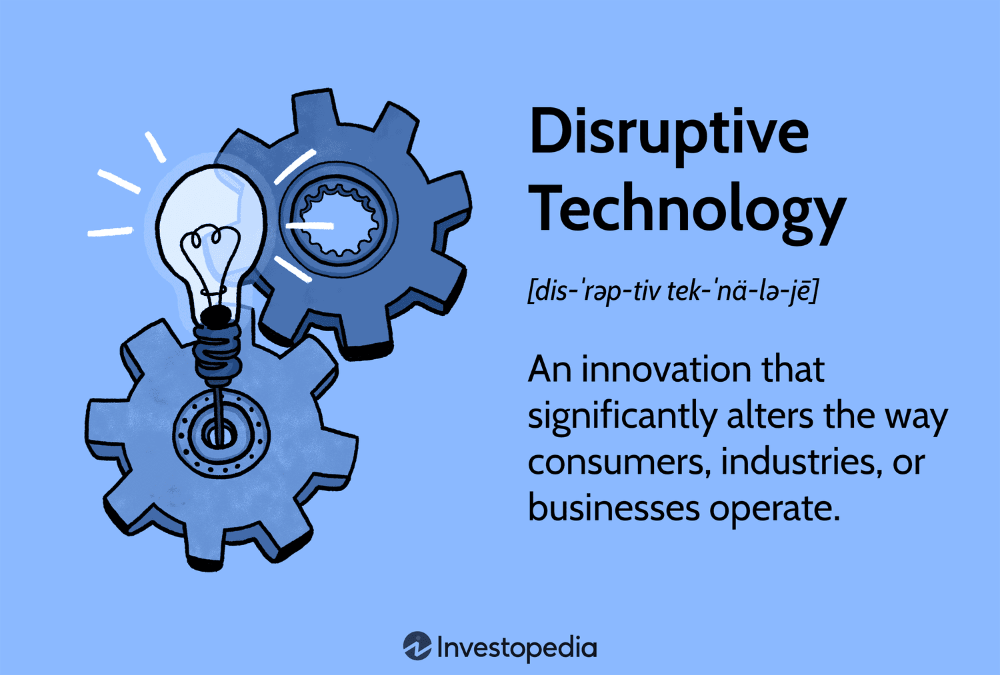

## Table of Contents

## What is disruptive technology?

Disruptive technology is a new invention or innovation that changes the way things are done in a big way. It often starts small and may not seem important at first, but over time, it grows and changes entire industries. For example, when smartphones first came out, they were not very popular. But now, they have changed the way we communicate, work, and even shop.

These technologies can make old ways of doing things less important or even unnecessary. For instance, streaming services like Netflix disrupted the traditional movie rental business. People used to go to video stores to rent movies, but now they can watch movies and TV shows online anytime they want. This shift forced many video rental stores to close down. Disruptive technologies often create new markets and can lead to big changes in society.

## How does disruptive technology impact industries?

Disruptive technology can shake up industries a lot. When a new technology comes along, it can change how businesses work and even make some old ways of doing things disappear. For example, when digital cameras came out, they started to replace film cameras. This meant that companies making film and film cameras had to change what they did or they might go out of business. The same thing happened with music when digital downloads and streaming services like Spotify started. They made CDs less popular, so companies had to find new ways to make money.

These changes can be good for some businesses and bad for others. Companies that can use the new technology can grow and do better than before. They might find new customers and new ways to make money. But companies that can't change or don't want to can have a hard time. They might lose customers and money. This can lead to big shifts in an industry, with some companies becoming leaders and others falling behind. Overall, disruptive technology can make industries more competitive and push them to keep improving.

## What are some historical examples of disruptive technologies?

One historical example of disruptive technology is the steam engine. Before the steam engine, people used animals, wind, and water to do work. The steam engine changed all that. It helped start the Industrial Revolution by making it easier to move heavy things and power machines. This meant factories could be built anywhere, not just by rivers. The steam engine changed how people worked and lived, and it helped make the world more connected.

Another example is the personal computer. Before personal computers, most people used big, expensive computers that were hard to use. When personal computers like the Apple II and the IBM PC came out, they made it easy for anyone to have a computer at home. This changed how people worked, learned, and played. People could do their work at home, students could use computers to study, and new games and programs were made just for personal computers. The personal computer changed many parts of life and helped start the digital age.

## What are the characteristics of a disruptive technology?

A disruptive technology usually starts small and may not seem important at first. It often begins in a part of the market that bigger companies don't pay much attention to. This new technology might be cheaper or easier to use, so it can attract customers who might not have used the old technology. Over time, as more people start using it, the technology gets better and can start to take over the whole market. It challenges the old ways of doing things and can make some old technologies or businesses less important or even go away.

Another key characteristic of disruptive technology is that it creates new markets or changes how things are done in a big way. It can lead to new products, services, or ways of working that people didn't think of before. This can shake up industries and make them more competitive. Companies that can use the new technology can grow and do well, while those that can't might struggle. Overall, disruptive technology pushes industries to keep improving and can lead to big changes in how we live and work.

## How can investors identify potential disruptive technologies?

Investors can spot potential disruptive technologies by keeping an eye on new inventions and innovations that might change how things are done. They should look for technologies that start small but could grow big over time. These technologies often solve problems in new ways or make things easier and cheaper. For example, if a new app makes it easier for people to do something they used to do in a more complicated way, it might be a disruptive technology. Investors should also pay attention to what people are talking about and what new companies are getting a lot of attention and funding.

Another way to identify disruptive technologies is by looking at trends and changes in industries. If a new technology is starting to take over a small part of the market, it might be a sign that it could grow and disrupt the whole industry. Investors should also think about how the technology could affect other industries and create new markets. For instance, the rise of electric cars is not just changing the car industry but also affecting energy and transportation. By staying informed and thinking about the big picture, investors can spot technologies that might change the world.

## What are the risks associated with investing in disruptive technologies?

Investing in disruptive technologies can be risky because these technologies often start small and take time to grow. They might not make money right away, and there's a chance they might not work out at all. This means investors could lose their money if the technology doesn't catch on or if it takes too long to become popular. Also, big companies might see the new technology as a threat and try to stop it from growing. This competition can make it hard for the new technology to succeed.

Another risk is that the market can change quickly. What seems like a great idea today might not be as good tomorrow. New laws or rules could come out that make it harder for the technology to be used. Or, another technology might come along that's even better. This uncertainty can make investing in disruptive technologies a gamble. But, if the technology does succeed, the rewards can be big, which is why some investors are willing to take the risk.

## How should investment strategies adapt to the rise of disruptive technologies?

When disruptive technologies start to change industries, investors need to be ready to change their strategies too. They should keep an eye on new inventions and trends, and be willing to invest in small companies that might grow big. It's important to look for technologies that solve problems in new ways or make things easier and cheaper. Investors should also think about how these technologies could affect other industries and create new markets. By staying informed and thinking about the big picture, investors can find opportunities to make money from disruptive technologies.

But, investing in disruptive technologies can be risky. These technologies often take time to grow and might not make money right away. There's a chance they might not work out at all, so investors could lose their money. Big companies might also try to stop the new technology from growing, which can make it hard for it to succeed. The market can change quickly too, with new laws or better technologies coming along. So, investors need to be careful and ready to change their plans if things don't go as expected. Even though it's risky, the rewards can be big if the technology does succeed.

## What role do startups play in the development of disruptive technologies?

Startups play a big role in creating disruptive technologies. They are often the ones who come up with new ideas and inventions that can change the world. Startups can be more flexible and quick to try new things because they are smaller and don't have as many rules to follow. This means they can focus on making something new and different, even if it's risky. For example, companies like Uber and Airbnb started as small startups and grew to change how we travel and stay in new places.

Big companies might not want to take as many risks, so startups have a chance to fill the gaps with new technologies. They can attract customers who are looking for something new and better. Over time, if the technology works out, startups can grow and even challenge the big companies. This competition can push everyone to keep improving and can lead to big changes in how we live and work.

## How can established companies respond to disruptive technologies?

Established companies can respond to disruptive technologies by keeping an eye on new inventions and trends. They should be ready to change and try new things. One way to do this is by working with startups or buying them. This can help big companies learn about new technologies and use them to stay ahead. Another way is by making their own new products or services that use the new technology. This can help them keep their customers and maybe even attract new ones.

But, it's not always easy for big companies to change. They might have a lot of rules and old ways of doing things that make it hard to try something new. If they don't change, they could lose customers to the new technology. So, it's important for established companies to be flexible and ready to take some risks. By doing this, they can stay competitive and keep up with the changes brought by disruptive technologies.

## What are the long-term economic effects of disruptive technologies?

Disruptive technologies can change the economy a lot over time. When new technologies come out, they can create new jobs and industries. For example, the internet created jobs in web design, online marketing, and more. These new jobs can help the economy grow. But, disruptive technologies can also make some old jobs go away. When cars came out, they made jobs for people making cars, but they also made jobs for people making horse carriages less important. This can be hard for people who lose their jobs, but it can also push the economy to keep improving and finding new ways to do things.

In the long run, disruptive technologies can make things cheaper and easier for everyone. When new technologies make it easier to do things, like how smartphones made it easier to communicate, it can save people time and money. This can make people's lives better and help the economy grow. But, it's important for the economy to be ready to change. Governments and businesses need to help people learn new skills and find new jobs when old ones go away. If they do this well, disruptive technologies can lead to a stronger and more flexible economy.

## How do regulatory environments affect the growth of disruptive technologies?

Regulatory environments can have a big impact on how fast disruptive technologies grow. If the rules are strict and hard to follow, it can slow down new inventions. For example, if a new technology needs a lot of tests and approvals before it can be used, it might take a long time for it to reach people. This can make it hard for small companies to keep going because they might run out of money while waiting. On the other hand, if the rules are clear and easy to follow, it can help new technologies grow faster. Governments can make rules that help new ideas without putting people at risk.

Regulations can also shape how disruptive technologies are used. Sometimes, new rules can make it easier for new technologies to be used in certain ways. For example, rules about using less energy can push companies to use new, green technologies. But, if the rules change a lot or are not clear, it can make it hard for companies to plan and grow. This can slow down the spread of new technologies. In the end, finding the right balance between safety and innovation is important for helping disruptive technologies grow and change the world in good ways.

## What advanced analytical tools can investors use to predict the success of disruptive technologies?

Investors can use different advanced tools to guess how well disruptive technologies might do. One tool is data analytics, which looks at big sets of information to find patterns and trends. For example, by looking at how people are using a new app or how fast a new technology is growing, investors can get a better idea of whether it will be successful. Another tool is [machine learning](/wiki/machine-learning), which uses computers to learn from data and make predictions. This can help investors see what might happen in the future based on what's happening now. These tools can give investors a clearer picture of the market and help them make smarter choices.

Another important tool is scenario analysis, which lets investors think about different ways the future might go. By making different plans based on what could happen, investors can be ready for changes and surprises. For example, they can think about what would happen if a new law comes out or if a new, better technology shows up. This helps them understand the risks and chances of success better. Using these advanced tools together can help investors see the big picture and make better guesses about which disruptive technologies will change the world.

## References & Further Reading

[1]: ["Advances in Financial Machine Learning"](https://www.amazon.com/Advances-Financial-Machine-Learning-Marcos/dp/1119482089) by Marcos Lopez de Prado

[2]: Bergstra, J., Bardenet, R., Bengio, Y., & Kégl, B. (2011). ["Algorithms for Hyper-Parameter Optimization."](https://dl.acm.org/doi/10.5555/2986459.2986743) Advances in Neural Information Processing Systems 24.

[3]: ["Machine Learning for Algorithmic Trading"](https://github.com/stefan-jansen/machine-learning-for-trading) by Stefan Jansen

[4]: ["Quantitative Trading: How to Build Your Own Algorithmic Trading Business"](https://github.com/LucindaYa/quant-resources/blob/master/Quantitative%20Trading%20How%20to%20Build%20Your%20Own%20Algorithmic%20Trading%20Business.pdf) by Ernest P. Chan

[5]: ["Evidence-Based Technical Analysis: Applying the Scientific Method and Statistical Inference to Trading Signals"](https://www.amazon.com/Evidence-Based-Technical-Analysis-Scientific-Statistical/dp/0470008741) by David Aronson