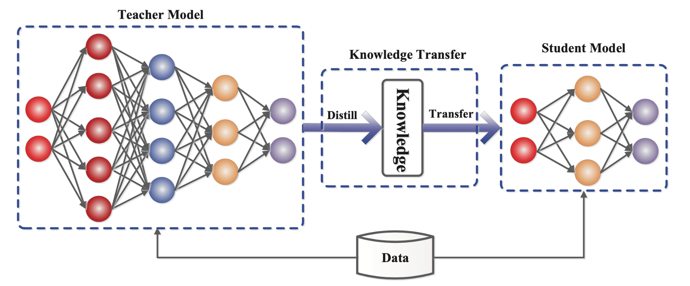

## Table of Contents

## What is distillation in the context of machine learning?

Distillation in machine learning is a technique used to create a simpler model from a more complex one. Imagine you have a big, complicated model that works really well but is slow and hard to use. Distillation helps you make a smaller, simpler model that can still do a good job, but faster and easier. This simpler model is called a student model, and it learns from the bigger, more complicated model, which is called the teacher model.

The process of distillation involves training the student model to mimic the behavior of the teacher model. The student model doesn't just learn from the original data; it also learns from the predictions or the way the teacher model thinks. This way, the student model can capture some of the deeper understanding that the teacher model has, even if it's smaller and simpler. Distillation is useful in many situations, like when you need to run models on devices with less power, like smartphones, or when you want to make your models work faster and more efficiently.

## How does distillation differ from traditional machine learning methods?

Distillation in machine learning is different from traditional methods because it involves creating a simpler model from a more complex one. In traditional machine learning, you usually train a model directly on your data, trying to make it as good as possible. With distillation, you start with a big, complicated model (the teacher) that's already good at its job. Then, you use this teacher model to help train a smaller, simpler model (the student). The student model learns not just from the original data, but also from how the teacher model makes its predictions.

This process of learning from another model is what sets distillation apart. Traditional methods focus on improving the model's performance by tweaking it directly, often using techniques like adjusting learning rates or changing the model's architecture. Distillation, on the other hand, uses the knowledge of the teacher model to guide the student model. This means the student can learn more efficiently and end up with a simpler model that still performs well. It's like having a smart tutor help you study, making it easier to understand and apply the lessons.

## What are the main benefits of using distillation in machine learning?

Distillation in [machine learning](/wiki/machine-learning) helps make models smaller and faster. Imagine you have a big, complicated model that works really well but is slow and hard to use. With distillation, you can create a smaller, simpler model that can still do a good job, but much faster. This is super helpful when you want to run your model on devices with less power, like smartphones or small computers. It's like turning a heavy, powerful machine into a lighter, easier-to-use tool that still gets the job done.

Another big benefit of distillation is that it can make models easier to understand and work with. Sometimes, big models can be like a mysterious black box - you know they work, but you're not sure how. By using distillation, you can create a simpler model that's easier to explain and tweak. This can be really useful in situations where you need to understand how your model makes decisions, like in medical or financial applications. So, distillation not only makes models faster and smaller but also more transparent and easier to handle.

## Can you explain the process of knowledge distillation?

Knowledge distillation is a way to make a simpler model learn from a bigger, more complex model. Imagine you have a teacher who is really good at something, and you want a student to learn from this teacher. In machine learning, the teacher model is already trained and good at making predictions. The student model, which is smaller and simpler, learns not just from the original data but also from the teacher's predictions. This helps the student understand things better and faster than if it were learning on its own.

The process starts with the teacher model making predictions on the training data. These predictions are then used to guide the training of the student model. The student model tries to mimic the teacher's predictions, which helps it capture the deeper understanding that the teacher has. This is different from regular training where the model only learns from the original data. By learning from the teacher, the student can become good at its job even though it's simpler. This makes the student model faster and easier to use, which is great for devices with less power or when you need quick results.

## What types of models are typically used as teachers and students in distillation?

In knowledge distillation, the teacher model is usually a big and complex model that performs really well on a task. These teacher models can be things like deep neural networks with many layers, like convolutional neural networks (CNNs) for image tasks or transformers for language tasks. The teacher model has learned a lot from the training data and can make very accurate predictions. Because it's so big and complex, it might be slow to use or need a lot of computing power.

The student model, on the other hand, is smaller and simpler. It could be a smaller [neural network](/wiki/neural-network) with fewer layers or parameters. The goal is for the student to learn from the teacher and still do a good job, but be faster and easier to use. For example, the student might be a smaller CNN or a simpler version of a transformer. By learning from the teacher's predictions, the student can capture some of the teacher's understanding and perform well even though it's simpler. This makes the student model great for use on devices with less power or when you need quick results.

## How do you choose the right teacher model for knowledge distillation?

Choosing the right teacher model for knowledge distillation is important. You want a teacher that's really good at the task you're working on. This means the teacher should have high accuracy and be able to make good predictions. A common choice for a teacher model is a big neural network, like a deep [convolutional neural network](/wiki/convolutional-neural-network) (CNN) for image tasks or a transformer for language tasks. These models have lots of layers and parameters, which let them learn a lot from the data. The better the teacher model is at its job, the more it can help the student learn.

The teacher model should also be one that you can train well. This means you need enough data and computing power to make sure the teacher learns everything it can. Sometimes, you might even use an ensemble of models as a teacher, where you combine the predictions of several good models to get even better results. The key is to make sure the teacher model is as good as possible, so it can pass on its knowledge to the student effectively. By choosing a strong teacher, you help the student model become simpler yet still effective.

## What are the key challenges faced when implementing distillation techniques?

One of the main challenges in implementing distillation techniques is finding the right balance between the teacher and student models. The teacher model needs to be good enough to provide useful guidance, but if it's too complex, it might be hard for the student to learn from it effectively. On the other hand, if the student model is too simple, it might not be able to capture the important knowledge from the teacher. This balancing act requires careful selection of both models and sometimes involves trial and error to get it right.

Another challenge is the need for sufficient computational resources. Training the teacher model can be resource-intensive because it's usually a large and complex model. Even after the teacher is trained, the process of distilling knowledge to the student can take a lot of time and computational power. This can be a barrier for teams with limited resources, making it harder to implement distillation effectively. Additionally, ensuring that the student model maintains the performance of the teacher while being simpler is a tricky task that requires careful monitoring and adjustment throughout the distillation process.

## How can distillation be used to improve the performance of smaller models?

Distillation helps smaller models get better by letting them learn from bigger, smarter models. Imagine you have a big model that's really good at its job but is slow and hard to use. With distillation, you can use this big model to teach a smaller model how to do the same job well, but faster. The smaller model, called the student, learns not just from the original data but also from how the big model, called the teacher, makes its predictions. This way, the student can understand things better and faster than if it were learning on its own.

The key to making this work is choosing the right teacher and student models. The teacher needs to be really good at the task so it can give the student good advice. The student should be simple enough to be fast and easy to use but also able to learn from the teacher. By carefully setting up this learning process, you can make the smaller model perform almost as well as the big one. This is super helpful when you want to run your model on devices with less power, like smartphones, or when you need quick results.

## What metrics should be used to evaluate the success of a distillation process?

To evaluate how well distillation works, you need to look at a few key things. One important metric is the performance of the student model compared to the teacher model. You want to see if the student can do almost as well as the teacher on tasks like classifying images or understanding language. This can be measured using accuracy, which shows how often the student gets the right answer, or other metrics like F1 score, which balances precision and recall. If the student's performance is close to the teacher's, that's a good sign that distillation worked well.

Another thing to consider is how much smaller and faster the student model is compared to the teacher. You can measure this by looking at the number of parameters in the model or how long it takes to make predictions. A successful distillation process should result in a student model that's much simpler and quicker to use but still performs well. By comparing these metrics before and after distillation, you can see if the process helped make a more efficient model without losing too much accuracy.

## Can you describe an example of a successful application of distillation in industry?

One successful example of distillation in industry is how Google uses it to make their search algorithms faster and more efficient. Google has big, complex models that are really good at understanding what people are searching for. But these models can be slow to use because they have so many parts. So, Google uses distillation to create smaller, simpler models that can still understand searches well but are much faster. This way, when someone searches for something on Google, the results come back quickly, even on phones or computers that aren't very powerful.

This use of distillation helps Google provide a better experience for their users. The smaller models can run on devices with less power, like smartphones, without losing much accuracy. This means people get quick, accurate search results no matter what device they're using. By using distillation, Google can keep their search algorithms strong and fast, which is important for staying competitive in the search engine market.

## How does temperature scaling affect the distillation process?

Temperature scaling is a technique used in knowledge distillation to make the teacher model's predictions softer and more helpful for the student model. Imagine the teacher model is very confident in its answers, like always saying "I'm 100% sure!" But if the teacher is too sure, it might not give the student enough information about other possible answers. By using temperature scaling, we can make the teacher's answers less confident, like saying "I'm 70% sure of this, but there's a chance it could be something else." This helps the student learn more about different possibilities and understand the task better.

In practice, temperature scaling works by adjusting the softmax function used in the teacher model's output layer. The softmax function turns the model's raw predictions into probabilities. By adding a temperature parameter, we can control how spread out these probabilities are. A higher temperature makes the probabilities more even, while a lower temperature makes them more focused. For example, if $$ T $$ is the temperature, the softmax function with temperature scaling becomes $$ \text{softmax}(z_i/T) $$. By setting $$ T $$ to a value greater than 1, we can make the teacher's predictions softer, which helps the student learn more effectively during distillation.

## What are the latest advancements in distillation techniques for machine learning?

One of the latest advancements in distillation techniques is the use of self-distillation. In self-distillation, a model learns from itself instead of a separate teacher model. This means the model can improve its own performance by using its predictions as a guide. Self-distillation is helpful because it doesn't need a big, complicated teacher model, making it easier to use and more efficient. Researchers have found that by letting the model learn from its own softened predictions, it can become better at its job without needing extra resources.

Another advancement is the use of multi-teacher distillation. Instead of using just one teacher model, this method uses several teacher models to teach the student. Each teacher might be good at different parts of the task, so by learning from all of them, the student can get a more complete understanding. This can lead to better performance and more robust models. For example, if $$ T_1, T_2, \ldots, T_n $$ are the teacher models, the student model can learn from the combined knowledge of all these teachers, making it stronger and more versatile.

## References & Further Reading

[1]: Hinton, G., Vinyals, O., & Dean, J. (2015). ["Distilling the Knowledge in a Neural Network."](https://arxiv.org/abs/1503.02531) arXiv preprint arXiv:1503.02531.

[2]: Ba, J., & Caruana, R. (2014). ["Do Deep Nets Really Need to be Deep?"](https://arxiv.org/abs/1312.6184) Advances in Neural Information Processing Systems 27.

[3]: Buciluǎ, C., Caruana, R., & Niculescu-Mizil, A. (2006). ["Model Compression."](https://dl.acm.org/doi/10.1145/1150402.1150464) Proceedings of the 12th ACM SIGKDD International Conference on Knowledge Discovery and Data Mining.

[4]: Gou, J., Yu, B., Maybank, S.J., & Tao, D. (2021). ["Knowledge Distillation: A Survey."](https://arxiv.org/abs/2006.05525) International Journal on Artificial Intelligence Tools.

[5]: Furlanello, T., Lipton, Z.C., Tschannen, M., Itti, L., & Anandkumar, A. (2018). ["Born-Again Neural Networks."](https://arxiv.org/abs/1805.04770) International Conference on Machine Learning.