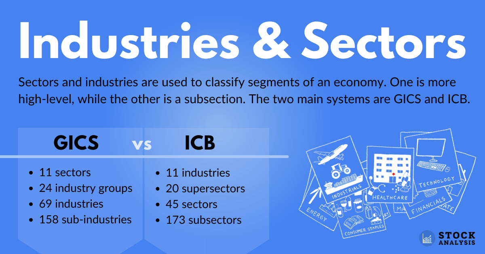

## Table of Contents

## What is the basic definition of an industry?

An industry is a group of businesses that make or sell similar products or services. For example, the car industry includes all the companies that make cars. The main goal of these businesses is to earn money by meeting the needs of customers who want to buy their products or services.

Industries can be big or small, and they can be found all over the world. Some industries, like technology or healthcare, are very important and affect many parts of our lives. Others, like the toy industry, might be smaller but still play a big role in the economy. Each industry has its own challenges and ways of working, but they all work together to keep the economy running.

## What is the basic definition of a sector?

A sector is a big part of the economy that includes many different industries. It's like a category that groups together businesses that do similar kinds of work. For example, the agriculture sector includes all the businesses that grow crops or raise animals, while the finance sector includes banks and insurance companies.

Sectors help us understand how different parts of the economy work together. They can be divided into three main types: primary, secondary, and tertiary. Primary sectors are about using natural resources, like farming or mining. Secondary sectors take those resources and turn them into products, like factories that make cars. Tertiary sectors provide services, like schools or restaurants. By looking at sectors, we can see how money and jobs flow through the economy.

## How do industries and sectors differ in terms of scope?

Industries and sectors are both ways to group businesses, but they have different scopes. An industry is a smaller group that focuses on businesses that make or sell similar products or services. For example, the car industry includes all companies that make cars, while the clothing industry includes companies that make clothes. Industries are more specific and deal with the day-to-day activities of businesses that are very similar.

On the other hand, a sector is a much bigger group that includes many different industries. Sectors help us see the bigger picture of the economy. For example, the manufacturing sector includes not just the car industry, but also other industries like the electronics industry and the furniture industry. Sectors are broader and help us understand how different parts of the economy work together and affect each other.

## Can you provide examples of different industries within a sector?

The healthcare sector is a big part of the economy that includes many different industries. One industry in the healthcare sector is the pharmaceutical industry, which makes medicines and drugs. Another industry is the medical devices industry, which makes things like X-ray machines and heart monitors. There's also the healthcare services industry, which includes hospitals and clinics where doctors and nurses take care of patients.

The technology sector is another big part of the economy with many different industries. The software industry is one example, where companies make computer programs and apps. The hardware industry is another, where companies make computers, smartphones, and other devices. There's also the IT services industry, which helps businesses set up and use technology to do their work better.

These examples show how sectors are made up of different industries. Each industry in a sector has its own special job, but they all work together to make the sector strong and important to the economy.

## How are industries classified within economic frameworks?

Industries are classified within economic frameworks to help us understand and organize different parts of the economy. One common way to classify industries is by using the North American Industry Classification System (NAICS). This system groups businesses based on what they do, like making things, providing services, or selling goods. For example, under NAICS, a company that makes cars would be in the manufacturing industry, while a company that sells cars would be in the retail trade industry. This helps governments, businesses, and researchers compare and study different parts of the economy.

Another way to classify industries is by looking at their role in the economy, like primary, secondary, and tertiary industries. Primary industries are about using natural resources, like farming, fishing, and mining. Secondary industries take those resources and turn them into products, like factories that make cars or clothes. Tertiary industries provide services, like schools, restaurants, and banks. By classifying industries this way, we can see how different parts of the economy depend on each other and how money and jobs flow through the system.

## What role do sectors play in economic analysis?

Sectors play a big role in economic analysis because they help us understand how different parts of the economy work together. By looking at sectors, we can see how money moves from one part of the economy to another. For example, when people buy more cars, it helps the manufacturing sector grow. This can lead to more jobs and more money for people working in that sector. Then, those people might spend more money on services, which helps the service sector grow. Sectors show us these connections and help us see the big picture of the economy.

Sectors also help us compare different parts of the economy and see which ones are doing well or not so well. For example, if the technology sector is growing fast, it might mean that people are spending more on computers and software. On the other hand, if the agriculture sector is not doing well, it might mean that farmers are having a hard time. By looking at these trends, governments and businesses can make better decisions about where to invest money and how to help different parts of the economy. Sectors give us a way to organize and understand the economy so we can plan for the future.

## How do government policies impact industries versus sectors?

Government policies can affect industries in very specific ways. For example, if the government makes a new rule about car safety, it will mostly affect the car industry. Companies in this industry will need to change how they make cars to follow the new rule. This can cost them money and time. But it might also make their cars safer and more popular with customers. So, government policies can help or hurt an industry depending on what the policy is about.

On the other hand, government policies can affect sectors in a bigger way. For example, if the government decides to spend more money on healthcare, it will help the whole healthcare sector. This can mean more money for hospitals, more jobs for doctors and nurses, and more money for companies that make medicines. The whole sector can grow because of this policy. Sectors are bigger than industries, so government policies that affect sectors can have a wider impact on the economy.

In summary, government policies can target specific industries with rules and regulations that directly affect how those industries operate. But when policies target sectors, they can influence a broader range of industries within that sector, leading to bigger changes in the economy. Both types of impacts are important to understand how government actions shape the economic landscape.

## What are the common methods used to categorize industries and sectors?

One common way to categorize industries and sectors is by using the North American Industry Classification System (NAICS). This system groups businesses based on what they do, like making things, selling goods, or providing services. For example, a company that makes cars would be in the manufacturing industry, while a company that sells cars would be in the retail trade industry. NAICS helps us organize and compare different parts of the economy, making it easier for governments, businesses, and researchers to study and understand how industries work.

Another way to categorize industries and sectors is by looking at their role in the economy. This method divides industries into primary, secondary, and tertiary categories. Primary industries use natural resources, like farming, fishing, and mining. Secondary industries turn those resources into products, like factories that make cars or clothes. Tertiary industries provide services, like schools, restaurants, and banks. By categorizing industries this way, we can see how different parts of the economy depend on each other and how money and jobs flow through the system.

Both methods of categorization help us understand the economy better. NAICS provides a detailed way to look at specific industries, while the primary, secondary, and tertiary classification gives us a broader view of how different sectors work together. Using these methods, we can see the big picture of the economy and make better decisions about where to invest money and how to help different parts of the economy grow.

## How do global economic trends affect industries differently from sectors?

Global economic trends can have a big impact on industries and sectors, but in different ways. An industry, like the car industry, might be hit hard by a trend like higher gas prices. When gas prices go up, people might buy fewer cars, especially big ones that use a lot of gas. This can make it hard for car companies to sell their cars and make money. But if there's a trend towards electric cars, the car industry could do well because more people want to buy them. So, global trends can push industries to change what they do or how they do it.

Sectors, on the other hand, are bigger groups that include many different industries. A trend like a global economic slowdown can affect a whole sector, like the manufacturing sector. This sector includes not just car makers, but also companies that make electronics, furniture, and more. When the economy slows down, people might buy less of everything, which can hurt the whole manufacturing sector. But if there's a trend towards more spending on technology, the technology sector, which includes software, hardware, and IT services, could grow a lot. So, global trends can make a big difference to how well a sector does, affecting many industries at once.

## What are the implications of industry-specific regulations compared to sector-wide regulations?

Industry-specific regulations are rules that only apply to one kind of business, like the car industry or the food industry. These rules can make a big difference to the companies in that industry. For example, if there's a new rule about how safe cars need to be, car companies have to spend money to make their cars safer. This can be hard for them, but it can also make their cars better and more popular with customers. Industry-specific regulations help keep things safe and fair, but they can also make it harder for companies to make money if the rules are too strict or expensive.

Sector-wide regulations are rules that apply to a whole group of industries, like the manufacturing sector or the healthcare sector. These rules can have a big impact on many different kinds of businesses at once. For example, if there's a new rule about how much pollution factories can make, it affects not just car makers, but also companies that make electronics, furniture, and more. Sector-wide regulations can help solve big problems, like pollution or healthcare costs, but they can also be hard for businesses to follow. They might need to spend a lot of money to meet the new rules, which can slow down the whole sector.

## How do technological advancements influence the evolution of industries within a sector?

Technological advancements can change industries a lot by making them do things in new ways. For example, in the car industry, which is part of the manufacturing sector, new technology like electric engines is changing how cars are made. Companies are now making electric cars instead of just cars that use gas. This means they need new machines and new ways to make cars. It can be hard for them at first, but it can also help them make better cars that people want to buy. So, technology can push industries to change and grow in new directions.

Technology also helps industries in a sector work better together. In the healthcare sector, new technology like electronic health records helps doctors and hospitals share information easily. This makes it easier for them to take care of patients. And in the pharmaceutical industry, which is also part of healthcare, new technology helps scientists find new medicines faster. This can help the whole healthcare sector get better and help more people. So, technology can make industries in a sector stronger and more connected, helping them do their jobs better.

## What advanced analytical tools are used to study the dynamics between industries and sectors?

Advanced analytical tools like data analytics and machine learning help us understand how industries and sectors change and work together. Data analytics lets us look at big sets of information to find patterns and trends. For example, we can see how sales in the car industry go up or down over time and how that affects the whole manufacturing sector. Machine learning can make predictions about what might happen next, like how new technology might change an industry. These tools help us see the big picture of the economy and make smart decisions about where to invest money or how to help industries grow.

Another tool we use is input-output analysis, which shows how different industries depend on each other. For example, the car industry needs steel from the steel industry to make cars. By looking at these connections, we can see how a change in one industry, like higher steel prices, can affect other industries and the whole sector. Network analysis is also helpful because it shows how industries are connected in a sector. It can show us how a problem in one industry, like a factory closing, can spread to other industries and affect the whole sector. These tools help us understand the complex relationships between industries and sectors and plan for the future.

## What are Sector Momentum and Rotation Strategies?

Sector [momentum](/wiki/momentum) and rotation strategies are fundamental approaches in [algorithmic trading](/wiki/algorithmic-trading), leveraging the systematized movement of capital across various sectors to optimize portfolio performance. These strategies involve systematically reallocating investments from one sector to another based on specific indicators that signal future performance trends. The goal is to capitalize on market cycles by investing in sectors showing upward momentum and divesting from those expected to underperform.

Historical data and sophisticated algorithms form the backbone of these strategies. By analyzing past performance metrics such as price movements, trading volumes, and economic indicators, algorithmic models forecast future sector performances. This prediction process typically involves quantitative techniques like statistical analysis, [machine learning](/wiki/machine-learning), and econometric models. These algorithms are designed to identify patterns and correlations indicative of sector momentum. For instance, a basic momentum indicator could be calculated using the formula:

$$
\text{Momentum} = \frac{\text{Current Price} - \text{Price n Periods Ago}}{\text{Price n Periods Ago}} \times 100
$$

A higher momentum value suggests a stronger upward trend, potentially indicating a buy signal for that sector.

Sector rotation strategies further fine-tune this process by aligning investments based on macroeconomic conditions and cyclical patterns. They can be implemented using various models, including decision trees and neural networks, which incorporate economic indicators such as interest rates and GDP growth to predict sector shifts. Code snippets in Python might look like this for a simple momentum calculation:

```python
import pandas as pd

def calculate_momentum(data, period=5):
    return ((data['Price'] - data['Price'].shift(period)) / data['Price'].shift(period)) * 100

# Example DataFrame with sector prices
data = pd.DataFrame({
    'Date': pd.date_range(start='2021-01-01', periods=10, freq='D'),
    'Price': [100, 102, 104, 103, 107, 110, 108, 115, 117, 120]
})

data['Momentum'] = calculate_momentum(data)
print(data)
```

Backtesting these strategies across different market cycles is crucial to evaluate their effectiveness and reliability. By simulating the performance of sector rotation strategies using historical data, traders can assess potential risks and returns before deploying capital. Backtesting helps identify market environments where specific strategies outperform, refining algorithms to better adapt to fluctuating economic conditions.

In summary, sector momentum and rotation strategies are sophisticated methods within algorithmic trading, utilizing historical data analysis and predictive modeling to enhance investment returns. The systematic application of these approaches, combined with rigorous [backtesting](/wiki/backtesting), equips traders with the tools necessary for navigating dynamic market environments effectively.

## References & Further Reading

[1]: Bergstra, J., Bardenet, R., Bengio, Y., & Kégl, B. (2011). ["Algorithms for Hyper-Parameter Optimization."](https://papers.nips.cc/paper/4443-algorithms-for-hyper-parameter-optimization) Advances in Neural Information Processing Systems 24.

[2]: ["Advances in Financial Machine Learning"](https://www.amazon.com/Advances-Financial-Machine-Learning-Marcos/dp/1119482089) by Marcos Lopez de Prado

[3]: ["Evidence-Based Technical Analysis: Applying the Scientific Method and Statistical Inference to Trading Signals"](https://www.amazon.com/Evidence-Based-Technical-Analysis-Scientific-Statistical/dp/0470008741) by David Aronson

[4]: ["Machine Learning for Algorithmic Trading"](https://github.com/stefan-jansen/machine-learning-for-trading) by Stefan Jansen

[5]: ["Quantitative Trading: How to Build Your Own Algorithmic Trading Business"](https://www.amazon.com/Quantitative-Trading-Build-Algorithmic-Business/dp/1119800064) by Ernest P. Chan