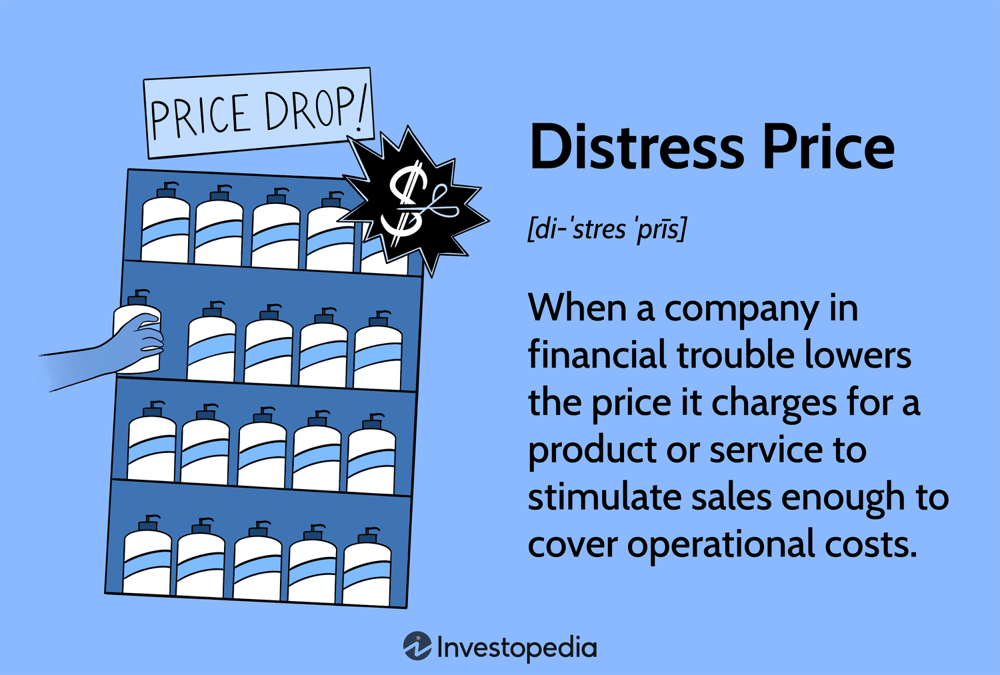

## Table of Contents

## What is a distress sale?

A distress sale happens when someone needs to sell something quickly because they are in a tough spot. This could be because they need money fast, or they are moving and can't take their things with them. When someone is in a hurry to sell, they usually have to lower the price a lot. This means they might not get as much money as they would if they had more time to find the right buyer.

In real estate, a distress sale often happens when the owner can't pay their mortgage anymore. They might have to sell their house quickly to avoid losing it completely. Because the seller is in a rush, buyers can sometimes find good deals. But, it's important for buyers to be careful because properties sold in distress might need a lot of repairs or have other problems.

## What are the common reasons for a distress sale?

People might have a distress sale when they need money fast. This can happen if they lose their job or have a lot of bills to pay. They might also need to sell things quickly if they are moving to a new place and can't take everything with them. When someone is in a rush to sell, they often have to lower the price a lot just to get rid of the item quickly.

In real estate, distress sales often happen when the owner can't pay their mortgage anymore. This can lead to the bank taking the house if the owner doesn't sell it in time. Another reason is if the owner is going through a divorce or if someone in the family passes away. These situations can force people to sell their home quickly, even if it means selling it for less than they wanted.

## How does a distress sale differ from a regular sale?

A distress sale happens when someone needs to sell something quickly because they are in a tough situation. This could be because they need money fast or they are moving and can't take their things with them. Because they are in a hurry, they usually have to sell the item for a lower price than they would in a regular sale. In a regular sale, the seller has more time to find the right buyer and can wait for a better offer.

In real estate, a distress sale often means the owner is selling the house because they can't pay their mortgage anymore. They might need to sell it quickly to avoid losing it to the bank. This is different from a regular sale where the owner might be selling because they want to move to a new house or they are looking for a bigger or smaller home. In a regular sale, the owner can take their time to find the best price, but in a distress sale, they have to sell fast, even if it means getting less money.

## What are the immediate financial implications of a distress sale for the seller?

When someone has a distress sale, they usually get less money for what they are selling. This is because they need to sell it fast and can't wait for a better offer. If they are selling a house, they might get much less than what the house is really worth. This can make it hard for them to pay off any debts they have, like a mortgage or loans. They might still owe money even after the sale.

The money from a distress sale might help the seller in the short term. For example, it can stop the bank from taking their house or help them pay off some urgent bills. But in the long run, they lose out because they didn't get the full value of what they sold. This can make it harder for them to buy a new home or start over financially.

## How can a distress sale affect the market value of similar assets?

When someone has a distress sale, it can make other similar things seem less valuable. If a house in a neighborhood is sold for a low price because the owner needed money fast, people might think other houses in that area are worth less too. This can make it harder for other people in the neighborhood to sell their homes for a good price. They might have to lower their prices to match what people expect after seeing the distress sale.

But, the effect on the market value might not last long. Once people understand that the low price was because of the seller's urgent situation and not because the house or neighborhood is bad, the prices can go back to normal. It's important for people to know the difference between a distress sale and the true value of similar assets so they don't make bad decisions based on one sale.

## What are the tax implications of a distress sale?

When someone sells something in a distress sale, they might have to pay taxes on the money they get from the sale. The tax they have to pay depends on what they are selling and how much they sell it for. For example, if they sell a house, they might have to pay capital gains tax. This is a tax on the profit they make from selling the house. If the house was their main home and they lived in it for at least two of the last five years, they might not have to pay this tax on the first $250,000 of profit, or $500,000 if they are married and filing jointly.

If the price they get from the distress sale is lower than what they owe on the property, like a mortgage, they might have a different tax situation. If the bank forgives part of the debt, this can be considered taxable income. This is called cancellation of debt income, and they might have to pay taxes on it. It's a good idea for someone in a distress sale situation to talk to a tax professional to understand all the tax rules and how they apply to their specific situation.

## How does a distress sale impact the seller's credit rating?

A distress sale can hurt a seller's credit rating, especially if it involves selling a house because they can't pay their mortgage. If the seller can't sell the house fast enough and the bank takes it back, this is called a foreclosure. A foreclosure stays on the seller's credit report for seven years and can make it hard for them to borrow money or get a loan in the future. Even if they sell the house before it goes into foreclosure, if they had to miss mortgage payments to get to the point of a distress sale, those missed payments can also lower their credit score.

If the seller has other debts, like credit card debt or personal loans, and they can't pay those because they had to use the money from the distress sale for something else, this can also hurt their credit. Late payments or not paying at all can stay on their credit report for up to seven years too. So, a distress sale can have a big impact on a seller's credit rating, making it important for them to think carefully about their options and maybe talk to a financial advisor before deciding to go through with it.

## What are the long-term financial consequences of engaging in a distress sale?

When someone has a distress sale, they usually get less money than they would in a normal sale. This means they might not be able to pay off all their debts, like a mortgage or loans. If they were selling a house, they might still owe money to the bank even after the sale. This can make it hard for them to start over financially because they don't have as much money to buy a new home or invest in other things. It can also make it difficult for them to borrow money in the future because lenders might see them as a risk.

In the long run, a distress sale can also affect someone's credit rating. If they had to miss mortgage payments or other bills to get to the point of a distress sale, those missed payments can lower their credit score. If the sale involves a house and they can't sell it fast enough, the bank might take it back, which is called a foreclosure. A foreclosure stays on their credit report for seven years and can make it hard for them to get loans or credit cards. So, a distress sale can have big impacts on someone's financial future, making it important to think carefully about other options before deciding to go through with it.

## How can a business prepare for or avoid a distress sale?

A business can avoid a distress sale by keeping a close eye on its money. This means always knowing how much money is coming in and going out, and planning for the future. If the business sees that it might not have enough money to pay its bills, it can take action early. This could mean cutting costs, like spending less on things that are not needed, or finding new ways to make more money, like selling new products or services. By doing this, the business can stay healthy and avoid needing to sell things quickly at a low price.

Another way to prepare for a distress sale is to have a good relationship with banks or other people who lend money. If a business has a strong relationship with its lenders, it might be able to get more time to pay back loans or even get new loans to help with money problems. Also, having a plan for emergencies can help. This plan could include selling some assets in a smart way, not in a rush, or finding investors who can help the business through tough times. By planning ahead and staying in control of its finances, a business can reduce the chance of having to do a distress sale.

## What strategies can be used to minimize the negative effects of a distress sale?

To minimize the negative effects of a distress sale, it's important for the seller to talk to professionals like a real estate agent or a financial advisor. These experts can help the seller understand their options and find the best way to sell their asset. For example, they might suggest fixing up the property a bit to make it more attractive, even if it's a quick sale. They can also help the seller set a fair price that is low enough to attract buyers fast but not so low that it hurts the seller's finances too much.

Another strategy is to be open with buyers about why the sale is happening. If buyers know it's a distress sale, they might be more understanding and willing to pay a bit more than they would if they thought the low price was because the asset was not worth much. It's also a good idea to look for other ways to get money, like loans or help from family, to avoid a distress sale if possible. By taking these steps, a seller can reduce the impact of a distress sale and protect their financial future as much as they can.

## How do investors perceive companies that have undergone distress sales?

Investors often see companies that have had distress sales as risky. When a company has to sell things quickly and at a low price, it can mean they are having money problems. Investors might worry that the company won't be able to pay its bills or make money in the future. This can make them less likely to want to invest in the company because they are afraid they might lose their money.

However, not all investors see distress sales in the same way. Some investors look for companies that are in distress because they think they can buy the company's stock at a low price and make money later when the company gets better. These investors believe that the distress sale is a temporary problem and that the company can recover if it makes the right changes. So, while many investors might be cautious, others see distress sales as a chance to invest in a company that could do well in the future.

## What are the legal considerations and protections for both buyers and sellers in a distress sale?

In a distress sale, both buyers and sellers need to know about the legal rules. For sellers, it's important to understand how a distress sale can affect their debts. If they are selling a house because they can't pay their mortgage, they need to know if the sale will cover what they owe the bank. They should also check if there are any laws that protect them from losing everything if the sale doesn't cover all their debts. Sellers should talk to a lawyer to make sure they are following all the rules and to see if there are any special programs or protections they can use.

For buyers, it's important to know what they are buying. In a distress sale, the property might have problems or debts attached to it. Buyers should do a lot of research and maybe even hire a lawyer to check the property's title and see if there are any liens or other issues. Some places have laws that give buyers a chance to back out of the sale if they find big problems after they buy. Buyers should also be aware of any special rules about how fast the sale has to happen and make sure they follow them so the sale is legal.

## References & Further Reading

[1]: Bergstra, J., Bardenet, R., Bengio, Y., & Kégl, B. (2011). ["Algorithms for Hyper-Parameter Optimization."](https://dl.acm.org/doi/10.5555/2986459.2986743) Advances in Neural Information Processing Systems 24.

[2]: Lopez de Prado, M. (2018). ["Advances in Financial Machine Learning."](https://www.amazon.com/Advances-Financial-Machine-Learning-Marcos/dp/1119482089) Wiley.

[3]: Aronson, D. (2006). ["Evidence-Based Technical Analysis: Applying the Scientific Method and Statistical Inference to Trading Signals."](https://www.amazon.com/Evidence-Based-Technical-Analysis-Scientific-Statistical/dp/0470008741) Wiley.

[4]: Jansen, S. (2020). ["Machine Learning for Algorithmic Trading."](https://github.com/stefan-jansen/machine-learning-for-trading) Packt Publishing.

[5]: Chan, E. P. (2009). ["Quantitative Trading: How to Build Your Own Algorithmic Trading Business."](https://github.com/ftvision/quant_trading_echan_book) Wiley.

[6]: Kirilenko, A., Kyle, A. S., Samadi, M., & Tuzun, T. (2017). ["The Flash Crash: The Impact of High-Frequency Trading on an Electronic Market."](https://www.jstor.org/stable/26652722) Review of Financial Studies, 30(6), 2220-2255.

[7]: PwC. (2019). ["Managing risks in algorithmic trading."](https://www.pwc.ch/en/insights/risk/future-of-risk-2019/risk-in-review.html)

[8]: Hull, J. C. (2018). ["Risk Management and Financial Institutions."](https://books.google.com/books/about/Risk_Management_and_Financial_Institutio.html?id=1J1QDwAAQBAJ) Wiley.