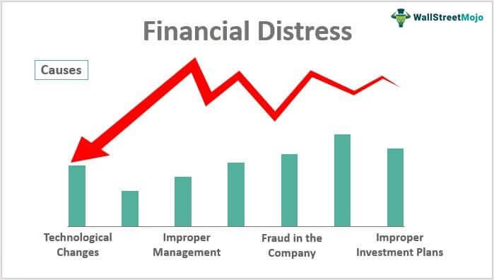

The landscape of global finance has undergone transformative changes due to the convergence of economic challenges and technological advancements. A key development in this evolution is the adoption of algorithmic trading. This approach utilizes complex algorithms and high-frequency data to execute trades at unprecedented speeds, enabling rapid responses to market changes. Such efficiency has made algorithmic trading a cornerstone of modern financial markets.

Within this technological framework, a notable issue has emerged: distress sales. These transactions occur when assets, such as stocks or real estate, are sold urgently and often at below-market prices due to financial strain. Although distress sales can provide liquidity to sellers facing economic pressures, they frequently result in significant financial losses, as buyers leverage the situation to acquire assets at reduced prices.



This article explores the complex interactions among economic pressure, financial distress, distress sales, and algorithmic trading. Understanding these relationships is crucial as they significantly impact market behavior, asset pricing, and financial stability. By examining these dynamics, stakeholders can better navigate the challenges and opportunities within today's financial environment.

## Table of Contents

## Understanding Distress Sales

A distress sale, also known as a distressed sale, is characterized by the urgent disposition of assets, such as real estate or stocks, at prices significantly below their standard market value. This situation typically arises from financial duress, where the seller needs to rapidly acquire liquidity to address pressing financial obligations or unforeseen emergencies. During distress sales, sellers compromise on the price to expedite transactions, which can make them vulnerable to financial exploitation. Buyers, aware of the seller's urgency, tend to offer prices lower than the prevailing market rates, effectively leveraging the seller's disadvantaged position. This often results in financial losses for the seller, as they are unable to realize the full market value of their assets. The dynamics of distress sales reflect a critical intersection of immediate financial necessity and market opportunism, painting a crucial portrait of risk and potential loss inherent in such transactions.

## Economic Impact of Distress Sales

Distress sales occur when assets are sold urgently, often below market value, due to financial duress. These sales can significantly impact the broader economy, as they often contribute to asset devaluation, increased market [volatility](/wiki/volatility-trading-strategies), and a decrease in consumer confidence. When sellers are compelled to liquidate assets quickly, they might do so at prices that do not accurately reflect the assets' intrinsic values. This results in artificial pricing dynamics, which can skew perceptions of overall asset performance and market stability.

The ripple effect of distress sales on the economy primarily stems from the forced undervaluation of assets. Assets sold at distressed prices can set a precedent for market value, influencing the pricing strategies of similar assets. This effect is particularly pronounced in illiquid markets, where a single distress sale can heavily impact the pricing of comparable assets. For example, Python code could be used to model the impact of distress sales on asset pricing through simulations that consider varying levels of market [liquidity](/wiki/liquidity-risk-premium):

```python
import numpy as np

def simulate_distress_sale_impact(initial_price, distress_sale_discount, num_assets):
    market_prices = []
    for _ in range(num_assets):
        market_price = initial_price * (1 - np.random.uniform(0, distress_sale_discount))
        market_prices.append(market_price)
    return np.mean(market_prices)

initial_price = 1000  # hypothetical initial asset price
distress_sale_discount = 0.3  # 30% potential price reduction during distress sale
num_assets = 1000  # simulate impact on 1000 similar assets

average_price_after_distress = simulate_distress_sale_impact(initial_price, distress_sale_discount, num_assets)
print("Average Market Price After Distress Sales:", average_price_after_distress)
```

Here, the simulation considers distress sales potentially discounting asset prices by up to 30%, resulting in a general decline in perceived market values for similar assets. This practice can also lead to increased volatility, as the rapid execution of sales may cause sudden shifts in supply and demand dynamics.

Additionally, consumer confidence can be negatively affected by distress sales. When investors witness assets being sold below market value, it may signal financial instability, leading to reduced investment activity and heightened risk aversion. The perception of declining asset values might deter consumer spending and investment, further exacerbating economic instability.

In summary, distress sales can initiate a cascade of economic consequences by affecting asset valuation, market volatility, and consumer confidence, thereby distorting the natural pricing mechanisms within financial markets.

## Algorithmic Trading and its Role

Algorithmic trading, commonly referred to as algo trading, leverages computer algorithms to automate and execute trades based on pre-defined criteria. This technology eliminates the need for human intervention, allowing for rapid and efficient trading that can capitalize on small market inefficiencies. At its core, [algorithmic trading](/wiki/algorithmic-trading) utilizes advanced mathematical models and high-speed data processing to identify and exploit patterns in the financial markets.

In the context of distress sales, algorithmic trading can play a crucial role in affecting market behavior. When assets are sold at reduced prices due to financial strain, algorithms can detect these discrepancies in asset pricing and act swiftly to optimize trading outcomes. This rapid detection and response mechanism is vital because distress sales often lead to temporary mispricings in the market. By recognizing such opportunities, algorithmic traders can engage in [arbitrage](/wiki/arbitrage), buying undervalued assets and selling them at a profit when the market corrects itself.

Algorithms designed for trading can include strategies that monitor market data in real-time, applying statistical methods to predict price movements. For instance, a simple algorithm might be structured to buy an asset when its price drops below a certain percentage of its average value over the past month, expecting a rebound. A Python implementation of a basic strategy could resemble:

```python
import numpy as np

# Example prices over a period
prices = np.array([100, 102, 101, 99, 98, 97])

# Calculate the moving average
moving_average = np.mean(prices)

# Define a threshold
threshold = 0.95  # 95% of the moving average
buy_signal = prices < moving_average * threshold

# Decide to buy if the current price is below the threshold
if buy_signal[-1]:
    print("Buy signal - current price is below the threshold.")
else:
    print("No buy signal - current price is above the threshold.")
```

This code checks if the most recent price is less than 95% of the moving average, triggering a buy signal if the condition is met. In real-world applications, algorithms can be far more intricate, implementing [machine learning](/wiki/machine-learning) models to enhance predictive capabilities and optimize trading strategies.

By quickly recognizing and taking advantage of pricing anomalies, algorithmic trading not only aids in managing the risks associated with distress sales but also helps stabilize markets by facilitating the rapid correction of mispricings. However, the speed and [volume](/wiki/volume-trading-strategy) at which algorithms operate can also increase market volatility, as large volumes of trades executed simultaneously might lead to sudden price swings, influencing the overall market dynamics.

## Financial Losses Associated with Algorithmic Trading

Algorithmic trading, while offering opportunities for high returns, inherently carries substantial risks that can exacerbate financial losses, particularly in volatile market conditions. One significant issue is that algorithms can trigger rapid market movements, destabilizing asset prices and leading to flash crashes. These abrupt declines in asset prices often result in cascading losses and heightened market distress.

Flash crashes are typically characterized by steep market falls within a very short timeframe, often attributed to high-frequency trading algorithms acting in concert. For instance, algorithms can react to new information almost instantaneously, executing trades within milliseconds. This speed, while advantageous for seizing opportunities, can cause problems when many algorithms respond similarly to a piece of market data, resulting in overwhelming selling pressure and a precipitous drop in asset prices.

One illustrative example is the Flash Crash of May 6, 2010, when the Dow Jones Industrial Average plunged about 1,000 points in mere minutes before correcting itself. The event was exacerbated by algorithmic trading, which amplified selling pressure as stop-loss orders were triggered en masse, further depressing prices. Such incidents underscore the potential for algorithm-driven trades to rapidly destabilize markets.

Algorithmic trading systems can also suffer from poor design or erroneous market models, resulting in cascading errors. For example, a miscalculation or a flaw in the algorithm's logic can lead to a series of incorrect buy or sell signals, significantly affecting market dynamics and causing financial losses not only for the traders using the algorithm but also for the broader market.

Mitigating these risks requires implementing stringent risk management protocols. These include circuit breakers, which halt trading if prices move too rapidly within a short period, providing a buffer to stabilize markets. Moreover, regulators and firms may impose checks to ensure algorithms are robustly tested under various market conditions to prevent unintended consequences.

In conclusion, while algorithmic trading can capture lucrative market opportunities, the associated risks and potential for amplifying financial distress, particularly through events like flash crashes, necessitate careful regulation and strategic oversight. Understanding the limitations and potential pitfalls of algorithm-driven strategies is crucial for managing the risks effectively in today's fast-paced trading environment.

## Case Studies and Real-World Examples

The 2008 Financial Crisis stands as a critical example illustrating the impact of distress sales and algorithmic trading in financial markets. This period was marked by a massive sell-off of assets, as institutions and investors sought to liquidate holdings to cover liabilities and maintain liquidity in a rapidly destabilizing environment. The urgency of these sales exacerbated declines in asset prices, creating a vicious cycle that further deepened financial distress across markets.

One of the key players affected by distress sales during the crisis was General Electric (GE). Facing significant financial pressure, GE was forced to offload assets at reduced prices to secure cash flow and support its capital operations. This included selling stakes in businesses and assets like real estate, which, in healthier market conditions, could have fetched considerably higher valuations. The decision to engage in distress sales reflected the pressing need to address looming debts and operational costs amid harsh economic realities.

Similarly, Sears Holdings executed distress sales as a means of navigating its financial challenges. The retail giant, grappling with mounting debt and declining sales, resorted to selling off parts of its business and real estate holdings. These sales, often executed at lower-than-expected prices due to the urgency to generate cash, highlighted the strategic yet painful decision-making necessary within distressed economic environments.

Algorithmic trading played a significant role during this crisis by accelerating the rate and volume of trades, contributing to increased market volatility. Algorithms designed to react to price movements engaged rapidly in buying and selling activities, exploiting price discrepancies caused by distress sales. This often led to substantial computational trading volumes, impacting market liquidity and price stability. However, the speed and volume enabled by algorithmic trading also risked triggering flash crashes or exacerbating price declines, adding layers of complexity to an already volatile situation.

The synergy between distress sales and algorithmic trading during the 2008 Financial Crisis underscores the importance of sound financial strategies and risk management. Understanding these dynamics enables market participants to better anticipate and respond to similar scenarios in the future.

## Mitigating Financial Risks

Effective risk management is essential for mitigating financial losses associated with distress sales and algorithmic trading. Here's how traders can approach this challenge:

**Thorough Due Diligence**: One of the most crucial steps in mitigating risks is engaging in comprehensive due diligence. Traders should develop a deep understanding of asset valuations and market conditions. This involves analyzing historical data, such as price movements and trading volumes, to discern patterns and irregularities. Utilizing financial models or software tools designed to simulate different market scenarios can aid traders in preparing for various contingencies. For instance, the Black-Scholes model, which provides a theoretical estimate for the price of options, could be adapted to evaluate distressed asset valuations.

**Monitoring Market Indicators**: Traders should regularly monitor critical market indicators that have a significant impact on asset prices. Key indicators may include interest rates, inflation rates, and geopolitical events. Algorithmic tools can be programmed to continuously analyze these indicators, allowing traders to swiftly adapt their strategies based on fresh data. This real-time analysis serves as a protective measure against sudden market shifts that could result in distress sales.

**Diversification of Portfolio**: Risk can be spread across various assets through diversification, which is fundamental in minimizing the adverse effects of distress sales. A well-diversified portfolio ensures that potential losses in one sector are counterbalanced by gains in another, mitigating overall risk exposure. Traders can achieve diversification by investing in various asset classes, such as equities, bonds, commodities, and derivatives. This approach reduces dependency on a single asset's performance, thereby lowering financial risk.

**Implementing Stop-Loss Orders**: Stop-loss orders are automated instructions set with brokers to buy or sell once an asset reaches a specific price. This strategy aids in limiting potential losses by setting a predefined threshold for selling an asset. In the context of algorithmic trading, integrating stop-loss mechanisms into trading algorithms can provide a safety net that triggers an exit when negative price movements occur. This proactive measure helps prevent assets from being sold at distressed prices during market volatility.

**Regular Stress Testing**: Conducting regular stress tests on portfolios is critical to understand how they would perform under adverse conditions, such as market crashes or economic downturns. Stress testing involves simulating different stress scenarios and evaluating the impact on asset values. For instance, traders might simulate a significant interest rate hike and assess how this affects their holdings. The insights gained can inform better preparation and strategic adjustments, thereby safeguarding against potential financial losses arising from distress sales and volatile markets.

**Leveraging Advanced Analytics and Machine Learning**: Incorporating advanced analytics and machine learning techniques can enhance risk management strategies. Machine learning algorithms can be employed to identify emerging patterns and market trends, allowing traders to make more informed decisions. By training models on historical data, traders can develop predictive analytics tools that anticipate market movements, providing a competitive edge in identifying and reacting to potential distress sales.

In today's fast-paced and complex financial markets, understanding and mitigating the risks associated with distress sales and algorithmic trading is indispensable for traders and investors. By employing strategic risk management practices, traders can better navigate financial challenges and protect their portfolios from unwanted losses.

## Conclusion

Understanding the interplay between economic distress, financial losses, distress sales, and algorithmic trading is crucial in navigating the complexities of today's financial markets. Economic distress often prompts distress sales, which can lead to significant financial losses as asset prices are driven down. These sales, while sometimes necessary for liquidity, can distort market values and create opportunities for algorithmic trading to exploit undervalued assets. 

Algorithmic trading introduces both opportunities and risks in this context. The speed and efficiency of algo trading allow for quick capitalization on price discrepancies, potentially leading to arbitrage profits. However, this high-frequency trading can exacerbate market volatility and increase the risk of flash crashes, further amplifying financial distress.

Ensuring successful navigation of these financial landscapes requires a comprehensive understanding and strategic planning. Education plays a significant role; traders and investors must be well-versed in market dynamics and risk management practices. This includes conducting thorough due diligence on asset valuations and market conditions to make informed decisions.

Moreover, integrating risk management strategies is vital. This might involve setting automated stop-loss orders within trading algorithms to limit potential losses or using diversified investment strategies to cushion against market downturns. By marrying technological capabilities with robust strategic frameworks, traders and investors can better manage the complexities of distress sales and algorithmic trading, optimizing both risk and reward.

## References & Further Reading

[1]: Bergstra, J., Bardenet, R., Bengio, Y., & Kégl, B. (2011). ["Algorithms for Hyper-Parameter Optimization."](https://dl.acm.org/doi/10.5555/2986459.2986743) Advances in Neural Information Processing Systems 24.

[2]: Lopez de Prado, M. (2018). ["Advances in Financial Machine Learning."](https://www.amazon.com/Advances-Financial-Machine-Learning-Marcos/dp/1119482089) Wiley.

[3]: Aronson, D. (2006). ["Evidence-Based Technical Analysis: Applying the Scientific Method and Statistical Inference to Trading Signals."](https://www.amazon.com/Evidence-Based-Technical-Analysis-Scientific-Statistical/dp/0470008741) Wiley.

[4]: Jansen, S. (2020). ["Machine Learning for Algorithmic Trading."](https://github.com/stefan-jansen/machine-learning-for-trading) Packt Publishing.

[5]: Chan, E. P. (2009). ["Quantitative Trading: How to Build Your Own Algorithmic Trading Business."](https://github.com/ftvision/quant_trading_echan_book) Wiley.

[6]: Kirilenko, A., Kyle, A. S., Samadi, M., & Tuzun, T. (2017). ["The Flash Crash: The Impact of High-Frequency Trading on an Electronic Market."](https://www.jstor.org/stable/26652722) Review of Financial Studies, 30(6), 2220-2255.

[7]: PwC. (2019). ["Managing risks in algorithmic trading."](https://www.pwc.ch/en/insights/risk/future-of-risk-2019/risk-in-review.html)

[8]: Hull, J. C. (2018). ["Risk Management and Financial Institutions."](https://books.google.com/books/about/Risk_Management_and_Financial_Institutio.html?id=1J1QDwAAQBAJ) Wiley.