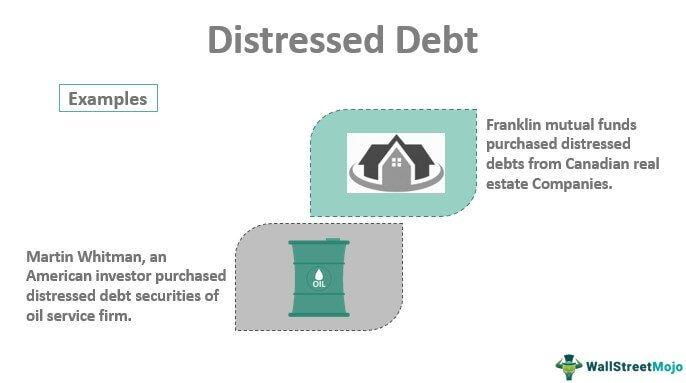

## Table of Contents

## What are distressed securities?

Distressed securities are investments in companies that are in financial trouble. These companies might be struggling to pay their debts or might even be close to going bankrupt. Investors buy these securities, like bonds or stocks, at a low price, hoping that the company will recover and the value of the securities will go up.

People who invest in distressed securities are often looking for a big payoff. They believe that by helping the company get back on its feet, they can make a lot of money. However, this type of investing is risky because the company might not recover, and the investor could lose their money. It's like trying to fix a broken toy; if you can fix it, it might be worth a lot, but if you can't, you might just have a broken toy.

## How do securities become distressed?

Securities become distressed when the company that issued them runs into big money problems. This can happen for many reasons, like not making enough money from selling their products, having too much debt, or facing unexpected events like a lawsuit or a natural disaster. When these problems pile up, the company might struggle to pay back what it owes to people who bought its bonds or stocks. As a result, the value of these securities drops a lot because investors get worried and want to sell them quickly.

Once the value of the securities goes down a lot, they are called distressed. This means they are sold at a much lower price than when they were first issued. Investors might still buy them, hoping the company can solve its problems and become successful again. But it's a risky bet because the company could fail completely and the securities could become worthless. So, distressed securities are like buying a damaged item at a discount, hoping you can fix it and sell it for more later.

## What are the common characteristics of distressed securities?

Distressed securities are usually sold at a big discount because the company that issued them is having money problems. These securities might be bonds or stocks, but they are worth a lot less than when they were first sold. Investors can buy them for a lower price because everyone is worried about the company's future. This means the price of the securities has dropped a lot, making them "distressed."

These securities often come from companies that are struggling to pay their debts or are close to going bankrupt. The companies might have too much debt, not enough sales, or other big problems. Because of these issues, the value of their securities goes down. Investors who buy distressed securities are hoping that the company will fix its problems and the securities will become more valuable again. But it's risky because the company might not recover, and the securities could become worthless.

## Who typically invests in distressed securities?

People who invest in distressed securities are usually looking for big rewards but know it's risky. They are often called "vulture investors" because they buy securities from companies that are struggling or about to fail. These investors believe they can help the company get better and make a lot of money when the securities go up in value again. They might work with the company to fix its problems or wait for the company to recover on its own.

These investors can be big hedge funds or private investment firms that have a lot of money and experience in dealing with troubled companies. They have the resources and knowledge to analyze a company's problems and decide if it's worth the risk. Sometimes, regular people might invest in distressed securities too, but it's usually not recommended because it's so risky. It's like trying to fix a broken toy; if you can fix it, you might sell it for a lot, but if you can't, you just have a broken toy.

## What are the risks associated with investing in distressed securities?

Investing in distressed securities is risky because the company that issued them might not recover from its problems. If the company goes bankrupt, the securities could become worthless, and you could lose all your money. It's like betting on a sick horse to win a race; if the horse gets better and wins, you could make a lot of money, but if it doesn't, you lose your bet.

Another risk is that it can take a long time for a company to fix its problems. You might have to wait years before you see any profit, and during that time, the value of the securities could keep going down. Plus, other investors might have a better plan to help the company, and if they succeed, you might not get as much money as you hoped. It's like planting a seed in bad soil; it might grow into a big plant, but it might also never sprout at all.

## How can an investor identify distressed securities?

To find distressed securities, an investor should look at companies that are having money problems. These companies might have a lot of debt and not enough money coming in from their sales. They might also be facing big lawsuits or other problems that make it hard for them to pay what they owe. You can find out about these issues by reading news about the company, looking at their financial reports, and seeing if their bonds or stocks are selling for a lot less than they used to.

Once you know which companies are struggling, you can check if their securities are distressed. This means their bonds or stocks are selling at a big discount. You can see this by looking at the current price of the securities and comparing it to what they were worth before the company started having problems. If the price has dropped a lot, those securities are likely distressed. It's like finding a toy on sale because it's broken; if you think you can fix it, it might be a good deal.

## What strategies are used to invest in distressed securities?

Investors who want to buy distressed securities often look for companies that are having money problems. They check the news and the company's financial reports to see if the company has too much debt or not enough sales. They also look at the price of the company's bonds or stocks to see if they are selling for a lot less than before. If the price has dropped a lot, those securities are distressed. Investors buy them at a low price, hoping the company will fix its problems and the securities will become more valuable again.

Once they buy the distressed securities, investors might try different strategies to make money. Some investors work with the company to help it get better. They might help the company pay off its debts or find new ways to make money. Other investors might just wait and see if the company can fix its problems on its own. Both ways are risky because the company might not recover, and the securities could become worthless. But if the company does get better, the investors could make a lot of money when the securities go up in value.

## What is the role of bankruptcy in distressed securities investing?

Bankruptcy plays a big part in distressed securities investing. When a company goes bankrupt, it means it can't pay its debts and needs help to figure out what to do next. Investors who bought distressed securities from this company might have a chance to get some of their money back. They can work with the company during the bankruptcy process to come up with a plan to fix its problems. This plan might involve selling off parts of the company, cutting costs, or finding new ways to make money.

But bankruptcy is risky for investors because it's not guaranteed that they will get their money back. If the company's problems are too big, it might have to close down completely, and the securities could become worthless. Investors need to be ready for this possibility and have a good understanding of the bankruptcy process. They need to know how to negotiate and work with the company to make sure they have the best chance of getting some of their money back. It's like trying to save a sinking ship; if you can patch it up and keep it afloat, you might save it, but if you can't, it will sink.

## How do distressed securities fit into a broader investment portfolio?

Distressed securities can be a part of a bigger investment plan, but they are risky. They are like the wild cards in a deck of cards. Most people who invest in them are looking for big rewards, but they know there's a chance they could lose all their money. Because of this, distressed securities are usually a small part of an investor's overall portfolio. They are not something you would put all your money into because it's too risky. Instead, they are used to try and make extra money, kind of like betting on a long shot in a horse race.

Including distressed securities in a portfolio can help spread out the risk. If you have a lot of different kinds of investments, like stocks, bonds, and real estate, adding distressed securities can be another way to mix things up. This way, if one part of your investments doesn't do well, the others might help balance it out. But because distressed securities are so risky, it's important to understand them well and not put too much money into them. It's like adding a bit of spice to a meal; a little can make it better, but too much can ruin it.

## What are some historical examples of successful distressed securities investments?

One famous example of a successful distressed securities investment is when investor Carl Icahn bought shares in TWA (Trans World Airlines) in the 1980s. TWA was struggling with a lot of debt and not making enough money. Icahn saw a chance to make money by buying the company's distressed securities at a low price. He ended up taking control of TWA and made changes to help it do better. Even though TWA eventually went bankrupt, Icahn made a lot of money from his investment.

Another example is when investors bought distressed securities from General Motors (GM) during the 2008 financial crisis. GM was in big trouble and close to going bankrupt. Some investors saw this as a chance to buy GM's bonds and stocks at a very low price. When the U.S. government stepped in to help GM, the company was able to recover. The investors who bought the distressed securities made a lot of money when GM's securities went up in value again.

## What legal and regulatory considerations should be noted when investing in distressed securities?

When investing in distressed securities, it's important to know about the laws and rules that can affect your investment. One big thing to think about is the bankruptcy process. If the company you invested in goes bankrupt, there are strict laws about how the company's assets are divided up. You need to understand these laws to know if you might get any of your money back. Also, there are rules about how you can buy and sell distressed securities. Some countries have laws that say you need to be a certain kind of investor, like a professional, to buy these securities because they are so risky.

Another thing to consider is the rules about how you can influence the company you invested in. If you buy a lot of distressed securities, you might want to help the company fix its problems. But there are laws about what you can and can't do to help the company. You might need to work with other investors or the company's management to come up with a plan. It's also important to know about any rules that might stop you from buying or selling securities quickly. These rules can affect how much money you can make or lose. So, it's a good idea to talk to a lawyer or a financial advisor who knows about these things before you invest in distressed securities.

## How do market conditions affect the performance of distressed securities?

Market conditions can have a big impact on how well distressed securities do. When the economy is doing well, it's easier for struggling companies to get better. They might be able to sell more products, pay off their debts, or get help from other companies or the government. This means the value of their distressed securities could go up because investors feel more hopeful about the company's future. But if the economy is doing badly, it's harder for these companies to fix their problems. They might not be able to sell enough products or get the help they need, so the value of their securities could go down even more.

During times of economic trouble, like a recession, more companies might become distressed, and their securities could be sold at even lower prices. This can be a good time for investors to buy distressed securities because they might get them at a bigger discount. But it's also riskier because it's harder to predict if the company will recover. The overall mood of the market, like how confident investors feel, can also affect the performance of distressed securities. If investors are feeling hopeful, they might be more willing to buy distressed securities, pushing their prices up. But if investors are worried, they might avoid these securities, making their prices go down.

## What are Valuation and Investment Strategies?

Valuing distressed securities is inherently complex due to the financial instability of the entities involved. Traditional valuation methods, such as the discounted cash flow (DCF) and liquidation value analyses, are frequently employed to determine their worth. The DCF method estimates the value of an investment based on its expected future cash flows, which are discounted back to their present value. The formula for DCF is:

$$
\text{DCF} = \sum \frac{C_t}{(1 + r)^t}
$$

where $C_t$ represents cash flow at time $t$, and $r$ is the discount rate. This approach requires an accurate assessment of future earnings, which poses a challenge for companies with uncertain financial prospects.

Liquidation value analysis evaluates the worth of a company's assets if they were sold separately. This method often serves as a lower bound during bankruptcy proceedings, guiding investors in estimating potential recoveries.

Investment strategies in distressed securities prominently feature 'vulture investing'. This approach entails acquiring undervalued assets with the anticipation of substantial profit following the company's recovery or successful reorganization. Vulture investors often buy distressed debts at significant discounts, aiming for returns when these debts regain value post-recovery. Their role can extend into actively engaging in the restructuring process, leveraging influence to obtain favorable outcomes through negotiations or asset management.

Sophisticated investors may also utilize hedging or event-driven strategies to manage risk and maximize returns. Hedging involves using financial instruments like derivatives to offset potential losses, thereby stabilizing returns amid market [volatility](/wiki/volatility-trading-strategies). On the other hand, event-driven strategies capitalize on specific corporate events—such as mergers, acquisitions, or bankruptcies—that might affect the valuation of distressed securities. These strategies require a keen understanding of legal procedures and market dynamics.

Incorporating [algorithmic trading](/wiki/algorithmic-trading) into these strategies further refines the investment process. Algorithms can analyze vast datasets to identify price inefficiencies or potential recovery signals faster and more accurately than traditional methods. Python, with its robust libraries like NumPy and Pandas, can be used to implement these strategies programmatically. For instance, in an event-driven strategy focusing on bankruptcies, one might use the following Python snippet to simulate potential returns:

```python
import numpy as np

# Simulate returns based on recovery probability
np.random.seed(42)
simulated_returns = np.random.normal(loc=0.15, scale=0.05, size=1000)  # Assuming 15% average returns with 5% volatility

# Calculate mean and standard deviation of returns
mean_return = np.mean(simulated_returns)
std_dev_return = np.std(simulated_returns)

print(f"Mean Expected Return: {mean_return:.2%}")
print(f"Standard Deviation of Returns: {std_dev_return:.2%}")
```

This code reflects an approach to simulate expected returns, offering insights into the potential profitability and risks of an investment in distressed securities. As distressed security markets evolve, strategies combining traditional valuation techniques with algorithmic trading are likely to dominate, providing a competitive edge to informed investors.

## References & Further Reading

[1]: Bergstra, J., Bardenet, R., Bengio, Y., & Kégl, B. (2011). ["Algorithms for Hyper-Parameter Optimization."](https://dl.acm.org/doi/10.5555/2986459.2986743) Advances in Neural Information Processing Systems 24.

[2]: ["Advances in Financial Machine Learning"](https://www.amazon.com/Advances-Financial-Machine-Learning-Marcos/dp/1119482089) by Marcos Lopez de Prado

[3]: ["Evidence-Based Technical Analysis: Applying the Scientific Method and Statistical Inference to Trading Signals"](https://www.amazon.com/Evidence-Based-Technical-Analysis-Scientific-Statistical/dp/0470008741) by David Aronson

[4]: ["Machine Learning for Algorithmic Trading"](https://github.com/stefan-jansen/machine-learning-for-trading) by Stefan Jansen

[5]: ["Quantitative Trading: How to Build Your Own Algorithmic Trading Business"](https://www.amazon.com/Quantitative-Trading-Build-Algorithmic-Business/dp/1119800064) by Ernest P. Chan