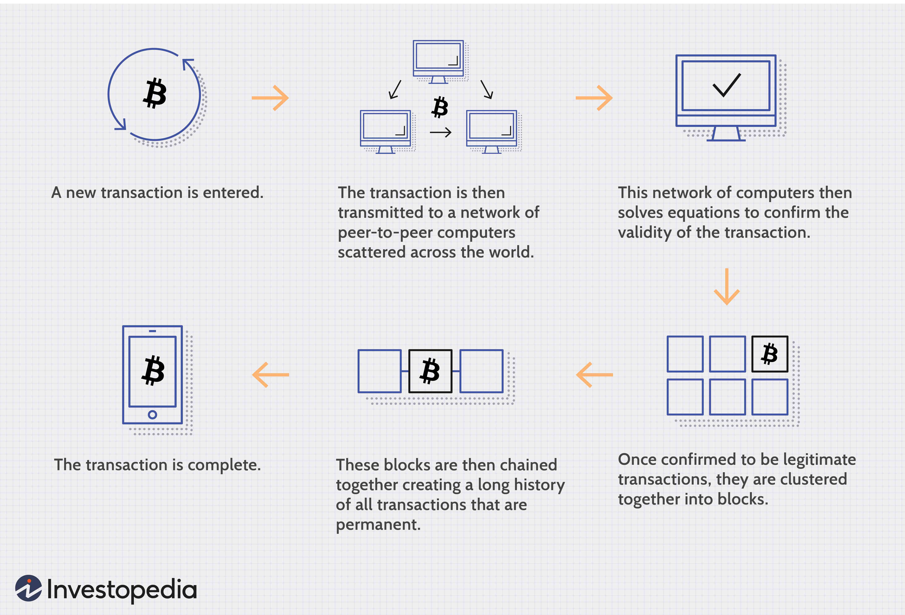

Distributed Applications, or DApps, represent a transformative approach to software development and deployment, shifting away from the traditional architecture reliance on a centralized server. Instead, DApps distribute functionality across multiple systems, utilizing the decentralized nature of blockchain technology. This paradigm shift not only redefines software infrastructure but also enhances aspects of user interaction, security, and data integrity.

This article investigates the distinctiveness of DApps, focusing on their implementation within the realms of blockchain and algorithmic trading. Unlike conventional applications, DApps harness the decentralized and immutable properties of blockchain, making them particularly well-suited for applications where transparency and security are pivotal. This examination will highlight how DApps differ fundamentally from their traditional counterparts, noting the manifold potential uses across various sectors.



In sectors such as finance and gaming, DApps introduce new opportunities for decentralization, allowing for increased security and user control. These applications eliminate the need for a central authority to manage data or transactions, thus reducing vulnerabilities and points of failure. By providing users with greater autonomy and control over their interactions and data, DApps pave the way for more secure and transparent ecosystems.

Throughout the discussion, the transformative potential of DApps to revamp industries and enhance user empowerment will become evident. As DApps continue to gain traction, the promise they hold for improving the efficiency, security, and inclusivity of digital interactions will be explored, signaling a promising evolution in the digital application landscape.

## Table of Contents

## Understanding DApps

DApps, or decentralized applications, distinguish themselves from traditional applications by functioning on distributed computing systems such as blockchain. Unlike conventional applications that rely on a single server, DApps operate on a peer-to-peer network, which significantly diminishes dependence on a central server. This structural shift in application architecture not only enhances reliability but also increases security by removing centralized points of failure.

The incorporation of smart contracts forms a critical facet of DApps. These contracts are self-executing agreements with the terms of the contract directly written into code. They automatically execute transactions when specified conditions are met, fostering a trustless environment where parties can engage without intermediaries. This capability not only streamlines processes but also minimizes the potential for human error and manipulation.

Moreover, DApps are frequently open-source, a feature that encourages global collaboration among developers. By being open-source, DApp's code is accessible to anyone interested in improving or enhancing the application. This nature of collective innovation helps in rapid advancement and the rectification of potential software bugs, ensuring a more reliable and up-to-date application.

Key features of DApps include decentralization, transparency, security, and user control. Decentralization ensures that no single entity has control over the application, aligning with the foundational principles of blockchain technology. Transparency is inherent in DApps due to their operation on blockchains, where all transactions are recorded in a public ledger visible to all participants. This public ledger helps maintain data integrity and accountability.

Security is enhanced because of the distributed nature of blockchain, which makes it resistant to hacking and fraudulent activities. Any attempt to alter data requires consensus from multiple nodes in the network, making unauthorized changes extremely difficult. Furthermore, user control is a vital aspect of DApps, as users maintain possession of their data and digital assets without the need for third-party intermediaries.

Overall, these characteristics of DApps offer a robust and reliable application environment that challenges the traditional paradigms of software development and deployment. As DApps continue to evolve, they represent a transformative technology with the potential to enhance user autonomy and reshape various industries by providing more secure, transparent, and decentralized solutions.

## Blockchain and DApps

Blockchain technology serves as the underlying framework for Decentralized Applications (DApps), providing a decentralized platform that revolutionizes how applications can operate. Unlike traditional centralized systems, blockchain utilizes a peer-to-peer architecture, allowing DApps to distribute data across multiple nodes. This distribution enhances the security and resilience of DApps, as data is not concentrated in a single location but spread across the network, reducing the risk of data breaches and system failures.

The innate transparency of blockchain technology is another significant advantage. In a blockchain, every transaction or piece of data is recorded in blocks and added to a chain in a linear, chronological order. This systematic recording allows all transactions to be publicly visible and easily verifiable by any network participant, thus ensuring data integrity and fostering trust among users. Each participant in the blockchain network has access to the same data, which can be critical for ensuring accountability and auditing purposes.

One of the primary benefits of utilizing blockchain for DApps is the elimination of central points of failure. Centralized systems are often vulnerable to attacks because they rely on singular points where data and control are concentrated. By distributing operations across a decentralized network, DApps significantly reduce these vulnerabilities, enhancing the overall robustness of the application. Moreover, the decentralized nature of blockchain protects DApps from censorship and external control, providing users with more autonomy over their interactions with the application.

A fundamental characteristic of blockchain that bolsters the reliability of DApps is its immutability. Once information is recorded on a blockchain, it is nearly impossible to alter without the consensus of the network. This immutability ensures that historical data remains unchanged and transparent, preventing fraudulent activities such as double-spending in digital currencies and ensuring traceability in supply chain applications.

Overall, blockchain technology provides a robust platform for DApps, supporting their core features of decentralization, security, and transparency. The synergy between DApps and blockchain technology not only enhances current digital ecosystems but also paves the way for innovative applications across various industries.

## DApps in Algo Trading

Algorithmic trading, characterized by the use of algorithms to automatically execute trading decisions, showcases the significant potential of decentralized applications (DApps). By harnessing decentralized networks, DApps enable real-time data processing and transaction execution without the need for intermediaries, thereby streamlining and enhancing the efficiency of trading processes.

At the core of DApps' functionality in algo trading is the blockchain's peer-to-peer nature, ensuring that all transactions are carried out in a secure and transparent manner. This transparency not only allows for the verification of transactions by all participating nodes but also promotes a high level of data integrity, crucial for the decision-making processes in trading systems.

One of the particular strengths of deploying DApps in this context is their ability to utilize smart contracts. These are self-executing contracts with terms of agreement directly written into code, which facilitate the automatic execution of trading rules based on predefined conditions. This automation reduces the likelihood of human errors and ensures consistent and reliable execution of trades. For example, if a smart contract is programmed to sell an asset if its price drops below a certain threshold, the action can be performed automatically without human intervention, thus increasing efficiency and reducing delay.

Moreover, the decentralized architecture of DApps helps to significantly lower costs traditionally associated with trading. By reducing reliance on central financial institutions and intermediaries, DApps minimize transaction fees and other associated costs. This cost-effectiveness, coupled with the enhanced security and robustness provided by the blockchain's distributed ledger, positions DApps as transformative tools in the [algorithmic trading](/wiki/algorithmic-trading) sector.

In Python, implementing a basic smart contract for algo trading could look like this simple pseudocode:

```python
class SmartContract:
    def __init__(self, asset_price, sell_threshold, quantity):
        self.asset_price = asset_price
        self.sell_threshold = sell_threshold
        self.quantity = quantity

    def execute_trade(self):
        if self.asset_price < self.sell_threshold:
            return f"Selling {self.quantity} units"
        else:
            return "Hold position"

# Example usage
contract = SmartContract(asset_price=100, sell_threshold=105, quantity=10)
result = contract.execute_trade()
print(result)  # Output: "Selling 10 units"
```

This simplified example demonstrates how algorithmic rules can be encoded and executed within the framework of a DApp, highlighting the practicality and efficiency of using such applications in modern trading environments. Through continuous innovation, the potential for DApps in algorithmic trading continues to expand, paving the way for more autonomous and efficient financial systems.

## Benefits and Challenges

Distributed applications, or DApps, provide several notable benefits over traditional centralized applications. One primary advantage is enhanced security. Since DApps operate on blockchain technology, data is distributed across multiple nodes, reducing the risk of a single point of failure. This decentralization ensures that even if one part of the network is compromised, the overall system remains secure. The use of cryptographic techniques within blockchain further bolsters this security by preventing unauthorized data alterations.

Transparency is another significant benefit of DApps. All transactions and interactions within a DApp are recorded on the blockchain, making them visible and auditable by all network participants. This transparency fosters trust among users, as they can verify any transaction independently, ensuring data integrity and accountability.

Furthermore, DApps promote user control and autonomy. Unlike centralized applications where data and control are often in the hands of a single entity, DApps distribute authority and ownership across their user base. This decentralization empowers users by allowing them control over their own data and how it is used.

Despite these benefits, DApps face several challenges. Scalability is a major concern. Distributed networks can experience slower processing speeds compared to centralized systems, as every transaction must be verified by multiple nodes. This verification process can also lead to higher operational costs as more computing power is required.

Another hurdle is user adoption. The interfaces of DApps can be more complex than those of traditional applications, often requiring users to have a good understanding of blockchain technology. This learning curve can deter potential users who are accustomed to the simplicity of centralized platforms.

In addressing these challenges, continuous innovation and technological advancements are crucial. Developments in blockchain technology, such as layer 2 scaling solutions, aim to enhance transaction speeds and reduce costs, thereby improving the scalability of DApps. Simplifying user interfaces and improving education around DApps can help drive user adoption.

In conclusion, while DApps have inherent challenges to overcome, their potential to revolutionize industries by providing secure, transparent, and autonomous digital interactions is immense. Future innovations are expected to address current limitations, paving the way for broader acceptance and integration of DApps in various sectors.

## Conclusion

As the digital landscape evolves, Decentralized Applications (DApps) represent a transformative innovation poised to redefine how users interact with technology. The integration of blockchain with DApps, particularly in sectors like algorithmic trading, is opening new avenues for efficiency and security. By capitalizing on the decentralized nature of blockchain, DApps enhance transaction transparency and trust, thereby reducing the reliance on intermediary entities and fostering a more direct and secure digital environment.

Despite the existing challenges, such as scalability and complex user interfaces, the acceptance and growth of DApps continue to expand. This growth is driven by their potential to disrupt traditional systems, offering more resilient alternatives that do not depend on singular points of failure associated with centralized frameworks. As technological advancements progress, these obstacles are likely to be mitigated, facilitating broader adoption and innovation in DApp development.

Embracing DApps could lead to more trustworthy, decentralized, and inclusive digital interactions, empowering users with greater control over their data and transactions. The path forward suggests that the future of digital applications will increasingly rely on the innovative capacity of DApps, supported by the ongoing advancement of blockchain technology. As industries and developers continue to explore and harness these technologies, DApps are positioned to play a significant role in shaping the next wave of digital transformation.

## References & Further Reading

[1]: Petrowski, M., & Bendjelid, M. (2018). ["Blockchain and Decentralized Applications: Opportunities and Challenges."](https://www.researchgate.net/publication/324725048_Blockchain_Challenges_and_applications) IEEE Xplore.

[2]: Nakamoto, S. (2008). ["Bitcoin: A Peer-to-Peer Electronic Cash System."](https://nakamotoinstitute.org/library/bitcoin/) Bitcoin.org.

[3]: ["Mastering Bitcoin: Unlocking Digital Cryptocurrencies"](https://www.amazon.com/Mastering-Bitcoin-Unlocking-Digital-Cryptocurrencies/dp/1449374042) by Andreas M. Antonopoulos

[4]: Bashir, I. (2017). ["Mastering Blockchain: Distributed Ledger Technology, Decentralization and Smart Contracts Explained."](https://books.google.com/books/about/Mastering_Blockchain.html?id=3ZlUDwAAQBAJ)

[5]: Buterin, V. (2014). ["Ethereum: A Next-Generation Smart Contract and Decentralized Application Platform."](https://ethereum.org/content/whitepaper/whitepaper-pdf/Ethereum_Whitepaper_-_Buterin_2014.pdf) Ethereum Whitepaper.

[6]: ["Building Decentralized Apps with Ethereum and Solidity"](https://medium.com/@solidity101/solidity-mastery-building-decentralized-applications-with-confidence-3d3a53f58ea7) by Roberto Infante

[7]: Iansiti, M., & Lakhani, K. R. (2017). ["The Truth About Blockchain."](https://hbr.org/2017/01/the-truth-about-blockchain) Harvard Business Review.