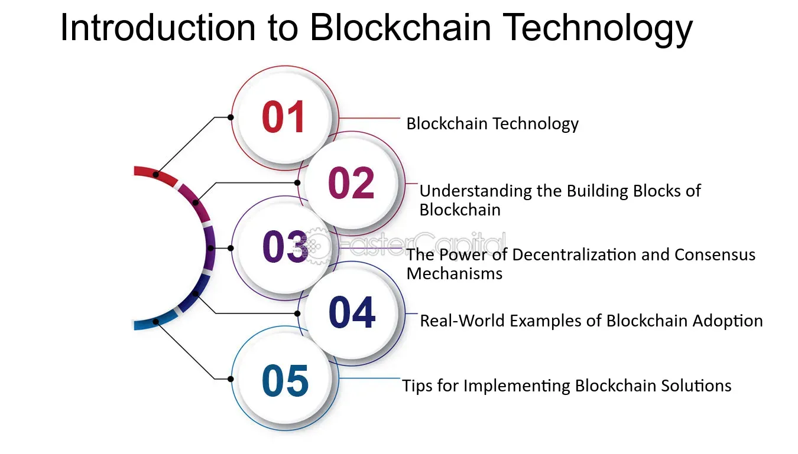

## Table of Contents

## What is a distributed application (DApp)?

A distributed application, often called a DApp, is a type of software that runs on a network of computers instead of a single computer. This network is usually a blockchain, which is a secure way to store data across many computers. Because the data is spread out, DApps can be more reliable and less likely to fail. They also let people interact directly with each other without needing a middleman, like a bank or a company.

DApps are often used for things like cryptocurrencies, where people can send and receive money without a bank. They can also be used for other things, like games or social networks, where users control their own data. Since DApps run on a blockchain, they are transparent and secure, meaning that everyone can see what's happening, but no one can change it without permission. This makes DApps a powerful tool for creating new kinds of applications that are open and fair for everyone.

## How do distributed applications differ from traditional applications?

Distributed applications, or DApps, are different from traditional applications because they run on many computers at the same time, instead of just one. Traditional applications usually run on a single server or a centralized system, which means if that server goes down, the app might stop working. But with DApps, the data and processing are spread out across a network, often a blockchain. This makes DApps more reliable because if one computer fails, the others can keep the app running.

Another big difference is how DApps and traditional apps handle data and trust. Traditional apps often rely on a central authority, like a company, to manage data and make sure everything is fair. This can be a problem if the company makes bad decisions or if it gets hacked. DApps, on the other hand, use a blockchain to keep data secure and transparent. Everyone can see what's happening, and no one can change it without the network's agreement. This makes DApps more open and fair, and it lets people trust the system without needing a middleman.

## What are the key components of a distributed application?

The main parts of a distributed application include the blockchain, smart contracts, and a user interface. The blockchain is like a big, shared notebook where all the data is stored across many computers. It keeps everything safe and makes sure no one can change the data without everyone agreeing. Smart contracts are special programs that run on the blockchain. They automatically do things like sending money or updating records when certain conditions are met. The user interface is what people see and use to interact with the DApp, like a website or an app on their phone.

Another important part is the consensus mechanism, which is how all the computers in the network agree on what's true. This can be done in different ways, like proof of work or proof of stake, but the goal is always the same: to make sure everyone trusts the system. Lastly, there's often a token or [cryptocurrency](/wiki/cryptocurrency) that's used within the DApp. This can be used to pay for using the app, reward people for helping run the network, or give users a way to own part of the app. Together, these components make DApps work in a way that's open, secure, and doesn't need a middleman.

## What are the benefits of using distributed applications?

One big benefit of using distributed applications, or DApps, is that they are very reliable. Because they run on many computers at the same time, if one computer stops working, the others can keep the app going. This means DApps are less likely to crash or stop working. Also, DApps are more secure because they use a blockchain to store data. This makes it hard for hackers to change or steal information because it's spread out and everyone can see what's happening.

Another benefit is that DApps can be more fair and open. Traditional apps often have a company or someone in charge who decides what happens. But with DApps, no one is in control. Instead, everyone in the network agrees on what's true using something called a consensus mechanism. This means people can trust the app without needing a middleman like a bank or a company. DApps also let users own their own data and even part of the app itself through tokens or cryptocurrencies, giving people more control over what they use and how it works.

## What are the common challenges faced when developing distributed applications?

Developing distributed applications can be tricky because they need to work well on many computers at the same time. One big challenge is making sure all those computers agree on what's true. This is called a consensus mechanism, and it can be slow and use a lot of energy. Another problem is that if the network gets too busy, it can slow down or even stop working. This can make the app hard to use, especially if a lot of people want to use it at the same time.

Another challenge is keeping the app safe and private. Even though blockchains are hard to hack, they are public, so anyone can see what's happening. This can be a problem if people want to keep some things secret. Also, writing the code for DApps, called smart contracts, can be hard. If there's a mistake in the code, it can cause big problems that are hard to fix because the code runs on a blockchain and can't be changed easily.

Lastly, it can be tough to make DApps easy to use. People are used to traditional apps that work on one computer, so DApps can seem complicated. Plus, using DApps often means dealing with cryptocurrencies, which can be confusing for people who are new to them. All these challenges mean that making a good DApp takes a lot of work and careful planning.

## How does blockchain technology relate to distributed applications?

Blockchain technology is the backbone of distributed applications, or DApps. It's like a big, shared notebook that keeps track of all the data and transactions in a DApp. Instead of being stored on one computer, the data is spread out across many computers in a network. This makes the DApp more reliable and secure because if one computer fails, the others can keep the app running. Also, because everyone in the network can see what's happening in the blockchain, it's hard for anyone to cheat or change the data without everyone agreeing.

Using blockchain in DApps also means that there's no need for a middleman like a bank or a company to make sure everything is fair. Instead, the rules for how the DApp works are written in special programs called smart contracts. These smart contracts run on the blockchain and automatically do things like sending money or updating records when certain conditions are met. This makes DApps more open and fair because no one person or group is in control. It's all about trust in the system, not in a single authority.

## Can you provide examples of distributed applications that use blockchain technology?

One example of a DApp that uses blockchain technology is Ethereum. Ethereum is a platform where people can create and run their own DApps. It uses a special kind of blockchain that can run smart contracts, which are like automatic programs that do things when certain rules are met. For example, people use Ethereum to make new cryptocurrencies, run games, or even create digital art that can be bought and sold. Because it runs on a blockchain, everything is safe and open for everyone to see.

Another example is Uniswap, which is a DApp for trading cryptocurrencies. Instead of using a bank or a company to trade, Uniswap lets people trade directly with each other on the Ethereum blockchain. It uses smart contracts to make sure the trades are fair and to keep everything running smoothly. This means people can trade without needing to trust a middleman, making it easier and more open for everyone.

A third example is Decentraland, a virtual world where people can buy and sell virtual land and other items using a cryptocurrency called MANA. It's all built on the Ethereum blockchain, so the ownership of the land and items is recorded in a way that's safe and can't be changed easily. People can also create games and experiences in Decentraland, making it a fun and creative place to explore.

## What is the role of smart contracts in blockchain-based distributed applications?

Smart contracts play a crucial role in blockchain-based distributed applications. They are like special programs that run automatically on the blockchain when certain conditions are met. For example, if you want to send money to someone when they finish a job, a smart contract can make that happen without needing a bank or a company to help. This makes things more fair and open because everyone can see the rules and know that they will be followed.

Smart contracts also make DApps more reliable and secure. Because they are written into the blockchain, they can't be changed easily, which means people can trust that the DApp will work the way it's supposed to. This is important for things like trading cryptocurrencies or buying virtual land, where you want to be sure that your money and your stuff are safe. By using smart contracts, DApps can do a lot of things automatically and fairly, making them a powerful tool for building new kinds of applications.

## How do consensus mechanisms work in blockchain DApps?

In blockchain DApps, consensus mechanisms are like voting systems that help all the computers in the network agree on what's true. Imagine a group of friends trying to decide where to eat. They all need to agree on the same place, or they'll end up at different restaurants. In a blockchain, the computers, called nodes, need to agree on things like transactions and data updates. They use different ways to reach this agreement, like proof of work or proof of stake. Proof of work is like a puzzle-solving contest where the first computer to solve it gets to add new data to the blockchain. Proof of stake is more like a lottery where computers with more of the blockchain's cryptocurrency have a better chance of adding new data.

The main goal of these consensus mechanisms is to keep the blockchain secure and fair. If everyone agrees on what's happening, it's hard for anyone to cheat or change the data without everyone noticing. This makes the DApp reliable because even if one computer tries to do something wrong, the others can stop it. Different DApps might use different consensus mechanisms depending on what they need. Some might want to be fast, while others might want to save energy. But no matter which method they use, the idea is the same: to make sure everyone trusts the system and can use the DApp safely.

## What are the scalability issues in blockchain-based distributed applications and how can they be addressed?

Scalability is a big problem for blockchain-based distributed applications. It means that as more people use the DApp, it can get slow and hard to use. This happens because every computer in the network needs to check and agree on every new piece of data, like a transaction. If too many people are trying to do things at the same time, the network can get backed up, kind of like a traffic jam. This can make the DApp less useful because people don't want to wait a long time for their stuff to go through.

To fix these scalability issues, people are trying different things. One idea is to use something called "sharding," which splits the blockchain into smaller pieces, or shards. Each shard can handle its own data, so more things can happen at the same time without slowing down the whole network. Another way is to use "off-chain" solutions, where some of the work is done outside the main blockchain. For example, with something called the Lightning Network, people can do a lot of small transactions quickly without needing to put each one on the blockchain. These ideas can help make DApps faster and easier to use, even when a lot of people want to use them.

## What programming languages and tools are commonly used to develop blockchain DApps?

When building blockchain DApps, developers often use languages like Solidity and Vyper for writing smart contracts on the Ethereum blockchain. Solidity is the most popular one and looks a bit like JavaScript, making it easier for many developers to learn. It's used to create the rules and automatic actions that happen in a DApp. Vyper is another language that's simpler and safer, but it's not used as much. For other blockchains, like Hyperledger Fabric, developers might use Go or Java. These languages help make sure the DApp runs smoothly and securely on the blockchain.

Besides programming languages, developers also use special tools to build DApps. Truffle is a popular tool for Ethereum that helps with testing and deploying smart contracts. It makes the whole process easier and less likely to have mistakes. Remix is another tool that lets you write, test, and run smart contracts right in your web browser, which is handy for quick changes and testing. For working with other blockchains, tools like Hyperledger Composer can be useful. They help developers put together all the parts of a DApp and make sure it works well on the blockchain.

## What are some advanced security considerations for developing and deploying distributed applications on blockchain?

When you're making and putting out distributed applications on a blockchain, you need to think a lot about keeping them safe. One big thing to watch out for is making sure your smart contracts don't have mistakes. If there's a small error in the code, it could let hackers in or cause the DApp to do the wrong thing. To stop this from happening, developers use special tools to test their smart contracts over and over again. They also use something called formal verification, which is like a super careful check to make sure the code does exactly what it's supposed to do. Another important part is keeping private information safe. Even though blockchains are open for everyone to see, you can use special tricks like encryption to hide some data so only the right people can see it.

Another thing to think about is how to stop attacks on the whole network. Hackers might try to take over a lot of the computers on the blockchain to control what happens, which is called a 51% attack. To stop this, DApps can use different ways to make sure everyone agrees on what's true, like proof of stake instead of proof of work. This can make it harder for hackers to take over. Also, keeping the DApp up to date is really important. As new ways to hack come out, you need to fix your DApp to stay safe. Using good security practices, like always checking and updating the code, helps keep the DApp strong and safe for everyone to use.

## References & Further Reading

[1]: Petrowski, M., & Bendjelid, M. (2018). ["Blockchain and Decentralized Applications: Opportunities and Challenges."](https://www.researchgate.net/publication/324725048_Blockchain_Challenges_and_applications) IEEE Xplore.

[2]: Nakamoto, S. (2008). ["Bitcoin: A Peer-to-Peer Electronic Cash System."](https://nakamotoinstitute.org/library/bitcoin/) Bitcoin.org.

[3]: ["Mastering Bitcoin: Unlocking Digital Cryptocurrencies"](https://www.amazon.com/Mastering-Bitcoin-Unlocking-Digital-Cryptocurrencies/dp/1449374042) by Andreas M. Antonopoulos

[4]: Bashir, I. (2017). ["Mastering Blockchain: Distributed Ledger Technology, Decentralization and Smart Contracts Explained."](https://books.google.com/books/about/Mastering_Blockchain.html?id=3ZlUDwAAQBAJ)

[5]: Buterin, V. (2014). ["Ethereum: A Next-Generation Smart Contract and Decentralized Application Platform."](https://ethereum.org/content/whitepaper/whitepaper-pdf/Ethereum_Whitepaper_-_Buterin_2014.pdf) Ethereum Whitepaper.

[6]: ["Building Decentralized Apps with Ethereum and Solidity"](https://medium.com/@solidity101/solidity-mastery-building-decentralized-applications-with-confidence-3d3a53f58ea7) by Roberto Infante

[7]: Iansiti, M., & Lakhani, K. R. (2017). ["The Truth About Blockchain."](https://hbr.org/2017/01/the-truth-about-blockchain) Harvard Business Review.