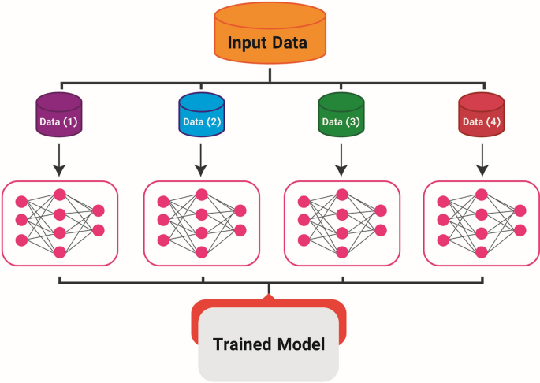

## Table of Contents

## What is distributed communication in the context of machine learning?

Distributed communication in the context of machine learning refers to the process of exchanging data and model updates between multiple computers or nodes working together to solve a machine learning problem. This is particularly important in large-scale machine learning tasks where the data is too big to fit on a single machine or when the computational power of a single machine is insufficient. By distributing the workload across multiple nodes, the training process can be significantly sped up, and larger datasets can be handled more efficiently.

In a typical distributed machine learning setup, each node may be responsible for processing a subset of the data and computing partial model updates. These updates are then communicated to other nodes, often through a central coordinator, to be aggregated and used to update the global model. This communication can be synchronous, where nodes wait for each other to finish their computations before exchanging updates, or asynchronous, where nodes can send and receive updates at any time. The choice between these methods depends on factors like the size of the dataset, the network bandwidth, and the desired trade-off between speed and model accuracy.

## Why is distributed communication important for machine learning?

Distributed communication is important for machine learning because it allows us to handle big data and complex models that a single computer can't manage alone. When we have a lot of data, it's too much for one computer to process quickly. By spreading the data across many computers, each one can work on a smaller piece of the puzzle. This makes the whole process faster and lets us use more data to train better models.

Also, distributed communication helps when we need a lot of computing power. Some [machine learning](/wiki/machine-learning) models, like deep neural networks, need a lot of calculations. By using many computers together, we can do these calculations much faster. This is really helpful for things like training models for self-driving cars or understanding human speech, where we need quick and accurate results.

## What are the basic principles of distributed communication systems?

Distributed communication systems work by breaking down a big job into smaller parts and sharing those parts among many computers. Each computer, or node, does its own piece of the work and then talks to the other nodes to share what it has done. This talking, or communication, is really important because it helps put all the pieces back together to make a complete result. In machine learning, for example, each node might work on a part of the data and then share its learning with the other nodes to build a better model.

The main idea behind these systems is to make things faster and handle more data. If one computer can't do the job quickly enough, using many computers can speed things up a lot. But, it's not just about speed. It's also about making sure the communication between nodes is reliable and efficient. If the nodes can't talk to each other well, the whole system can slow down or even fail. So, good communication methods and strong network connections are key to making distributed systems work well.

## How does distributed communication differ from traditional communication in machine learning?

Distributed communication in machine learning is different from traditional communication because it involves many computers working together, while traditional communication usually happens on just one computer. In traditional setups, all the data and calculations happen in one place. This can be slow if you have a lot of data or if the model is very complex. But with distributed communication, the work is split up among many computers. Each computer, or node, works on a small part of the data and then shares its results with the others. This makes the whole process much faster and lets you use more data to train better models.

The way these computers talk to each other in a distributed system is also different. In traditional setups, there's no need for communication between different parts of the computer because everything is happening in one place. But in distributed systems, the nodes need to send and receive information all the time. They might use a central computer to help them share their results, or they might talk to each other directly. This communication can happen in different ways, like all at once or one at a time, depending on what works best for the task. The key is to make sure the communication is fast and reliable so the whole system can work well together.

## What are some common protocols used in distributed communication for machine learning?

In distributed machine learning, several common protocols help computers talk to each other. One popular protocol is the Message Passing Interface (MPI). MPI lets different computers send messages to each other, which is really helpful for sharing data and model updates. Another common protocol is the Remote Procedure Call (RPC). With RPC, one computer can ask another computer to do a task and then get the results back. This is useful for things like asking a node to process a part of the data and then sending the results back to the main computer.

Another important protocol is the Parameter Server (PS) architecture. In this setup, there's a central server that keeps track of the model's parameters. The other computers, or workers, send their updates to this server, and the server then sends the updated parameters back to the workers. This helps keep everyone on the same page and makes sure the model is updated correctly. Lastly, there's the AllReduce protocol, which is used a lot in [deep learning](/wiki/deep-learning). AllReduce helps all the computers share their updates at the same time, so everyone can use the new information to update the model together. This can make the training process faster and more efficient.

## Can you explain the concept of 'Blink Communication' in distributed systems?

Blink communication in distributed systems is a way for computers to talk to each other quickly, kind of like sending a quick flash of light or a "blink." It's used when you want to share small bits of information very fast, without needing a lot of back-and-forth. For example, in a machine learning setup, one computer might send a quick update to others to let them know it's ready to share its part of the work, or it might send a signal to start a new round of calculations.

This method is helpful because it's simple and fast, which is important in big systems where lots of computers need to work together smoothly. Imagine a group of friends playing a game where they need to signal each other to start a new round. If they can just blink a light to say "go," it's much quicker than sending a long message. In distributed systems, using blink communication can make the whole process more efficient, helping to speed up tasks like training machine learning models where timing and coordination are key.

## What are the challenges faced when implementing distributed communication in machine learning?

Implementing distributed communication in machine learning can be tricky because it involves a lot of computers working together, and they need to talk to each other just right. One big challenge is making sure the communication is fast and reliable. If the computers can't share information quickly or if the messages get lost, the whole system can slow down or even stop working. This is really important in machine learning because the computers need to share updates about the model they're building. If the communication isn't good, the model might not learn properly or take too long to train.

Another challenge is dealing with the complexity of managing many computers at once. Each computer, or node, has to do its part of the work and then share it with the others. This means you need a good way to split up the work and make sure everyone is on the same page. Sometimes, one computer might finish its job faster than the others, and you need to decide if it should wait or keep going. Also, if one computer has a problem, like a network issue or a hardware failure, you need a plan to keep the whole system running smoothly. This can be hard to manage, especially when you're working with big datasets and complex models.

## How does distributed communication affect the performance and scalability of machine learning models?

Distributed communication can really help make machine learning models work faster and handle more data. When you use many computers together, each one can work on a small part of the data. This means the whole job gets done much quicker than if just one computer was doing all the work. For example, if you have a huge amount of data, one computer might take days to process it all, but with many computers working together, you could finish in hours. This is important because faster training means you can try out more ideas and make your models better. Also, by spreading the work across many computers, you can use bigger and more complex models that one computer couldn't handle alone.

But, there are some challenges too. The way the computers talk to each other can affect how well the system works. If the communication is slow or if messages get lost, the whole process can slow down or even stop. This means you need to make sure the communication is fast and reliable. Also, managing many computers at once can be tricky. You have to split up the work evenly and make sure all the computers are working together smoothly. If one computer has a problem, you need a way to keep the whole system running. So, while distributed communication can make machine learning models more powerful and able to handle more data, it also adds some new problems to solve.

## What are the best practices for optimizing distributed communication in machine learning?

To optimize distributed communication in machine learning, it's important to keep the communication between computers as fast and efficient as possible. One good way to do this is by using smart ways to send and receive data. For example, instead of sending all the data at once, you can send only the parts that have changed. This can save a lot of time and make the system work better. Also, choosing the right communication protocol, like MPI or AllReduce, can make a big difference. These protocols help the computers talk to each other in a way that's quick and reliable, which is really important when you're training a machine learning model.

Another important practice is to balance the work evenly among all the computers. If one computer finishes its job much faster than the others, it might have to wait, which can slow down the whole system. To avoid this, you can use techniques like data sharding, where you split the data into equal parts for each computer to work on. Also, it's helpful to have a good way to handle problems, like if one computer stops working. You can set up the system so that other computers can take over the work, keeping everything running smoothly. By following these practices, you can make your distributed machine learning system faster and more reliable, helping you build better models with big data.

## How can 'Blink Communication' be integrated into existing machine learning frameworks?

Blink communication can be integrated into existing machine learning frameworks by adding a simple signaling system that allows nodes to quickly share small bits of information. For example, in a framework like TensorFlow or PyTorch, you could add a function that sends a quick signal to other nodes when a certain task is complete. This signal, or "blink," could be used to coordinate the start of new rounds of calculations or to indicate that a node is ready to share its updates. By using existing communication protocols like MPI or RPC, you can easily send these signals without needing to change much of the existing code. This makes it easier to keep the system running smoothly and efficiently.

To implement blink communication, you would need to modify the framework's communication layer to include this new signaling method. For instance, you could add a new method in the communication module that sends a short message to all nodes when a specific event occurs. This could be done by adding a few lines of code to the existing communication functions. For example, in Python, you might add something like ```python
def send_blink_signal(self, event):
    self.comm.send(event, dest='all')
``` to the communication class. This simple addition allows the nodes to quickly share important updates, helping to speed up the training process and improve the overall performance of the machine learning model.

## What advanced techniques can be used to enhance the efficiency of distributed communication in large-scale machine learning?

One advanced technique to enhance the efficiency of distributed communication in large-scale machine learning is the use of quantization. Instead of sending full-precision data between nodes, quantization reduces the amount of data that needs to be communicated by representing it with fewer bits. For example, if you're sending model updates, you can use techniques like stochastic quantization to convert floating-point numbers into lower-precision integers. This means less data to send, which can speed up communication and reduce network load. A simple way to implement quantization in Python might look like ```python
import numpy as np

def stochastic_quantize(x, num_bits):
    scale = 2 ** (num_bits - 1)
    x_scaled = x * scale
    x_quantized = np.round(x_scaled)
    return x_quantized / scale
```. By using this method, you can make your distributed system work faster and handle more data.

Another technique is the use of asynchronous communication. In traditional synchronous setups, nodes wait for each other to finish their tasks before exchanging updates, which can lead to idle time and slow down the process. Asynchronous communication allows nodes to send and receive updates at any time, without waiting. This can be particularly useful in large-scale machine learning where nodes might have different processing speeds. For instance, a node can start working on the next batch of data as soon as it finishes its current task, and then share its updates with others whenever it's ready. This can be implemented by adding an asynchronous update function to your communication module, such as ```python
import asyncio

async def async_update(self, update):
    await self.comm.send(update, dest='all')
```. By using asynchronous methods, you can keep all nodes busy and reduce the overall training time of your machine learning model.

## What are the future trends and research directions in distributed communication for machine learning?

Future trends in distributed communication for machine learning are likely to focus on making communication even faster and more efficient. One big area of research is developing new ways to compress data before sending it between nodes. Techniques like quantization and sparsification are becoming more popular because they can reduce the amount of data that needs to be sent. For example, quantization can turn a full-precision number into a lower-precision one, making it smaller and faster to send. Another trend is using more advanced asynchronous communication methods, where nodes don't have to wait for each other to finish their tasks before sharing updates. This can help keep all nodes busy and speed up the overall training process.

Another important direction is improving the fault tolerance of distributed systems. As machine learning models get bigger and more complex, it's important to make sure the system can keep working even if one or more nodes fail. Researchers are working on ways to quickly detect and handle failures, so the rest of the system can continue without major interruptions. This involves developing new protocols and algorithms that can reroute tasks and data to other nodes if needed. Additionally, there's a growing interest in integrating distributed communication with edge computing, where data is processed closer to where it's generated. This can reduce the need for sending large amounts of data over the network, making the whole system more efficient and responsive.