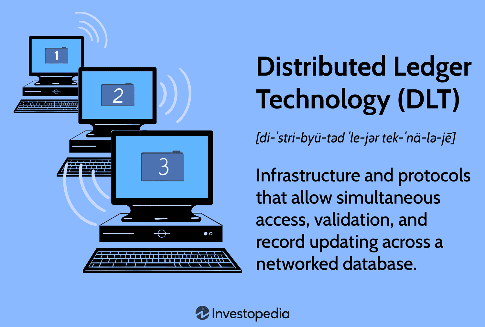

Distributed Ledger Technology (DLT) is profoundly impacting various sectors, with blockchain standing out as its most notable application. Prominently, DLT promises to redefine the trading industry, particularly algorithmic trading, by offering improvements in transparency, security, and efficiency. Algorithmic trading, which relies on pre-defined strategies and high-speed data processing, necessitates robust and reliable systems to maximize effectiveness. The integration of DLT within these systems can vastly enhance their performance by ensuring immutable and verifiable transaction records, expediting trade settlements, and minimizing reliance on intermediaries. 

This article will examine the functions and advantages of DLT in the context of trading. We will explore how distributed ledgers, exemplified by blockchain, provide auditable transaction records, mitigate fraud risks, and facilitate quicker settlements. Moreover, we will discuss real-world applications demonstrating DLT's transformative potential across the financial sector and other industries. Future prospects, alongside challenges such as scalability and regulatory considerations, will be outlined, providing a comprehensive understanding of DLT's evolving role in algorithmic trading.

## Table of Contents

## Understanding Distributed Ledgers

Distributed ledgers are fundamentally different from traditional databases due to their decentralized nature. Unlike conventional databases, which store data in a centralized server, distributed ledgers replicate and distribute data across multiple nodes in a network. Each node, acting as an independent validator, contains a copy of the entire ledger. This architecture enhances resilience and reduces single points of failure, making the system more robust against data breaches.

The decentralization inherent in distributed ledger technology (DLT) greatly enhances data integrity. Since transactions are recorded across numerous nodes, altering any piece of information necessitates coordination across the majority of the network, making unauthorized changes highly impractical. This consensus-driven approach ensures that the data remains consistent and trustworthy, as all nodes hold synchronized copies of the ledger.

Blockchain, a prominent type of distributed ledger, structures its data as a sequence of blocks. Each block contains a batch of transactions, a timestamp, and a unique cryptographic hash of the previous block, forming a chain. This design ensures immutability, meaning that once a block is appended to the chain, its data cannot be modified without altering subsequent blocks, which would require a consensus from the network majority.

As a result, blockchains provide a transparent yet secure platform for recording transactions. Their chronological linking of blocks facilitates an auditable and traceable history of all transactions within the network, enhancing transparency. This property is particularly advantageous in applications requiring verified records, as it eliminates the need for intermediaries to guarantee the authenticity and integrity of the transactions.

In summary, the distribution and decentralization of data storage inherent in distributed ledger technology represent a significant departure from traditional database management. These characteristics not only diminish the potential for data breaches but also ensure that the information recorded remains immutable and transparent, with blockchain serving as a quintessential example of such advancements.

## Blockchain Technology: Beyond Cryptocurrencies

Blockchain technology, widely recognized for its association with cryptocurrencies, has gained traction across various sectors due to its inherent transparency and security features. Beyond digital currencies, blockchain has been integrated into industries such as supply chain management, healthcare, and finance, where it plays a critical role in enhancing operational efficiencies and reducing fraudulent activities.

In the supply chain sector, blockchain is used to track the provenance of goods, ensuring transparency at every stage from manufacturing to delivery. Companies leverage blockchain to monitor the movement of products, reducing the risk of counterfeiting and providing consumers with verified data about product origins. For instance, through immutable ledger entries, stakeholders can verify the authenticity and journey of each item, thus promoting trust and accountability throughout the supply chain.

The healthcare industry benefits significantly from blockchain technology by employing it to secure patient data and facilitate seamless sharing among authorized parties. Blockchain's ability to maintain an immutable record ensures that patient information remains unaltered by unauthorized access, thereby enhancing data security. It also supports interoperability by allowing different healthcare providers to access patient records efficiently, ensuring continuity of care and reducing errors associated with data fragmentation.

In the financial sector, blockchain fosters secure transactions and reduces the potential for fraud through its decentralized nature. The technology eliminates the need for traditional intermediaries, thus enabling faster and more cost-effective transaction settlements. One of the most transformative features of blockchain in this context is the implementation of smart contracts. These self-executing contracts have the terms of the agreement directly written into code, automatically executing and enforcing contractual clauses without the need for third-party intervention. By minimizing human involvement, smart contracts reduce operational costs and mitigate the risk of errors or manipulations.

Overall, blockchain technology transcends its initial use in cryptocurrencies, offering a versatile framework applicable across multiple industries. Its robust security features, combined with capabilities for automating processes through smart contracts, denote a shift toward more efficient and transparent operations, paving the way for future innovations and applications.

## Algorithmic Trading and Blockchain

Algorithmic trading has become a critical component of modern financial markets, leveraging pre-set strategies and sophisticated software to execute trades at high speeds, processing extensive data sets more efficiently than human capabilities. By capitalizing on algorithmic precision, this approach minimizes the adverse impacts of emotions and executes trades based on quantifiable data and signals.

Distributed Ledger Technology (DLT) significantly enhances the performance and reliability of [algorithmic trading](/wiki/algorithmic-trading) systems. One of the primary attributes DLT brings to algorithmic trading is the creation of immutable and auditable records of transactions. This provides market participants with increased transparency and trust, essential for maintaining integrity in automated trading processes. Blockchain, a prevalent form of DLT, structures data into blocks, securing and linking them chronologically, which further guarantees the immutability and comprehensiveness of data involved in trading activities.

Moreover, blockchain’s ability to streamline trade settlements is considerable. Traditional settlement processes can sometimes extend over a few days due to multiple parties involved and the required intermediaries. By implementing blockchain technology, trade settlements can be expedited, sometimes merging the trading and settlement phases almost instantaneously. This not only reduces settlement time but also the associated counterparty risk. Minimizing reliance on intermediaries through DLT lowers transaction costs and mitigates the potential for fraud, as automated and tamper-proof blockchain systems replace the need for often fallible human oversight.

To illustrate, let's consider a typical trade execution process without blockchain: 
1. Execution - Trade orders are executed through brokers.
2. Clearing - Details of the executed trades are confirmed.
3. Settlement - Legal ownership of the traded securities is transferred.

Incorporating blockchain, however, modifies this to:
1. Execution - Transactions are automatically recorded on the blockchain when trades are executed.
2. Clearing - Due to blockchain's inherent structure, trade verification occurs simultaneously with execution.
3. Settlement - The transaction is settled immediately, with the blockchain updating ownership records in real-time.

By addressing the latency issues found in traditional trading systems, DLT promises a more cohesive and streamlined process. As algorithmic trading continues to evolve, its synergy with blockchain technology could redefine efficiency and security standards in financial markets.

## Applications and Real-world Examples

Blockchain technology has dramatically enhanced efficiencies in the financial sector by facilitating real-time settlements and the use of smart contracts. Traditional financial transactions often involve multiple intermediaries and can take several days to complete. However, blockchain's decentralized ledger system allows for instantaneous verification and settlement of transactions. This improvement reduces the risk of errors and fraud and lowers transaction costs and processing times.

In logistics, blockchain is employed to ensure supply chain transparency. Companies like Walmart have integrated blockchain to trace the origin and journey of products, allowing for improved traceability and accountability. This adoption streamlines operations and enhances consumer trust, as it provides verified information about the provenance and handling of products.

Public administration has also started to harness blockchain's capabilities. An exemplary case is Estonia's digital identity infrastructure, which uses blockchain to manage and secure citizens' data. This system offers a secure method for accessing public services electronically, ensuring data integrity and confidentiality. With blockchain, citizens can verify their identity digitally with more security and reduced risk of unauthorized access, showcasing the potential of this technology in enhancing public sector services.

## Future Prospects and Challenges

Distributed Ledger Technology (DLT) presents promising prospects for enhancing digital infrastructure across industries, yet it faces significant challenges, most notably scalability and energy consumption. These issues are primarily associated with consensus mechanisms, especially proof-of-work (PoW), which is renowned for its security but criticized for its heavy energy demands. PoW requires participants, known as miners, to solve complex mathematical problems to validate transactions, which, while ensuring network security, leads to large-scale energy consumption and slower transaction throughput.

Scalability is a persistent concern for DLT, as traditional blockchains can process a limited number of transactions per second (TPS). This limitation can hinder large-scale applications and affects the timeliness of operations, crucial for sectors like finance. Innovative solutions such as sharding aim to tackle this problem. Sharding divides the blockchain into smaller, manageable parts called "shards," allowing parallel processing of transactions, which can significantly increase the network's TPS.

In addition to sharding, alternative consensus mechanisms such as proof-of-stake (PoS) and delegated proof-of-stake (DPoS) offer potential solutions to the energy consumption issue. PoS minimizes energy usage by assigning transaction validation rights based on the number of coins a validator holds, rather than computational power. This leads to a more energy-efficient process while maintaining network security. DPoS further refines this by having stakeholders vote for a small, trusted group of validators, potentially increasing transaction speed and reducing energy requirements.

The regulatory environment for DLT continues to evolve, presenting both challenges and opportunities. Regulators worldwide are working toward creating frameworks that ensure security, transparency, and compliance within DLT operations without stifling innovation. The lack of a uniform regulatory approach can lead to inconsistencies that impede cross-border transactions and collaborations. However, appropriate regulatory measures could catalyze innovation by fostering trust and providing clear guidelines for implementation.

In conclusion, while DLT holds transformative potential, overcoming scalability and energy consumption challenges through technological innovations like sharding and alternative consensus models is crucial. Concurrently, developing a balanced regulatory framework will be pivotal in facilitating the widespread adoption of DLT, ensuring its secure and efficient integration into various sectors.

## Conclusion

Distributed Ledger Technology (DLT), especially blockchain, plays a pivotal role in transforming algorithmic trading by significantly improving transparency, speed, and security across trading systems. Its decentralized nature ensures that trading records are immutable and auditable, leading to a higher level of trust among participants. This trust, coupled with the ability to conduct transactions at high speeds, aligns well with the objectives of algorithmic trading, which demands swift and reliable execution of trades.

Despite the clear advantages, the widespread adoption of DLT in trading systems presents certain challenges. Scalability remains a concern, as traditional blockchain technologies like Bitcoin's proof-of-work consensus mechanism are not equipped to handle the immense [volume](/wiki/volume-trading-strategy) of transactions typical in algorithmic trading without compromising speed. Moreover, energy consumption associated with these consensus mechanisms poses environmental and cost-related challenges. Addressing these issues necessitates innovations such as sharding and the use of alternative consensus models, which promise enhanced scalability and reduced energy demand.

Regulatory frameworks also play a crucial role in the eventual integration of DLT into the financial sector. The regulation of DLT-based systems is still evolving, and achieving a balance between fostering innovation and ensuring compliance remains a delicate task. Well-defined regulations can provide the needed confidence for broader adoption by mitigating risks related to security and data privacy.

To sum up, DLT offers a significant leap forward for algorithmic trading by refining key operational parameters like transparency and efficiency. However, its full potential can only be realized through continuous technological innovation and the establishment of comprehensive regulatory frameworks. This would not only address current limitations but also sustainably integrate DLT into existing financial infrastructures.

## References & Further Reading

Narayanan, A., et al. (2016) – *Bitcoin and Cryptocurrency Technologies*. This publication provides a comprehensive introduction to the technical aspects of Bitcoin and other cryptocurrencies. It covers cryptographic principles, blockchain mechanics, and the distributed consensus processes that underlie these technologies. This work is essential for understanding the technical foundation of blockchain systems and their application in various fields.

Mougayar, W. (2016) – *The Business Blockchain*. Mougayar offers insights into how blockchains are transforming businesses. He explores the strategic implications of blockchain technology and its potential to redefine industry boundaries. This book is particularly useful for those interested in understanding how blockchain can alter organizational processes and ecosystems across different sectors.

Iansiti, M., & Lakhani, K. R. (2017) – *The Truth About Blockchain*. This article demystifies blockchain, addressing both its transformative potential and the misconceptions associated with it. The authors explore how blockchain can change the landscape of business operations by enhancing transparency and security. Their analysis helps readers grasp the profound impact this technology may have on innovation and competitive advantage.

Tapscott, D., & Tapscott, A. (2016) – *Blockchain Revolution*. In this pioneering work, the Tapscotts examine how blockchain technology can revolutionize the economy. The book delves into how blockchains can be leveraged to execute transactions, streamline operations, and foster trust in areas ranging from financial services to supply chain management. It provides a visionary perspective on blockchain's capabilities and its prospective role in shaping future economic structures.

