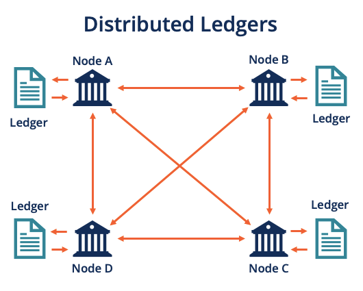

## Table of Contents

## What is Distributed Ledger Technology (DLT)?

Distributed Ledger Technology (DLT) is a way to record and share information across many computers. It's like a big notebook that everyone can see and add to, but no one can change what's already written. This makes it very safe and hard to cheat because the information is spread out and everyone has a copy.

DLT is used in things like cryptocurrencies, where it helps keep track of who owns what without needing a bank or a middleman. It's also being used in other areas like supply chains to track goods from start to finish, making sure everything is done right and on time. By using DLT, people can trust the information because it's transparent and tamper-proof.

## How does DLT differ from traditional centralized systems?

DLT is different from traditional centralized systems because it spreads data across many computers instead of keeping it in one place. In a centralized system, like a bank, all the data is stored on one main computer or server. This means if something goes wrong with that server, like a hack or a crash, all the data could be lost or changed. With DLT, the data is copied on many computers, so if one goes down, the others still have the information. This makes DLT more secure and less likely to fail.

Another big difference is how trust works. In centralized systems, you have to trust the people running the system to keep your data safe and correct. With DLT, the system is designed so that you don't need to trust one person or group. Everyone can see the data, and it's hard to change it without everyone noticing. This makes DLT more transparent and fair. It's like having a group of friends who all keep a copy of the same notebook, so no one can sneakily change the notes without the others knowing.

## What are the main types of DLT?

There are mainly two types of DLT: public and private. Public DLT, like the one used in Bitcoin, is open for anyone to join and see the data. It's like a big public notebook where anyone can write and read. This makes it very transparent but also slower because many people need to agree on each change. Private DLT, on the other hand, is more like a private club. Only certain people can join and see the data. It's faster and more controlled because fewer people need to agree on changes.

Another type is a hybrid DLT, which mixes features of both public and private systems. In a hybrid system, some parts of the data might be open to everyone, while other parts are only for certain people. This can be useful when you want some transparency but also need to keep some information private. Each type of DLT has its own uses depending on what you need it for, like speed, security, or openness.

## What are the key components of a DLT system?

A DLT system has several important parts that make it work. First, there are the nodes, which are the computers that store copies of the ledger. Each node has the same information, so if one goes down, the others can keep going. Then, there's the consensus mechanism, which is like a voting system that helps all the nodes agree on changes to the ledger. This makes sure everyone has the same version of the truth.

Another key part is the cryptography, which keeps the data safe and private. It uses special math to lock up the information so only people with the right keys can see it. This helps prevent cheating and keeps the system secure. Finally, there's the smart contracts, which are like automatic rules that run on the DLT. They can do things like move money or check if certain conditions are met, all without needing a person to help.

These parts all work together to make DLT a powerful tool. They help make the system open, safe, and able to work without a central boss. This means people can trust the information and use it for all sorts of things, from money to tracking goods.

## How does consensus mechanism work in DLT?

A consensus mechanism is like a way for all the computers in a DLT system to agree on what's true. Imagine you and your friends are keeping a shared notebook. If someone wants to write something new, everyone needs to agree it's okay before it goes in. In DLT, this agreement happens through special rules. These rules make sure everyone's copy of the ledger stays the same, so no one can sneak in false information.

There are different ways to reach this agreement. One common way is called Proof of Work, which is like a puzzle that computers solve to add new information. Another way is Proof of Stake, where computers with more "skin in the game" get to help decide. No matter which method is used, the goal is the same: to make sure everyone trusts the information in the ledger. This helps keep the system fair and secure, so people can use it without worrying about cheating or mistakes.

## What are the benefits of using DLT?

Using DLT has many good things about it. One big benefit is that it's very safe and hard to cheat. Because the information is spread out on many computers, it's tough for someone to change it without everyone noticing. This makes it great for things like money or tracking goods, where you want to be sure the information is correct. Also, DLT can save time and money because it doesn't need a middleman like a bank or a big company to keep everything in order. This can make things faster and cheaper for everyone.

Another good thing about DLT is that it's open and clear for everyone to see. In a DLT system, you can check the information yourself, so you don't have to just trust someone else. This makes it easier to know that things are being done fairly and honestly. Plus, DLT can work all around the world without needing to follow one country's rules, which can be helpful for businesses that work in many places. All these benefits make DLT a powerful tool for many different uses.

## What are the potential challenges and limitations of DLT?

DLT has some challenges and limitations that can make it hard to use. One big problem is that it can be slow and use a lot of energy. When many computers need to agree on changes, it can take a long time, especially in big public systems like Bitcoin. This can make it hard to use for things that need to happen quickly. Also, the computers doing all this work use a lot of power, which can be bad for the environment and expensive.

Another challenge is that DLT can be hard to understand and use. It's a new technology, and many people don't know how it works yet. This can make it tough for businesses and regular people to start using it. Plus, even though DLT is safe, it's not perfect. There can still be mistakes or hacks, especially if the system is not set up well. This means people need to be careful and learn how to use DLT the right way to make sure it works well for them.

Lastly, there are legal and rule problems with DLT. Because it's new, many countries don't have clear laws about how to use it. This can make it hard for businesses to know what they're allowed to do. Also, DLT can be hard to change once something is written down, which can be a problem if you need to fix a mistake or update information. All these challenges mean that while DLT has a lot of good things about it, it also has some big hurdles to overcome.

## How is security and privacy managed in DLT?

Security and privacy in DLT are managed through a few key ways. One big way is through cryptography, which is like a special math lock that keeps information safe. Each piece of data in the ledger is locked up so that only people with the right key can see it. This helps keep things private and makes it hard for anyone to change the data without being noticed. Also, because the data is spread out across many computers, it's very hard for someone to hack all of them at once. This spread-out nature makes DLT more secure than systems where all the data is in one place.

Another way DLT manages privacy is through different types of networks. In private DLT systems, only certain people can join and see the data, which helps keep things more private. Public DLT systems are open to everyone, but they still use cryptography to keep individual data safe. Sometimes, DLT uses special tools called zero-knowledge proofs, which let you prove something is true without showing the actual data. This helps keep things private while still letting the system work. All these methods together help make DLT both secure and private, even though it's open for everyone to see.

## What are some real-world applications of DLT?

One real-world use of DLT is in cryptocurrencies like Bitcoin and Ethereum. These digital currencies use DLT to keep track of who owns what without needing a bank. People can send money to each other directly, and the system keeps everything safe and clear for everyone to see. This makes it easier and cheaper to move money around the world, especially for people who don't have easy access to banks.

Another way DLT is used is in supply chains. Companies use it to track goods from where they start to where they end up. For example, a food company might use DLT to make sure their products are safe and fresh. Each step of the journey, like when the food is picked, packed, and shipped, is recorded on the ledger. This helps the company and customers know that everything is done right and on time. It also makes it easier to find and fix problems if something goes wrong.

DLT is also being used in voting systems. Some places are trying it out to make voting more fair and safe. With DLT, each vote is recorded in a way that can't be changed, and everyone can see that the voting is done right. This can help stop cheating and make people trust the voting more. It's still new, but it shows how DLT can help with big, important things like elections.

## How does DLT support smart contracts?

DLT supports smart contracts by providing a safe and clear place for them to work. Smart contracts are like special computer programs that run on the DLT. They do things automatically when certain rules are met, like moving money or checking if a job is done. Because DLT keeps everything open and safe, people can trust that the smart contract will do what it's supposed to do without needing a middleman. This makes things faster and cheaper because you don't have to wait for someone to check and approve everything.

For example, if you're buying a house, a smart contract on a DLT can automatically give the money to the seller once all the papers are signed and checked. This way, everyone knows the deal is fair and done right. DLT makes sure the smart contract can't be changed or tricked, so both the buyer and seller can feel safe. This is just one way DLT helps smart contracts work better and be more useful in real life.

## What is the role of cryptography in DLT?

Cryptography plays a big role in DLT by keeping the information safe and private. It's like using special math to lock up the data so that only people with the right key can see it. This helps stop people from cheating or changing the information without being noticed. Each piece of data in the ledger is locked up tight, making it hard for anyone to mess with it. This makes DLT very secure because even if someone tries to hack one computer, the data on all the other computers is still safe and locked up.

Also, cryptography helps make sure everyone agrees on what's true in the DLT system. It's used in the consensus mechanism, which is like a voting system that helps all the computers agree on changes to the ledger. This makes sure everyone has the same version of the truth. Without cryptography, it would be much easier for someone to change the data and cause problems. So, by using cryptography, DLT can be trusted to keep information safe and correct, which is important for things like money or tracking goods.

## What are the future trends and developments in DLT?

In the future, DLT is likely to become even more important in many areas. One big trend is that more and more businesses will start using DLT to make their work easier and safer. For example, banks might use it more to move money around the world faster and cheaper. Also, DLT could be used more in tracking things like food or medicine to make sure they are safe and get to people on time. As more people learn about DLT and how to use it, we might see new ways to use it that we haven't thought of yet.

Another trend is that DLT might become faster and use less energy. Right now, some DLT systems can be slow and use a lot of power, which can be a problem. But people are working on new ways to make DLT better. They are trying to find new ways for computers to agree on changes that don't take as long or use as much energy. This could make DLT more useful for things that need to happen quickly, like buying things online or making quick payments. As these improvements happen, DLT could become a part of everyday life for more people.

## References & Further Reading

[1]: Narayanan, A., Bonneau, J., Felten, E., Miller, A., & Goldfeder, S. (2016). ["Bitcoin and Cryptocurrency Technologies."](https://press.princeton.edu/books/hardcover/9780691171692/bitcoin-and-cryptocurrency-technologies) Princeton University Press.

[2]: Mougayar, W. (2016). ["The Business Blockchain: Promise, Practice, and Application of the Next Internet Technology."](https://books.google.com/books/about/The_Business_Blockchain.html?id=CEsPDAAAQBAJ) Wiley.

[3]: McWaters, R. (2016). ["The Future of Financial Infrastructure: An Ambitious Look at How Blockchain Can Reshape Financial Services"](https://www.weforum.org/publications/the-future-of-financial-infrastructure-an-ambitious-look-at-how-blockchain-can-reshape-financial-services/) World Economic Forum.

[4]: Iansiti, M., & Lakhani, K. R. (2017). ["The Truth About Blockchain."](https://hbr.org/2017/01/the-truth-about-blockchain) Harvard Business Review.

[5]: De Filippi, P., & Wright, A. (2018). ["Blockchain and the Law: The Rule of Code."](https://www.jstor.org/stable/j.ctv2867sp) Harvard University Press.

[6]: Gomber, P., Koch, J.-A., & Siering, M. (2017). ["Digital Finance and FinTech: Current Research and Future Research Directions."](https://link.springer.com/content/pdf/10.1007/s11573-017-0852-x.pdf) Journal of Business Research, 70, 313-318.

[7]: Hull, J. C. (2018). ["Risk Management and Financial Institutions."](https://books.google.com/books/about/Risk_Management_and_Financial_Institutio.html?id=1J1QDwAAQBAJ) Wiley.

[8]: Peters, G. W., Panayi, E., & Chapelle, A. (2015). ["Trends in Crypto-Currencies and Blockchain Technologies: A Monetary Theory and Regulation Perspective."](https://papers.ssrn.com/sol3/papers.cfm?abstract_id=2646618) arXiv preprint arXiv:1508.04364. 

[9]: Chuen, D. L. K., Guo, L., & Wang, Y. (2018). ["Cryptocurrency: A New Investment Opportunity?"](https://papers.ssrn.com/sol3/papers.cfm?abstract_id=2994097) Journal of Alternative Investments, 20(3), 16-40.