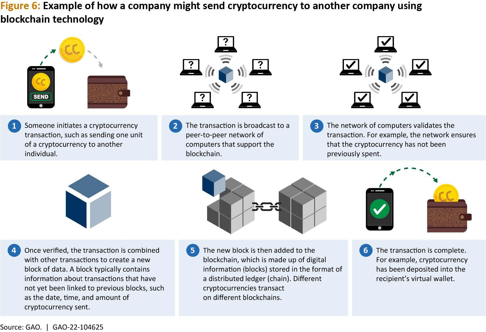

## Table of Contents

## What is a distributed ledger?

A distributed ledger is a type of database that is shared and synchronized across multiple devices, computers, or locations. Unlike traditional databases that are managed by a single entity, a distributed ledger has no central authority controlling it. Instead, every participant in the network has a copy of the ledger, and they all work together to keep it updated and accurate. This makes it very secure and transparent because it's hard for anyone to change the information without others noticing.

One common example of a distributed ledger is blockchain, which is used by cryptocurrencies like Bitcoin. In a blockchain, each block contains a list of transactions, and once a block is added to the chain, it's very difficult to alter. This system ensures that all participants can trust the data because it's verified by many people, not just one. Distributed ledgers can be used for many things beyond cryptocurrencies, like tracking supply chains, managing health records, or voting systems, making them useful in many areas of life.

## How does a distributed ledger differ from a traditional centralized database?

A distributed ledger is different from a traditional centralized database in how it stores and manages data. In a centralized database, all the data is stored in one place, controlled by one organization or person. This means that if you want to change or add information, you have to go through that central authority. On the other hand, a distributed ledger spreads the data across many places. Every participant in the network has a copy of the data, and they all work together to keep it up-to-date. This makes it harder for any single person to control or change the information without others noticing.

Another big difference is in how secure and transparent the systems are. In a centralized database, the security depends a lot on the central authority keeping it safe. If that authority is compromised, the whole database can be at risk. But in a distributed ledger, the security comes from the fact that many people are checking and verifying the data. It's much harder to change the information because any change would have to be agreed upon by many participants. This also makes the system more transparent because everyone can see the same information and know it's accurate.

## What are the key components of a distributed ledger system?

A distributed ledger system has a few key parts that make it work. First, there are the nodes, which are the computers or devices that hold a copy of the ledger. These nodes are spread out across the network, and they all work together to keep the ledger up-to-date. When someone wants to add or change information, the nodes use a special process called consensus to agree on what should happen. This makes sure that everyone has the same information and that it's hard for anyone to cheat or make changes without others knowing.

Another important part is the ledger itself, which is just a record of all the transactions or data that's been added. This ledger is usually organized into blocks, especially in systems like blockchain, where each block contains a group of transactions. Once a block is added, it's very hard to change, which makes the system secure. The last key component is the cryptographic security, which uses special codes to keep the data safe. This helps to make sure that only people who should be able to see or change the data can do so, adding another layer of protection to the system.

## Can you explain the concept of consensus in distributed ledgers?

Consensus in distributed ledgers is like a group of friends deciding on where to eat. Everyone has a say, and they need to agree on the same place before they can all go there. In a distributed ledger, all the computers, called nodes, need to agree on the new information that's being added to the ledger. This agreement is important because it makes sure that everyone has the same information and no one can sneak in false data without others noticing.

There are different ways to reach consensus, but the main idea is the same: everyone needs to agree. One common way is called "Proof of Work," which is like solving a puzzle. The first node to solve the puzzle gets to add the new information, and then everyone else checks to make sure it's right. If it is, they all add the same information to their ledgers. Another way is called "Proof of Stake," which is like voting. Nodes with more "stake," or investment in the system, get more say in deciding what information gets added. Both ways make sure that the information in the ledger stays accurate and trusted by everyone.

## What are the main types of distributed ledgers?

There are two main types of distributed ledgers: public and private. A public distributed ledger is like a big open book that anyone can read and write in. It's used by cryptocurrencies like Bitcoin, where anyone can join the network, see all the transactions, and add new ones. This makes it very open and transparent, but it can also be slow because so many people are involved in the process of agreeing on new information.

A private distributed ledger is more like a members-only club. Only certain people or organizations can join and see what's in the ledger. This makes it faster and easier to agree on new information because there are fewer people involved. Companies often use private ledgers to keep track of things like supply chains or financial transactions, where they want to make sure the information is secure and only seen by people who need to see it.

## What are some common use cases for distributed ledgers in business?

Distributed ledgers are used in businesses to keep track of supply chains. Imagine you're a big company that makes shoes. You want to know where every part of your shoe comes from, from the leather to the laces. A distributed ledger can help you see this information in real time, and everyone involved can see it too. This makes sure everyone knows where things are coming from, and it can help stop fakes or bad products from getting into your supply chain.

Another common use is for managing financial transactions. Banks and other financial companies use distributed ledgers to record who is sending money to whom. This makes it easier and faster to move money around, and it can also cut down on the costs of keeping track of all those transactions. Plus, because everyone can see the same information, it's harder for mistakes or fraud to happen.

Some businesses also use distributed ledgers for keeping track of important documents or contracts. For example, a company might use it to store agreements with other companies or to manage employee records. This way, everyone who needs to can see the documents, and it's hard for anyone to change them without others knowing. This can make things like audits or legal checks much simpler and more trustworthy.

## How can distributed ledgers enhance security and transparency in transactions?

Distributed ledgers can make transactions more secure because they spread the information across many computers instead of keeping it in one place. This means that if someone tries to change the information, they have to change it on all the computers at the same time, which is very hard to do. Also, these systems use special codes called cryptography to keep the data safe. Only people who should be able to see or change the data can do so, which adds another layer of protection.

They also make transactions more transparent because everyone in the network can see the same information. For example, in a supply chain, every company involved can see where a product is coming from and where it's going. This makes it easier to trust that the information is correct because it's not just one person saying it's true, but many people agreeing on it. This transparency can help stop fraud and mistakes, making the whole process more reliable.

## What are the potential challenges and limitations of implementing distributed ledgers?

One big challenge with distributed ledgers is the need for a lot of computer power. Because every computer in the network has to keep a copy of the ledger and work together to agree on new information, it can use a lot of energy and slow things down. This can make it hard for big networks with many users to work quickly and efficiently. Also, setting up and maintaining a distributed ledger can be expensive and complicated, which might be tough for smaller businesses or organizations.

Another challenge is privacy. While distributed ledgers are good at making things transparent, this can be a problem when you want to keep some information private. For example, if you're using a public ledger, everyone can see your transactions, which might not be what you want. There are ways to make parts of the ledger private, but this can make the system more complicated and harder to use. 

Lastly, there can be issues with rules and laws. Different places have different rules about how data should be stored and shared, and distributed ledgers might not always fit with these rules. This can make it hard to use them in some situations, especially if you're working across different countries. Also, because distributed ledgers are still new, many people might not trust them yet or know how to use them properly, which can slow down their adoption.

## How do distributed ledgers contribute to the development of smart contracts?

Distributed ledgers help make smart contracts possible by giving them a place to live and work. Smart contracts are like computer programs that automatically do things when certain conditions are met. They can be used for all sorts of things, like paying rent or buying things online. Because distributed ledgers are spread out across many computers and everyone can see the same information, they make smart contracts more trustworthy. If you put a smart contract on a distributed ledger, everyone can see it and know that it will do what it's supposed to do without anyone cheating.

But it's not just about trust. Distributed ledgers also make smart contracts more secure and efficient. Since the ledger is hard to change once something is added, it's very hard for someone to mess with a smart contract after it's been set up. This means the contract will keep working the way it was supposed to. Plus, because the ledger can handle many transactions at once, smart contracts can run quickly and smoothly, making them useful for all sorts of business and personal needs.

## What role do distributed ledgers play in the evolution of supply chain management?

Distributed ledgers help make supply chain management better by giving everyone involved a clear view of what's happening. Imagine you're a company that makes bikes. You want to know where every part of your bike comes from, like the tires or the frame. A distributed ledger lets you see this information in real time, and everyone who needs to can see it too. This means you can trust that the parts are coming from the right places and that they're good quality. It also helps stop fake or bad products from getting into your supply chain because everyone can see where things are coming from and where they're going.

Another way distributed ledgers help with supply chains is by making things faster and easier. When you use a distributed ledger, you don't have to wait for one person to check and approve every step. Instead, everyone can see the same information and agree on what should happen next. This can save time and money because you don't need as many people to keep track of everything. Plus, because the ledger is hard to change once something is added, you can be sure that the information stays correct and trustworthy. This can make your supply chain run more smoothly and help you serve your customers better.

## Can you discuss the impact of distributed ledgers on financial inclusion and banking services?

Distributed ledgers can help more people use banking services by making it easier and cheaper to send and receive money. In many places, people don't have bank accounts because banks are far away or charge too much for their services. With distributed ledgers, people can use their phones to do banking, even if they live in a small village. This means they can save money, pay bills, or get loans without needing to go to a bank. It also helps people in different countries send money to each other quickly and for less money, which can make a big difference for families who need to support each other from far away.

Another way distributed ledgers help with financial inclusion is by making banking services more transparent and secure. When everyone can see the same information on a ledger, it's harder for banks to charge hidden fees or make mistakes. This builds trust, which is important for people who might be new to banking. Also, because the ledger is hard to change once something is added, people can feel more sure that their money is safe. This can encourage more people to start using banking services, knowing that their money is being handled fairly and securely.

## What are the future prospects and emerging trends in distributed ledger technology?

Distributed ledger technology is growing fast and looks set to change many parts of our lives in the future. One big trend is the use of distributed ledgers in more industries, like healthcare and real estate. For example, doctors could use a distributed ledger to keep patient records safe and easy to share between hospitals. In real estate, buying and selling homes could be quicker and cheaper because everyone can see the same information and agree on it faster. Another trend is the development of better ways to reach consensus, like using less energy or making the process faster. This could make distributed ledgers easier and cheaper to use for everyone.

Another emerging trend is the focus on making distributed ledgers more private and secure. While they are already very secure, new ideas like zero-knowledge proofs could make them even better. This would let people prove things are true without showing all the details, which is important for keeping personal information safe. Also, more countries and companies are starting to use distributed ledgers for things like voting or tracking food from farm to table. As more people understand and trust this technology, we might see it used in even more ways to make our lives easier and more connected.

## References & Further Reading

[1]: Narayanan, A., Bonneau, J., Felten, E., Miller, A., & Goldfeder, S. (2016). ["Bitcoin and Cryptocurrency Technologies: A Comprehensive Introduction."](https://press.princeton.edu/books/hardcover/9780691171692/bitcoin-and-cryptocurrency-technologies) Princeton University Press.

[2]: Pilkington, M. (2016). ["Blockchain Technology: Principles and Applications"](https://papers.ssrn.com/sol3/papers.cfm?abstract_id=2662660) in "Research Handbook on Digital Transformations," Edward Elgar Publishing.

[3]: Peters, G. W., & Panayi, E. (2016). ["Understanding Modern Banking Ledgers through Blockchain Technologies: Future of Transaction Processing and Smart Contracts on the Internet of Money"](https://link.springer.com/content/pdf/10.1007/978-3-319-42448-4_13.pdf) in Banking Beyond Banks and Money.

[4]: Antonopoulos, A. M., & Wood, G. (2018). ["Mastering Ethereum: Building Smart Contracts and DApps."](https://books.google.com/books/about/Mastering_Ethereum.html?id=nJJ5DwAAQBAJ) O'Reilly Media.

[5]: Mougayar, W. (2016). ["The Business Blockchain: Promise, Practice, and Application of the Next Internet Technology."](https://books.google.com/books/about/The_Business_Blockchain.html?id=CEsPDAAAQBAJ) Wiley.

[6]: Tapscott, D., & Tapscott, A. (2016). ["Blockchain Revolution: How the Technology Behind Bitcoin Is Changing Money, Business, and the World."](https://dl.acm.org/doi/10.5555/3051781) Portfolio/Penguin.

[7]: Franco, P. (2014). ["Understanding Bitcoin: Cryptography, Engineering and Economics."](https://onlinelibrary.wiley.com/doi/book/10.1002/9781119019138) Wiley.