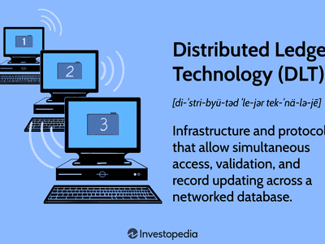

The rapid advancement of technology has paved the way for revolutionary changes in various sectors, none more intriguing than blockchain technology and its associated distributed ledger systems. Blockchain, a decentralized and often public digital ledger, is at the forefront of these developments, transforming how data is stored and transactions are processed. This exploration centers on the applications of distributed ledgers, with a particular emphasis on blockchain technology's role in algorithmic trading.

Blockchain has become synonymous with innovation, promising unprecedented levels of security, transparency, and efficiency. Unlike traditional centralized systems, blockchain technology disperses data across multiple nodes, significantly minimizing risks associated with data breaches and unauthorized modifications. The inherent qualities of a blockchain—its immutable and transparent nature—are particularly advantageous in the world of finance, where accuracy and trust are paramount.



In traditional financial systems, data is typically stored in a central repository, making it prone to manipulation and single points of failure. Distributed ledger technology (DLT) addresses these challenges by ensuring that data is not only replicated across a network of computers but is also continuously updated and verified by consensus mechanisms. This method of data integrity assurance is proving to be a game-changer in algorithmic trading, a domain reliant on fast, accurate, and secure execution of trades based on complex mathematical models and formulas.

Blockchain technology is revolutionizing financial systems and application in algorithmic trading is a prime example of its potential impact. Algorithmic trading, which utilizes pre-programmed strategies to execute trades at high speed and frequency, benefits from blockchain's transparent and tamper-proof environment. By ensuring that each transaction is recorded on a public ledger, blockchain enhances the auditability and traceability of trades, reducing systemic risks and bolstering market confidence.

The integration of blockchain in algorithmic trading exemplifies the broader transformations occurring in financial markets through the application of distributed ledger technology. As blockchain continues to develop and its capabilities expand, its role in enhancing the efficiency, security, and transparency of financial transactions is expected to grow, heralding a new era for both blockchain technology and the sectors it touches.

## Table of Contents

## Understanding Distributed Ledgers

Distributed ledgers mark a significant departure from the conventional, centralized methods of managing and recording transactional data. Centralized systems typically rely on a single authoritative data source governed by one entity. This framework not only poses a risk of single-point failures but also creates bottlenecks in data accessibility and integrity.

In contrast, distributed ledgers store transaction data across multiple nodes in a network. This architecture ensures that each node holds a complete, synchronized copy of the whole ledger, making data redundancy a signature feature. The primary advantage here is resilience; even if one node fails or is compromised, the rest remain operational, providing a robust defense against data loss and corruption. This decentralized approach significantly enhances data integrity, ensuring that any transaction recorded within the ledger is secure and tamper-proof.

A common question arises regarding how distributed ledgers differ from traditional databases. In a conventional database, transactions are entered and modified centrally, relying on trust in a single control point. These systems are vulnerable to data breaches and central failures. On the other hand, distributed ledgers like blockchains employ cryptographic techniques to ensure that once a transaction is recorded, it cannot be altered retroactively without altering all subsequent blocks in collaboration with the network majority.

Blockchain is perhaps the most well-known form of distributed ledger technology and serves as the backbone for cryptocurrencies such as Bitcoin and Ethereum. In a blockchain, transactions are grouped into blocks, which are then linked together in chronological order, forming a chain. This structure ensures transparency and traceability, as each block contains a cryptographic hash of the previous block, creating an immutable, secure, and verifiable ledger.

To further illustrate, consider the use of a blockchain in a Python context:

```python
import hashlib

class Block:
    def __init__(self, previous_hash, transaction):
        self.transaction = transaction
        self.previous_hash = previous_hash
        self.block_data = f"{transaction}-{previous_hash}"
        self.block_hash = hashlib.sha256(self.block_data.encode()).hexdigest()

# Sample implementation demonstrating previous hash linking
block0 = Block("0", "First transaction")
block1 = Block(block0.block_hash, "Second transaction")

print(f"Block 1 Hash: {block0.block_hash}")
print(f"Block 2 Hash: {block1.block_hash}")
```

Here, the `Block` class models a simple blockchain system where each block records a transaction and hash value, linking it to the previous block's hash. This demonstrates how transactions are securely and immutably stored across a distributed ledger.

Distributed ledgers are multifaceted, extending beyond blockchain, providing a foundational framework for various applications that demand security and decentralized control. By eliminating potential single-point vulnerabilities, distributed ledgers promise enhanced data security and reliability, marking a revolutionary step in digital record-keeping practices.

## Blockchain Technology: Beyond Cryptocurrencies

Blockchain technology, initially recognized for its role in cryptocurrencies like Bitcoin and Ethereum, has applications that stretch far beyond this domain. It offers a robust framework that enhances the efficiency and security of processes across a variety of sectors. The inherent structure of distributed ledgers is particularly suited to industries such as supply chain management, healthcare, and financial services.

In supply chain management, blockchain facilitates the tracking of goods through all production stages, enhancing transparency and accountability. For instance, when a product moves from manufacturer to consumer, blockchain's immutable ledger can verify each step, reducing the risk of fraudulent activities and ensuring product authenticity.

The healthcare industry benefits from blockchain by securing patient data exchange and improving the efficiency of health services. Patient records can be securely shared across different healthcare providers with assured confidentiality, reducing instances of data breaches. This secure system ensures that medical histories, treatment plans, and diagnostic results are both accessible and protected from unauthorized access.

In financial services, blockchain mitigates risks related to fraud and unauthorized transactions due to its decentralized framework. Traditional financial transactions often involve intermediaries, but blockchain transactions occur on peer-to-peer networks, enabling faster processing and reducing third-party interference. Additionally, the decentralization reduces the probability of a single point of failure, thereby enhancing the system's overall resilience.

A crucial feature of blockchain is its capability to support smart contracts. These are self-executing contracts where the terms are inscribed in code, and they automatically execute when certain predefined conditions are met. For instance, an insurance payout could be automatically processed when specific criteria, as determined by the contract and corroborated by trustworthy data, are fulfilled. This functionality streamlines processes and minimizes the need for intermediaries, reducing costs and the possibility of human error in complex transactions.

Overall, blockchain's ability to provide a secure, transparent, and tamper-resistant record makes it an invaluable tool in modernizing and protecting critical functions in various industries. Its maturation and integration continue to lead to innovative applications and provide a technological edge in safeguarding and streamlining operations.

## Algorithmic Trading and Blockchain

Algorithmic trading uses pre-programmed, complex algorithms and mathematical models to perform high-speed trading, drastically changing financial markets. These algorithms process large datasets to make decisions and execute orders quicker than human capabilities. Blockchain technology is increasingly integrated into these platforms, offering transparency, traceability, and reliability. 

One of the primary benefits of incorporating blockchain into [algorithmic trading](/wiki/algorithmic-trading) is the transparent and immutable nature of the records. In blockchain, each trade is recorded on a distributed ledger, ensuring that data remains accurate and unaltered. This accountability enhances audit capabilities, allowing for rigorous oversight and compliance with financial regulations. 

Moreover, blockchain facilitates faster transaction settlements. Traditional trading systems often experience delays due to intermediaries; however, blockchain's decentralized nature allows direct peer-to-peer transactions. This eliminates intermediaries, reducing transaction times from days to seconds. For example, smart contracts automatically enforce trade terms upon meeting specific conditions, further expediting settlement processes.

Blockchain integration also reduces systemic frailties like fraud or manipulation. The technology's design ensures any tampering attempt is immediately visible, thanks to the consensus mechanisms like Proof of Work (PoW) and Proof of Stake (PoS). These mechanisms maintain ledger integrity by requiring network-wide agreement on any changes.

While integrating blockchain in algorithmic trading offers numerous advantages, challenges remain. High-frequency trading demands extremely low latency, which blockchain systems must meet to avoid disadvantageous trading delays. Ongoing advancements in blockchain infrastructure aim to address these challenges, ensuring its compatibility with the demands of modern trading systems.

## Applications and Real-world Examples

Blockchain and distributed ledger technologies are finding substantial applications across various sectors, proving to be far more than just the backbone for cryptocurrencies. These technologies are making significant impacts in areas such as finance, logistics, and public administration by enhancing security, improving transparency, and streamlining processes.

In the financial sector, blockchain and distributed ledger technologies have revolutionized cross-border payments. Traditional cross-border transactions are typically slow and expensive, but blockchain facilitates real-time settlements at a lower cost. This is achieved through decentralized verification processes, which bypass traditional banking systems, reducing the number of intermediaries involved. Moreover, the use of smart contracts in financial services allows for automated contract execution. Smart contracts are self-executing contracts with the terms directly written into code. For instance, they automatically execute trades or processes based on predefined conditions, significantly lowering the risk of human error or fraud. In trade finance, blockchain reduces the time and cost associated with the issuance of letters of credit and bills of lading by digitizing these instruments.

In the logistics and supply chain industry, companies like Walmart have successfully implemented blockchain technology to enhance visibility and efficiency. Walmart’s blockchain-based supply chain tracking system allows for real-time tracking of goods from origin to shelf. This increased transparency aids in rapidly identifying and addressing issues such as product recalls or delivery delays, thereby reducing waste and improving safety measures. The visibility provided by blockchain ensures all parties involved in the supply chain can access trustworthy data, which is crucial for maintaining efficiency in global logistics operations.

Public administration systems are also benefiting from blockchain technologies, as seen in Estonia's digital identity system. Estonia has developed a groundbreaking e-government platform where blockchain is used to secure governmental records and data. This system allows citizens to access government services online with unparalleled security and privacy. Blockchain’s immutable ledger is instrumental in maintaining reliable and tamper-proof records, which streamlines citizen verification processes and ensures secure interactions between individuals and the government.

These applications illustrate the transformative potential of blockchain and distributed ledger technologies across different sectors. By increasing efficiency, reducing costs, and enhancing security, these technologies are setting new standards and paving the way for further innovations in diverse domains.

## Future Prospects and Challenges

While the prospects for blockchain-based distributed ledgers are promising, several challenges warrant consideration. A primary concern is scalability. As distributed ledger systems grow, they require increased computational resources to maintain efficiency and speed. Traditional blockchains, such as Bitcoin's, experience scalability issues when many transactions are processed simultaneously. Various solutions, like sharding and layer-two protocols, are being explored to address these issues. Sharding involves partitioning a blockchain network into smaller, more manageable segments or "shards," thereby distributing the load and improving transaction throughput.

Interoperability across different blockchain systems is another significant challenge. Currently, multiple blockchain platforms exist, each with unique protocols and standards, leading to isolated systems that cannot communicate seamlessly. Efforts are underway to develop interoperability protocols like cross-chain bridges, which facilitate communication between distinct blockchains, enhancing their utility and versatility.

The regulatory environment for blockchain technology is also evolving, presenting both opportunities and challenges. Governments worldwide are grappling with creating comprehensive legal frameworks to govern blockchain and digital assets. As regulations mature, they will provide clearer guidelines for compliance, which can encourage broader adoption. However, inconsistent regulations across jurisdictions may pose operational challenges for multinational blockchain projects.

Energy consumption remains a critical issue, particularly for proof-of-work (PoW) consensus mechanisms utilized by many blockchain networks. PoW requires vast amounts of computational power, resulting in high energy consumption. Transitioning to more sustainable alternatives, like proof-of-stake (PoS), where participants validate transactions based on the number of tokens they hold, can significantly reduce energy requirements.

Despite these challenges, continuous innovation within the blockchain space promises expanded utilization across global markets. New consensus algorithms, advances in cryptography, and regulatory developments are actively advancing the technology's potential. As these innovations mature, blockchain-based distributed ledgers are poised to play an increasingly pivotal role in various industries, offering enhanced security, efficiency, and transparency.

## Conclusion

Blockchain technology, combined with distributed ledgers, marks a significant evolution in digital record-keeping and transaction management. This synergy offers an unparalleled opportunity to enhance transparency, as the immutable and openly accessible nature of blockchain ensures that all transactions are recorded in a manner that cannot be altered without consensus from the network. This aspect not only solidifies trust among participants but also provides a robust framework for auditability and compliance in various sectors. 

Security is another crucial benefit derived from the architecture of distributed ledgers. By decentralizing control and distributing data across numerous nodes, blockchain systems dramatically reduce the risk of data breaches and unauthorized alterations. The consensus mechanisms embedded within these systems serve as an additional layer of protection, ensuring that only legitimate changes are recorded. Moreover, because blockchain technologies can eliminate single points of failure, they bolster the system's resilience against cyber-attacks and fraudulent activities.

Efficiency gains from employing blockchain and distributed ledger technology are substantial. They streamline processes by automating transactions and agreements through smart contracts – self-executing contracts with the terms directly written into code. This automation reduces the need for intermediaries, thus cutting down the time and costs associated with traditional transaction processing. For instance, in algorithmic trading, blockchain's integration facilitates real-time trade settlements, achieving an accuracy and speed previously unattainable.

The application of blockchain in algorithmic trading serves as a testament to its transformative potential in financial markets. By providing verifiable, unalterable records of trades and improving the overall integrity and efficiency of trading systems, blockchain addresses several critical challenges that traditional financial systems face. This transition not only optimizes performance but also mitigates risks associated with human errors and systemic weaknesses.

Despite these impressive advancements, the growing adoption of blockchain technology must contend with certain challenges. Scalability remains a pivotal concern, with solutions such as sharding and off-chain transactions being actively explored to enhance the system's capacity to handle large volumes of transactions efficiently. Interoperability between various blockchain networks is also paramount for seamless integration and broader adoption. Furthermore, regulatory frameworks need to evolve to accommodate the unique aspects of blockchain, ensuring compliance without stifling innovation.

In summary, blockchain and distributed ledger technology are set to reshape industries worldwide, providing a foundation for future digital economies. As these technologies mature and challenges are progressively addressed, they promise to drive innovative solutions and redefine standard practices. The [momentum](/wiki/momentum) behind blockchain is undeniable, suggesting a future where its applications transcend current limitations, unlocking a new era of digital innovation and efficiency across various sectors.

## References & Further Reading

[1]: Narayanan, A., Bonneau, J., Felten, E., Miller, A., & Goldfeder, S. (2016). ["Bitcoin and Cryptocurrency Technologies: A Comprehensive Introduction."](https://press.princeton.edu/books/hardcover/9780691171692/bitcoin-and-cryptocurrency-technologies) Princeton University Press.

[2]: Pilkington, M. (2016). ["Blockchain Technology: Principles and Applications"](https://papers.ssrn.com/sol3/papers.cfm?abstract_id=2662660) in "Research Handbook on Digital Transformations," Edward Elgar Publishing.

[3]: Peters, G. W., & Panayi, E. (2016). ["Understanding Modern Banking Ledgers through Blockchain Technologies: Future of Transaction Processing and Smart Contracts on the Internet of Money"](https://link.springer.com/content/pdf/10.1007/978-3-319-42448-4_13.pdf) in Banking Beyond Banks and Money.

[4]: Antonopoulos, A. M., & Wood, G. (2018). ["Mastering Ethereum: Building Smart Contracts and DApps."](https://books.google.com/books/about/Mastering_Ethereum.html?id=nJJ5DwAAQBAJ) O'Reilly Media.

[5]: Mougayar, W. (2016). ["The Business Blockchain: Promise, Practice, and Application of the Next Internet Technology."](https://books.google.com/books/about/The_Business_Blockchain.html?id=CEsPDAAAQBAJ) Wiley.

[6]: Tapscott, D., & Tapscott, A. (2016). ["Blockchain Revolution: How the Technology Behind Bitcoin Is Changing Money, Business, and the World."](https://dl.acm.org/doi/10.5555/3051781) Portfolio/Penguin.

[7]: Franco, P. (2014). ["Understanding Bitcoin: Cryptography, Engineering and Economics."](https://onlinelibrary.wiley.com/doi/book/10.1002/9781119019138) Wiley.