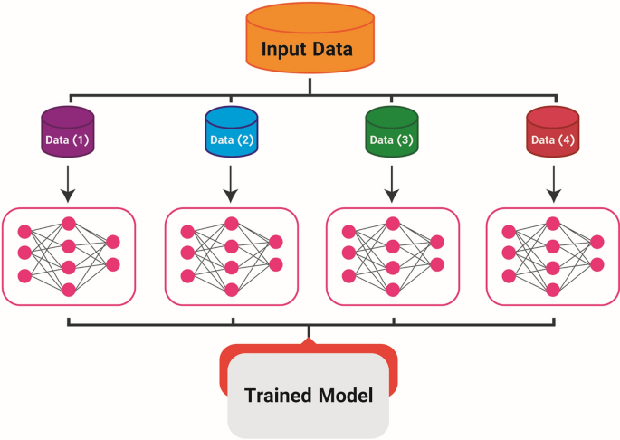

## Table of Contents

## What are distributed methods in machine learning?

Distributed methods in machine learning involve breaking down a large problem into smaller parts that can be worked on by different computers at the same time. This is helpful when you have a lot of data or when the calculations are too complex for one computer to handle quickly. By spreading the work across multiple computers, you can speed up the process and handle bigger problems. Imagine you have a huge puzzle; instead of one person trying to put it together, many people work on different sections at the same time, making the job faster and easier.

These methods often use techniques like data parallelism, where the same model is trained on different parts of the data on different machines, and model parallelism, where different parts of the model are trained on the same data on different machines. For example, in data parallelism, if you have a dataset $$D$$ and a model $$M$$, you can split $$D$$ into smaller subsets $$D_1, D_2, ..., D_n$$ and train $$M$$ on each subset on a different machine. The results are then combined to improve the overall model. This approach helps in managing large datasets and complex models more efficiently, making machine learning more scalable and practical for real-world applications.

## Why are distributed methods important for scaling machine learning models?

Distributed methods are important for scaling machine learning models because they allow us to handle much larger datasets and more complex models than a single computer can manage. When you have a lot of data, like millions of images or texts, it can take too long to train a model on just one machine. By using distributed methods, you can split the data into smaller parts and train the model on multiple computers at the same time. This makes the training process much faster and allows you to use bigger and more detailed models that can learn more from the data.

Another reason distributed methods are important is that they help in managing the computational load of complex models. Some [machine learning](/wiki/machine-learning) models, like deep neural networks, have many layers and parameters, which require a lot of calculations. If you use distributed methods, you can split the model itself across different machines. For example, you can train different parts of a model $$M$$ on the same data $$D$$ on different computers. This not only speeds up the training but also allows you to build and train models that would be too big for a single computer to handle.

## What is Local SGD and how does it work in distributed training?

Local SGD, or Stochastic Gradient Descent, is a way to train machine learning models faster by using multiple computers. In Local SGD, instead of updating the model after looking at each piece of data, you collect a bunch of data and update the model all at once. Each computer, or worker, gets a copy of the model and works on its own set of data. After a few updates, the workers share their updated models with each other and combine them to make one better model.

This method helps because it cuts down on how often the computers need to talk to each other, which can slow things down. Imagine if you were trying to solve a puzzle with friends. Instead of showing each other every piece you try, you work on your part of the puzzle for a bit and then share your progress. This way, you can work faster and still put the puzzle together well. In Local SGD, this means less waiting and more working, making the training process quicker and more efficient.

## How does Gradient Sparsification improve efficiency in distributed machine learning?

Gradient Sparsification is a technique used in distributed machine learning to make the training process more efficient. When training a model on multiple computers, these computers need to share information about how to improve the model. This information is called the gradient. Normally, the gradient contains a lot of numbers, and sending all these numbers between computers can take a long time. Gradient Sparsification helps by only sending the most important numbers, or the ones that matter the most for improving the model. This way, the computers can communicate faster and spend more time actually training the model.

For example, if you have a gradient $$g$$ with many elements, Gradient Sparsification might only send the top 1% of the elements that have the largest values. This means instead of sending the entire gradient, you only send a small part of it. This not only speeds up the communication between the computers but also reduces the amount of data that needs to be transferred. As a result, the overall training process becomes quicker and more efficient, allowing you to train larger models on bigger datasets without slowing down.

## What are the key features of IMPALA and how does it handle distributed reinforcement learning?

IMPALA, which stands for Importance Weighted Actor-Learner Architecture, is a way to train [reinforcement learning](/wiki/reinforcement-learning) models faster using many computers. It works by having one computer, called the learner, that updates the model, while many other computers, called actors, use the model to play the game or do the task. The actors send back what they learned to the learner, but they don't wait for the learner to update the model before they keep playing. This means the actors can keep working without stopping, which makes the training much quicker.

IMPALA uses something called importance sampling to make sure the learner can still learn from the actors even if the model changes. When the actors send back their experiences, the learner uses a formula to adjust for the changes in the model. This formula is called importance weighting, and it helps the learner figure out how to update the model in a way that works well even if the model has changed since the actors started their tasks. By doing this, IMPALA can handle many actors working at the same time, making it very good for distributed reinforcement learning.

## How does ZeRO enhance memory efficiency in distributed training?

ZeRO, which stands for Zero Redundancy Optimizer, is a way to make training big machine learning models on many computers more memory efficient. When you train a model on multiple computers, each computer usually needs to keep a copy of the model and the data it's working on. This can use up a lot of memory, especially if the model is very big. ZeRO helps by splitting the model's parameters, gradients, and optimizer states across all the computers, so no single computer has to hold everything at once. This means each computer can use its memory more efficiently, allowing you to train bigger models without running out of memory.

In ZeRO, instead of each computer having a full copy of the model, the model's parts are spread out. For example, if you have a model with parameters $$P$$, ZeRO can divide $$P$$ into smaller parts $$P_1, P_2, ..., P_n$$ and assign each part to a different computer. When it's time to update the model, the computers work together to combine their parts and make the update. This way, ZeRO not only saves memory but also helps in training the model faster because the computers can work on different parts of the model at the same time.

## What is GPipe and how does it implement pipelined model parallelism?

GPipe is a way to train big machine learning models faster by using many computers at the same time. It uses a method called pipelined model parallelism, which is like an assembly line in a factory. Imagine a model as a long chain of steps. Instead of waiting for one computer to finish all the steps, GPipe breaks the model into smaller parts and lets different computers work on different parts at the same time. This way, while one computer is working on the first part of the model, another can start on the next part, and so on. This makes the whole process much quicker because the computers don't have to wait for each other to finish their parts.

In GPipe, the model is split into several smaller pieces, let's call them $$M_1, M_2, ..., M_n$$. Each piece is assigned to a different computer. As data moves through the model, it goes from one piece to the next, like water flowing through pipes. The first computer processes the data with $$M_1$$ and sends the result to the next computer, which then processes it with $$M_2$$, and so on. This pipelining means that while one piece of data is being processed by $$M_2$$, another piece can start with $$M_1$$. This overlap in processing helps to use the computers more efficiently and speeds up the training of the model.

## How does PipeDream-2BW optimize the training process in distributed environments?

PipeDream-2BW is a way to make training big machine learning models faster when using many computers. It does this by using something called pipeline parallelism. In pipeline parallelism, the model is split into smaller parts, and each part is worked on by a different computer. While one computer is working on its part, the next computer can start working on the next part. This is like an assembly line where each worker does their job and passes the work to the next worker. PipeDream-2BW makes this even better by letting computers work on different parts of the model at the same time, without waiting for the previous part to be done. This means the computers can keep working without stopping, making the whole process quicker.

Another way PipeDream-2BW speeds things up is by using something called bidirectional communication. Normally, data moves through the model in one direction, from the start to the end. But in PipeDream-2BW, data can move in both directions at the same time. This means that while one computer is sending data forward, it can also be receiving data from the computer behind it. This back-and-forth communication helps to keep all the computers busy and working on the model at the same time. By doing this, PipeDream-2BW can train big models much faster than other methods, making it a great choice for distributed training.

## What are the advantages of using PowerSGD in distributed training?

PowerSGD, which stands for Power Stochastic Gradient Descent, is a way to make training machine learning models faster when using many computers. It does this by making the communication between the computers more efficient. In regular training, computers need to send a lot of information to each other, which can slow things down. PowerSGD uses a special trick called low-rank approximation to send less information. Instead of sending the whole gradient, it sends a smaller version that still helps to improve the model. This means the computers can talk to each other faster and spend more time actually training the model.

This method is especially helpful when you have a lot of computers working together. By sending less information, PowerSGD can handle bigger models and more data without slowing down. Imagine you have a big puzzle, and instead of showing your friends every piece you try, you show them a smaller summary of your progress. This way, you can work faster and still put the puzzle together well. PowerSGD helps in the same way, making the training process quicker and more efficient, so you can train bigger and better models.

## How does Mesh-TensorFlow facilitate model parallelism across multiple devices?

Mesh-TensorFlow is a way to make training big machine learning models faster by using many computers at the same time. It does this by splitting the model into smaller pieces and letting different computers work on these pieces together. This is called model parallelism. In Mesh-TensorFlow, you can think of the model as a big grid or "mesh" where each part of the model is assigned to a different computer. This way, while one computer is working on one part of the model, another computer can work on a different part at the same time, making the whole process quicker.

Mesh-TensorFlow makes it easy to set up this model parallelism because it lets you describe how you want to split the model using simple instructions. For example, if you have a model with parameters $$P$$, you can tell Mesh-TensorFlow to split $$P$$ into smaller parts $$P_1, P_2, ..., P_n$$ and assign each part to a different computer. This way, the computers can work together to train the model without having to wait for each other, making the training process faster and more efficient.

## What is the role of ByteScheduler in optimizing data flow in distributed training?

ByteScheduler helps make training big machine learning models faster by managing how data moves between computers. When you train a model on many computers, they need to share information like gradients to improve the model. This sharing can slow things down if not done right. ByteScheduler fixes this by deciding the best way to send this information. It looks at how fast each computer can send and receive data and then plans the best path for the data to take. This way, the computers can keep working without waiting too long for data, making the whole training process quicker.

For example, if you have a gradient $$g$$ that needs to be sent from one computer to another, ByteScheduler will figure out the best way to send $$g$$ so that it doesn't slow down the training. It might decide to send parts of $$g$$ at different times or through different paths to keep everything moving smoothly. By doing this, ByteScheduler helps in training bigger models on more data without the computers getting stuck waiting for data to arrive.

## How does ZeRO-Infinity extend the capabilities of ZeRO for even larger model training?

ZeRO-Infinity is a way to train even bigger machine learning models than ZeRO can handle. It does this by using a special kind of memory called CPU memory and storage memory, not just the memory on the computer's graphics card. This means you can use the memory from all parts of the computer to help train the model. ZeRO-Infinity also lets you use more computers at the same time, making the training process faster. By spreading the model across many computers and using different types of memory, ZeRO-Infinity can handle models that are too big for regular methods.

When you use ZeRO-Infinity, the model's parameters $$P$$ are split into even smaller pieces than in ZeRO. These pieces are spread out across all the computers, and the computers work together to update the model. ZeRO-Infinity makes sure that the computers can still talk to each other and share information, even if the model is very big. This way, you can train huge models without running out of memory or slowing down the training process.

## References & Further Reading

[1]: Dean, J., Corrado, G., Monga, R., Chen, K., Devin, M., Le, Q. V., ... & Ng, A. Y. (2012). ["Large Scale Distributed Deep Networks."](https://dl.acm.org/doi/10.5555/2999134.2999271) Advances in Neural Information Processing Systems 25.

[2]: Li, M., Andersen, D. G., Park, J. W., Smola, A. J., Ahmed, A., Josifovski, V., ... & Long, J. (2014). ["Scaling Distributed Machine Learning with the Parameter Server."](https://dl.acm.org/doi/10.5555/2685048.2685095) Proceedings of the 11th USENIX Symposium on Operating Systems Design and Implementation.

[3]: Recht, B., Re, C., Wright, S., & Niu, F. (2011). ["Hogwild: A Lock-Free Approach to Parallelizing Stochastic Gradient Descent."](https://arxiv.org/abs/1106.5730) Advances in Neural Information Processing Systems 24.

[4]: Kairouz, P., McMahan, B., Avent, B., Bellet, A., Bennis, M., Bhagoji, A. N., ... & Zhao, S. (2021). ["Advances and Open Problems in Federated Learning."](https://arxiv.org/abs/1912.04977) Journal of Machine Learning Research, 22(1).

[5]: Goyal, P., Dollár, P., Girshick, R., Noordhuis, P., Wesolowski, L., Kyrola, A., ... & He, K. (2017). ["Accurate, Large Minibatch SGD: Training Imagenet in 1 Hour."](https://arxiv.org/abs/1706.02677) arXiv preprint arXiv:1706.02677.

[6]: Narayanan, D., Sanjeev, V., Zhao, F., Kaliannan Chandramohan, V., Choudhury, N. A., & Zaharia, M. (2021). ["Efficient large-scale language model training on GPU clusters using Megatron-LM."](https://arxiv.org/abs/2104.04473) arXiv preprint arXiv:2104.04473.

[7]: Shazeer, N., Mirhoseini, A., Maziarz, K., Davis, A., Le, Q., Hinton, G., & Dean, J. (2017). ["Outrageously Large Neural Networks: The Sparsely-Gated Mixture-of-Experts Layer."](https://arxiv.org/abs/1701.06538) arXiv preprint arXiv:1701.06538.

[8]: Shoeybi, M., Patwary, M. A., Puri, R., LeGresley, P., Casper, J., & Catanzaro, B. (2019). ["Megatron-LM: Training Multi-Billion Parameter Language Models Using Model Parallelism."](https://arxiv.org/abs/1909.08053) arXiv preprint arXiv:1909.08053.