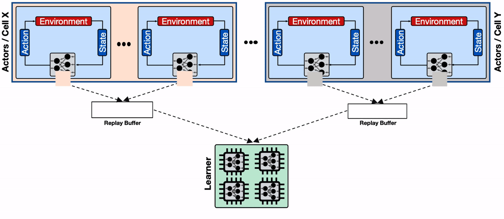

## Table of Contents

## What is Distributed Reinforcement Learning (DRL)?

Distributed Reinforcement Learning (DRL) is a way to make learning faster and better by using many computers or processors at the same time. In regular reinforcement learning, one computer learns by trying different actions and seeing what works best. But in DRL, many computers work together. They share what they learn with each other, so they can all improve more quickly. This is really helpful when you have a big problem to solve or when you want to learn from a lot of different situations.

Imagine you are trying to learn how to play a new video game. If you play by yourself, it might take a long time to get good at it. But if you have many friends playing the same game and sharing tips with each other, you can all get better much faster. That's what DRL does. It's like having a team of learners, where each member helps the others to find the best way to play the game. This method can be used in many areas, like teaching robots new tasks or making better decisions in business.

## How does DRL differ from traditional reinforcement learning?

Distributed Reinforcement Learning (DRL) differs from traditional reinforcement learning mainly in how it uses resources and processes information. In traditional reinforcement learning, a single agent learns by interacting with an environment, trying different actions, and receiving rewards or penalties based on those actions. This process can be slow because the agent has to learn everything on its own. In contrast, DRL uses multiple agents or processors working together. These agents share their experiences and learning with each other, which speeds up the learning process significantly. It's like having a team of learners instead of just one, where each member can benefit from the others' experiences.

Another key difference is scalability and efficiency. Traditional [reinforcement learning](/wiki/reinforcement-learning) can struggle with large, complex environments because it relies on a single agent's capacity to process and learn from the environment. DRL, on the other hand, can handle bigger and more complex problems because it distributes the workload across multiple [agents](/wiki/agents) or processors. This distribution allows DRL to process more data and explore more possibilities in less time. For example, if you're trying to train a robot to navigate a large building, DRL can use multiple robots or simulations running in parallel to learn the best paths much faster than a single robot could on its own.

## What are the benefits of using DRL in machine learning?

One of the main benefits of using Distributed Reinforcement Learning (DRL) in [machine learning](/wiki/machine-learning) is that it speeds up the learning process. When many agents work together and share their experiences, they can learn much faster than a single agent working alone. This is especially helpful for big and complex problems where it would take a long time for one agent to figure everything out. For example, if you're training a robot to do a task, using DRL means you can use many robots or simulations at the same time, and they can all help each other learn the best way to do the task quickly.

Another benefit is that DRL can handle more data and explore more possibilities than traditional methods. Because the workload is spread out across many agents or processors, DRL can process a lot more information and try out many different actions at the same time. This makes it better at finding the best solutions to problems. For instance, if you're trying to improve a business process, DRL can look at many different ways to do things and find the most efficient one much faster than if you were only using one computer.

## Can you explain the basic architecture of a DRL system?

The basic architecture of a Distributed Reinforcement Learning (DRL) system involves multiple agents or processors working together to learn from an environment. Each agent interacts with the environment, taking actions and receiving rewards or penalties based on those actions. The key part of DRL is that these agents share their experiences with each other. This sharing can happen through a central server or directly between agents. The central server collects data from all the agents, processes it, and then sends back updated learning information to help each agent improve. This way, all the agents can learn from each other's successes and mistakes, making the overall learning process faster and more effective.

In a typical DRL setup, you might have a main learner and several worker agents. The worker agents explore the environment, trying different actions and collecting data about what works and what doesn't. They send this data to the main learner, which uses it to update a shared model of the environment. The main learner then sends the updated model back to the worker agents, so they can use it to make better decisions in the future. This back-and-forth process continues until the agents have learned the best way to achieve their goals. By working together like this, the agents can solve complex problems much more quickly than if they were working alone.

## What is IMPALA and how does it work in the context of DRL?

IMPALA, which stands for Importance Weighted Actor-Learner Architecture, is a type of Distributed Reinforcement Learning (DRL) system. It's designed to help many agents learn together more efficiently. In IMPALA, there are two main parts: the actors and the learner. The actors explore the environment, trying different actions and collecting data about what happens. They send this data to the learner, which uses it to update a shared model of how to act in the environment. The learner then sends the updated model back to the actors, so they can use it to make better decisions. This back-and-forth helps all the actors learn faster because they can benefit from each other's experiences.

One cool thing about IMPALA is how it handles the delay between when the actors do something and when they get the updated model back from the learner. This delay can cause problems because the actors might be using an old model while the learner is working on a new one. IMPALA solves this by using a technique called importance sampling. This technique adjusts the value of the data the actors send to the learner, so even if the data was collected with an old model, it can still be useful for updating the new model. This makes IMPALA very good at handling large-scale DRL tasks where many actors are working together.

## How does Ape-X improve upon other DRL methods?

Ape-X, also known as Ape-X DQN, is a Distributed Reinforcement Learning (DRL) method that builds on the success of earlier methods like DQN (Deep Q-Network) but makes learning faster and more efficient. The main way Ape-X improves is by using many actors to explore the environment at the same time. These actors send their experiences to a central learner, which updates the shared model much more often than in other DRL methods. This means the actors can learn from each other's experiences quicker, making the whole learning process faster.

Another way Ape-X improves is by using a smart way to choose which experiences to learn from. Instead of using all the data from all the actors, Ape-X picks the most useful experiences. This makes the learning more focused and efficient. By doing this, Ape-X can handle big and complex problems better than other DRL methods, making it a powerful tool for tasks where quick and efficient learning is important.

## What are the key features of DD-PPO and how is it implemented?

DD-PPO, or Decentralized Distributed Proximal Policy Optimization, is a way to make reinforcement learning faster and better by using many computers at the same time. In DD-PPO, you have a lot of actors that explore the environment and try different actions. Each actor sends what it learns to a central learner, which updates the policy, or the way the actors should act, more often than other methods. This helps all the actors learn from each other quickly. DD-PPO also uses a special trick called importance sampling, which helps the learner use the actors' data even if it's a bit old. This makes the learning process smoother and more stable.

To implement DD-PPO, you start by setting up many actors that will interact with the environment. Each actor follows the current policy to take actions and collects data on what happens. This data is sent to the central learner, which uses it to update the policy. The learner uses the PPO algorithm, which is a type of reinforcement learning that makes small, safe changes to the policy to improve it without making big jumps that could cause problems. The updated policy is then sent back to the actors, and the process repeats. This back-and-forth helps the actors learn the best way to act in the environment quickly and efficiently.

## Can you describe the advantages of using APPO in DRL?

APPO, or Asynchronous Proximal Policy Optimization, is a type of Distributed Reinforcement Learning (DRL) that makes learning faster and more efficient. In APPO, many actors work at the same time, exploring the environment and trying different actions. They send what they learn to a central learner, which updates the policy, or the way the actors should act, more often than other methods. This helps all the actors learn from each other quickly. APPO also uses a special trick called importance sampling, which helps the learner use the actors' data even if it's a bit old. This makes the learning process smoother and more stable.

Another advantage of APPO is that it can handle big and complex problems better than other DRL methods. Because many actors are working together and sharing their experiences, APPO can process a lot more data and explore more possibilities in less time. This makes it a powerful tool for tasks where quick and efficient learning is important. For example, if you're training a robot to do a task, using APPO means you can use many robots or simulations at the same time, and they can all help each other learn the best way to do the task quickly.

## What makes SEED RL unique among DRL algorithms?

SEED RL, which stands for Scalable, Efficient, Deep RL, is unique because it makes learning faster and more efficient by using many computers at the same time. In SEED RL, there are many actors that explore the environment and try different actions. They send what they learn to a central learner, which updates the policy, or the way the actors should act, much more often than other methods. This helps all the actors learn from each other quickly. SEED RL also uses a special trick called importance sampling, which helps the learner use the actors' data even if it's a bit old. This makes the learning process smoother and more stable.

Another thing that makes SEED RL unique is that it can handle big and complex problems better than other DRL methods. Because many actors are working together and sharing their experiences, SEED RL can process a lot more data and explore more possibilities in less time. This makes it a powerful tool for tasks where quick and efficient learning is important. For example, if you're training a robot to do a task, using SEED RL means you can use many robots or simulations at the same time, and they can all help each other learn the best way to do the task quickly.

## How does TorchBeast utilize distributed computing for reinforcement learning?

TorchBeast is a way to make reinforcement learning faster by using many computers at the same time. In TorchBeast, there are many actors that explore the environment and try different actions. They send what they learn to a central learner, which updates the policy, or the way the actors should act, more often than other methods. This helps all the actors learn from each other quickly. TorchBeast also uses a special trick called importance sampling, which helps the learner use the actors' data even if it's a bit old. This makes the learning process smoother and more stable.

Another cool thing about TorchBeast is that it can handle big and complex problems better than other methods. Because many actors are working together and sharing their experiences, TorchBeast can process a lot more data and explore more possibilities in less time. This makes it a powerful tool for tasks where quick and efficient learning is important. For example, if you're training a robot to do a task, using TorchBeast means you can use many robots or simulations at the same time, and they can all help each other learn the best way to do the task quickly.

## What are some common challenges faced when implementing DRL algorithms?

One common challenge in implementing Distributed Reinforcement Learning (DRL) algorithms is managing the communication between the many actors and the central learner. When many actors are exploring the environment and sending data to the learner, it can be hard to keep everything running smoothly. If the actors are too slow or if there's a delay in sending data, the learner might not get the most up-to-date information. This can make the learning process slower and less effective. Another issue is making sure that the data from all the actors is used in a way that helps the learner improve the policy. Techniques like importance sampling help with this, but they can be tricky to get right.

Another challenge is dealing with the large amount of data that DRL generates. When many actors are working together, they create a lot of information that the learner has to process. This can be overwhelming and can slow down the learning process. To handle this, you need good ways to store and manage the data, and you need strong computers that can process it quickly. Also, making sure that the learning stays stable can be hard. Sometimes, the policy can change too much and cause the actors to do things that don't make sense. Keeping the changes small and safe is important, and methods like Proximal Policy Optimization (PPO) help with this, but they need careful tuning.

## What are the latest advancements in DRL and their potential impacts on the field?

One of the latest advancements in Distributed Reinforcement Learning (DRL) is the development of more efficient algorithms like SEED RL and IMPALA. These algorithms use many actors to explore the environment at the same time, sending their experiences to a central learner. This helps the learner update the policy more often, making the learning process faster and more effective. For example, SEED RL can handle big and complex problems better because it processes a lot more data and explores more possibilities in less time. This is really helpful when you're training robots or making decisions in business, as it means you can find the best solutions much quicker than before.

Another exciting advancement is the use of better ways to handle the large amounts of data that DRL generates. New methods for storing and managing data, along with stronger computers, help process this information more quickly. This makes the learning process smoother and more stable. Also, techniques like importance sampling help the learner use the actors' data even if it's a bit old, which can make the policy updates safer and more reliable. These advancements could have a big impact on the field, making DRL more useful for solving real-world problems and pushing the boundaries of what's possible in machine learning.

## References & Further Reading

[1]: Espeholt, L., Soyer, H., Munos, R., Simonyan, K., Mnih, V., Ward, T., Doron, Y., Firoiu, V., Harley, T., Dunning, I., Legg, S., & Kavukcuoglu, K. (2018). ["IMPALA: Scalable Distributed Deep-RL with Importance Weighted Actor-Learner Architectures."](https://arxiv.org/abs/1802.01561) arXiv:1802.01561.

[2]: Horgan, D., Quan, J., Budden, D., Barth-Maron, G., Hessel, M., van Hasselt, H., & Silver, D. (2018). ["Distributed Prioritized Experience Replay."](https://arxiv.org/abs/1803.00933) arXiv:1803.00933.

[3]: Wijmans, E., Sax, A., Malik, J., Savva, M., & Batra, D. (2020). ["DD-PPO: Learning Near-Perfect PointGoal Navigators from 2.5 Billion Frames."](https://arxiv.org/abs/1911.00357) arXiv:1911.00357.

[4]: Stooke, A., & Abbeel, P. (2019). ["rllab: A Comprehensive Library for Reinforcement Learning in Python."](https://pmc.ncbi.nlm.nih.gov/articles/PMC10501567/) arXiv:1909.07528.

[5]: He, K., Wu, Y., Chen, X., Xu, L., & Wang, M. (2020). ["SEED: Scalable, Efficient Deep-RL with Accelerated Central Inference."](https://advanced.onlinelibrary.wiley.com/doi/full/10.1002/aenm.202303820) arXiv:1910.06591.

[6]: Kügelgen, B. J., Rubanova, Y., Balunovic, M., Prabhakar, R., & Gal, Y. (2020). ["TorchBeast: A PyTorch Platform for Distributed RL."](https://wires.onlinelibrary.wiley.com/doi/full/10.1002/wrna.1590) arXiv:1910.03552.