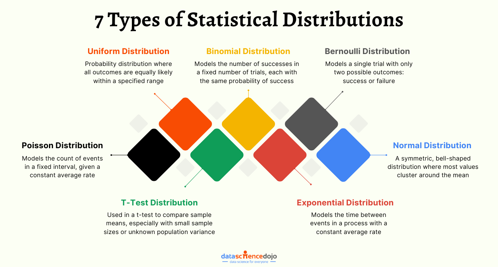

## Table of Contents

## What is distribution in finance?

In finance, distribution refers to how money, like profits or dividends, is shared among investors or shareholders. It's a way for companies to give back some of their earnings to the people who own parts of the company. When a company makes a profit, it can choose to distribute this money to its shareholders instead of keeping it all for future growth or other uses.

Distributions can take different forms, such as cash dividends, where shareholders receive money directly, or stock dividends, where they get more shares in the company. Sometimes, companies might also distribute other assets or even parts of their business. These distributions are important because they can affect how much return investors get on their investment and can influence their decisions to buy, hold, or sell the company's stock.

## Why is distribution important in financial markets?

Distribution is important in financial markets because it shows how companies share their profits with investors. When a company does well and makes money, it can give some of that money back to the people who own its stocks. This sharing, or distribution, makes investors happy because they get something back from their investment. It can also make more people want to buy the company's stocks, hoping to get a share of the profits too.

This process also helps keep the financial markets running smoothly. When companies regularly distribute profits, it gives investors a reason to keep their money in the market. They see that they can earn money not just from selling stocks at a higher price but also from regular payments. This stability can attract more investors, which is good for the overall health of the financial markets.

## What are the different types of distributions in finance?

In finance, there are several types of distributions that companies can use to share their profits with shareholders. One common type is cash dividends, where the company gives shareholders money directly. This is like getting a paycheck from the company just for owning its stock. Another type is stock dividends, where instead of cash, shareholders get more shares of the company. This can be good because it increases the number of shares an investor owns without them having to buy more.

There are also other forms of distributions. Sometimes, a company might give out property dividends, which means shareholders get physical assets or other non-cash items. Another type is special dividends, which are one-time payments that a company might give out if it has extra profits. Lastly, there are liquidating dividends, which happen when a company is closing down and it gives out its remaining assets to shareholders. Each type of distribution has its own benefits and can affect how investors feel about the company and its stock.

## Can you explain dividend distribution and its significance?

Dividend distribution is when a company shares its profits with its shareholders. It's like getting a little reward for owning part of the company. The company decides how much money to give out and when. Usually, this happens regularly, like every three months or once a year. Shareholders get this money based on how many shares they own. If you own more shares, you get more money.

This is important for a few reasons. First, it makes shareholders happy because they see that the company is doing well and sharing its success. This can make more people want to buy the company's stock, hoping to get dividends too. Second, it gives investors a steady income, which can be really helpful, especially for people who rely on their investments to live. Lastly, regular dividends can show that a company is stable and trustworthy, which is good for its reputation in the market.

## What is a capital gain distribution and how does it affect investors?

A capital gain distribution happens when a mutual fund or an investment company sells some of its investments for a profit. Instead of keeping all that profit, the company gives some of it back to the people who own shares in the fund. This is called a capital gain distribution. It's like getting a bonus because the investments did well.

This can affect investors in a couple of ways. First, it's good news because it means they get some extra money. They can use this money however they want, like spending it or investing it in something else. But, there's also a tax side to think about. When investors get a capital gain distribution, they usually have to pay taxes on it, just like they would if they sold an investment themselves and made a profit. So, while it's nice to get the extra money, investors need to remember to set some aside for taxes.

## How does interest distribution work in bonds and savings accounts?

Interest distribution in bonds and savings accounts is when you get money back for lending your money. When you buy a bond, you're basically lending money to a company or the government. They promise to pay you back the money you lent them, plus some extra money called interest. This interest is usually paid to you at certain times, like every six months or once a year. The amount of interest you get depends on the bond's interest rate and how much money you lent.

Savings accounts work a bit differently but still involve interest distribution. When you put money in a savings account, the bank uses that money to make loans to other people. In return, the bank gives you a small part of the money they earn from those loans, which is called interest. This interest is usually added to your account every month or every three months. The more money you have in your savings account, the more interest you'll get. Both bonds and savings accounts give you a way to earn money over time by letting others use your money.

## What are the tax implications of different types of distributions?

When you get money from investments, like dividends or capital gains, you usually have to pay taxes on it. Dividends, which are payments from companies to their shareholders, can be taxed differently depending on if they are "qualified" or "non-qualified." Qualified dividends are taxed at a lower rate, similar to long-term capital gains, which can be 0%, 15%, or 20% depending on your income. Non-qualified dividends, on the other hand, are taxed at your regular income tax rate, which can be higher. So, knowing the difference can help you plan better for taxes.

Capital gain distributions from mutual funds or other investments are also taxed. If the fund sold investments it held for more than a year and made a profit, that's a long-term capital gain, and it's taxed at the same rates as qualified dividends (0%, 15%, or 20%). If the investments were held for less than a year, it's a short-term capital gain, and it's taxed at your regular income tax rate. Interest from bonds and savings accounts is usually taxed as regular income too, but some bonds, like municipal bonds, might be tax-free at the federal level, which can be a big advantage. Understanding these tax rules can help you keep more of your investment earnings.

## How do mutual funds and ETFs handle distributions?

Mutual funds and ETFs handle distributions in a way that's similar but with some differences. When these funds make money from their investments, they can give some of that money back to the people who own shares in the fund. This can happen in the form of dividends, which are payments from the profits the fund made, or capital gains, which come from selling investments for more than what they cost. Both mutual funds and ETFs usually pay out these distributions to shareholders once or a few times a year. The exact timing can depend on the fund's rules and how it's set up.

The main difference between mutual funds and ETFs when it comes to distributions is how they affect the price of the shares. For mutual funds, when a distribution is made, the price of the fund's shares goes down by the amount of the distribution. This is because the money that was paid out is no longer part of the fund's value. On the other hand, ETFs usually don't see their share price drop in the same way because they can use a process called "dividend reinvestment" to keep the price stable. This means that instead of getting cash, shareholders might get more shares of the ETF, which helps keep the overall value of their investment the same.

## What role do distributions play in estate planning and inheritance?

Distributions are important in estate planning and inheritance because they help decide how a person's money and things will be shared after they pass away. When someone makes a will or a trust, they can say exactly who gets what. This could be money, houses, or other things they own. By planning how these things will be distributed, a person can make sure their family and friends get taken care of the way they want.

Sometimes, distributions in estate planning can also help lower taxes. If someone gives away money or things while they are still alive, it might not be taxed as much as if it were given after they die. This can save money for the people who get the inheritance. Planning distributions carefully can make everything go smoothly and help keep more money in the family instead of going to taxes.

## How can investors manage and reinvest distributions effectively?

Investors can manage distributions effectively by deciding what to do with the money they get. One good way is to set up automatic reinvestment. This means that instead of getting the money as cash, it gets used to buy more shares of the same investment. This can help grow their investment over time because they're buying more without spending extra money. Another way is to use the money to pay for things they need, like bills or other expenses. This can help them live more comfortably without having to dip into their main savings.

Reinvesting distributions can also be done in different ways. Investors might choose to put the money into a different investment that they think will do well. This can help spread out their money and lower the risk if one investment doesn't do as well as expected. It's also important for investors to keep an eye on how much they're getting in distributions and how it's taxed. They might need to set some money aside for taxes, especially if the distributions are big. By thinking carefully about how to manage and reinvest their distributions, investors can make the most of their money and reach their financial goals.

## What are some advanced strategies for optimizing distribution income?

One advanced strategy for optimizing distribution income is to focus on dividend growth investing. This means choosing stocks or funds that not only pay dividends but also increase those dividends over time. By picking companies that have a history of raising their dividends, investors can see their income grow without having to buy more shares. This can be especially helpful for people who want their investment income to keep up with inflation or to have more money as they get older. It's important to look at a company's financial health and its history of dividend increases to make sure it can keep up the good work.

Another strategy is to use a dividend reinvestment plan (DRIP) along with a tax-efficient approach. With a DRIP, the dividends you get are automatically used to buy more shares of the same investment. This can help your investment grow faster because you're buying more shares without spending extra money. To make this even better, you can put these investments in tax-advantaged accounts like IRAs or 401(k)s. This can help you keep more of your money because you won't have to pay taxes on the dividends right away. By combining these strategies, you can make your distribution income work harder for you over time.

## How do global economic factors influence distribution policies and outcomes?

Global economic factors can have a big impact on how companies decide to share their profits with shareholders. When the world economy is doing well, companies might make more money and feel more confident about giving out bigger dividends or more frequent distributions. But if the economy is struggling, like during a recession, companies might cut back on dividends to save money and stay safe. Things like interest rates, inflation, and currency exchange rates also play a role. For example, if interest rates go up, it might cost companies more to borrow money, which could mean less money for distributions. And if a country's currency gets weaker, it might affect how much money companies make from selling things in other countries, which can also change their distribution policies.

These global factors don't just affect what companies do; they also change how investors feel about their investments. When the economy is strong, investors might expect higher distributions and be more willing to invest in stocks that pay dividends. But if the economy is shaky, investors might be more worried about losing money and look for safer places to put their money, like bonds or savings accounts. This can make companies think twice about their distribution policies because they want to keep their investors happy. So, understanding how the world economy is doing can help both companies and investors make better decisions about distributions.

## What are Probability Distributions in Finance?

Probability distributions are crucial in finance, offering tools to model market behaviors and evaluate risks. They form the backbone of quantitative finance, providing structured approaches to describe uncertainties and predict outcomes. Various probability distributions, each with distinctive characteristics, are employed in financial modeling, risk assessment, and crafting investment strategies.

### Common Probability Distributions in Finance

**1. Normal Distribution**
The normal distribution, often depicted as a bell curve, is fundamental in finance for assuming asset returns' behavior due to its symmetric nature around the mean. It is characterized by two parameters: mean (μ) and standard deviation (σ). The probability density function (PDF) of a normal distribution is given by:

$$
f(x|\mu,\sigma^2) = \frac{1}{\sqrt{2\pi\sigma^2}} e^{-\frac{(x-\mu)^2}{2\sigma^2}}
$$

In finance, normal distributions are often applied in the models for stock prices under the assumption that returns are log-normally distributed, which simplifies financial theories and valuation models.

**2. Log-normal Distribution**
Contrary to the normal distribution, the log-normal distribution models a variable whose logarithm is normally distributed, making it suitable for modeling stock prices. Since stock prices cannot be negative, the log-normal distribution provides a more realistic model. If $X$ is a normal distribution, $e^X$ follows a log-normal distribution. This is particularly useful in option pricing models, such as the Black-Scholes model.

**3. Binomial Distribution**
The binomial distribution models the number of successes in a fixed number of independent Bernoulli trials (e.g., win/loss scenarios). It is parameterized by the number of trials $n$ and the success probability $p$. Its probability mass function (PMF) is:

$$
P(X = k) = \binom{n}{k} p^k (1-p)^{n-k}
$$

In finance, binomial distributions underpin discrete-time models like the Binomial Options Pricing Model, which provides a framework to evaluate options by modeling potential price movements of the underlying asset.

**4. Poisson Distribution**
The Poisson distribution expresses the probability of a given number of events happening in a fixed interval of time or space. Its parameter $\lambda$ corresponds to the average number of events in the interval. The PMF of a Poisson distribution is:

$$
P(X = k) = \frac{\lambda^k e^{-\lambda}}{k!}
$$

In finance, the Poisson distribution is useful for modeling the number of transactions or arrivals (e.g., insurance claims or calls to a call center) over a specified time, contributing to risk management strategies.

### Applications in Investment Strategies and Risk Management

Probability distributions enable investment strategies by providing frameworks for expectations and variances in returns. By analyzing return distributions, portfolio managers can estimate the expected performance and risk, optimizing asset allocations accordingly. For example, the mean-variance optimization uses normal distribution assumptions to balance return expectations with risk minimization.

In risk management, these distributions are foundational in calculating metrics like Value at Risk (VaR), a standard measure predicting the potential loss in value of a portfolio. Understanding the distribution of asset returns permits financial analysts to perform stress tests and scenario analyses, anticipating possible adverse movements in the market.

Moreover, advanced algorithms in [algorithmic trading](/wiki/algorithmic-trading) often utilize these distributions for high-frequency trading operations, enabling quick, data-driven decision-making. By leveraging probabilities, traders enhance precision in evaluating market opportunities and risks.

The strategic application of probability distributions in modeling financial situations fosters effective decision-making, ensuring resilience in investment portfolios against uncertainties and volatilities inherent in financial markets.

## How can risk be managed through distributions?

Understanding distributions is vital for risk management in financial portfolios. The application of distributions in assessing risk involves quantitative tools such as Value at Risk (VaR) and stress testing. These techniques enable investors and traders to anticipate potential losses and optimize their portfolio strategies.

Value at Risk (VaR) is a statistical metric used to quantify the level of financial risk within a firm or portfolio over a specific time frame. The core concept of VaR is to provide a measure of the worst expected loss at a given confidence level over a particular period. VaR is often expressed as:

$$
\text{VaR}_{\alpha}(X) = -\inf \{x \in \mathbb{R}: P(X \leq x) > \alpha\}
$$

where $\alpha$ is the confidence level and $X$ is the return distribution of the portfolio. VaR is instrumental in helping traders understand the thresholds at which portfolios may incur significant losses, enabling them to make informed decisions about asset allocations and the extent of leverage they might apply.

Stress testing complements VaR by evaluating the effects of extreme market conditions on a portfolio, even those that have not occurred historically. Stress testing involves constructing hypothetical scenarios to assess how adverse changes in market factors such as interest rates, exchange rates, and commodity prices could impact portfolio value. These scenarios may include events like market crashes or geopolitical tensions, testing the resilience of financial strategies and prompting adjustments to mitigate potential risks.

In practical use, traders and investors employ these metrics to model the probability distributions of returns and understand the risk profile of their portfolios. By analyzing the tail risks and the shape of these distributions, they can predict the likelihood of extreme losses and subsequently adjust their strategies. For instance, if the distribution exhibits fat tails (as seen in a leptokurtic distribution), indicating a higher probability of extreme losses, a risk manager might decide to hedge positions or diversify assets to reduce potential exposure.

Portfolio managers utilize algorithmic approaches to automate the process of assessing risk using distributions. Libraries such as NumPy and SciPy in Python allow for efficient computation of VaR and scenario analysis, employing methods like Monte Carlo simulations to account for a wide range of potential outcomes. An example implementation for calculating VaR using historical simulation could be:

```python
import numpy as np

# Simulated daily returns of a portfolio
returns = np.random.normal(0, 1, 1000)

# Confidence level
confidence_level = 0.95

# Calculate VaR
var = np.percentile(returns, (1 - confidence_level) * 100)
print(f'VaR at {confidence_level*100}% confidence level is {var}')
```

By understanding and leveraging distributions in risk management, portfolio managers can not only gauge potential financial risks but also enhance their decision-making processes, ultimately optimizing portfolio performance amidst uncertain market conditions. These tools are fundamental in a financial landscape that prioritizes prudence and preemptive strategy adaptation.

## References & Further Reading

[1]: Lopez de Prado, M. (2018). ["Advances in Financial Machine Learning."](https://www.amazon.com/Advances-Financial-Machine-Learning-Marcos/dp/1119482089) Wiley.

[2]: Aronson, D. R. (2006). ["Evidence-Based Technical Analysis: Applying the Scientific Method and Statistical Inference to Trading Signals."](https://www.amazon.com/Evidence-Based-Technical-Analysis-Scientific-Statistical/dp/0470008741) Wiley.

[3]: Jansen, S. (2020). ["Machine Learning for Algorithmic Trading."](https://github.com/stefan-jansen/machine-learning-for-trading) Packt Publishing.

[4]: Chan, E. P. (2009). ["Quantitative Trading: How to Build Your Own Algorithmic Trading Business."](https://github.com/ftvision/quant_trading_echan_book) Wiley.

[5]: Hull, J. C. (2014). ["Options, Futures, and Other Derivatives."](https://www.amazon.com/Options-Futures-Other-Derivatives-9th/dp/0133456315) Pearson Education.