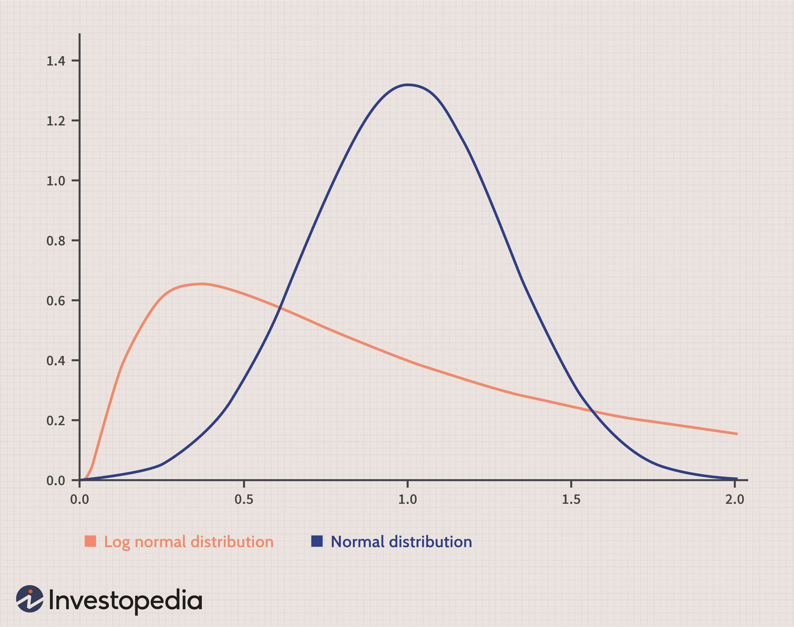

In the world of finance, understanding distributions is crucial for effective risk management and developing robust investment strategies. Distributions, both financial and statistical, play a pivotal role in analyzing market behavior, assessing risks, and enhancing decision-making processes. This article examines various types of distributions in finance, elucidating their significance in algorithmic trading and their broader impact on investment decision-making.

Financial distributions typically refer to disbursements from entities such as mutual funds, stocks, and retirement accounts. These financial distributions are essential for understanding how payouts work and their importance in financial planning. They can take various forms, such as dividends from stocks or interest payments from bonds, each impacting financial planning differently.



Moreover, probability distributions are key tools in finance for modeling market dynamics and evaluating risks. They provide insights into the likelihood of different outcomes, enabling investors and traders to make informed decisions. By employing probability distributions such as normal, log-normal, binomial, and Poisson, financial professionals can develop strategies for anticipating market movements and optimizing risk management approaches.

In the context of algorithmic trading, distributions are indispensable for automating trade decisions and ensuring efficiency. High-frequency trading systems rely on statistical models to process vast datasets and execute trades at speeds far beyond human capabilities. Understanding distributions enables these systems to predict price fluctuations more accurately, ultimately enhancing trading effectiveness.

Finally, risk management employs distributions to anticipate potential portfolio losses. Techniques like Value at Risk (VaR) and stress testing utilize distributional insights to safeguard investments against market volatility. By comprehending how distributions function, traders and investors can optimize their portfolios to withstand market disruptions and achieve their financial objectives.

This exploration underscores the fundamental role of distributions in finance and trading. By gaining a deeper understanding of these concepts, financial professionals can enhance their investment strategies and risk management techniques, ultimately making more informed decisions in the ever-evolving financial landscape.

## Table of Contents

## Understanding Financial Distributions

Financial distributions are disbursements derived from various types of securities, including mutual funds, stocks, and retirement accounts. These distributions play a critical role in both personal and corporate finance, as they influence investment decisions and financial planning strategies.

**Basics of Financial Distributions:**

At their core, financial distributions are payments made to investors based on the earnings and profits generated by their investments. These distributions typically occur on a periodic basis, such as quarterly or annually, and are an essential aspect of financial products like dividends, interest payments, and capital gains.

1. **Mutual Fund Distributions:**

    Mutual funds often generate income from dividends on stocks or interest on bonds, and they may also realize capital gains when they sell securities that have increased in value. These earnings are periodically distributed to fund shareholders. In most cases, mutual funds offer the option of reinvesting distributions back into additional shares, thereby compounding the investor’s returns.

2. **Stock Dividends:**

    Stock dividends are portions of a company's earnings paid out to stockholders. These can be in the form of cash payments or additional shares. The amount of dividends paid, typically expressed in dollar terms or as a dividend yield, reflects the company's profitability and its policy on returning profits to shareholders.

3. **Retirement Account Distributions:**

    Distributions from retirement accounts, such as 401(k)s or IRAs, are funds withdrawn by the account holder, usually upon retirement. These distributions are often subject to specific regulations and tax implications, particularly when taken before a certain age, in the form of Required Minimum Distributions (RMDs).

**Relevance of Distributions in Financial Planning:**

Financial distributions significantly impact financial planning and investment strategies. They provide a source of income for investors and can affect the tax obligations associated with an investment portfolio. Moreover, understanding the nature and timing of these distributions is crucial for effective cash flow management.

For example, reinvested distributions can contribute to an investor's compounding strategy, enhancing overall returns over time due to the reinvestment of dividends or interest payments. Conversely, regular cash distributions can be a vital income stream for retirees or those seeking passive income.

In essence, the strategic allocation of assets that produce regular distributions can help investors balance their portfolios according to risk tolerance and income needs. This approach underscores the necessity for investors to incorporate the timing, amount, and tax implications of distributions into their broader financial strategies, ensuring alignment with their long-term financial goals.

Overall, grasping the dynamics of financial distributions allows individuals and businesses to optimize investment outcomes, leveraging them as a tool for wealth accumulation, income stability, and enhanced financial security.

## Types of Financial Distributions

Financial distributions play a pivotal role in shaping the financial strategies of investors. They refer to the payments made to investors, derived from the earnings and profits of a security or financial account. These distributions come in various forms, including stock, bond, mutual fund, and retirement account distributions. Understanding these different forms aids in crafting a robust financial plan and developing effective investment strategies.

### Stock Distributions

Stock distributions, commonly known as dividends, represent a portion of a company’s earnings distributed to its shareholders. They are typically paid out either as cash dividends or as stock dividends. Cash dividends involve direct payments to shareholders, usually on a quarterly basis, while stock dividends are paid in additional shares of the company's stock. The decision to pay dividends and the amount often reflect a company's profitability and [liquidity](/wiki/liquidity-risk-premium) position. For investors, stock distributions present an opportunity for income generation, particularly important for income-focused investment strategies.

### Bond Distributions

Bond distributions primarily involve interest payments, also referred to as coupon payments. These payments are generally made at regular intervals, typically semi-annually, and are a crucial component of the return investors expect from holding bonds. The predictability of bond distributions makes them attractive for conservative investors seeking steady income streams. Additionally, the interest payment's size is generally determined by the bond's coupon rate, which is fixed at issuance. As such, understanding bond distributions is essential for managing [interest rate](/wiki/interest-rate-trading-strategies) risk and aligning investment strategies with income needs.

### Mutual Fund Distributions

Mutual fund distributions encompass various forms of earnings generated by the fund’s underlying investments. These include dividends from stocks, interest from bonds, and capital gains realized from the sale of securities within the fund. At least once a year, mutual funds are required to distribute these earnings to shareholders. Investors may opt to receive these distributions in cash or reinvest them back into the fund to purchase additional shares, a strategy that can compound returns over time.

### Retirement Account Distributions

Retirement accounts, such as IRAs and 401(k)s, involve distributions that require careful management due to tax implications and regulatory requirements. For instance, after reaching the age of 59½, retirees can begin taking penalty-free withdrawals. However, the IRS mandates Required Minimum Distributions (RMDs) from traditional retirement accounts starting at age 73 (as of 2023). Failure to comply with RMD rules can result in substantial tax penalties. Strategic planning around retirement account distributions is essential to minimize tax liabilities and ensure sufficient income during retirement.

### Impact on Financial Planning and Investment Strategies

The nature and timing of financial distributions significantly impact financial planning and investment strategies. Regular distributions from stocks, bonds, and mutual funds can provide a steady income stream, essential for maintaining liquidity and supporting cash flow needs. In the context of retirement planning, understanding RMDs is vital for managing taxable income and avoiding penalties. 

Moreover, reinvesting distributions can enhance growth strategies by leveraging the power of compounding. Effective management of distributions also informs risk management by ensuring that investors can meet both short-term income needs and long-term growth objectives without unnecessary exposure to market [volatility](/wiki/volatility-trading-strategies). 

In summary, a nuanced understanding of financial distributions enables investors to navigate complex financial decisions more effectively, optimize income, and construct portfolios that align with their financial goals and risk tolerances.

## Examples of Financial Distributions

Financial distributions play a crucial role in the fiscal ecosystem, influencing decision-making processes for individuals and corporations alike. By examining real-world examples, one can better appreciate the diverse applications and implications of these distributions.

One notable instance involves mutual funds, which are collective investment schemes pooling money from multiple investors to buy stocks, bonds, or other securities. A prominent mutual fund firm, for example, disburses distributions to its investors typically in the form of dividends or capital gains. Dividends represent the income generated from the fund's holdings, while capital gains are the profits earned when the fund sells securities at a higher price than the purchase price. These distributions are pivotal to investors as they can either be reinvested in additional shares of the fund or withdrawn for personal income, thus directly affecting the investor's financial strategy and portfolio growth.

Consider the hypothetical mutual fund "XYZ Fund." If XYZ Fund manages assets totaling $10 billion and decides to distribute $500 million as dividends this year, each investor receives a portion of this amount proportional to their ownership in the fund. If an investor holds 1% of the fund shares, their dividend distribution would amount to $5 million. This inflow can be reinvested or utilized as income, impacting the investor's net worth and potential tax liabilities. 

Another critical example is retirement account distributions, such as those from 401(k) plans or Individual Retirement Accounts (IRAs). These distributions are essential for retirees as they transition from [earning](/wiki/earning-announcement) a regular income to relying on savings. Understanding the compulsory withdrawals mandated by the Required Minimum Distributions (RMDs) is crucial. RMDs are minimum amounts that a retirement plan account owner must withdraw annually, starting with the year that they reach 72 (or 70½ if born before July 1, 1949), as per the Internal Revenue Service (IRS) regulations in the United States. Failure to take RMDs can result in substantial tax penalties, impacting retirement planning. 

For instance, in a case where an individual has $500,000 in an IRA and turns 72, IRS guidelines prescribe a specific formula to calculate the RMD. Suppose the life expectancy [factor](/wiki/factor-investing) used is 25.6, the RMD for that year would be $19,531 ($500,000 divided by 25.6). Failing to withdraw this amount can lead to a 50% excise tax on the amount not distributed as required.

Both mutual fund and retirement account distributions underscore the vital role of financial distributions in determining individual wealth trajectories and ensuring corporate financial health. Investors are significantly affected by these distributions as they directly impact cash flow, tax situations, and investment strategies. Corporations and financial entities must strategically manage distributions to maintain fiscal stability, investor satisfaction, and regulatory compliance, ensuring sustained growth and viability in the financial marketplace.

## Probability Distributions in Finance

Probability distributions are crucial in finance, offering tools to model market behaviors and evaluate risks. They form the backbone of quantitative finance, providing structured approaches to describe uncertainties and predict outcomes. Various probability distributions, each with distinctive characteristics, are employed in financial modeling, risk assessment, and crafting investment strategies.

### Common Probability Distributions in Finance

**1. Normal Distribution**
The normal distribution, often depicted as a bell curve, is fundamental in finance for assuming asset returns' behavior due to its symmetric nature around the mean. It is characterized by two parameters: mean (μ) and standard deviation (σ). The probability density function (PDF) of a normal distribution is given by:

$$
f(x|\mu,\sigma^2) = \frac{1}{\sqrt{2\pi\sigma^2}} e^{-\frac{(x-\mu)^2}{2\sigma^2}}
$$

In finance, normal distributions are often applied in the models for stock prices under the assumption that returns are log-normally distributed, which simplifies financial theories and valuation models.

**2. Log-normal Distribution**
Contrary to the normal distribution, the log-normal distribution models a variable whose logarithm is normally distributed, making it suitable for modeling stock prices. Since stock prices cannot be negative, the log-normal distribution provides a more realistic model. If $X$ is a normal distribution, $e^X$ follows a log-normal distribution. This is particularly useful in option pricing models, such as the Black-Scholes model.

**3. Binomial Distribution**
The binomial distribution models the number of successes in a fixed number of independent Bernoulli trials (e.g., win/loss scenarios). It is parameterized by the number of trials $n$ and the success probability $p$. Its probability mass function (PMF) is:

$$
P(X = k) = \binom{n}{k} p^k (1-p)^{n-k}
$$

In finance, binomial distributions underpin discrete-time models like the Binomial Options Pricing Model, which provides a framework to evaluate options by modeling potential price movements of the underlying asset.

**4. Poisson Distribution**
The Poisson distribution expresses the probability of a given number of events happening in a fixed interval of time or space. Its parameter $\lambda$ corresponds to the average number of events in the interval. The PMF of a Poisson distribution is:

$$
P(X = k) = \frac{\lambda^k e^{-\lambda}}{k!}
$$

In finance, the Poisson distribution is useful for modeling the number of transactions or arrivals (e.g., insurance claims or calls to a call center) over a specified time, contributing to risk management strategies.

### Applications in Investment Strategies and Risk Management

Probability distributions enable investment strategies by providing frameworks for expectations and variances in returns. By analyzing return distributions, portfolio managers can estimate the expected performance and risk, optimizing asset allocations accordingly. For example, the mean-variance optimization uses normal distribution assumptions to balance return expectations with risk minimization.

In risk management, these distributions are foundational in calculating metrics like Value at Risk (VaR), a standard measure predicting the potential loss in value of a portfolio. Understanding the distribution of asset returns permits financial analysts to perform stress tests and scenario analyses, anticipating possible adverse movements in the market.

Moreover, advanced algorithms in [algorithmic trading](/wiki/algorithmic-trading) often utilize these distributions for high-frequency trading operations, enabling quick, data-driven decision-making. By leveraging probabilities, traders enhance precision in evaluating market opportunities and risks.

The strategic application of probability distributions in modeling financial situations fosters effective decision-making, ensuring resilience in investment portfolios against uncertainties and volatilities inherent in financial markets.

## Algorithmic Trading and Distributions

Algorithmic trading utilizes probability distributions to enhance and streamline trading strategies by automating decision-making and optimizing execution speed. Probability distributions help traders model the behavior of financial markets by providing a mathematical framework for predicting price movements and assessing market risks.

Different types of distributions are instrumental in making fast, data-driven trading decisions. Normal distributions, for example, are often used in financial models to represent returns due to their properties of symmetry and predictable variation. This distribution is critical for algorithms that implement mean-reversion strategies, which assume that prices will revert to their historical average over time.

Log-normal distributions are another crucial tool, especially for modeling stock prices. Since stock prices cannot be negative and tend to exhibit proportional rather than absolute changes, the log-normal distribution is more appropriate than the normal distribution for predicting future prices. In algorithmic trading, these characteristics help in creating volatility strategies based on the anticipated fluctuations of asset prices.

Algorithmic models also employ binomial and Poisson distributions. The binomial distribution is helpful in scenarios such as option pricing when the probability of different outcomes (i.e., up or down movements in the price of an underlying asset) can be discretely assessed. Poisson distributions can model the number of events (like trades) that occur in a fixed interval of time or space, which is essential for high-frequency trading ([HFT](/wiki/high-frequency-trading-strategies)) that requires rapid and frequent decision-making based on market events.

High-frequency trading (HFT) employs these distributions to enhance trading efficiency by executing a substantial number of orders at extraordinarily fast speeds, often on the scale of microseconds. HFT algorithms rely heavily on the statistical properties of probability distributions to identify and exploit short-lived market inefficiencies. The utilization of advanced statistical algorithms, which incorporate probability distribution models, enables HFT systems to predict changes in market conditions swiftly and adjust their trading positions accordingly.

For instance, an algorithm designed to capitalize on statistical [arbitrage](/wiki/arbitrage) opportunities might use mean and standard deviation calculations derived from the historical data of asset prices. By assuming a normal distribution, the algorithm can identify deviations from the expected mean as potential trading opportunities, where prices are likely to revert to the mean, hence capturing profits from these fluctuations.

In code, a Python simulation of a simple mean-reversion strategy could look like this:

```python
import numpy as np

# Generate some synthetic historical price data
np.random.seed(0)
price_changes = np.random.normal(loc=0, scale=1, size=100)
prices = np.cumsum(price_changes) + 100  # start at a baseline price

def mean_reversion_strategy(prices, window=5):
    signals = np.zeros(len(prices))
    for i in range(window, len(prices)):
        moving_avg = np.mean(prices[i-window:i])
        if prices[i] < moving_avg:
            signals[i] = 1  # Buy signal
        elif prices[i] > moving_avg:
            signals[i] = -1  # Sell signal
    return signals

signals = mean_reversion_strategy(prices)
```

Here, an algorithm calculates a moving average of the stock prices and generates buy or sell signals based on the price's deviation from this average. By leveraging such distribution-based strategies, traders can systematically automate trading decisions and potentially generate returns in volatile market conditions.

In conclusion, understanding and utilizing probability distributions enable algorithmic trading systems to systematically calculate risk and execute trades with unparalleled precision and speed. This capability underscores the significant role of probability distributions in optimizing the efficiency and effectiveness of modern algorithmic trading strategies.

## Risk Management Through Distributions

Understanding distributions is vital for risk management in financial portfolios. The application of distributions in assessing risk involves quantitative tools such as Value at Risk (VaR) and stress testing. These techniques enable investors and traders to anticipate potential losses and optimize their portfolio strategies.

Value at Risk (VaR) is a statistical metric used to quantify the level of financial risk within a firm or portfolio over a specific time frame. The core concept of VaR is to provide a measure of the worst expected loss at a given confidence level over a particular period. VaR is often expressed as:

$$
\text{VaR}_{\alpha}(X) = -\inf \{x \in \mathbb{R}: P(X \leq x) > \alpha\}
$$

where $\alpha$ is the confidence level and $X$ is the return distribution of the portfolio. VaR is instrumental in helping traders understand the thresholds at which portfolios may incur significant losses, enabling them to make informed decisions about asset allocations and the extent of leverage they might apply.

Stress testing complements VaR by evaluating the effects of extreme market conditions on a portfolio, even those that have not occurred historically. Stress testing involves constructing hypothetical scenarios to assess how adverse changes in market factors such as interest rates, exchange rates, and commodity prices could impact portfolio value. These scenarios may include events like market crashes or geopolitical tensions, testing the resilience of financial strategies and prompting adjustments to mitigate potential risks.

In practical use, traders and investors employ these metrics to model the probability distributions of returns and understand the risk profile of their portfolios. By analyzing the tail risks and the shape of these distributions, they can predict the likelihood of extreme losses and subsequently adjust their strategies. For instance, if the distribution exhibits fat tails (as seen in a leptokurtic distribution), indicating a higher probability of extreme losses, a risk manager might decide to hedge positions or diversify assets to reduce potential exposure.

Portfolio managers utilize algorithmic approaches to automate the process of assessing risk using distributions. Libraries such as NumPy and SciPy in Python allow for efficient computation of VaR and scenario analysis, employing methods like Monte Carlo simulations to account for a wide range of potential outcomes. An example implementation for calculating VaR using historical simulation could be:

```python
import numpy as np

# Simulated daily returns of a portfolio
returns = np.random.normal(0, 1, 1000)

# Confidence level
confidence_level = 0.95

# Calculate VaR
var = np.percentile(returns, (1 - confidence_level) * 100)
print(f'VaR at {confidence_level*100}% confidence level is {var}')
```

By understanding and leveraging distributions in risk management, portfolio managers can not only gauge potential financial risks but also enhance their decision-making processes, ultimately optimizing portfolio performance amidst uncertain market conditions. These tools are fundamental in a financial landscape that prioritizes prudence and preemptive strategy adaptation.

## Conclusion

In summary, understanding both financial and probability distributions is pivotal in finance and trading. Financial distributions, such as those from stocks, bonds, mutual funds, and retirement accounts, form the backbone of financial planning and investment strategies. They help investors design portfolios that align with their income needs and risk tolerances. On the other hand, probability distributions, encompassing normal, log-normal, binomial, and Poisson distributions, are instrumental in modeling market behavior, assessing potential risks, and creating robust investment strategies. They enable traders and investors to anticipate market movements and assess risk, thereby facilitating more informed decision-making.

The integration of these concepts is crucial for effective risk management. Tools like Value at Risk (VaR) and stress testing rely heavily on probability distributions to identify potential losses and optimize portfolio strategies. Moreover, algorithmic trading thrives on these distributions, using them to automate trading decisions and increase efficiency through high-frequency trading.

In light of the dynamic nature of financial markets, ongoing learning and adaptation of strategies using distributions are essential. As markets evolve, the application of these statistical tools can provide a competitive edge, ensuring that investors and traders are well-prepared to navigate the complexities of the financial world. Embracing a continuous learning approach and applying distribution-based strategies can help in maintaining agility and informed decision-making in a rapidly changing financial landscape.

## References & Further Reading

[1]: Lopez de Prado, M. (2018). ["Advances in Financial Machine Learning."](https://www.amazon.com/Advances-Financial-Machine-Learning-Marcos/dp/1119482089) Wiley.

[2]: Aronson, D. R. (2006). ["Evidence-Based Technical Analysis: Applying the Scientific Method and Statistical Inference to Trading Signals."](https://www.amazon.com/Evidence-Based-Technical-Analysis-Scientific-Statistical/dp/0470008741) Wiley.

[3]: Jansen, S. (2020). ["Machine Learning for Algorithmic Trading."](https://github.com/stefan-jansen/machine-learning-for-trading) Packt Publishing.

[4]: Chan, E. P. (2009). ["Quantitative Trading: How to Build Your Own Algorithmic Trading Business."](https://github.com/ftvision/quant_trading_echan_book) Wiley.

[5]: Hull, J. C. (2014). ["Options, Futures, and Other Derivatives."](https://www.amazon.com/Options-Futures-Other-Derivatives-9th/dp/0133456315) Pearson Education.