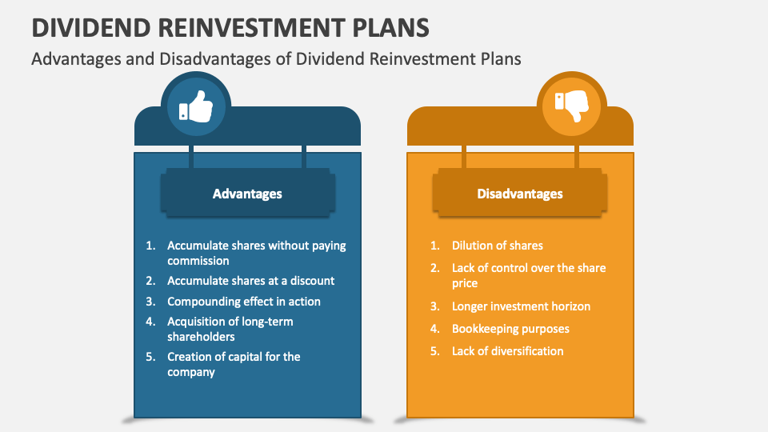

## Table of Contents

## What is distribution reinvestment?

Distribution reinvestment is when the money you earn from investments, like dividends or interest, is automatically used to buy more of the same investment instead of being paid out to you. This can help your investments grow faster because you're buying more shares without spending extra money.

For example, if you own stocks that pay dividends, instead of getting cash, those dividends can be used to buy more stocks. Over time, this can lead to owning more shares and potentially earning even more dividends in the future. It's a way to keep your money working for you without having to do anything extra.

## How does distribution reinvestment work?

Distribution reinvestment is a way to use the money you earn from your investments to buy more of those investments. For example, if you own shares in a company that pays dividends, instead of getting that money in your bank account, you can choose to have it automatically used to buy more shares of the same company. This means you don't have to spend any extra money to get more shares; the dividends you earn do the work for you.

This can help your investments grow faster over time. When you reinvest your dividends, you end up owning more shares, which can lead to earning even more dividends in the future. It's like a cycle where your money keeps working for you without you having to do anything extra. Many people find this a good way to increase their investment over the long term because it takes advantage of the power of compounding.

## What are the common types of distributions that can be reinvested?

The most common types of distributions that can be reinvested are dividends and interest. Dividends are payments made by a company to its shareholders, usually from the company's profits. If you own stocks that pay dividends, you can choose to reinvest those dividends to buy more shares of the same company. This way, your investment can grow without you spending more money. Interest is another type of distribution that can be reinvested. It's the money you earn from things like savings accounts or bonds. When you reinvest interest, it's used to buy more of the same investment, helping your money grow over time.

Another type of distribution that can be reinvested is capital gains. Capital gains are the profits you make when you sell an investment for more than you paid for it. Some investment funds, like mutual funds or exchange-traded funds (ETFs), might distribute these gains to their investors. Instead of taking the cash, you can choose to reinvest these gains to buy more shares of the fund. This can help your investment grow even more.

Overall, reinvesting distributions like dividends, interest, and capital gains is a way to use the money you earn from your investments to buy more of those investments. It's a strategy that can help your money work harder for you over time, leading to potentially bigger returns in the long run.

## What are the advantages of distribution reinvestment for beginners?

Distribution reinvestment can be a great way for beginners to grow their investments without having to put in more money. When you reinvest dividends or interest, you're using the money you earn to buy more of the same investment. This means you can own more shares without spending extra cash. Over time, this can help your investment grow faster because you're getting more shares, which can lead to earning even more dividends or interest in the future. It's like a snowball effect where your money keeps growing on its own.

Another advantage for beginners is that distribution reinvestment is easy to set up and doesn't require much work. Once you choose to reinvest your distributions, it happens automatically. You don't have to keep track of when dividends are paid or remember to buy more shares. This can be really helpful if you're new to investing and want a simple way to make your money work for you. Plus, it helps you take advantage of compounding, which is when your earnings start earning their own earnings, making your investment grow even more over time.

## How can distribution reinvestment help in building wealth over time?

Distribution reinvestment can help you build wealth over time by using the money you earn from your investments to buy more of those investments. For example, if you own stocks that pay dividends, instead of taking the cash, you can use those dividends to buy more stocks. This means you end up owning more shares without spending any extra money. Over time, as you own more shares, you can earn more dividends, which you can then reinvest again. This cycle can help your investment grow faster because you're always adding to your shares without having to put in more money.

Another way distribution reinvestment helps build wealth is through the power of compounding. Compounding is when your earnings start earning their own earnings. When you reinvest your dividends or interest, you're not just growing your investment with the money you put in at the start. You're also growing it with the money you earn along the way. Over many years, this can make a big difference in how much your investment is worth. It's like a snowball rolling down a hill, getting bigger and bigger as it goes. By letting your money work for you in this way, you can build more wealth over time without having to do much extra work.

## What are the tax implications of distribution reinvestment?

When you reinvest your distributions like dividends or interest, you still have to pay taxes on them, even though you're not getting the money in your bank account. The tax rules can be different depending on where you live and what kind of investment you have. For example, in the United States, dividends are usually taxed as income, and you have to report them on your tax return, even if you reinvest them. This means you might have to pay taxes on money you're not actually using, which can be a bit tricky to manage.

However, there are some ways to make this easier. If you're investing in a tax-advantaged account like an IRA or a 401(k), you might not have to pay taxes on your reinvested distributions right away. In these accounts, you can reinvest your dividends and let them grow without worrying about taxes until you take the money out later. This can be a big help in building your wealth over time because you're not losing part of your earnings to taxes every year. It's always a good idea to talk to a tax professional to understand how these rules apply to your specific situation.

## Can distribution reinvestment be used in retirement accounts?

Yes, you can use distribution reinvestment in retirement accounts like an IRA or a 401(k). When you reinvest your dividends or interest in these accounts, you don't have to pay taxes on them right away. This can help your money grow faster because you're not losing part of your earnings to taxes every year. Instead, you can let your investments grow and compound over time, which can make a big difference in how much money you have when you retire.

Using distribution reinvestment in a retirement account is also easy to set up. Once you choose to reinvest your distributions, it happens automatically. You don't have to keep track of when dividends are paid or remember to buy more shares. This can be really helpful if you're new to investing or if you just want a simple way to make your money work for you without having to do much extra work.

## What are the potential disadvantages of distribution reinvestment?

One potential disadvantage of distribution reinvestment is that you don't get the cash from your dividends or interest right away. If you need that money for bills or other expenses, you might have to sell some of your investments to get it. This can be a problem if the value of your investments has gone down since you bought them. Also, if you're reinvesting in a taxable account, you still have to pay taxes on those dividends or interest, even though you're not getting the money. This means you might have to come up with the money to pay those taxes, which can be tricky.

Another disadvantage is that reinvesting automatically means you're buying more of the same investment, no matter what the price is. If the price is high, you might end up buying more shares at a time when it might be better to wait for a lower price. This can affect how much money you make in the long run. Also, if you're not paying attention to your investments, you might end up with too much of one type of investment, which can make your portfolio less diverse and more risky.

## How does distribution reinvestment affect the cost basis of an investment?

When you reinvest your dividends or interest, it changes the cost basis of your investment. The cost basis is the original price you paid for your investment. When you reinvest, you're using the money you earn to buy more shares, so your total cost basis goes up. For example, if you bought 100 shares of a stock at $10 each, your cost basis would be $1,000. If you then reinvest $100 in dividends to buy 10 more shares, your new cost basis would be $1,100 because you now own 110 shares.

This can get a bit complicated when it comes to taxes. When you sell your investment, you need to know your cost basis to figure out if you made a profit or a loss. If you've been reinvesting your dividends or interest over time, you'll need to keep track of each reinvestment to know your new cost basis. This means you might need to do some extra work to keep your records up to date. But if you're using a retirement account like an IRA or a 401(k), you don't have to worry about this right away because you won't pay taxes on your reinvested earnings until you take the money out.

## What are the considerations for reinvesting distributions in a volatile market?

When you reinvest your distributions in a volatile market, it can be a bit tricky. A volatile market means the prices of investments can go up and down a lot in a short time. If you're automatically reinvesting your dividends or interest, you might end up buying more shares when the price is high. This can be risky because if the price goes down later, the value of your investment might drop. On the other hand, if the price goes down, you'll be buying more shares at a lower price, which can be good for the long term. It's like getting a discount on your investment.

Another thing to think about is how much risk you're okay with. In a volatile market, reinvesting can make your investment grow faster if things go well, but it can also make it more risky. You might end up with a lot of one type of investment, which can be risky if that investment doesn't do well. It's important to keep an eye on your investments and make sure you're not putting all your eggs in one basket. If you're not sure, it might be a good idea to talk to a financial advisor who can help you figure out the best way to handle your investments in a volatile market.

## How can advanced investors optimize their distribution reinvestment strategy?

Advanced investors can optimize their distribution reinvestment strategy by using a technique called dollar-cost averaging. This means they reinvest their dividends or interest at regular intervals, no matter what the market is doing. This can help them buy more shares when prices are low and fewer when prices are high, which can lead to a lower average cost per share over time. It's like getting a better deal on their investment. They can also choose to reinvest in different types of investments to spread out their risk. This way, if one investment doesn't do well, they still have others that might be doing better.

Another way advanced investors can optimize their strategy is by paying attention to tax implications. They might use tax-advantaged accounts like IRAs or 401(k)s to reinvest their distributions without having to pay taxes right away. This can help their money grow faster because they're not losing part of their earnings to taxes every year. They can also keep track of their cost basis carefully, so they know exactly how much they've invested over time. This can help them make smart decisions about when to sell their investments and how to handle their taxes. By thinking about these things, advanced investors can make the most out of their distribution reinvestment strategy.

## What are the differences in distribution reinvestment policies among various investment vehicles?

Different investment vehicles have different rules about how you can reinvest your distributions like dividends or interest. For example, if you own stocks directly, you can usually choose to reinvest your dividends automatically through a Dividend Reinvestment Plan (DRIP). This means the money you earn from dividends is used to buy more shares of the same stock without you having to do anything. Mutual funds and exchange-traded funds (ETFs) also often let you reinvest your dividends or capital gains distributions. These funds might have their own rules about how and when you can reinvest, so it's good to check the details of each fund.

Retirement accounts like IRAs and 401(k)s have special rules that can make reinvesting easier and more beneficial. In these accounts, you can reinvest your dividends or interest without having to pay taxes on them right away. This can help your money grow faster because you're not losing part of your earnings to taxes every year. On the other hand, if you're investing in a regular taxable account, you still have to pay taxes on your reinvested distributions, even though you're not getting the money in your bank account. This means you need to keep track of your taxes and might need to come up with the money to pay them.

## What is Understanding Distribution Reinvestment?

Distribution reinvestment is a strategy where dividends or interest earnings are used to purchase additional shares of the investment vehicle from which the returns were generated. This method of reinvestment is notably popular among long-term investors due to its potential to harness the power of compounding over extended periods.

When an investor opts for distribution reinvestment, they enable an automated process where dividends or interest payments are not withdrawn but reinvested into the same financial product. Mutual funds, Real Estate Investment Trusts (REITs), and various other pooled investment vehicles frequently offer dividend reinvestment plans (DRIPs) as part of their portfolio management services.

The compounding effect achieved through distribution reinvestment can be illustrated by the formula for compound interest, which is given by:

$$
A = P \left(1 + \frac{r}{n}\right)^{nt}
$$

Where:
- $A$ is the future value of the investment/loan, including interest.
- $P$ is the principal investment amount (initial deposit or loan amount).
- $r$ is the annual interest rate (decimal).
- $n$ is the number of times that interest is compounded per unit year.
- $t$ is the time the money is invested or borrowed for, in years.

In the context of reinvestment, $P$ represents the initial investment, and $r$ and $n$ account for how frequently and at what rate the dividends or interest are being added back into the investment.

Reinvestment cycles depend highly on the periodicity of the distribution — whether distributions are made monthly, quarterly, or annually — with each cycle providing an opportunity for the investment to grow. The continual reinvestment helps increase the quantity of shares owned over time, which in turn can produce larger dividend payments in subsequent periods, further compounding investment growth.

One of the significant benefits of distribution reinvestment is that it allows the investor to accumulate more assets without requiring additional capital input. By consistently increasing the asset base, reinvestment can significantly enhance the long-term growth potential of an investment portfolio. This mechanism is automatic in many plans, effectively removing the need for the investor to manage or execute trades manually, thereby enforcing a discipline in the investment process that mitigates the risk of emotional decision-making.

In conclusion, the strategy of distribution reinvestment is a powerful tool for investors aiming for incremental growth over time. It leverages the principle of compounding and requires minimal active management from the investor, aligning well with the objectives of long-term investment growth.

## What are the advantages and disadvantages of reinvestment?

Reinvestment refers to the financial strategy of using received dividends or interest to acquire additional shares of an investment. This practice offers numerous advantages for investors, particularly those focused on long-term growth. By reinvesting distributions, investors can enhance the growth potential of their investment portfolios without the need for additional capital infusion. This method of compounding allows for exponential growth, as reinvested earnings generate further earnings over time. The compounding effect can be represented mathematically by the formula for compound interest: 

$$
A = P \left(1 + \frac{r}{n}\right)^{nt}
$$

where $A$ is the amount of money accumulated after n years, including interest, $P$ is the principal amount (initial investment), $r$ is the annual interest rate (decimal), $n$ is the number of times that interest is compounded per year, and $t$ is the number of years.

Reinvestment strategies are employed by various pooled investment vehicles such as mutual funds and real estate investment trusts (REITs). These funds typically offer reinvestment plans that automatically reinvest dividends or income back into the fund, thus accelerating the growth of the investor's holdings over time. This strategy aligns well with the interests of investors seeking to maximize retirement funds or other long-term financial goals.

However, there are disadvantages to consider with reinvestment strategies. One primary concern is that reinvested distributions are taxable events. Even if dividends are reinvested rather than directly paid out to the investor, they are often taxed as ordinary income or at dividend tax rates in the year they are received. As a result, investors could face significant tax liabilities, which might offset some of the benefits derived from the compounding effect of reinvestment. Therefore, it is crucial for investors to consider the tax implications and potentially utilize tax-advantaged accounts such as IRAs or 401(k)s to mitigate tax burdens.

Investors must balance the benefits of asset accumulation and the power of compounding against the potential drawback of increased tax liabilities. Effective portfolio management requires careful consideration of these factors to optimize after-tax returns and align with the investor's financial goals and risk tolerance.

## References & Further Reading

[1]: ["Advances in Financial Machine Learning"](https://www.amazon.com/Advances-Financial-Machine-Learning-Marcos/dp/1119482089) by Marcos Lopez de Prado

[2]: ["Quantitative Trading: How to Build Your Own Algorithmic Trading Business"](https://www.amazon.com/Quantitative-Trading-Build-Algorithmic-Business/dp/1119800064) by Ernest P. Chan

[3]: ["Evidence-Based Technical Analysis: Applying the Scientific Method and Statistical Inference to Trading Signals"](https://www.amazon.com/Evidence-Based-Technical-Analysis-Scientific-Statistical/dp/0470008741) by David Aronson

[4]: ["Machine Learning for Algorithmic Trading"](https://github.com/stefan-jansen/machine-learning-for-trading) by Stefan Jansen

[5]: Bergstra, J., Bardenet, R., Bengio, Y., & Kégl, B. (2011). ["Algorithms for Hyper-Parameter Optimization."](https://proceedings.neurips.cc/paper/2011/file/86e8f7ab32cfd12577bc2619bc635690-Paper.pdf) Advances in Neural Information Processing Systems 24.