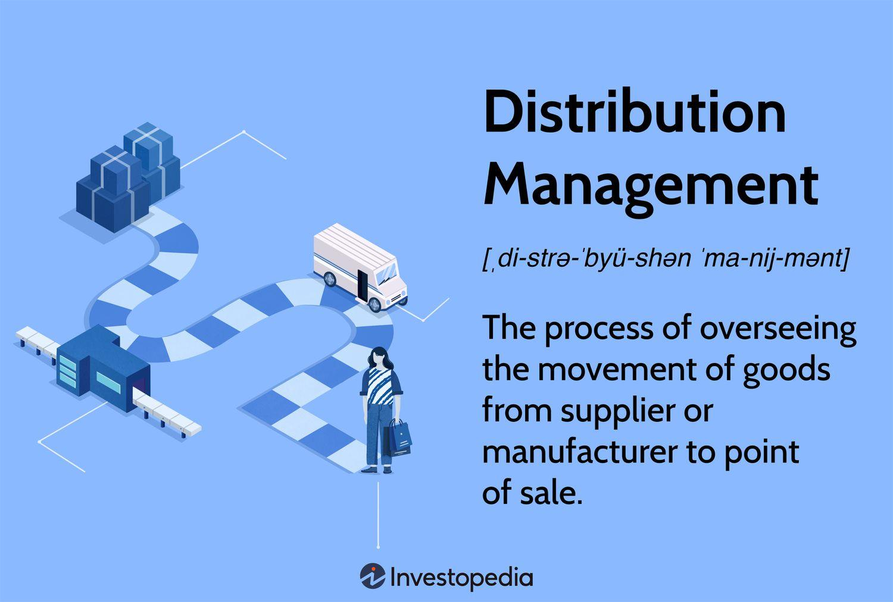

In the fast-paced world of stock trading, understanding the mechanisms behind stock sales and distribution is crucial. The stock market operates on complex dynamics where large-scale transactions can significantly impact overall market stability and individual stock prices. As such, grasping the intricacies of distribution stocks becomes essential for both individual and institutional investors aiming to navigate this environment effectively.

Distribution stocks refer to the strategic sale of large blocks of securities, executed primarily by institutional investors and hedge funds. This process not only helps in achieving liquidity without causing abrupt price declines but also maintains market equilibrium. Algorithmic trading plays an increasing role in this strategy, allowing high-frequency and high-volume transactions to be completed efficiently without human intervention. Algorithms enable traders to execute trades at optimal price levels by analyzing vast datasets and adjusting strategies in real-time based on market conditions.

A critical aspect of stock distribution is the concept of distribution days. These are specific trading days characterized by a decline in major stock market indexes accompanied by higher trading volume than the previous day. A series of distribution days can often signal an impending market downturn, providing vital warning signs for investors. Thus, understanding and identifying distribution days are crucial for interpreting market trends and making informed investment decisions.

Moreover, institutional investors employ sophisticated techniques to manage their extensive holdings. Such techniques include the use of dark pools—private exchanges designed to facilitate orders that are not transparent to the public—to avoid market disruption during significant transactions. Algorithmic trading's integration further ensures secrecy and efficiency, mitigating the risks associated with large-scale stock shifts.

As technology continues to advance, the intersection of algo trading with large-scale stock transactions is expected to grow, offering enhanced precision and reduced transaction costs. Investors and traders must familiarize themselves with these technological tools and strategies to remain competitive. As the stock market evolves, staying informed about these processes is essential for capitalizing on investment opportunities and minimizing risks.

## Table of Contents

## Understanding Distribution Stocks

Distribution stocks involve the strategic sale of large blocks of securities to the market, typically orchestrated by institutional investors with precision to mitigate severe price impacts. This process is integral to the maintenance of market stability and the protection of asset values.

Institutional investors, such as mutual funds, pension funds, and insurance companies, often hold substantial quantities of stocks. When these entities decide to reduce their holdings, indiscriminate or rapid selling can lead to sharp decreases in stock prices due to sudden supply influx, potentially triggering wider market [volatility](/wiki/volatility-trading-strategies). Thus, distribution must occur in a measured manner, usually over extended periods, to avert these risks.

The distinction between distribution and accumulation is fundamental for understanding market dynamics. Accumulation pertains to a phase where securities are being purchased, often quietly, leading to price stabilization or gradual appreciation. Conversely, during distribution phases, securities are being sold off, potentially placing downward pressure on prices. This shift from buying to selling can indicate changing perceptions of a stock's value or broader market trends, often discerned through technical analysis and trading volumes.

Market makers play a pivotal role during distribution phases. These entities provide [liquidity](/wiki/liquidity-risk-premium) to the market, helping to place buy and sell orders efficiently by pricing securities at levels that facilitate smoother transactions. Market makers aim to maintain market equilibrium by balancing order flows, which can soften the impact of large-scale distribution on stock prices. Their activities ensure that the stock remains attractive and tradable, preserving market confidence.

The response of individual traders to distribution phases can significantly differ from institutional actions. While institutions may follow strategic, algorithm-driven plans for distribution, individual traders often react to visible price movements and news, sometimes lacking the comprehensive data insight available to large investors. Retail traders tend to be more susceptible to emotional decision-making, which can exacerbate price swings during distribution periods as they buy or sell in response to short-term market conditions.

Understanding the nuanced process of stock distribution, especially the roles of key market participants, allows traders and investors to better navigate potential market shifts. It emphasizes the importance of strategic planning and informed decision-making in managing large holdings, ensuring market stability and optimal investment outcomes.

## The Mechanics of Stock Distribution

The mechanics of stock distribution involve a set of sophisticated strategies designed to manage how large blocks of stocks are sold in the market without creating substantial price disruptions. Institutional investors, such as mutual funds and pension plans, typically control significant volumes of shares, necessitating methods that preserve market stability while achieving desired liquidation or rebalancing of portfolios. 

Algorithmic selling and dark pools are primary tools for institutional investors in this context. Algorithms, or "algos," are sets of instructions processed by computers to automate trading activities. They enable large transactions to be divided into smaller ones and executed over intervals that can disguise the full [volume](/wiki/volume-trading-strategy) of trades. This is crucial in preventing a decrease in stock prices, which might occur if the market perceives a large sell-off. Additionally, dark pools, or private exchange systems, allow institutional investors to execute large trades outside of public exchanges, thus maintaining anonymity and mitigating market impact.

Timing is fundamental in stock distribution, as it helps maintain optimal price levels. Institutional investors assess market conditions meticulously, taking into consideration factors such as trading volumes, current price trends, and competitor actions. This analysis supports identifying opportune moments to execute trades, ensuring that the distribution does not contribute to adverse price movements. For instance, trades might be executed when market liquidity is high, reducing the potential for significant price fluctuations.

Strategic execution is another critical aspect, where investors aim to manage market perception to avoid signaling large dumps. This involves concealing the total size of sell orders through techniques such as iceberg orders, where only a small portion of the entire order is visible to the market at a given time. Additionally, using a variety of trading venues and intermediaries, investors can distribute trades across different platforms, further dispersing visibility and impact.

Prominent institutions have demonstrated effective stock distribution through various case studies. A classic example involves instances where a large mutual fund rebalances its holdings. Utilizing [algorithmic trading](/wiki/algorithmic-trading), the fund systematically sells excess shares while buying others, aligning with its strategic objectives without causing significant market ripples. Another example is an investment bank deploying a trading desk specializing in large block trades, which uses historical market data and predictive analysis to optimize trade execution timing.

These strategies together underscore the intricate process of stock distribution, showcasing how institutional entities navigate the complexities of large-scale stock sales. As technology advances, the methods employed in these mechanisms continue to evolve, further enhancing the efficiency and effectiveness of stock distribution.

## Distribution Days and Market Impact

A distribution day is a key concept in stock market analysis, denoting a trading session characterized by a significant decline in major stock indexes accompanied by higher-than-average trading volume. This phenomenon occurs when institutional investors, such as mutual funds and hedge funds, sell substantial amounts of stock, thereby exerting downward pressure on prices. Distribution days are a critical signal used by traders to gauge potential market trends and future movements.

When a series of distribution days occur over a short period, it often signals that the market is approaching a peak or is on the verge of a downturn. This accumulation of distribution days suggests that institutional investors are unloading significant volumes of stock, potentially anticipating a market correction or a bearish phase. A common rule of thumb among market analysts is that four or more distribution days within a span of two to three weeks can indicate an impending market top.

Traders interpret distribution days as warning signals due to the psychological and economic implications of large-scale selling by institutional players. When these investors start offloading stocks, it indicates a lack of confidence in the market's short-term performance, prompting other investors to consider defensive strategies. This might involve lightening up on positions, adopting hedging techniques, or reallocating portfolios to more defensive assets.

Volatility and volume patterns associated with distribution days are critical in understanding the market impact. High volume during these sessions indicates significant selling pressure, which can exacerbate market volatility. The interaction of these two factors not only affects individual stock prices but can also amplify movements in major indexes. For example, an index experiencing consecutive distribution days may see increased volatility as traders react to market signals and adjust their positions accordingly.

The broader market impact of distribution days is particularly evident in major indexes, such as the S&P 500 or the NASDAQ Composite. When these indexes register distribution days, it reflects a collective reduction in market confidence, influencing both retail and institutional traders. A pattern of distribution days can lead to increased bearish sentiment, causing widespread adjustments in investment strategies and potentially leading to a sustained downturn.

In summary, distribution days serve as a vital barometer for assessing investor sentiment and potential market shifts. By analyzing the frequency and pattern of these days, traders can infer the market's current phase and anticipate future movements, enabling them to make informed decisions and align their investment strategies with evolving market conditions.

## Role of Algorithmic Trading in Stock Sales

Algorithmic trading has revolutionized the landscape of stock sales by enhancing efficiency and precision. One of the main advantages of algorithmic trading is its ability to execute trades with complexity and flexibility, free from human emotional biases. Algorithms are specifically designed to handle large volumes of data, rapidly analyze market conditions, and make split-second trading decisions. This capability is especially beneficial for institutional investors who need to manage substantial stock positions while minimizing market impact.

Several algorithmic strategies employed in stock trading include Volume-Weighted Average Price (VWAP), Time-Weighted Average Price (TWAP), and Percent of Volume (POV). Each of these strategies serves specific purposes:

1. **VWAP** is used to execute orders based on the average price of a stock over a specific time period, weighted by volume. This approach ensures that the executed price is close to the average market price, reducing the risk of buying at inflated prices or selling too low.
$$
   \text{VWAP} = \frac{\sum \text{(Price}_i \times \text{Volume}_i\text{)}}{\sum \text{Volume}_i}

$$
   where $\text{Price}_i$ and $\text{Volume}_i$ are the price and volume at time point $i$.

2. **TWAP** splits large orders into smaller equal-sized trades over a pre-specified time. This strategy is less sensitive to volume fluctuations and is ideal for executing orders over stable market periods.

3. **POV** strategy adjusts the size of trade executions to match a pre-determined percentage of the market volume at any given time. This ensures that the strategy adapts to changing market conditions, which helps in maintaining a low profile during the execution process.

**Pros and Cons of Algorithmic Trading**

Pros:
- **Efficiency:** Algorithms can process large data sets rapidly and identify trading opportunities that might be missed by human traders.
- **Execution speed and precision:** With the ability to react in microseconds, algorithms significantly enhance execution precision.
- **Reduced market impact:** By breaking up large orders and executing them strategically, algorithms can minimize the price impact.
- **Consistent execution:** Algorithms execute trades following strict rules, ensuring consistency.

Cons:
- **Overreliance on technology:** Systems failures or bugs can disrupt trading operations.
- **Market anomalies:** Algorithms may contribute to market volatility due to their speed and volume, as seen in flash crashes.
- **Limited flexibility in unpredictable situations:** Algorithms might not adapt well to unforeseen market events if not properly designed.

The role of algorithmic trading extends into enhancing liquidity and reducing market volatility. By improving the precision and efficiency of trade executions, algorithms contribute to smoother market operations. They provide liquidity by continuously engaging with the market, helping facilitate trades even during low-volume periods. However, the influence of algorithmic trading on market volatility can be double-edged. While it generally aids in tightening spreads and providing liquidity, aggressive algorithmic trading strategies can exacerbate volatility, especially during market stress or uncertainty.

Overall, algorithmic trading has become an indispensable tool for managing large institutional stock sales. Its capacity to leverage advanced strategies, improve liquidity, and ensure efficient execution makes it a compelling option for modern trading activities. Nonetheless, relying on algorithmic systems necessitates an understanding of both their potential and limitations.

## Accumulation/Distribution Indicator: A Technical Analysis Tool

The Accumulation/Distribution (A/D) indicator is a crucial tool in technical analysis used to assess the relationship between stock price and volume, providing insights into the buying and selling pressure within the market. Developed by Marc Chaikin, the A/D indicator helps traders identify trends by evaluating whether a stock is being accumulated (bought) or distributed (sold) over a period. This indicator is particularly valuable in understanding market sentiment during distribution phases, where large institutional investors might be discreetly offloading stocks.

Traders utilize the A/D indicator to discern trends in buying and selling activities by tracking the movement of the A/D line in conjunction with price movements. An upward sloping A/D line indicates accumulation, suggesting that buying pressure is dominant, whereas a downward sloping line points to distribution, signifying selling pressure. The effectiveness of the A/D line lies in its ability to reveal divergences between volume flow and price action, which can preempt price reversals.

The A/D line is calculated using the following formula:
$$
A/D_t = A/D_{t-1} + \left( \frac{(C_t - L_t) - (H_t - C_t)}{H_t - L_t} \right) \times V_t
$$
where:
- $A/D_t$ is the current A/D value.
- $C_t$, $H_t$, and $L_t$ are the closing, high, and low prices of the period, respectively.
- $V_t$ is the volume of the period.

This formula captures the concept that if the close is near the high, accumulation is occurring, whereas if it is near the low, distribution is likely occurring.

In practical applications, traders use the A/D indicator to make informed decisions regarding stock accumulation or distribution by observing how the indicator behaves relative to price movements. For example, if a stock's price is declining while the A/D line is rising, it may suggest underlying accumulation and a potential bullish reversal. Conversely, if the price is rising but the A/D line is falling, it may hint at distribution and a bearish turning point.

There are notable case examples where the A/D indicator has provided early warning signs for investors. For instance, during a prolonged uptrend, if the A/D line starts to diverge by trending downwards while the stock's price continues to rise, it may alert traders to possible distribution activities preceding a downturn. Such divergences have historically served as precursors to significant price corrections.

Overall, the Accumulation/Distribution indicator stands as a valuable analytical tool, assisting traders in interpreting market dynamics and sentiment, ultimately aiding in the strategic planning of investment decisions.

## Conclusion and Future Perspectives

In conclusion, understanding distribution stocks and the role of algorithmic trading is paramount for navigating modern financial markets effectively. Distribution stocks involve the strategic sale of large security blocks, primarily by institutional investors aiming to minimize market disruption and price volatility. Algorithmic trading has revolutionized this process by providing tools for precise execution, using strategies like Volume Weighted Average Price (VWAP) and Time Weighted Average Price (TWAP) to optimize trade timings and volumes without human emotional biases. This interplay between distribution strategies and algorithmic trading creates a more fluid and less volatile market environment that benefits both buyers and sellers.

Traders and investors can leverage this knowledge to enhance their strategic investment plans. Understanding the mechanics of stock distribution can inform decisions on timing market entries and exits, especially by observing distribution days that may signal market tops or downturns. Algorithmic trading's efficiency allows traders to customize their strategies further, incorporating automation to seize fleeting market opportunities and mitigating risks associated with large-volume trades.

Looking ahead, the future trends in stock distribution methods and algorithmic trading promise further innovations. As [artificial intelligence](/wiki/ai-artificial-intelligence) and [machine learning](/wiki/machine-learning) algorithms develop, they are expected to provide even more sophisticated trading strategies that adapt to complex market dynamics. Blockchain technology could also play a role, ensuring greater transparency and security in transactions, which could redefine stock distribution's operational aspects.

The technological landscape of trading platforms is evolving rapidly. New tools that integrate real-time data analytics, predictive modeling, and advanced algorithms are becoming more accessible to retail investors, leveling the playing field with institutional players. The ease of use and accessibility of these platforms mean that traders must continuously educate themselves and adapt to these new technologies to maintain a competitive edge.

In summary, a comprehensive understanding of distribution stocks, coupled with an adept use of algorithmic trading strategies, is essential for future-proofing one's investment approach. As market conditions and technologies evolve, ongoing education and adaptability will remain crucial for investors and traders aiming to optimize their performance in an increasingly sophisticated financial landscape.

## References & Further Reading

[1]: Bergstra, J., Bardenet, R., Bengio, Y., & Kégl, B. (2011). ["Algorithms for Hyper-Parameter Optimization."](https://papers.nips.cc/paper/4443-algorithms-for-hyper-parameter-optimization) Advances in Neural Information Processing Systems 24.

[2]: ["Advances in Financial Machine Learning"](https://www.amazon.com/Advances-Financial-Machine-Learning-Marcos/dp/1119482089) by Marcos Lopez de Prado

[3]: ["Evidence-Based Technical Analysis: Applying the Scientific Method and Statistical Inference to Trading Signals"](https://www.amazon.com/Evidence-Based-Technical-Analysis-Scientific-Statistical/dp/0470008741) by David Aronson

[4]: ["Machine Learning for Algorithmic Trading"](https://github.com/stefan-jansen/machine-learning-for-trading) by Stefan Jansen

[5]: ["Quantitative Trading: How to Build Your Own Algorithmic Trading Business"](https://www.amazon.com/Quantitative-Trading-Build-Algorithmic-Business/dp/1119800064) by Ernest P. Chan