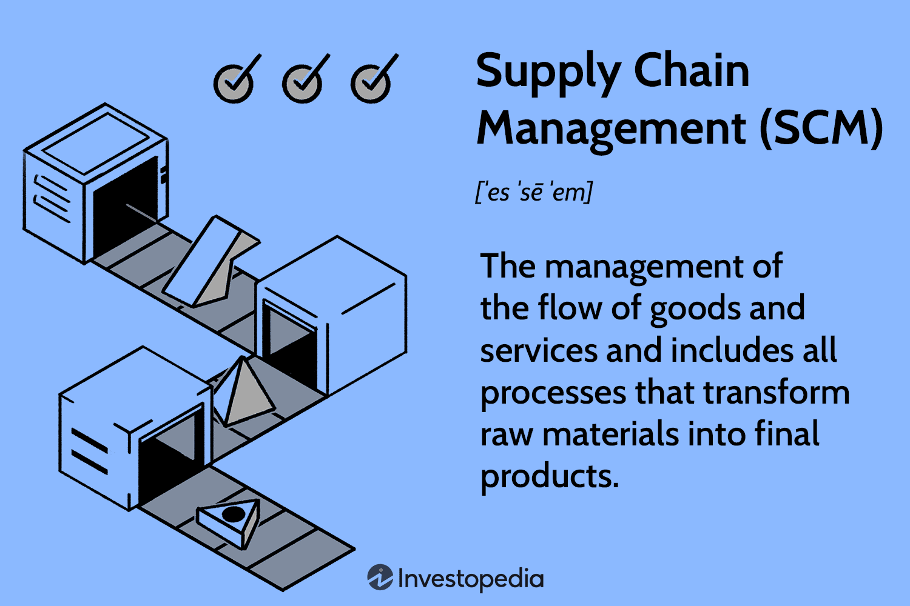

Syndicate distribution, logistics, and algorithmic trading are fundamental components within today’s dynamic financial markets. The intersection of these areas allows for the proficient handling and execution of large-scale trades, capitalizing on advancements in technology to boost profitability and mitigate risks. This narrative explores the essential relationship between syndicate distribution and algorithmic trading, particularly highlighting the logistics involved in ensuring seamless operations and successful execution of trades.

The rapid pace of evolution in financial technologies compels a reexamination and overhaul of traditional distribution and trading paradigms. Market players are faced with the imperative to adapt these contemporary methodologies or risk becoming obsolete. Algorithmic trading has significantly transformed market operations by deploying complex algorithms capable of making instantaneous decisions at speeds that surpass human capability. These algorithms analyze vast datasets to identify trading opportunities quickly and execute trades with precision and efficiency. In contrast, syndicate distribution plays a critical role in the Initial Public Offering (IPO) process, ensuring comprehensive distribution of new securities to a wide range of investors and fostering broad market participation.



By exploring how these components integrate, we set the foundation for understanding current trading frameworks and pave the way for future innovations. This exploration will illuminate the transformative potential of integrating syndicate distribution logistics with algorithmic trading, providing insights into their implications for financial markets.

Ultimately, the convergence of logistics, syndicate distribution, and algorithmic trading signals a paradigmatic shift in financial markets, offering numerous advantages such as heightened efficiency, reduced operational risks, and favorable economic outcomes. As we navigate through this article, we aim to unravel the substantial impact of these integrated systems and propose a vision of their continuing evolution in the financial industry.

## Table of Contents

## Understanding Syndicate Distribution

Syndicate distribution is a pivotal process in the issuance of new stock offerings, primarily conducted through an Initial Public Offering (IPO). This process is orchestrated by a group of investment banks that form a syndicate to collaboratively sell new securities. By sharing the financial risk and operational workload involved in launching a new security, these banks can more effectively introduce substantial offerings to the market.

Investment banks collaborate within a syndicate to ensure that new securities are adequately distributed across a broad spectrum of investors. This strategic dissemination is vital not only to stimulate market interest but also to preserve price stability during the initial phases of trading. By dispersing the risk and effort, each participating bank in the syndicate can leverage its network of clients, while also benefiting from the collective reach of the syndicate. Consequently, securities can be more evenly distributed, reducing the likelihood of price [volatility](/wiki/volatility-trading-strategies) and enhancing the offering's market reception.

For smaller banks, participation in a syndicate is particularly advantageous as it grants them access to deals that would otherwise be beyond their individual reach. This involvement not only amplifies their market presence but also expands their client base. Through syndication, these banks can partake in lucrative opportunities, thereby increasing their profitability and strengthening their position in the financial market.

The distribution process is crucial for the success of IPOs. It significantly influences the initial reception of the new securities in the market, setting a foundation for their future valuations. An effective syndicate distribution strategy ensures that securities are appropriately priced and placed, promoting investor confidence and engagement. The initial allocation and dissemination are, therefore, vital in shaping investor perceptions and establishing a favorable market trajectory for the securities.

In summary, syndicate distribution is integral to primary market operations. It aligns the interests of issuers with those of investors by facilitating a structured and strategic approach to the entry of new securities. This collaborative framework not only mitigates risk but also maximizes the potential for successful market integration, underscoring its fundamental role in financial markets.

## Logistics in Syndicate Distribution

Effective logistics management is crucial for successful syndicate distribution, as it involves the coordination of complex operations under varying market conditions. This coordination ensures the timely and efficient allocation of securities among syndicate members, adhering to regulatory requirements and managing investor communications effectively.

A critical component of syndicate logistics is managing the allocation of securities. This involves distributing the shares or bonds among syndicate members, each responsible for selling a portion to institutional or retail investors. It requires meticulous planning to ensure that all members receive an appropriate allocation that aligns with their market reach and investor demand, thus maximizing the syndicate's overall effectiveness.

Adherence to regulatory requirements is another essential facet of syndicate logistics. Regulatory bodies impose various rules to ensure fair play and transparency in financial markets, especially during Initial Public Offerings (IPOs). Syndicate managers must ensure compliance with these regulations to avoid legal repercussions and maintain market integrity.

Communication strategies are vital for managing investor interest, especially when launching a new security. A well-coordinated communication plan helps maintain investor enthusiasm and confidence, facilitating a smoother transition from initial offering to active trading. This involves crafting clear, consistent messages about the offering, its value proposition, and the associated risks.

The integration of advanced technologies enhances logistical efficiency by enabling real-time data sharing and decision-making. Technologies such as blockchain can offer secure and transparent transaction records, while specialized software applications provide platforms for real-time collaboration and strategic adjustments among syndicate members.

Efficient logistics not only allows for quick adaptation to changes in market conditions but also optimizes distribution strategies to enhance execution speed and market responsiveness. In competitive markets, precision and efficiency in distribution operations are key differentiators among syndicate partners. Robust logistical frameworks streamline processes, reduce delays, and strengthen overall market competitiveness. The use of data analytics and AI can improve forecasting accuracy, helping syndicates anticipate market movements and adjust strategies proactively.

In conclusion, effective logistics in syndicate distribution is fundamental to ensuring the successful launch and stabilization of new securities in the financial market. By prioritizing precision, compliance, and communication, alongside embracing technological advancements, syndicates can achieve a competitive edge in the distribution process.

## Algorithmic Trading: A Game Changer

Algorithmic trading, commonly referred to as algo trading, utilizes sophisticated algorithms to facilitate the execution of trades based on predefined criteria. These algorithms enable transactions at speeds and volumes that surpass human capability, thereby revolutionizing the financial sector. Key to the success of [algorithmic trading](/wiki/algorithmic-trading) is its efficiency in processing large quantities of market data rapidly, pinpointing trading opportunities, and executing trades instantaneously. This level of speed and precision significantly reduces human involvement, minimizing the latency associated with manual trading processes.

High-frequency trading ([HFT](/wiki/high-frequency-trading-strategies)) represents a specialized area within algorithmic trading. It exploits low-latency networks to capture minute price discrepancies that manifest in milliseconds across large trading volumes. This method of trading has exponentially increased the scale of market activity, with firms investing heavily in technological infrastructure to support HFT operations. The success of HFT hinges on the ability to execute a high [volume](/wiki/volume-trading-strategy) of trades at minimal time intervals, necessitating advanced technologies that ensure minimal propagation delays and optimal data throughput.

Algorithmic trading strategies range in complexity from straightforward techniques, such as simple moving averages, to advanced methodologies involving [machine learning](/wiki/machine-learning) models. These models are capable of evolving with market conditions, identifying patterns and adapting their strategies accordingly. This adaptability is crucial in navigating the dynamic landscape of financial markets. An example of a simple algorithmic trading strategy in Python could be:

```python
import pandas as pd

def simple_moving_average_strategy(data, short_window=40, long_window=100):
    signals = pd.DataFrame(index=data.index)
    signals['price'] = data['Close']
    signals['short_ma'] = data['Close'].rolling(window=short_window, min_periods=1).mean()
    signals['long_ma'] = data['Close'].rolling(window=long_window, min_periods=1).mean()

    signals['signal'] = 0.0
    signals['signal'][short_window:] = np.where(signals['short_ma'][short_window:] > signals['long_ma'][short_window:], 1.0, 0.0)
    signals['positions'] = signals['signal'].diff()

    return signals
```

The deployment of these strategies requires a robust technological foundation, comprising state-of-the-art server colocation facilities and the ability to swiftly adjust algorithms to remain effective. This infrastructure is vital in maintaining the efficacy and competitiveness of trading strategies under rapidly changing market conditions. As the complexity of financial markets increases, algorithmic trading continues to evolve, changing the landscape of market operations and establishing new standards for trade execution. This ongoing innovation reflects a broader shift toward automated, data-driven practices that enhance the fluidity and efficiency of markets globally.

## Integrating Logistics with Algorithmic Trading

Merging logistics from syndicate distributions with algorithmic trading frameworks leads to significant enhancements in the securities distribution process. This fusion leverages real-time data analytics to boost the efficiency of logistical operations and empower algorithms to execute more informed trading decisions. The availability of instantaneous data allows for the rapid adjustment of execution strategies, optimizing outcomes in dynamic market environments.

Innovative technologies such as blockchain offer substantial promise in streamlining logistical tasks. Blockchain can provide a secure, transparent, and immutable record of transactions, which is crucial for building trust in capital markets. This ledger technology ensures that each step in the distribution process is accurately documented and easily verifiable, reducing the chance of errors and fraud.

Integrating logistics data into trading algorithms allows financial entities to better anticipate market movements, offering a competitive edge. With access to comprehensive logistical datasets, algorithms can identify patterns and predict trends with higher reliability. This heightened predictive capability enables more strategic decision-making, reducing risks and enhancing profitability.

Artificial intelligence (AI) and machine learning are increasingly pivotal in refining the integration of logistics and trading systems. These technologies enable algorithms to dynamically adapt based on logistical data inputs. For example, machine learning models can continuously optimize trade placement strategies by learning from evolving market conditions and logistics patterns, ensuring that trades are executed at the most opportune times.

This convergence of logistics and algorithmic trading not only improves current market practices but also paves the way for future advancements in financial technology. As these integrations become more sophisticated, they are expected to set new standards for efficiency, accuracy, and security in securities trading, fostering a more resilient and competitive financial market landscape.

## Challenges and Considerations

Integrating syndicate logistics with algorithmic trading indeed presents substantial opportunities for enhancing operational efficiencies in financial markets. However, this integration also introduces several challenges that require careful management and strategic planning to ensure seamless operations and to maximize the potential benefits.

Latency concerns are paramount. The integration requires synchronous operations across diverse systems, necessitating ultra-fast data processing capabilities to maintain trading competitiveness. Any delay in data transfer can result in significant financial losses, especially in high-frequency trading environments where trades are executed in milliseconds. It is essential to invest in advanced networking infrastructure and low-latency communication technologies to mitigate these concerns effectively.

Cybersecurity threats pose significant risks to the integrated system. As financial markets become increasingly data-intensive, the protection of sensitive information becomes critical. Robust security protocols are imperative to safeguard against malicious attacks which could lead to data breaches, financial theft, and severe reputational damage. Implementing multi-layered security strategies, including encryption, intrusion detection systems, and regular security audits, can help in fortifying the overall system integrity.

Regulatory compliance represents another formidable challenge. Financial regulations differ widely across jurisdictions, adding complexity to cross-border operations. Companies must navigate these discrepancies carefully to avoid legal penalties. This necessitates a thorough understanding of international regulatory frameworks and potentially the deployment of compliance management systems that ensure adherence to relevant laws while facilitating smooth global operations.

Scalability remains a crucial [factor](/wiki/factor-investing) as trading volumes grow and computational algorithms become more sophisticated. The integration should be flexible and scalable to accommodate increasing demands without compromising performance. Leveraging cloud-based solutions can provide the necessary scalability, offering elastic computing resources that can be adjusted as per the need.

Addressing these challenges with innovative solutions is essential to ensure that logistics and trading technologies work synergistically rather than hinder operations. This requires continuous investment in technology development and infrastructure enhancement, alongside adaptive strategic management to respond effectively to emerging challenges. By opening pathways for continuous improvement and resilience, financial markets can harness technological advancements to achieve enhanced efficiency and secure a competitive edge in the global trading environment.

## Future Trends

Looking ahead, several technological trends are poised to significantly influence the landscape of syndicate distribution logistics and algorithmic trading. Quantum computing is one of the most promising developments, with the potential to revolutionize market operations by addressing computational challenges that are currently beyond the capabilities of classical computing systems. Its ability to process vast datasets and solve complex optimization problems can lead to unprecedented advancements in trade execution and risk management.

Another pivotal trend is the ongoing evolution of machine learning technologies. These innovations are set to produce more sophisticated trading algorithms capable of real-time learning and adaptation. By employing advanced techniques such as deep [reinforcement learning](/wiki/reinforcement-learning), trading systems can enhance decision accuracy by continuously improving their strategies in response to evolving market conditions.

Blockchain technology is also expected to play a transformative role, specifically in the areas of record-keeping and data integrity. Its decentralized and tamper-proof nature offers enhanced transparency and efficiency in trade settlements. This technology can facilitate seamless, secure transactions, reducing the need for intermediaries and minimizing the risks associated with traditional settlement processes.

Furthermore, [artificial intelligence](/wiki/ai-artificial-intelligence) is anticipated to expand its role in automating various aspects of trading and logistics. AI-driven automation has the potential to streamline operations and lower operational costs significantly. Intelligent systems can efficiently manage logistics tasks such as inventory management, routing, and demand forecasting, improving overall efficiency.

As these technologies mature, their cohesive adoption will likely redefine traditional market paradigms. A synergistic integration of quantum computing, machine learning, blockchain, and AI will provide enhanced efficiency, scalability, and security across financial markets. Firms that strategically embrace these advancements stand to gain a competitive edge by optimizing their operational frameworks and offering superior services to their clients.

## Conclusion

The integration of syndicate distribution logistics with algorithmic trading presents substantial opportunities for enhancing the operational efficiencies of financial markets. As technological advancements continue, the potential to revolutionize securities distribution and trading becomes more evident. By leveraging the strengths of both domains, market participants can achieve faster, more reliable, and secure trade executions, maintaining competitive positions in a rapidly evolving marketplace.

Algorithmic trading enables the execution of large volumes of trades with precision and speed undetectable by traditional methods. This capability is crucial in the context of syndicate distribution, where the efficient allocation and execution of securities profoundly impact market success. The edge provided by algorithmic trading is further enhanced by integrating sophisticated logistic frameworks, ensuring that supply chain variables are optimized to support the trading algorithms.

It is essential for entities within the financial sector to adopt these innovative approaches, constantly optimizing their organizational infrastructures to align with future advancements. This proactive adjustment not only ensures competitiveness but also anticipates the dynamic nature of financial markets. The synergy between distribution logistics and trading algorithms promises to redefine market operations, heralding unprecedented efficiency and market depth.

Strategically embracing these changes allows the financial industry to unlock new potentials, introducing a new era of trading dynamics where technological leadership and precision are paramount. This evolution, characterized by seamless integration and advanced data analytics, will likely set new standards for operational efficiency and market responsiveness. Thus, financial entities must ensure robust infrastructures equipped to harness these technological advancements, paving the way for continued innovation and sustained market relevance.

## References & Further Reading

[1]: Bergstra, J., Bardenet, R., Bengio, Y., & Kégl, B. (2011). ["Algorithms for Hyper-Parameter Optimization."](https://dl.acm.org/doi/10.5555/2986459.2986743) Advances in Neural Information Processing Systems 24.

[2]: ["Advances in Financial Machine Learning"](https://www.amazon.com/Advances-Financial-Machine-Learning-Marcos/dp/1119482089) by Marcos Lopez de Prado

[3]: ["Evidence-Based Technical Analysis: Applying the Scientific Method and Statistical Inference to Trading Signals"](https://www.amazon.com/Evidence-Based-Technical-Analysis-Scientific-Statistical/dp/0470008741) by David Aronson

[4]: ["Machine Learning for Algorithmic Trading"](https://github.com/stefan-jansen/machine-learning-for-trading) by Stefan Jansen

[5]: ["Quantitative Trading: How to Build Your Own Algorithmic Trading Business"](https://www.amazon.com/Quantitative-Trading-Build-Algorithmic-Business/dp/1119800064) by Ernest P. Chan