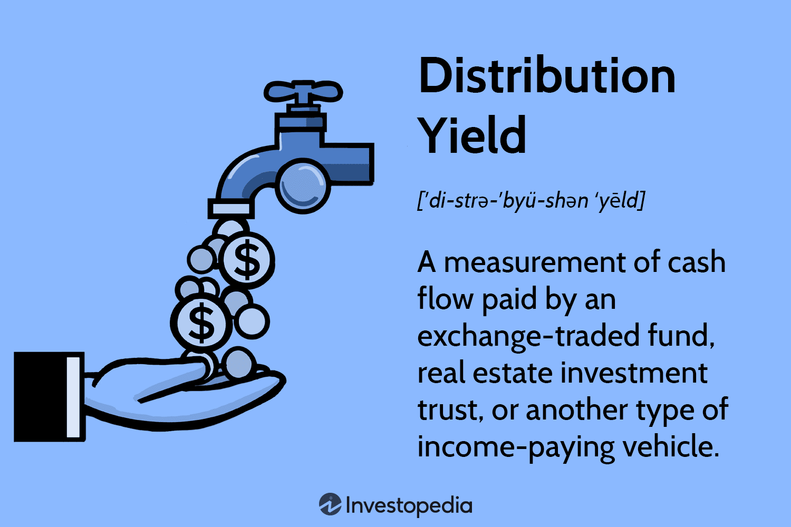

## Table of Contents

## What is distribution yield?

Distribution yield is a way to measure how much money you can expect to earn from an investment over a year, based on the distributions it pays out. Distributions can be things like dividends from stocks or interest from bonds. The yield is calculated by taking the total distributions paid out over the past year and dividing it by the current price of the investment. This gives you a percentage that shows how much income the investment generates relative to its price.

For example, if a stock pays out $2 in dividends over the past year and its current price is $40, the distribution yield would be 5% ($2 divided by $40). This means if you own the stock, you can expect to earn 5% of its value in dividends each year. Distribution yield is useful for investors who want to know how much income they can expect from their investments, especially if they rely on that income for living expenses.

## How is distribution yield different from dividend yield?

Distribution yield and dividend yield are similar because they both tell you how much money you can get from an investment each year. But they are not exactly the same. Dividend yield only looks at the dividends that a company pays out to its shareholders. It is calculated by dividing the annual dividends by the current stock price. So, if you are looking at how much money you can get from the dividends of a stock, you use the dividend yield.

On the other hand, distribution yield is a bit broader. It includes all kinds of payouts that an investment might give you, not just dividends. This can include interest from bonds or other types of income distributions. So, when you calculate the distribution yield, you take all these different types of payouts into account and divide them by the current price of the investment. This makes distribution yield useful for a wider range of investments, not just stocks that pay dividends.

## Why is distribution yield important for investors?

Distribution yield is important for investors because it helps them understand how much money they can expect to get from their investments each year. This is especially helpful for people who need regular income from their investments, like retirees. By looking at the distribution yield, they can see if an investment will give them enough money to live on or to meet their financial goals.

Also, distribution yield is useful because it gives a complete picture of all the money an investment might pay out, not just dividends. This means it can be used for different types of investments, like bonds or real estate investment trusts (REITs), which might pay out interest or other types of income. Knowing the distribution yield helps investors compare different investments and choose the ones that will give them the best income for their money.

## What types of investments typically offer distribution yields?

Investments that typically offer distribution yields include stocks that pay dividends, bonds that pay interest, and real estate investment trusts (REITs) that distribute rental income. Dividend stocks are common in many investors' portfolios because they provide regular income from the profits a company makes. Bonds, on the other hand, are like loans that investors give to governments or companies, and in return, they get interest payments. REITs own and operate properties, and they must pay out most of their taxable income as dividends to shareholders.

These types of investments are popular with people who want a steady stream of income. For example, retirees often look for investments with good distribution yields to help them live off their savings. By choosing investments that offer high distribution yields, they can make sure they have enough money coming in regularly to cover their expenses.

## How do you calculate the distribution yield of an investment?

To calculate the distribution yield of an investment, you need to know two things: the total amount of money the investment paid out over the last year, and the current price of the investment. The total payout can include dividends from stocks, interest from bonds, or other types of income distributions. Once you have these numbers, you divide the total payout by the current price of the investment. Then, you multiply the result by 100 to turn it into a percentage. This percentage is the distribution yield.

For example, if a stock paid out $2 in dividends over the last year and its current price is $40, you would calculate the distribution yield like this: $2 divided by $40 equals 0.05. Multiply 0.05 by 100 to get a distribution yield of 5%. This means that if you own this stock, you can expect to earn 5% of its value in dividends each year. Knowing the distribution yield helps investors understand how much income they can expect from their investments and compare different investment options.

## What factors can affect the distribution yield of a fund or stock?

Several things can change the distribution yield of a fund or stock. One big [factor](/wiki/factor-investing) is the price of the investment. If the price goes up, the yield goes down because the same amount of money is spread over a bigger number. If the price goes down, the yield goes up because the same amount of money is now a bigger part of a smaller number. Another thing that affects the yield is how much money the company or fund decides to pay out. If they pay out more, the yield goes up. If they pay out less, the yield goes down.

Changes in the economy can also affect distribution yields. When the economy is doing well, companies might make more money and pay out more to investors, which can increase the yield. But if the economy is not doing well, companies might cut back on what they pay out, which can lower the yield. Interest rates can also play a role. When interest rates go up, the cost of borrowing money goes up, which can affect how much companies can afford to pay out. When interest rates go down, borrowing money becomes cheaper, and companies might be able to pay out more. All these things together can make the distribution yield of a fund or stock go up or down.

## Can distribution yield change over time, and if so, why?

Yes, distribution yield can change over time. This happens because the price of the investment can go up or down. If the price of the investment goes up, the same amount of money paid out each year becomes a smaller part of the total price, so the yield goes down. If the price goes down, the same amount of money becomes a bigger part of the total price, so the yield goes up. Also, the amount of money the company or fund pays out can change. If they decide to pay out more money, the yield goes up. If they pay out less, the yield goes down.

The economy can also affect the distribution yield. When the economy is doing well, companies might make more money and decide to pay out more to investors, which can increase the yield. But if the economy is not doing well, companies might cut back on what they pay out, which can lower the yield. Interest rates are another factor. When interest rates go up, it costs more for companies to borrow money, which can affect how much they can afford to pay out. When interest rates go down, borrowing money becomes cheaper, and companies might be able to pay out more. All these things together can make the distribution yield change over time.

## How does reinvestment of distributions impact the yield?

When you get money from your investments, like dividends or interest, you can choose to take that money out or put it back into the investment. If you decide to put it back in, this is called reinvestment. Reinvesting can change the distribution yield over time. At first, the yield stays the same because the amount of money you get each year doesn't change right away. But as you keep putting the money back into the investment, you end up owning more of it. This can make the total amount of money you get each year go up because you have more shares or units paying out.

Over time, if the price of the investment stays the same or goes up, the distribution yield might go down. This happens because even though you're getting more money each year, it's now spread over a bigger total value of your investment. But if the price of the investment goes down, the yield might go up because the same amount of money is now a bigger part of a smaller total value. So, reinvesting can affect the yield in different ways depending on how the price of the investment changes.

## What are the tax implications of receiving distributions?

When you get money from your investments, like dividends or interest, you usually have to pay taxes on it. This money is called a distribution, and the tax you pay depends on where you live and what type of investment you have. For example, in the United States, dividends from stocks can be taxed at a lower rate than your regular income if they are qualified dividends. But if they are not qualified, they are taxed at your normal income tax rate. Interest from bonds is usually taxed as regular income, but some bonds, like municipal bonds, might be tax-free at the federal level.

Reinvesting your distributions can also affect your taxes. Even if you put the money back into the investment instead of taking it out, you still have to pay taxes on it in the year you get it. This means you might have to pay taxes on money you didn't actually use. It's a good idea to talk to a tax professional to understand how distributions will affect your taxes and how to plan for them. They can help you figure out the best way to handle your investments and taxes.

## How can distribution yield be used to compare different investment options?

Distribution yield is a helpful tool for comparing different investment options because it shows you how much money each investment can give you every year. When you look at the distribution yield, you can see which investment pays out more money compared to its price. For example, if one stock has a distribution yield of 3% and another stock has a yield of 5%, the second stock gives you more money for the same amount of money you put in. This makes it easier to decide which investment will help you reach your financial goals, like getting a steady income or growing your savings.

But remember, distribution yield is just one part of the picture. You should also think about other things like how risky the investment is, how much it might grow in the future, and any fees you might have to pay. A high distribution yield might look good, but if the investment is very risky or if it doesn't grow much over time, it might not be the best choice for you. By looking at all these factors together, you can make a smarter decision about where to put your money.

## What are the limitations and potential pitfalls of relying on distribution yield for investment decisions?

Distribution yield can be a helpful way to see how much money an investment might give you each year, but it has some limits. One big problem is that it only looks at the money you get right now and doesn't think about how the investment might grow or lose value in the future. So, if you pick an investment just because it has a high distribution yield, you might miss out on other investments that could give you more money over time. Also, a high yield might mean the investment is risky. If a company is paying out a lot of money, it might be because it's not doing well and its stock price could go down, which means you could lose money.

Another thing to watch out for is that distribution yield can change. The amount of money an investment pays out can go up or down, and so can its price. If you're counting on a certain amount of money each year, you might be surprised if the yield goes down. Also, if you're reinvesting the money you get, the yield might look lower over time because you're buying more of the investment, even though you're getting more money overall. So, it's important not to just look at the distribution yield when you're deciding where to put your money. You should also think about other things like how safe the investment is, how it might grow, and any fees you might have to pay.

## How do professional investors use distribution yield in advanced portfolio strategies?

Professional investors use distribution yield as part of their advanced portfolio strategies to help them make smart choices about where to put their money. They look at the distribution yield to see how much money different investments can give them each year. This helps them pick investments that will give them a steady income, which is important for things like retirement funds or other plans where people need regular money. But they don't just look at the yield. They also think about how risky the investment is, how it might grow over time, and any fees they might have to pay. By putting all these things together, they can build a portfolio that not only gives them income but also grows their money in a safe way.

In more advanced strategies, professional investors might use distribution yield to balance their portfolios. They might choose some investments with high yields to get more income right away, and other investments with lower yields but more potential for growth. This way, they can have a mix of income and growth. They also keep an eye on how the yield changes over time because it can tell them if an investment is doing well or if it's time to sell it and buy something else. By using distribution yield along with other tools, professional investors can make their portfolios work better for their clients and meet their financial goals.

## What is Understanding Distribution Yield?

Distribution yield is an essential metric for evaluating the income potential of various investment vehicles, such as mutual funds, Exchange-Traded Funds (ETFs), and Real Estate Investment Trusts (REITs). It expresses the annual distribution as a percentage of the current market price of the investment, providing a snapshot of the income generated relative to its current valuation.

### Calculation of Distribution Yield

The distribution yield is calculated using the following formula:

$$
\text{Distribution Yield (\%)} = \left(\frac{\text{Annual Distribution per Share}}{\text{Current Market Price per Share}}\right) \times 100
$$

For example, if an [ETF](/wiki/etf-trading-strategies) distributes $2 per share annually and its current market price is $40, the distribution yield would be:

$$
\text{Distribution Yield} = \left(\frac{2}{40}\right) \times 100 = 5\%
$$

This calculation highlights the income an investor would receive from an investment based purely on its current price, without considering potential changes in the price or future capital appreciation.

### Importance of Distribution Yield

Distribution yield is crucial for assessing the cash flow potential of investments. It allows investors to compare the income generation capability of different investment options, thereby informing portfolio construction that aligns with their financial goals. This metric is particularly significant for income-focused investors, such as retirees, who may prioritize regular income streams over long-term capital gains.

By examining distribution yields, investors can evaluate an investment's ability to generate consistent income over time, which is essential for maintaining financial stability, especially in volatile markets.

### Comparison with Dividend Yield

While distribution yield and dividend yield are similar, they serve different purposes and apply to different types of investments. Dividend yield refers specifically to the income generated from dividends of stocks as a percentage of the stock's current price. It is calculated as follows:

$$
\text{Dividend Yield (\%)} = \left(\frac{\text{Annual Dividends per Share}}{\text{Current Stock Price per Share}}\right) \times 100
$$

In contrast, the distribution yield encompasses all forms of income distributed by investment vehicles, including not only dividends but also interest payments or other distributions. Therefore, while both metrics offer insights into income potential, the distribution yield provides a broader perspective for investments such as funds and REITs, where the income might not solely originate from stock dividends.

In summary, the distribution yield is an invaluable tool for understanding the income potential of diversified investments beyond traditional equities. By accurately evaluating this metric, investors can make more informed decisions, tailoring their investment strategies to meet both current income needs and long-term financial objectives.

## What is the process of yield calculation?

Yield calculation is a fundamental aspect of investment analysis, serving to estimate the expected return on an investment as a percentage of its current or original cost. Various types of yield calculations are used depending on the nature of the security and the investment goals. 

### Current Yield

The current yield is a measure that indicates the income generated by a security relative to its market price. It is a straightforward calculation typically used for bonds and is expressed by the formula:

$$
\text{Current Yield} = \frac{\text{Annual Coupon Payment}}{\text{Current Market Price}}
$$

This metric provides a snapshot of the income-producing capacity of an investment at its present market price, offering a basis for comparison with other income-generating assets.

### Yield to Maturity (YTM)

Yield to Maturity is a more comprehensive yield measure, as it accounts for all future coupon payments of a bond and the difference between its current market price and face value, assuming the bond is held until maturity. The formula for YTM is complex and typically solved through trial and error or financial calculators, but it can be estimated as:

$$
\text{YTM} = \frac{C + \frac{F - P}{n}}{\frac{F + P}{2}}
$$

where:
- $C$ is the annual coupon payment,
- $F$ is the face value of the bond,
- $P$ is the current market price,
- $n$ is the years to maturity.

YTM is particularly useful for comparing bonds with different coupon rates and term lengths.

### Yield to Call (YTC)

For callable bonds, Yield to Call is an important metric that calculates the yield of a bond if it is called before it reaches maturity. The YTC formula is similar to YTM, but the calculation period is until the call date, and instead of using the face value, it uses the call price:

$$
\text{YTC} = \frac{C + \frac{Call\ Price - P}{t}}{\frac{Call\ Price + P}{2}}
$$

where $t$ is the number of years until the call date. This metric helps investors assess the potential returns of bonds that may be redeemed by the issuer prior to their maturity date.

### Relevance of Yield Calculations

Different types of securities require specific yield calculations. For example, bonds are often evaluated using YTM and YTC because these capture the overall yield accounting for time value and call options, whereas equities might focus on the current yield to assess dividends against market [volatility](/wiki/volatility-trading-strategies). By understanding and applying these calculations, investors can compare the income potential of various securities and identify those that align best with their risk tolerance and investment objectives. These assessments play a crucial role in constructing a well-balanced portfolio, ensuring that returns are maximized in line with market conditions and personal targets.

## What is an overview of investment returns?

Investment returns represent the financial gains or losses derived from investing capital in various financial instruments over a set period. Investors evaluate these returns through multiple metrics to determine the performance of an asset or portfolio. Among the prominent metrics used are absolute returns, annualized returns, and real returns.

Absolute returns measure the total change in value of an investment, expressed as a percentage, without considering external factors like inflation. This metric offers a straightforward view of the financial performance over time. For instance, if an investment grows from $1,000 to $1,200, the absolute return is $(\frac{1200 - 1000}{1000}) \times 100 = 20\%$.

Annualized returns provide a normalized measure of returns, adjusting for varied time horizons to allow comparisons between investments over different durations. The annualized return transforms short-term returns into an annual context through the formula:

$$

\text{Annualized Return} = \left( (1 + \text{Total Return})^{\frac{1}{n}} \right) - 1 
$$

where $n$ is the number of years. This metric is valuable for comparing investments held over different periods by giving a standardized annual percentage, offering a long-term performance perspective.

Real returns adjust absolute or nominal returns to account for inflation, providing a clearer picture of the investment's increase in purchasing power. The real return can be calculated using the formula:

$$

\text{Real Return} = \frac{1 + \text{Nominal Return}}{1 + \text{Inflation Rate}} - 1 
$$

These metrics, while useful individually, gain greater insight when factored with distribution yield and yield calculations. Distribution yield, for instance, signifies the income an investor receives as a proportion of the investment's current market price. It is particularly important for assets like mutual funds, ETFs, and REITs, which may offer stable income streams. This yield forms a component of the total investment return and is critical when assessing the overall performance of income-generating securities.

Yield calculations, whether they pertain to current yield, yield to maturity, or yield to call, also play a pivotal role in evaluating investment returns. They provide investors with estimates of expected future cash flows, forming a crucial part of the decision-making process when comparing securities.

Context and consistency are paramount in evaluating these returns across diverse asset classes. Different investments bear varied risk profiles, cash flow characteristics, and market behaviors. As a result, understanding the specific metrics relevant to each class — such as the capital appreciation potential of equities or the income reliability of bonds — is crucial for accurate performance assessment. By consistently applying these evaluative measures, investors can better navigate the complexities of financial markets and optimize their investment strategies for superior outcomes.

## References & Further Reading

[1]: Bergstra, J., Bardenet, R., Bengio, Y., & Kégl, B. (2011). ["Algorithms for Hyper-Parameter Optimization."](https://papers.nips.cc/paper/4443-algorithms-for-hyper-parameter-optimization) Advances in Neural Information Processing Systems 24.

[2]: ["Advances in Financial Machine Learning"](https://www.amazon.com/Advances-Financial-Machine-Learning-Marcos/dp/1119482089) by Marcos Lopez de Prado

[3]: ["Evidence-Based Technical Analysis: Applying the Scientific Method and Statistical Inference to Trading Signals"](https://www.amazon.com/Evidence-Based-Technical-Analysis-Scientific-Statistical/dp/0470008741) by David Aronson

[4]: ["Machine Learning for Algorithmic Trading"](https://github.com/PacktPublishing/Machine-Learning-for-Algorithmic-Trading-Second-Edition) by Stefan Jansen

[5]: ["Quantitative Trading: How to Build Your Own Algorithmic Trading Business"](https://www.amazon.com/Quantitative-Trading-Build-Algorithmic-Business/dp/1119800064) by Ernest P. Chan