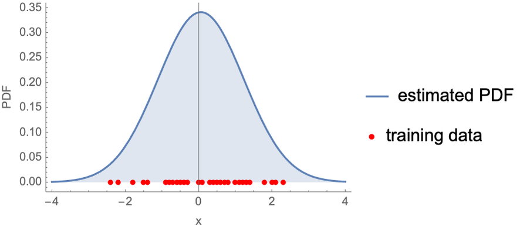

## Table of Contents

## What is a distribution in the context of machine learning?

In machine learning, a distribution refers to how data is spread out or arranged. Imagine you have a bunch of numbers, like the heights of people in a room. A distribution tells you how often each height appears. For example, if most people are around 5 feet 10 inches tall, the distribution would show a peak at that height. Distributions help us understand the patterns in our data, which is crucial for building good machine learning models.

There are many types of distributions, but some common ones include the normal distribution and the uniform distribution. The normal distribution, often called the bell curve, is symmetric and looks like a bell. It's useful because many natural phenomena, like heights or test scores, follow this pattern. The uniform distribution, on the other hand, means every value has an equal chance of occurring. If you roll a fair die, the outcome is uniformly distributed because each number from 1 to 6 is equally likely. Understanding these distributions helps machine learning algorithms make better predictions and decisions.

## Why are distributions important in machine learning?

Distributions are important in machine learning because they help us understand the patterns and behaviors of our data. When we know how our data is spread out, we can make better guesses about what might happen next. For example, if we know that most people's heights follow a normal distribution, we can predict how likely it is for someone to be a certain height. This understanding helps us build models that are more accurate and useful.

In machine learning, many algorithms assume that the data follows a certain type of distribution. For instance, some algorithms work best with data that follows a normal distribution, $$ N(\mu, \sigma^2) $$. If our data doesn't match these assumptions, the algorithms might not work well. By checking and understanding the distribution of our data, we can choose the right algorithms and even transform our data to fit the assumptions better. This leads to better performance and more reliable results from our machine learning models.

## How do you visualize data distributions?

Visualizing data distributions helps us see how our data is spread out. One of the most common ways to do this is by using a histogram. A histogram is a type of bar graph where the height of each bar shows how many times a value appears in our data. For example, if we are looking at the heights of students, each bar might represent a range of heights, and the height of the bar shows how many students fall into that range. This gives us a quick picture of whether the data is spread evenly or if it clumps around certain values.

Another way to visualize distributions is by using a box plot, also known as a box-and-whisker plot. A box plot shows the median, the first and third quartiles, and any outliers in the data. The box part of the plot represents the middle 50% of the data, with a line inside showing the median. The "whiskers" extend out to show the range of the data, and any points outside the whiskers are considered outliers. This type of plot is great for comparing the distributions of different groups of data side by side.

For a more detailed view, we can use a density plot. A density plot is like a smooth version of a histogram. It shows the probability density function of the data, which can help us see the shape of the distribution more clearly. For instance, if the data follows a normal distribution, the density plot will look like a bell curve. To create a density plot, we can use software like Python with the matplotlib library:

```python
import matplotlib.pyplot as plt
import numpy as np

# Generate sample data
data = np.random.normal(0, 1, 1000)

# Create a density plot
plt.figure(figsize=(10, 6))
plt.hist(data, density=True, bins=30, alpha=0.6, color='g')
plt.plot(np.sort(data), np.exp(-np.sort(data)**2/2)/np.sqrt(2*np.pi), 'r', linewidth=2)
plt.title('Density Plot of Normal Distribution')
plt.xlabel('Value')
plt.ylabel('Density')
plt.show()
```

This code will create a histogram and overlay it with the theoretical normal distribution curve, helping us see how well our data matches the expected distribution.

## What is the difference between a probability distribution and a frequency distribution?

A probability distribution tells us about the chances of different outcomes happening. It's like a rulebook that says how likely it is for something to occur. For example, if you flip a coin, the probability distribution tells you there's a 50% chance of getting heads and a 50% chance of getting tails. In math, we can use formulas to describe these chances. For instance, the normal distribution, which looks like a bell curve, can be described by the formula $$ N(\mu, \sigma^2) $$, where $$ \mu $$ is the average and $$ \sigma^2 $$ is how spread out the data is. This helps us understand and predict what might happen in the future.

A frequency distribution, on the other hand, shows us how often things actually happen in our data. It counts how many times each value shows up. For example, if you have a list of test scores, a frequency distribution will tell you how many students got each score. You can make a histogram to see this visually, where the height of each bar shows how many times a score appears. Unlike a probability distribution, which deals with chances, a frequency distribution deals with what has already happened. Both types of distributions are important in understanding data, but they serve different purposes.

## Can you explain common types of distributions used in machine learning, such as normal, uniform, and exponential distributions?

In machine learning, one common type of distribution is the normal distribution, often called the bell curve. It looks like a bell and is symmetric, meaning the left and right sides are mirror images. Many natural things, like people's heights or test scores, follow this pattern. The normal distribution is described by two numbers: the mean ($$ \mu $$) and the standard deviation ($$ \sigma $$). The mean tells us the center of the bell, and the standard deviation tells us how spread out the data is. This distribution is very important because many statistical methods assume data follows a normal distribution, which helps in making predictions and understanding data.

Another common distribution is the uniform distribution. In a uniform distribution, every value has the same chance of happening. Think of rolling a fair die; each number from 1 to 6 is equally likely. This distribution is useful when we want to model situations where all outcomes are equally probable. For example, if you're picking a random number between 1 and 10, each number has the same chance of being chosen. The uniform distribution doesn't have a specific shape like the normal distribution; instead, it's a straight line if you plot it.

The exponential distribution is used to model the time between events in a process where events happen at a constant average rate. It's often used in reliability engineering and queuing theory. For example, if you're waiting for a bus that comes every 10 minutes on average, the time you wait could follow an exponential distribution. This distribution has a formula, $$ f(x) = \lambda e^{-\lambda x} $$, where $$ \lambda $$ is the rate parameter. The shape of the exponential distribution is not symmetric; it starts high and then drops off quickly, showing that short waits are more common than long waits.

## How do you estimate a distribution from a dataset?

Estimating a distribution from a dataset means figuring out how the data is spread out. Imagine you have a bunch of numbers, like the ages of people in a town. To estimate the distribution, you can start by making a histogram. A histogram is a type of bar graph where each bar shows how many times a certain value appears in your data. For example, if many people are around 30 years old, you'll see a tall bar at that age. By looking at the histogram, you can guess if the data follows a normal distribution, where most values are around the middle and fewer are at the edges, or if it follows another pattern like a uniform distribution, where all values are equally likely.

Another way to estimate a distribution is by fitting a known distribution to your data. Let's say you think your data might follow a normal distribution. You can calculate the mean ($$ \mu $$) and the standard deviation ($$ \sigma $$) of your data. The mean is the average of all the numbers, and the standard deviation tells you how spread out the data is. Once you have these values, you can use them to draw a normal distribution curve over your histogram. If the curve matches the shape of your histogram well, then it's likely that your data follows a normal distribution. You can do this with other distributions too, like the exponential distribution, by finding the right parameters that make the theoretical curve fit your data best.

## What is the role of distributions in model training and evaluation?

Distributions play a crucial role in training machine learning models because they help us understand how our data is spread out. When we train a model, we want it to learn the patterns in our data, and knowing the distribution helps us do that better. For example, if our data follows a normal distribution, we can use that information to choose the right algorithms and set the right parameters. Many machine learning algorithms, like linear regression, assume that the data follows a normal distribution, $$ N(\mu, \sigma^2) $$. If our data doesn't match this assumption, we might need to transform it or use a different algorithm that works better with the actual distribution of our data.

Distributions are also important when we evaluate our models. After training a model, we test it on new data to see how well it performs. If the new data has a different distribution than the training data, our model might not work as well. This is called a distribution shift, and it can make our model's predictions less accurate. To avoid this, we can use techniques like cross-validation, where we split our data into different parts and train and test our model on different combinations of these parts. This helps us see how well our model will perform on different distributions of data, making our evaluation more reliable.

## How do distributions affect the choice of machine learning algorithms?

Distributions play a big role in deciding which machine learning algorithm to use. Imagine you're trying to predict house prices. If the prices follow a normal distribution, where most houses are priced around the average with fewer at the extremes, you might choose algorithms like linear regression. Linear regression works well with data that follows a normal distribution, $$ N(\mu, \sigma^2) $$, because it assumes the errors in predictions are normally distributed. If your data doesn't fit this pattern, you might need to transform it or pick a different algorithm that can handle the actual distribution of your data better.

For example, if your data is spread out evenly, like the numbers on a fair die, you might use algorithms that work well with a uniform distribution. Some algorithms, like decision trees, can handle different types of distributions without needing the data to be normal. They split the data into groups based on certain rules, so they can work well even if the data isn't spread out in a specific way. Understanding the distribution of your data helps you pick the right tool for the job, making your machine learning model more accurate and useful.

## What are the challenges of dealing with non-normal distributions in machine learning?

Dealing with non-normal distributions in machine learning can be tricky because many common algorithms, like linear regression, assume that the data follows a normal distribution, $$ N(\mu, \sigma^2) $$. When the data doesn't fit this pattern, these algorithms might not work as well. For example, if you're trying to predict how long customers stay on a website and the data is skewed, meaning most people stay a short time but a few stay much longer, a linear regression model might give you bad predictions. You might need to use special techniques to transform your data so it looks more like a normal distribution, or you might need to pick a different kind of algorithm that can handle skewed data better.

Another challenge is that non-normal distributions can make it hard to evaluate how well your model is doing. Many statistical tests and evaluation metrics assume the data is normally distributed. If it's not, these tests might not be accurate. For instance, if you're using a t-test to see if your model's predictions are significantly different from random guessing, but your data is not normally distributed, the test results might be misleading. You might need to use different kinds of tests or metrics that don't assume normality, or you might need to use techniques like bootstrapping to get a better idea of your model's performance.

## How can you transform data to fit a desired distribution?

When your data doesn't fit a normal distribution, you can use something called data transformation to make it look more like a normal distribution, $$ N(\mu, \sigma^2) $$. One common way to do this is by using a log transformation. If your data is skewed, meaning it has a long tail on one side, you can take the logarithm of each number. This can pull in the long tail and make the data more symmetric. For example, if you're looking at house prices and they're spread out with a few very expensive houses, taking the log of the prices can make the distribution look more normal.

Another way to transform data is by using a Box-Cox transformation. This method can work on data that's not just skewed but might have other problems too. The Box-Cox transformation finds the best way to change your data to make it as close to a normal distribution as possible. You can use software like Python to do this easily. Here's how you might use the `scipy` library in Python to apply a Box-Cox transformation:

```python
import numpy as np
from scipy import stats

# Sample data
data = [1, 2, 3, 4, 5, 6, 7, 8, 9, 10]

# Apply Box-Cox transformation
transformed_data, lambda_param = stats.boxcox(data)

print("Transformed data:", transformed_data)
print("Lambda parameter:", lambda_param)
```

This code will change your data to fit a normal distribution better, making it easier to use with algorithms that assume normality.

## What advanced techniques exist for modeling complex distributions in machine learning?

When dealing with complex distributions in machine learning, one advanced technique is to use mixture models. A mixture model is like a recipe where you mix different types of distributions together to create a new one that fits your data better. For example, if your data looks like it might be a mix of a normal distribution and an exponential distribution, you can use a Gaussian Mixture Model (GMM). GMMs can handle data that has multiple peaks or clusters, which is common in real-world datasets. By fitting a GMM to your data, you can capture these complex patterns and make more accurate predictions. In Python, you can use the `scikit-learn` library to fit a GMM like this:

```python
from sklearn.mixture import GaussianMixture
import numpy as np

# Sample data
data = np.array([[1, 2], [1, 4], [1, 0],
                 [4, 2], [4, 4], [4, 0]])

# Fit a Gaussian Mixture Model
gmm = GaussianMixture(n_components=2, random_state=0).fit(data)

# Predict the cluster for each data point
labels = gmm.predict(data)
print("Cluster labels:", labels)
```

Another advanced technique is using kernel density estimation (KDE). KDE is a way to estimate the shape of a distribution without assuming it follows any specific type, like a normal distribution $$ N(\mu, \sigma^2) $$. Instead, it uses a smooth curve to represent how your data is spread out. This is useful when your data has a complicated shape that doesn't fit well with simpler distributions. KDE can help you see the true underlying pattern in your data, which can be important for making accurate predictions or understanding the data better. You can use Python's `scipy` library to create a KDE plot like this:

```python
import numpy as np
from scipy import stats
import matplotlib.pyplot as plt

# Sample data
data = np.random.normal(0, 1, 1000)

# Create a kernel density estimate
kde = stats.gaussian_kde(data)

# Plot the KDE
x_grid = np.linspace(min(data), max(data), 1000)
plt.plot(x_grid, kde(x_grid), 'b-', label='KDE')
plt.hist(data, density=True, alpha=0.3, label='Histogram')
plt.legend()
plt.title('Kernel Density Estimation')
plt.show()
```

These techniques allow machine learning models to handle complex data distributions more effectively, leading to better performance and more insightful analyses.

## How do you assess whether a model's assumptions about data distribution are met?

To check if a model's assumptions about data distribution are met, you can start by looking at your data using graphs like histograms or density plots. These graphs show how your data is spread out, helping you see if it matches the shape that the model expects. For example, if you're using a model that assumes the data follows a normal distribution, $$ N(\mu, \sigma^2) $$, you can see if your histogram looks like a bell curve. If it doesn't, your data might not fit the model's assumptions well.

Another way to assess these assumptions is by using statistical tests. For instance, the Shapiro-Wilk test can tell you if your data is normally distributed. You can use Python to run this test like this:

```python
from scipy import stats

# Sample data
data = [1, 2, 3, 4, 5, 6, 7, 8, 9, 10]

# Perform Shapiro-Wilk test
stat, p_value = stats.shapiro(data)

print("Shapiro-Wilk Test Statistic:", stat)
print("p-value:", p_value)
```

If the p-value is small (usually less than 0.05), it suggests your data might not be normally distributed. By combining visual checks and statistical tests, you can better understand if your data meets the model's assumptions, helping you choose the right model or transform your data to fit better.