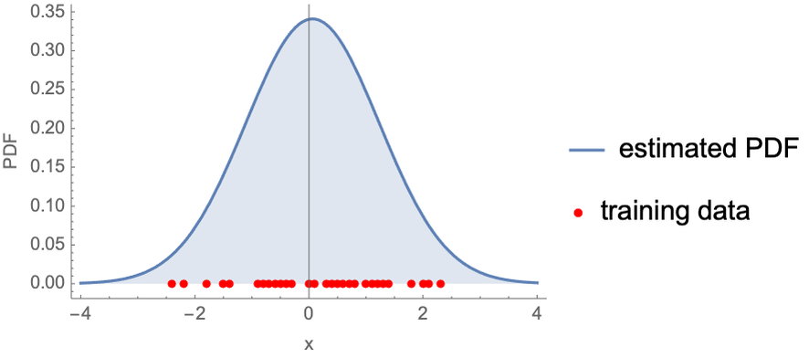

## Table of Contents

## What is a distribution in the context of machine learning?

In machine learning, a distribution refers to how data is spread out or organized. Imagine you have a bunch of different numbers, like the heights of people in a room. A distribution tells you how many people are of each height, showing whether most people are tall, short, or somewhere in between. This helps machine learning models understand and predict patterns in data. For example, if a model knows the distribution of heights, it can better guess someone's height based on other information.

Distributions are important because they help us make sense of data and make predictions. In machine learning, we often use different types of distributions, like the normal distribution, which looks like a bell curve. If you have data that follows a normal distribution, you can use a formula like $$ P(x) = \frac{1}{\sqrt{2\pi\sigma^2}} e^{-\frac{(x-\mu)^2}{2\sigma^2}} $$ to describe it. Here, $\mu$ is the average height, and $\sigma$ is how spread out the heights are. Understanding these distributions helps machine learning algorithms work better and make more accurate predictions.

## How do distributions help in understanding data for machine learning models?

Distributions help machine learning models understand data by showing how the data is spread out. Imagine you're looking at the ages of people in a park. A distribution would tell you if most people are young, old, or a mix of both. This information is crucial because it helps the model recognize patterns. For example, if the model sees that most people at the park are young, it might predict that a new visitor is also likely to be young.

When a [machine learning](/wiki/machine-learning) model knows the distribution of data, it can make better guesses and predictions. For instance, if you're using a model to predict house prices, knowing the distribution of house prices in a neighborhood can help the model understand what's normal and what's not. If most houses are priced around $300,000, the model can use this information to predict that a new house in the same area will likely be close to that price. This makes the model's predictions more accurate and useful.

## What is the Gumbel Softmax distribution and why is it used in machine learning?

The Gumbel Softmax distribution is a special kind of distribution used in machine learning, especially when we need to make choices or decisions. Imagine you have a list of options, and you want to pick one based on some probabilities. The Gumbel Softmax helps by adding a bit of randomness to these choices, which can be useful when training models that need to learn how to make decisions. It's like flipping a weighted coin, where the weights come from the probabilities, but with a twist that helps the model explore different options.

This distribution is particularly useful in machine learning because it allows models to work with categorical data in a way that can be smoothly optimized. In many machine learning tasks, we want the model to output something like "yes" or "no," or to choose from a set of categories. The Gumbel Softmax distribution helps by turning these hard choices into soft, continuous values that can be used in gradient-based optimization methods. For example, if you're training a model to classify images, the Gumbel Softmax can help the model learn how to make these classifications more effectively by allowing it to explore different possibilities during training.

## Can you explain how the Gumbel Softmax distribution is derived?

The Gumbel Softmax distribution is derived by combining the Gumbel distribution with the softmax function. Imagine you have a set of probabilities that you want to turn into choices. The Gumbel distribution adds some randomness to these probabilities, making them more like a weighted lottery. If you have probabilities $p_1, p_2, ..., p_k$, the Gumbel distribution adds a random number to each of these probabilities. These random numbers come from the Gumbel distribution, which is a special kind of distribution that can be written as $$ G(x) = e^{-e^{-x}} $$. When you add these random numbers to your probabilities, you get new values that you can use to make choices.

After adding the Gumbel noise, you use the softmax function to turn these new values into a set of probabilities that add up to 1. The softmax function takes the new values and turns them into probabilities by using the formula $$ \text{softmax}(x_i) = \frac{e^{x_i}}{\sum_{j=1}^k e^{x_j}} $$. This step makes sure that the model can still use these probabilities to make decisions, but now with the added randomness from the Gumbel distribution. This combination of Gumbel noise and the softmax function is what makes the Gumbel Softmax distribution useful for machine learning, especially when training models that need to make categorical choices.

## What are the practical applications of the Gumbel Softmax in neural networks?

The Gumbel Softmax is really helpful in neural networks when you want the network to make choices. Imagine you're training a network to pick the best route for a delivery truck. The Gumbel Softmax helps by letting the network try out different routes during training, even if one route seems better at first. This randomness helps the network learn which routes are truly the best over time. It's like letting the network explore different options before settling on the best one.

Another practical use of the Gumbel Softmax is in generating text or images. If you're using a [neural network](/wiki/neural-network) to create a story or a picture, you want it to pick words or pixels from a set of options. The Gumbel Softmax lets the network make these choices in a way that can be smoothly improved over time. By adding a bit of randomness to the choices, the network can explore different possibilities and learn how to make better decisions. This makes the generated stories or images more varied and interesting.

## How does the temperature parameter affect the Gumbel Softmax distribution?

The temperature parameter in the Gumbel Softmax distribution controls how much randomness is added to the choices. When the temperature is high, the distribution becomes more random, making the choices more spread out. This means the neural network can explore a wider range of options during training. On the other hand, when the temperature is low, the distribution becomes more focused, and the choices become more certain. This helps the network make more confident decisions once it has learned what works best.

Think of the temperature like a dial on a stove. A high temperature means the choices are like boiling water, all over the place and hard to predict. A low temperature is like simmering water, where the choices are more stable and predictable. By adjusting the temperature, you can help the neural network learn better by exploring different options early on and then making more confident decisions later. The temperature parameter is used in the softmax function like this: $$ \text{softmax}(x_i) = \frac{e^{x_i / T}}{\sum_{j=1}^k e^{x_j / T}} $$, where $T$ is the temperature.

## What are the advantages of using Gumbel Softmax for discrete data?

The Gumbel Softmax is really useful when you're working with choices that are clear and separate, like [picking](/wiki/asset-class-picking) a color from a set of options. It helps by adding a bit of randomness to these choices, which can be good when you're training a computer to make decisions. This randomness lets the computer try out different options during training, even if one choice seems better at first. This way, the computer can learn which choices are truly the best over time. The Gumbel Softmax does this by using the Gumbel distribution to add noise to the probabilities and then using the softmax function to turn these noisy values into new probabilities. The formula for this is $$ \text{softmax}(x_i) = \frac{e^{x_i / T}}{\sum_{j=1}^k e^{x_j / T}} $$, where $T$ is a temperature that controls how random the choices are.

Another advantage of the Gumbel Softmax is that it works well with the way computers learn. Many learning methods need to make small changes to get better over time, and the Gumbel Softmax fits right in. It turns hard choices into soft, continuous values that the computer can use to improve its decisions. This makes it easier for the computer to learn how to pick the best option from a set of choices. By using the Gumbel Softmax, the computer can explore different possibilities and learn from them, making its final decisions more accurate and useful.

## How can Gumbel Softmax be implemented in popular machine learning frameworks like TensorFlow or PyTorch?

In TensorFlow, you can implement the Gumbel Softmax by using the `tf.random.gumbel` function to add noise to your probabilities and then applying the softmax function. First, you generate Gumbel noise and add it to your logits. Then, you use the softmax function to turn these noisy logits into probabilities. You can control how random the choices are by using a temperature parameter. Here's a simple example of how you might do this in TensorFlow:

```python
import tensorflow as tf

def gumbel_softmax(logits, temperature=1.0):
    gumbel_noise = tf.random.gumbel(shape=tf.shape(logits), dtype=logits.dtype)
    noisy_logits = logits + gumbel_noise
    return tf.nn.softmax(noisy_logits / temperature)

# Example usage
logits = tf.constant([[1.0, 2.0, 3.0]])
result = gumbel_softmax(logits, temperature=0.5)
print(result)
```

In PyTorch, the process is similar. You can use `torch.distributions.gumbel.Gumbel` to generate the Gumbel noise and then apply the softmax function. The `F.gumbel_softmax` function in PyTorch's `torch.nn.functional` module makes this even easier. You just need to pass your logits and a temperature to this function, and it will handle the rest. Here's how you might implement it in PyTorch:

```python
import torch
import torch.nn.functional as F

# Example usage
logits = torch.tensor([[1.0, 2.0, 3.0]])
result = F.gumbel_softmax(logits, tau=0.5, hard=False)
print(result)
```

Both implementations allow you to control the randomness of the choices by adjusting the temperature parameter. A high temperature makes the choices more random, while a low temperature makes them more certain. This helps the model explore different options during training and make better decisions over time.

## What are some common challenges faced when using Gumbel Softmax in machine learning models?

One common challenge when using Gumbel Softmax in machine learning models is finding the right temperature. The temperature controls how random the choices are, and it can be tricky to pick the best one. If the temperature is too high, the model might make too many random choices and not learn well. If it's too low, the model might not explore enough different options. So, you often need to try different temperatures to see what works best for your specific task. This can take a lot of time and effort.

Another challenge is that Gumbel Softmax can sometimes lead to unstable training. When you add noise to the choices, it can make the model's learning process more unpredictable. This can cause the model's performance to jump around a lot during training, making it hard to tell if it's really improving. To deal with this, you might need to use special techniques to make the training more stable. For example, you could slowly lower the temperature over time to help the model learn more smoothly. This way, the model can explore different choices at first and then focus on the best ones later.

## How does Gumbel Softmax compare to other distributions like the Bernoulli or Categorical?

The Gumbel Softmax is different from the Bernoulli and Categorical distributions because it adds a special kind of randomness to help with learning. The Bernoulli distribution is like flipping a coin, where you have just two choices, like yes or no. The Categorical distribution is like rolling a die, where you have multiple choices, like picking a color from a set of options. But the Gumbel Softmax takes these choices and adds noise from the Gumbel distribution. This noise helps the model explore different choices during training, which can lead to better learning. The formula for the Gumbel Softmax is $$ \text{softmax}(x_i) = \frac{e^{x_i / T}}{\sum_{j=1}^k e^{x_j / T}} $$, where $T$ is the temperature that controls how random the choices are.

A big advantage of the Gumbel Softmax over the Bernoulli and Categorical distributions is that it can be used in a way that helps the model improve over time. When you use the Gumbel Softmax, the model can make small changes to get better at making choices. This is because the Gumbel Softmax turns hard choices into soft, continuous values that the model can use to learn. The Bernoulli and Categorical distributions don't do this, so they can be harder to use with some learning methods. By using the Gumbel Softmax, the model can explore different possibilities and learn from them, making its final decisions more accurate and useful.

## Can you discuss any advanced techniques or modifications to the Gumbel Softmax for specific use cases?

One advanced technique for the Gumbel Softmax is called the "Straight-Through" Gumbel Softmax. This modification helps the model learn better by making the choices more clear during training. Imagine you're teaching a computer to pick a color from a set of options. The Straight-Through method lets the computer make a soft choice during training, but then it uses a hard choice when it's time to make a decision. This way, the computer can explore different colors but still make a clear choice in the end. The formula for the Straight-Through Gumbel Softmax is a bit different because it uses both the soft and hard versions of the choices. By using this technique, the model can learn more effectively and make better decisions.

Another modification is the use of "Scheduled Sampling" with the Gumbel Softmax. This technique helps the model learn to make choices over time by slowly changing how random the choices are. Imagine you're training a model to pick the best route for a delivery truck. At first, you want the model to try out different routes to see what works best. But as the training goes on, you want the model to focus on the best routes. Scheduled Sampling does this by starting with a high temperature, which makes the choices more random, and then slowly lowering the temperature to make the choices more certain. This way, the model can explore different options at first and then make more confident decisions later. By using Scheduled Sampling, the model can learn to make better choices over time.

## What future research directions could enhance the use of Gumbel Softmax in machine learning?

One promising direction for future research is to improve how the Gumbel Softmax works with different types of data. Right now, it's mostly used for picking from a set of clear choices, like colors or words. But what if we could use it for more complex data, like pictures or sounds? Researchers could explore ways to make the Gumbel Softmax work better with these kinds of data. For example, they might find new ways to add the right kind of noise to the choices, so the model can learn to pick the best option even when the choices are more complicated. This could make the Gumbel Softmax even more useful for tasks like generating new images or understanding spoken language.

Another area for future research is to make the Gumbel Softmax more efficient. Right now, using the Gumbel Softmax can take a lot of time and computer power, especially when you're trying out different temperatures to see what works best. Researchers could work on new methods to speed up the process. For example, they might find ways to quickly test different temperatures without having to train the model from scratch each time. Or they might come up with new formulas that make the Gumbel Softmax work faster. By making the Gumbel Softmax more efficient, it could be used more easily in real-world applications, like helping computers make quick and accurate decisions in self-driving cars or medical diagnosis systems.