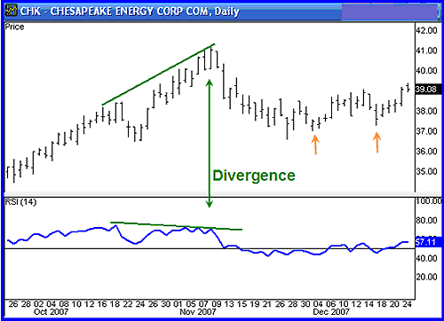

## Table of Contents

## What is divergence in trading?

Divergence in trading happens when the price of an asset and a technical indicator, like the Relative Strength Index (RSI) or Moving Average Convergence Divergence (MACD), move in opposite directions. This can signal that the current trend might be weakening and a possible reversal could be coming. For example, if the price of a stock is going up but the RSI is going down, this is called bearish divergence. It suggests that even though the price is rising, the momentum behind the price movement is getting weaker, which might mean the price will start to fall soon.

Traders use divergence to make decisions about when to buy or sell. When they see a bullish divergence, where the price is going down but the indicator is going up, they might see it as a sign to buy, thinking the price will soon start to rise. On the other hand, spotting a bearish divergence can be a signal to sell or short sell, expecting the price to drop. It's important for traders to use divergence along with other analysis tools because divergence alone isn't always a perfect predictor of future price movements.

## How does momentum analysis work in trading?

Momentum analysis in trading is about looking at how fast a stock's price is changing. Traders use it to figure out if a stock's price will keep going up or down. They do this by comparing the current price to past prices over a certain time, like a few days or weeks. If the price is going up faster than before, that's strong momentum, and it might mean the price will keep rising. If the price is going down faster, that's negative momentum, and the price might keep falling.

To do [momentum](/wiki/momentum) analysis, traders use tools like the Relative Strength Index (RSI) or the Moving Average Convergence Divergence (MACD). These tools help them see the speed of price changes more clearly. For example, if the RSI is above 70, it might mean the stock is overbought and could soon drop in price. If it's below 30, the stock might be oversold and could go up soon. By watching these indicators, traders can make better guesses about when to buy or sell a stock.

## What are the different types of divergence?

There are two main types of divergence in trading: regular divergence and hidden divergence. Regular divergence happens when the price of a stock and a technical indicator move in opposite directions. This can tell traders that the current trend might be getting weaker and a price reversal could be coming soon. There are two kinds of regular divergence: bullish and bearish. Bullish regular divergence is when the price is going down but the indicator is going up. This might mean the price will start to go up soon. Bearish regular divergence is the opposite, where the price is going up but the indicator is going down, suggesting the price might start to fall.

Hidden divergence is a bit different. It happens when the price and the indicator move in the same direction but at different speeds. This type of divergence can show that the current trend is likely to keep going. There are also two kinds of hidden divergence: bullish and bearish. Bullish hidden divergence is when the price makes a higher low but the indicator makes a lower low. This can mean the upward trend will continue. Bearish hidden divergence is when the price makes a lower high but the indicator makes a higher high, suggesting the downward trend will keep going. Both types of divergence help traders make better decisions about when to buy or sell.

## Can you explain the difference between regular and hidden divergence?

Regular divergence happens when the price of a stock and a technical indicator move in opposite directions. This can signal that the current trend might be weakening and the price could soon reverse. For example, if the price is going up but the indicator is going down, that's called bearish regular divergence. It might mean the price will start to fall soon. On the other hand, if the price is going down but the indicator is going up, that's bullish regular divergence, suggesting the price might start to rise.

Hidden divergence is different because it happens when the price and the indicator move in the same direction but at different speeds. This type of divergence can show that the current trend is likely to continue. For instance, if the price makes a higher low but the indicator makes a lower low, that's bullish hidden divergence. It suggests the upward trend will keep going. If the price makes a lower high but the indicator makes a higher high, that's bearish hidden divergence, indicating the downward trend will continue. Both types of divergence help traders make better decisions about when to buy or sell.

## How can traders identify divergence on a chart?

To spot divergence on a chart, traders need to look at both the price of the stock and a technical indicator like the RSI or MACD. For regular divergence, they should see if the price and the indicator are moving in opposite directions. If the price is going up but the indicator is going down, that's bearish regular divergence. It might mean the price will start to fall soon. If the price is going down but the indicator is going up, that's bullish regular divergence, suggesting the price might start to rise.

For hidden divergence, traders should check if the price and the indicator are moving in the same direction but at different speeds. If the price makes a higher low but the indicator makes a lower low, that's bullish hidden divergence. It suggests the upward trend will keep going. If the price makes a lower high but the indicator makes a higher high, that's bearish hidden divergence, indicating the downward trend will continue. By watching these patterns, traders can make better guesses about when to buy or sell a stock.

## What are the common indicators used to spot divergence?

Traders often use the Relative Strength Index (RSI) and the Moving Average Convergence Divergence (MACD) to spot divergence. The RSI measures how fast and strong a stock's price is changing. It's shown as a number between 0 and 100. When the RSI is above 70, the stock might be overbought, and when it's below 30, it might be oversold. By comparing the RSI with the stock's price, traders can see if there's divergence. For example, if the price is going up but the RSI is going down, that's bearish divergence.

The MACD is another tool that helps spot divergence. It's made up of two lines: the MACD line and the signal line. When the MACD line crosses above the signal line, it can be a sign to buy, and when it crosses below, it can be a sign to sell. Traders look for times when the price of a stock and the MACD move in opposite directions. If the price is making higher highs but the MACD is making lower highs, that's bearish divergence. If the price is making lower lows but the MACD is making higher lows, that's bullish divergence. By using these indicators, traders can make better guesses about when to buy or sell.

## How does momentum analysis complement divergence in trading strategies?

Momentum analysis and divergence work well together in trading because they give traders more information about what might happen next with a stock's price. Momentum analysis looks at how fast a stock's price is changing. If the price is going up faster than before, that's strong momentum, which might mean the price will keep rising. If it's going down faster, that's negative momentum, and the price might keep falling. By using tools like the RSI or MACD, traders can see the speed of these changes. When they see strong momentum, it can confirm what they learn from looking at divergence.

Divergence happens when the price of a stock and a technical indicator move in different ways. Regular divergence can signal that the current trend might be getting weaker and the price could soon reverse. Hidden divergence can show that the current trend is likely to keep going. When traders see divergence, they can use momentum analysis to check if the momentum supports what the divergence is suggesting. For example, if there's bullish divergence and strong upward momentum, it might be a good time to buy. If there's bearish divergence and strong downward momentum, it might be a good time to sell. By combining these two, traders can make better guesses about when to buy or sell a stock.

## What are the potential pitfalls of relying on divergence and momentum analysis?

Using divergence and momentum analysis in trading can be tricky because these methods aren't perfect. Sometimes, what looks like a clear signal can be wrong. For example, you might see a bearish divergence where the price is going up but the indicator is going down. You might think the price will start to fall, but instead, it keeps going up. This is called a false signal. It can lead to bad trades and losing money. Also, these methods can be affected by big news or events that change the market suddenly. If something unexpected happens, like a company announcing good news, the stock price might go up even if the indicators suggest otherwise.

Another problem is that these tools can be hard to use right. It takes a lot of practice to spot divergence and momentum correctly. Sometimes, traders might see patterns that aren't really there, or they might miss important signals. It's also easy to get confused by too many indicators or by looking at too short a time period. Using these methods alone without other kinds of analysis, like looking at the company's financials or what's happening in the economy, can make it harder to make good trading decisions. That's why it's important to use divergence and momentum analysis along with other tools to get a fuller picture of what might happen next with a stock's price.

## Can divergence and momentum analysis be applied to all financial markets?

Yes, divergence and momentum analysis can be used in many different financial markets, like stocks, [forex](/wiki/forex-system), commodities, and cryptocurrencies. These methods look at how prices are moving and how fast they're changing. This can help traders in any market figure out if a price trend might keep going or if it might change direction soon. For example, if a trader sees that the price of gold is going up but the RSI is going down, they might think the price of gold will start to fall soon. This kind of analysis can be useful no matter what you're trading.

However, these methods might work better in some markets than others. Markets that move a lot, like stocks and cryptocurrencies, can show clear patterns of divergence and momentum. But in markets that don't move as much, like some commodities, it might be harder to spot these patterns. Also, different markets can be affected by different things, like news or economic reports. So, while divergence and momentum analysis can be used in all financial markets, traders need to think about what's special about each market and use other tools too to make the best decisions.

## How do experienced traders adjust their strategies based on divergence and momentum signals?

Experienced traders use divergence and momentum signals to fine-tune their trading strategies. When they see a bullish divergence, where the price is going down but the indicator is going up, they might decide it's a good time to buy. They look for strong upward momentum to confirm this signal. If the momentum is strong, they feel more confident that the price will start to rise soon. On the other hand, if they spot a bearish divergence, where the price is going up but the indicator is going down, they might think about selling or short selling. They check for strong downward momentum to make sure the price will likely fall.

These traders also know that divergence and momentum signals can sometimes be wrong. So, they don't rely on these signals alone. They use other tools like looking at the company's financials, checking economic news, and using other technical indicators to get a fuller picture. This helps them avoid false signals and make better trading decisions. By combining divergence and momentum analysis with other methods, experienced traders can adjust their strategies to be more successful in the market.

## What advanced techniques can be used to enhance the accuracy of divergence and momentum analysis?

Experienced traders use several advanced techniques to make their divergence and momentum analysis more accurate. One way is to use multiple time frames. Instead of just looking at a daily chart, they might also look at weekly or monthly charts. This helps them see if the divergence and momentum signals are strong across different time periods. If the signals match up on different time frames, it makes them more confident in their trading decisions. Another technique is to combine divergence and momentum analysis with other indicators, like [volume](/wiki/volume-trading-strategy) or trend lines. By checking if the volume is increasing when they see a bullish divergence, they can feel more sure that the price will go up.

Another advanced method is to use more complex indicators like the Stochastic Oscillator or the Average Directional Index (ADX) along with RSI and MACD. These indicators can give extra information about the strength of the trend and the speed of price changes. For example, if the ADX shows a strong trend and the Stochastic Oscillator shows overbought or oversold conditions, it can help confirm the signals from divergence and momentum analysis. Traders also pay attention to how long the divergence lasts. A longer-lasting divergence might be a stronger signal than a short one. By using these advanced techniques, traders can make their analysis more accurate and reduce the chance of making bad trades based on false signals.

## How can one backtest a trading strategy that incorporates divergence and momentum analysis?

To backtest a trading strategy that uses divergence and momentum analysis, you need to look at past data to see how well your strategy would have worked. Start by choosing a time period, like the last five years, and get the historical price data for the stocks or assets you want to trade. Then, apply your strategy to this data. For example, if you see a bullish divergence and strong upward momentum, your strategy might say to buy. You would then see what would have happened if you bought at that time and sold when the strategy said to. Keep track of all your trades, how much you made or lost, and how often your strategy was right or wrong.

After you've gone through all the data, you can see how well your strategy did. Look at things like how much money you would have made overall, how big your wins and losses were, and how often your strategy gave you good signals. This helps you see if your strategy is good enough to use in real trading. You might need to change your strategy if it didn't work well. For example, if you found that your strategy worked better on weekly charts than daily charts, you could try using weekly charts instead. Backtesting helps you practice and improve your strategy before you start using real money.

## What are Key Momentum Indicators?

Momentum indicators are essential tools for traders in assessing price movements and identifying potential entry and [exit](/wiki/exit-strategy) points. Among these, the Relative Strength Index (RSI), Stochastic Oscillator, and Rate of Change (ROC) are widely utilized due to their effectiveness in evaluating market conditions.

The Relative Strength Index (RSI) is a momentum oscillator that measures the speed and change of price movements on a scale from 0 to 100. Developed by J. Welles Wilder Jr., the RSI helps traders determine whether a market is overbought or oversold, potentially indicating a reversal. Typically, an RSI above 70 suggests overbought conditions, while an RSI below 30 indicates oversold conditions. The formula for RSI is:

$$
\text{RSI} = 100 - \left( \frac{100}{1 + \frac{\text{Average Gain}}{\text{Average Loss}}} \right)
$$

The Stochastic Oscillator, developed by George Lane, compares a specific closing price of a security to its price range over a certain period. It consists of two lines — %K and %D. %K indicates the current position within the high-low range, while %D is a moving average of %K. This oscillator aims to measure market momentum and identify potential trend reversals by examining the relative position between the two lines. A common interpretation involves overbought conditions at levels above 80 and oversold conditions below 20.

The Rate of Change (ROC) indicator evaluates the percentage change between the most recent price and the price during a specific period in the past. It provides insights into the speed at which a security's price is changing. The formula for calculating ROC is:

$$
\text{ROC} = \left( \frac{\text{Current Price} - \text{Price} \, n \, \text{periods ago}}{\text{Price} \, n \, \text{periods ago}} \right) \times 100
$$

Each of these indicators assists traders in refining their strategies by providing clear signals about market momentum. Their fixed boundaries allow for effective comparison against price swings, assisting in the anticipation of potential market reversals. By leveraging these tools, traders can optimize their decision-making processes, enhance strategy efficiency, and potentially improve their trading outcomes.

## What are Practical Strategies Using Momentum and Divergence?

Traders utilize various strategies that leverage momentum and divergence to optimize their trading approaches. These strategies include techniques such as [scalping](/wiki/gamma-scalping), swing trading, and strategic moves like buying dips and shorting pumps.

**Scalping and Fast Oscillators:** Scalpers, who focus on making quick profits from small price changes, rely heavily on fast oscillators to gain insights into immediate market momentum. Oscillators like the Stochastic Oscillator and the Relative Strength Index (RSI) can help identify overbought or oversold conditions swiftly, allowing traders to execute trades within short time frames. The formula for RSI is:

$$
\text{RSI} = 100 - \left( \frac{100}{1 + \text{RS}} \right)
$$

Where RS (Relative Strength) is the average of x days' up closes divided by the average of x days' down closes.

**Swing Trading and Divergence Patterns:** Swing traders benefit from identifying divergence patterns, which can signal potential trend reversals or confirm ongoing trends. By analyzing divergences between price action and momentum indicators like the RSI or Moving Average Convergence Divergence (MACD), traders can determine strategic entry and exit points for longer time frames.

**Combining Momentum Indicators:** Aligning medium-term indicators with broader momentum oscillators is another effective strategy. For instance, traders might use the MACD, which consists of the MACD line and a signal line, as a medium-term momentum indicator in conjunction with longer-term trend indicators to validate trading signals. The MACD is calculated as:

$$
\text{MACD} = \text{EMA}_{\text{Short period}} - \text{EMA}_{\text{Long period}}
$$

Where EMA stands for Exponential Moving Average.

**Advanced Strategy Formulation:** Experienced traders often develop complex, multi-layered strategies using algorithmic trading systems. These systems integrate various momentum and divergence indicators to refine risk management processes and enhance profitability. By coding custom algorithms that account for different market conditions, traders can automate their strategies to execute trades with precision and reduce the influence of human errors. Here’s a simple Python snippet illustrating how to identify divergence using RSI:

```python
import pandas as pd

def identify_divergence(prices, rsi):
    divergence_points = []
    for i in range(1, len(prices)-1):
        # Check for a bearish divergence
        if prices[i] > prices[i-1] and rsi[i] < rsi[i-1]:
            divergence_points.append(('bearish', i))
        # Check for a bullish divergence
        elif prices[i] < prices[i-1] and rsi[i] > rsi[i-1]:
            divergence_points.append(('bullish', i))
    return divergence_points

# Example usage
prices = [100, 105, 102, 108, 107]
rsi = [70, 65, 68, 64, 66]
divergences = identify_divergence(prices, rsi)
print(divergences)
```

By employing these practical strategies, traders can utilize momentum and divergence analysis to adjust their trading practices and increase their likelihood of success in financial markets.

## References & Further Reading

[1]: Bergstra, J., Bardenet, R., Bengio, Y., & Kégl, B. (2011). ["Algorithms for Hyper-Parameter Optimization."](https://dl.acm.org/doi/10.5555/2986459.2986743) Advances in Neural Information Processing Systems 24.

[2]: ["Advances in Financial Machine Learning"](https://www.amazon.com/Advances-Financial-Machine-Learning-Marcos/dp/1119482089) by Marcos Lopez de Prado

[3]: ["Evidence-Based Technical Analysis: Applying the Scientific Method and Statistical Inference to Trading Signals"](https://www.amazon.com/Evidence-Based-Technical-Analysis-Scientific-Statistical/dp/0470008741) by David Aronson

[4]: ["Machine Learning for Algorithmic Trading"](https://github.com/stefan-jansen/machine-learning-for-trading) by Stefan Jansen

[5]: ["Quantitative Trading: How to Build Your Own Algorithmic Trading Business"](https://www.amazon.com/Quantitative-Trading-Build-Algorithmic-Business/dp/1119800064) by Ernest P. Chan