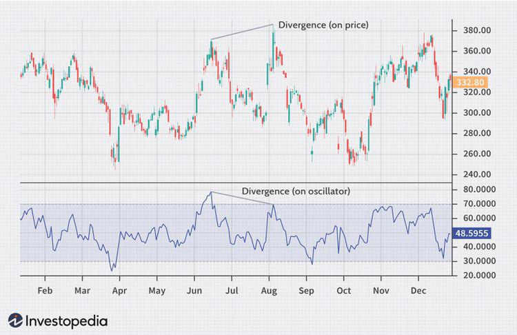

Technical analysis is a methodology that evaluates securities by analyzing statistical trends gathered from trading activity, such as price movement and volume. This approach is pivotal for traders seeking to forecast future market behavior and make informed trading decisions. It relies on various tools and indicators, including trend lines, moving averages, and complex models that identify price patterns and market signals. The insights derived from technical analysis are crucial for traders across different markets, aiming to capitalize on potential opportunities or mitigate risks.

Algorithmic trading, a more recent innovation in the financial markets, entails using computer programs to execute trades at speeds and frequencies impossible for human traders. With the ability to process massive amounts of market data and adhere to predefined criteria, algorithms have revolutionized trading by enhancing its efficiency and precision. As algorithmic trading gains traction among institutional and retail traders, its integration with sophisticated analytical techniques like technical analysis becomes increasingly significant.



Divergence, a key concept in technical analysis, marks a disagreement between price movement and technical indicators, potentially signaling reversals or continuations in market trends. Identifying divergence involves observing scenarios where, for example, the price of a security reaches new highs while the indicator fails to match these highs, suggesting weakening momentum and potential trend reversal. Recognizing divergence is crucial as it provides some of the earliest signals of imminent changes in market direction, serving as a valuable tool for traders.

The integration of divergence strategies into algorithmic trading systems promises to enhance market analysis and improve trading outcomes. This article aims to explore the synergy between divergence analysis and algorithmic trading. By leveraging the precise execution capabilities of algorithms with the predictive power of divergence signals, traders can potentially achieve more efficient trading results. This combination offers a robust framework to navigate the dynamics of financial markets, ensuring that traders maintain agility and strategic advantage in an ever-evolving landscape.

## Table of Contents

## Understanding Technical Analysis

Technical analysis is a methodology used by traders and investors to predict future market behavior by analyzing historical price data and trading volumes. The foundation of technical analysis lies in the assumption that all relevant information is already reflected in the current and past prices of an asset. Thus, by studying these price movements, traders can make informed predictions about future price trends.

### Key Principles and Tools

One of the primary principles of technical analysis is that market prices move in trends, and these trends can persist over time. Identifying and following these trends is crucial for successful trading. Several tools are employed to accomplish this, including trend lines, moving averages, and various indicators.

**Trend Lines**: A trend line is a straight line that connects two or more price points and extends into the future to act as a line of support or resistance. An upward trend line indicates a bullish market, while a downward trend line suggests a bearish market.

**Moving Averages**: This tool smooths out price data by creating a constantly updated average price. Moving averages come in various forms, with the simple moving average (SMA) and the exponential moving average (EMA) being the most common. The EMA gives more weight to the most recent prices, making it more responsive to new information.

Each type has its specific applications and is used to identify different market conditions. For instance, a moving average can help determine if an asset is in an uptrend or downtrend by comparing its short-term moving average with its long-term moving average.

### Importance of Price Patterns and Market Signals

Price patterns are formations created by the price movements of an asset on a chart. Recognizing these patterns is vital for traders as they can be indicative of potential market reversals or continuations. Common price patterns include head and shoulders, double tops and bottoms, and flags and pennants. These patterns, once identified, can provide traders with signals on when to enter or [exit](/wiki/exit-strategy) trades, thereby aiding in making evidence-based trading decisions.

### Common Technical Analysis Indicators

Several indicators are widely used to enhance the predictive power of technical analysis by quantifying market actions:

- **MACD (Moving Average Convergence Divergence)**: This trend-following momentum indicator highlights the relationship between two moving averages of a stock’s price. The MACD is calculated by subtracting the 26-period EMA from the 12-period EMA. A nine-day EMA of the MACD, known as the "signal line," is then plotted on top of the MACD line, which can function as a trigger for buy and sell signals.
$$
  \text{MACD} = \text{EMA}_{12} - \text{EMA}_{26}

$$

- **RSI (Relative Strength Index)**: This momentum oscillator measures the speed and change of price movements. It oscillates between zero and 100 and is considered overbought when above 70 and oversold when below 30, prompting traders to anticipate a reversal or correction.

- **Stochastic Oscillator**: This tool compares a security's closing price to its price range over a certain period. It is used to gauge market momentum and identify overbought or oversold conditions. The stochastic oscillator measures on a scale of 0 to 100, similar to the RSI.

These indicators are not meant to be used in isolation. Instead, successful traders often use them in conjunction with other forms of technical analysis to confirm trends and signals, thus enhancing the accuracy of their predictive models. By integrating these methods, traders and analysts can derive a more comprehensive view of market dynamics, leading to more successful trading outcomes.

## Divergence in Technical Analysis

Divergence in technical analysis refers to a situation where the direction of a technical indicator deviates from the direction of the price movement. This phenomenon is typically observed in indicators such as the Moving Average Convergence Divergence (MACD), Relative Strength Index (RSI), and stochastic oscillators, which are used to gauge the [momentum](/wiki/momentum) and trend strength of the asset.

### Identifying Divergence in Price Charts

Divergence is identified by comparing price movements on a chart to movements in a corresponding technical indicator. In essence, divergence occurs in two forms: regular divergence and hidden divergence. Each type has different implications for traders.

### Types of Divergences

#### Regular Divergence

Regular divergence is observed when the price makes a new high (in an uptrend) or a new low (in a downtrend), but the indicator does not. This kind of divergence signals a potential reversal in the current trend. For instance, if the price is rising but the MACD starts to fall, it may indicate a weakening of the uptrend momentum, suggesting a possible bearish reversal.

Mathematically, regular bullish divergence can be expressed as:
$$
\Delta P_{\text{new low}} < \Delta P_{\text{old low}} \text{, and } \Delta I_{\text{new low}} > \Delta I_{\text{old low}}
$$
where $\Delta P$ represents price changes and $\Delta I$ denotes indicator changes.

Conversely, regular bearish divergence occurs when:
$$
\Delta P_{\text{new high}} > \Delta P_{\text{old high}} \text{, and } \Delta I_{\text{new high}} < \Delta I_{\text{old high}}
$$

#### Hidden Divergence

Hidden divergence, on the other hand, tends to be a signal of trend continuation rather than reversal. It occurs when the price makes a higher low (in an uptrend) or a lower high (in a downtrend), but the indicator fails to confirm this by making a lower low or higher high, respectively. Hidden divergence is often seen as an opportunity to enter the market in the direction of the prevailing trend.

For hidden bullish divergence:
$$
\Delta P_{\text{higher low}} > \Delta P_{\text{lower low}} \text{, and } \Delta I_{\text{higher low}} < \Delta I_{\text{lower low}}
$$

For hidden bearish divergence:
$$
\Delta P_{\text{lower high}} < \Delta P_{\text{higher high}} \text{, and } \Delta I_{\text{lower high}} > \Delta I_{\text{higher high}}
$$

### Significance in Trading

Divergence is significant in trading as it highlights discrepancies between price action and momentum, potentially forewarning traders about shifts in trend dynamics. Traders leverage divergence for market reversals by identifying regular divergences and continuity of trends by identifying hidden divergences. Such analysis helps in making informed decisions regarding entry and exit points in trades.

### Examples of Using Divergence

1. **Predicting Reversals**: Suppose a currency pair is in a robust upward trend, hitting new highs. However, the RSI starts showing lower highs, indicating decreasing buying pressure. This regular bearish divergence could signal an impending downturn, allowing traders to prepare for shorting opportunities.

2. **Identifying Continuations**: Consider a stock experiencing a correction but maintaining its long-term uptrend. If the price forms a higher low, yet the stochastic oscillator forms lower lows, hidden bullish divergence might suggest the uptrend is likely to continue, offering a buy signal.

In conclusion, divergence provides valuable insight into potential market moves, empowering traders to anticipate changes and adjust strategies accordingly. Identifying divergence requires careful analysis and often serves as a complement to other technical tools for comprehensive market evaluation.

## Algorithmic Trading: A Brief Overview

Algorithmic trading is a method of executing orders using automated pre-programmed trading instructions accounting for variables such as timing, price, and [volume](/wiki/volume-trading-strategy). This approach leverages computational power and advanced mathematical models to trade at an unmatched speed and frequency, which is infeasible for human traders. The primary advantage of [algorithmic trading](/wiki/algorithmic-trading) is its ability to minimize the impact of human emotions on trading decisions, ensuring consistent and objective decision-making.

Automated trading systems operate by executing trades at high speeds using predefined criteria. These systems can assess multiple market conditions simultaneously, enabling traders to seize market opportunities that may only exist for seconds. Algorithms can include complex strategies involving statistical [arbitrage](/wiki/arbitrage), market-making, and trend-following techniques. For example, in [statistical arbitrage](/wiki/statistical-arbitrage), traders exploit price discrepancies of correlated financial instruments, often using mean-reversion strategies where assets are expected to revert to their historical mean price.

Several algorithmic trading strategies are employed by traders, including trend-following, mean-reversion, and arbitrage strategies. Trend-following algorithms capitalize on the momentum of market trends, buying when the market is bullish and selling during bearish periods. Mean-reversion strategies, on the other hand, are based on the assumption that asset prices will return to their mean or average level. Arbitrage strategies exploit short-term discrepancies in asset pricing across different markets or exchanges, trading assets nearly simultaneously to achieve risk-free profits.

Algorithmic trading has gained popularity among both institutional and retail traders due to its numerous benefits. Institutional traders benefit from the ability to execute large volumes with reduced market impact and improved [liquidity](/wiki/liquidity-risk-premium). They can also exploit market inefficiencies more effectively due to the vast computational resources at their disposal. On the other hand, retail traders leverage algorithmic trading to level the playing field, utilizing algorithms to access strategic trading opportunities which were previously exclusive to larger entities.

The rapid advancement of technology and the increasing availability of high-speed internet connectivity have made it easier for retail traders to participate in algorithmic trading. Platforms offering algorithmic trading services have democratized access, allowing individual traders to deploy sophisticated strategies without needing substantial infrastructure. As financial markets evolve, the role of algorithmic trading in enhancing trading efficiency and accuracy continues to grow, highlighting its significance in modern financial markets.

## Integrating Divergence into Algorithmic Trading

Incorporating divergence signals into algorithmic trading systems can enhance the capacity for accurate market prediction and improve the efficiency of trade execution. Divergence, which highlights discrepancies between price movements and technical indicators, serves as a critical signal for potential trend reversals or continuations. Here's a breakdown of how divergence can be integrated into algorithmic trading and the associated benefits and challenges.

### Rationale for Incorporating Divergence

Algorithmic trading systems benefit significantly from the systematic identification and exploitation of divergence signals. Divergence can provide an early warning for shifts in market momentum, making it a valuable component in crafting responsive and predictive algorithms. Algorithms can process large amounts of data rapidly, identifying potential divergences faster and more consistently than manual observation allows. This capability positions divergence as an essential tool in modern, data-driven trading strategies.

### Steps to Develop a Divergence-Based Algorithm

1. **Define Divergence Criteria**: Identify and define the types of divergence to be utilized—regular or hidden—and associate them with specific indicators like the Relative Strength Index (RSI) or Moving Average Convergence Divergence (MACD).

2. **Data Acquisition and Preprocessing**: Collect historical price data and the corresponding indicator values. Ensure data quality and integrity using preprocessing methods such as cleaning and normalization.

3. **Algorithm Development**: 
   - Implement logic to detect divergence. For instance, in Python, you might calculate divergence for MACD as follows:

     ```python
     def detect_divergence(prices, macd, signal):
         divergences = []
         for i in range(1, len(prices)):
             if prices[i] > prices[i-1] and macd[i] < macd[i-1]:
                 divergences.append((i, 'bearish'))
             elif prices[i] < prices[i-1] and macd[i] > macd[i-1]:
                 divergences.append((i, 'bullish'))
         return divergences
     ```

   - Backtest the algorithm using historical data to validate its performance and refine its parameters.

4. **Implementation and Execution**: Deploy the algorithm in a live trading environment. Monitor its real-time performance and make necessary adjustments to improve its predictive accuracy.

### Advantages of Using Algorithms

- **Speed and Efficiency**: Algorithms can analyze vast datasets and detect divergence much faster than a human trader. This rapid identification can lead to quicker decision-making and execution of trades.
- **Consistency**: Automated systems provide uniform analysis and execution, reducing the influence of emotional and cognitive biases.
- **Scalability**: Algorithms can manage multiple assets and markets simultaneously, expanding opportunities and potential returns.

### Challenges and Limitations

- **Data Sensitivity and Noise**: Divergence detection is sensitive to the quality and cleanliness of data. Poor data can lead to inaccurate signals and erroneous trades.
- **Market Volatility**: High volatility may produce false divergence signals, requiring robust algorithms to filter out noise and avoid false positives.
- **Complexity of Development**: Creating algorithms that can accurately and consistently detect divergence requires significant programming expertise and financial knowledge, representing a barrier to entry for some traders.

Despite these challenges, the integration of divergence strategies into algorithmic trading represents a significant opportunity for improving trading efficiency and success rates. By leveraging advanced data analytics and computational power, traders can harness the predictive power of divergence to gain a competitive edge in today's fast-paced markets.

## Case Studies and Real-Life Applications

Examples of the successful implementation of divergence strategies in algorithmic trading demonstrate their versatility and potential for enhancing trading efficiency. One prominent case is the use of divergence-based algorithms by proprietary trading firms, which often develop sophisticated systems to capitalize on subtle market signals that might otherwise be overlooked by human traders. These firms have employed divergence strategies to predict market reversals, allowing them to position themselves advantageously ahead of competitors.

A well-documented example comes from Renaissance Technologies, a quant-based [hedge fund](/wiki/hedge-fund-trading-strategies) known for leveraging mathematical models and algorithms. Renaissance Technologies has reportedly incorporated divergence signals into their trading systems, helping them achieve notable returns over the years. The firm's reliance on systematic trading strategies, including divergence detection, underscores the practical benefits of automating trades based on technical indicators.

In another example, individual traders have adopted divergence-driven algorithms to enhance their trading outcomes. For instance, algorithmic traders using platforms like MetaTrader 5 have developed custom indicators that detect divergence patterns in conjunction with Relative Strength Index (RSI) and Moving Average Convergence Divergence (MACD). By [backtesting](/wiki/backtesting) these strategies in various market conditions, traders have been able to refine their algorithms, optimizing performance and improving risk management.

Lessons from both successful and failed applications of divergence strategies emphasize the importance of rigorous testing and continuous refinement. Successful implementations often involve comprehensive backtesting to assess the performance of divergence signals across different market environments. Additionally, incorporating [machine learning](/wiki/machine-learning) techniques can enhance the predictive accuracy of divergence signals by adapting to evolving market conditions.

However, not all implementations result in success. A common pitfall is overfitting trading algorithms to historical data, leading to poor performance in live trading conditions. Traders and firms must, therefore, balance the complexity and robustness of their models, ensuring they are neither oversensitive to noise nor too generalized to detect meaningful divergences.

Technological advancements have significantly bolstered the accuracy and effectiveness of divergence-based strategies. High-frequency trading ([HFT](/wiki/high-frequency-trading-strategies)) technologies have revolutionized the speed at which trades can be executed, ensuring that divergence signals are acted upon in real-time. Furthermore, advancements in data analytics and computational power allow for the processing of vast amounts of market data, enhancing the precision with which divergence is detected.

Python, with its extensive libraries like pandas for data manipulation and [backtrader](/wiki/backtrader) for backtesting, provides a robust environment for developing and testing divergence strategies. A basic example of detecting divergence in Python might involve calculating the RSI for a given dataset, identifying points where the price trend and RSI diverge, and executing trades based on this signal:

```python
import pandas as pd
import talib

# Load your historical market data
data = pd.read_csv('market_data.csv')

# Calculate RSI
data['RSI'] = talib.RSI(data['close'], timeperiod=14)

# Detect divergence
def detect_divergence(data):
    divergence_signals = []
    for i in range(1, len(data)):
        # Example condition for bullish divergence
        if data['close'][i] > data['close'][i-1] and data['RSI'][i] < data['RSI'][i-1]:
            divergence_signals.append((i, 'bullish'))
        # Example condition for bearish divergence
        elif data['close'][i] < data['close'][i-1] and data['RSI'][i] > data['RSI'][i-1]:
            divergence_signals.append((i, 'bearish'))
    return divergence_signals

divergences = detect_divergence(data)

# Show divergence points
print(divergences)
```

This code provides a simplistic approach to detecting divergence; real-world implementations would require more robust data processing and risk management layers. As trading systems evolve, the integration of [artificial intelligence](/wiki/ai-artificial-intelligence) and machine learning can further refine divergence detection, ultimately leading to more sophisticated and adaptive trading strategies.

## Best Practices and Tips

When developing an algorithmic trading system that incorporates divergence, several key considerations and best practices can help ensure success and effectiveness. By carefully addressing these aspects, traders can optimize their strategies and reduce potential risks.

### Key Considerations

1. **Data Quality and Preprocessing**: High-quality historical and real-time price data are crucial for accurate analysis. Ensure that the data used is clean, complete, and devoid of errors. Implement preprocessing steps, such as normalization, to make the data suitable for analysis.

2. **Choice of Technical Indicators**: Selecting the appropriate technical indicators for detecting divergence is essential. Common indicators include the Moving Average Convergence Divergence (MACD) and the Relative Strength Index (RSI). The choice of indicators impacts the sensitivity and specificity of divergence signals.

3. **Time Frame Selection**: The effectiveness of divergence signals can vary across different time frames. It's important to align the choice of time frames with trading objectives, whether intraday, swing, or long-term trades.

### Tips for Backtesting and Optimizing Divergence-Based Algorithms

1. **Robust Backtesting**: Backtest the algorithm on historical data to evaluate its performance. Use out-of-sample data to assess the robustness of the strategy. A Python code snippet for backtesting might look like this:

   ```python
   import pandas as pd
   from backtesting import Backtest, Strategy

   class DivergenceStrategy(Strategy):
       def init(self):
           # Implementation of divergence logic
           pass

       def next(self):
           # Trading logic using divergence
           pass

   data = pd.read_csv('historical_data.csv')
   bt = Backtest(data, DivergenceStrategy, cash=10000, commission=.002)
   stats = bt.run()
   bt.plot()
   ```

2. **Parameter Optimization**: Tuning the parameters of chosen indicators can significantly impact performance. Use techniques like grid search or genetic algorithms to find optimal parameter settings.

3. **Risk-Adjusted Metrics**: Evaluate strategy performance using risk-adjusted metrics such as the Sharpe Ratio, Sortino Ratio, or Maximum Drawdown. This helps in understanding the risk associated with the returns.

### Managing Risk and Minimizing Errors

1. **Position Sizing**: Utilize position sizing techniques to manage risk, such as fixed fractional, Kelly criterion, or volatility-based sizing. Proper position sizing minimizes exposure to large losses.

2. **Stop-Loss and Take-Profit Levels**: Implement stop-loss and take-profit orders to protect profits and limit losses. These should be based on volatility measures like the Average True Range (ATR).

3. **Error Handling**: Include error handling routines to manage unexpected situations, such as data feed disruptions or execution failures. This ensures the system is robust against operational issues.

### Monitoring and Adjusting Systems

1. **Real-Time Monitoring**: Constantly monitor the algorithm’s performance in real-time. Use dashboards and alerts to track key metrics and potential anomalies.

2. **Regular Updates**: Market conditions and dynamics change over time. Regularly update and recalibrate the algorithm to ensure it adapts to the latest market environment.

3. **Performance Reviews**: Periodically review the performance of the algorithm to detect any degradation in profitability. Conduct post-mortem analyses on trades to learn and improve.

By incorporating these best practices and tips, traders can enhance their divergence-based algorithmic trading systems' efficiency and resilience, effectively navigating dynamic market conditions.

## Conclusion

The integration of technical analysis, divergence, and algorithmic trading presents a powerful fusion that can enhance trading efficacy. Technical analysis provides the foundational basis by using historical price data to forecast market trends, while divergence offers crucial signals that often prelude market reversals, standing as an alert for traders. When these analytical strategies are embedded within algorithmic trading systems, there is an opportunity for traders to capitalize on market movements with precision and speed that traditional manual methods cannot achieve.

As we look to the future, the potential of algorithmic trading becomes even more promising when equipped with sophisticated analytical tools. The continuous evolution of technology and data analytics can significantly augment the accuracy and efficiency of these trading systems. Enhanced algorithms could leverage machine learning and artificial intelligence to adapt dynamically to market changes, potentially leading to more robust decision-making processes.

Traders and financial institutions are encouraged to explore and try out these advanced strategies as they provide a competitive edge in the fast-paced trading environment. The synergy between human expertise and machine efficiency can unlock previously untapped opportunities in financial markets.

This area calls for further research and development to overcome existing challenges and push the boundaries of current trading technologies. By investing in innovation and developing new methodologies, the finance industry can expect a future where trading decisions are not only faster and more accurate but also more intelligent. This continuous pursuit of knowledge will aid in the refinement of algorithmic strategies, ensuring they remain effective in an ever-evolving market landscape.

## References & Further Reading

[1]: Bergstra, J., Bardenet, R., Bengio, Y., & Kégl, B. (2011). ["Algorithms for Hyper-Parameter Optimization."](https://papers.nips.cc/paper/4443-algorithms-for-hyper-parameter-optimization) Advances in Neural Information Processing Systems 24.

[2]: ["Advances in Financial Machine Learning"](https://www.amazon.com/Advances-Financial-Machine-Learning-Marcos/dp/1119482089) by Marcos Lopez de Prado

[3]: ["Evidence-Based Technical Analysis: Applying the Scientific Method and Statistical Inference to Trading Signals"](https://www.amazon.com/Evidence-Based-Technical-Analysis-Scientific-Statistical/dp/0470008741) by David Aronson

[4]: ["Machine Learning for Algorithmic Trading"](https://github.com/stefan-jansen/machine-learning-for-trading) by Stefan Jansen

[5]: ["Quantitative Trading: How to Build Your Own Algorithmic Trading Business"](https://www.amazon.com/Quantitative-Trading-Build-Algorithmic-Business/dp/1119800064) by Ernest P. Chan