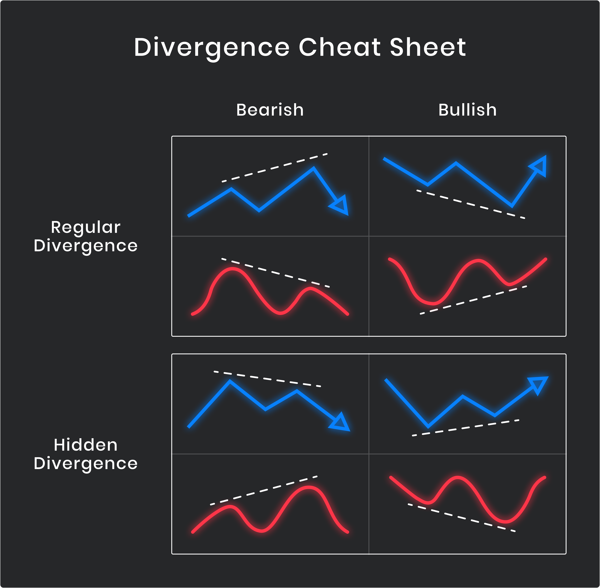

## Table of Contents

## What is divergence in technical analysis?

Divergence in technical analysis is when the price of an asset moves in the opposite direction of a technical indicator, like the Relative Strength Index (RSI) or Moving Average Convergence Divergence (MACD). For example, if the price of a stock is going up but the RSI is going down, that's a bearish divergence. It suggests that the upward trend might be losing strength and could reverse soon.

There are two main types of divergence: regular and hidden. Regular divergence can signal a potential trend reversal. If you see a higher high in price but a lower high in the indicator, it might mean the uptrend is about to end. Hidden divergence, on the other hand, can signal a trend continuation. If the price makes a higher low but the indicator makes a lower low, it might mean the uptrend will keep going.

Understanding divergence can help traders make better decisions. By spotting these patterns, traders can predict when a trend might change or continue. This can help them decide when to buy or sell an asset. However, divergence should not be used alone; it's best used with other analysis tools to confirm signals.

## How can divergence be identified on a chart?

To identify divergence on a chart, you need to look at both the price of the asset and a technical indicator, like the RSI or MACD. First, find the highs and lows on the price chart. Then, compare these to the highs and lows on the indicator. If the price is making higher highs but the indicator is making lower highs, you have a bearish divergence. If the price is making lower lows but the indicator is making higher lows, you have a bullish divergence.

For regular divergence, which signals a possible trend reversal, look for the price and the indicator moving in opposite directions at the peaks or troughs. For example, if the price hits a new high but the RSI does not, this could mean the uptrend is weakening and might reverse soon. Hidden divergence, which signals a trend continuation, is a bit different. Here, you'll see the price making a higher low while the indicator makes a lower low in an uptrend, or the price making a lower high while the indicator makes a higher high in a downtrend.

Using simple tools like trend lines can help you spot these patterns more easily. Draw a line connecting the highs or lows on both the price chart and the indicator. If these lines are moving in opposite directions, you've found a divergence. Always remember to use other analysis tools to confirm what the divergence is telling you, as it's not always a perfect predictor on its own.

## What are the different types of divergence?

There are two main types of divergence: regular divergence and hidden divergence. Regular divergence happens when the price of an asset and a technical indicator, like the RSI or MACD, move in opposite directions at important points like highs and lows. This type of divergence can signal that a trend might be about to reverse. For example, if the price of a stock keeps going up to new highs but the RSI starts making lower highs, it's a bearish regular divergence, suggesting the uptrend might be weakening and could soon turn into a downtrend.

Hidden divergence, on the other hand, can signal that a trend might continue. It happens when the price and the indicator move in opposite directions at less obvious points, like when the price is making a higher low but the indicator is making a lower low in an uptrend. This can mean that the current trend is strong and likely to keep going. For instance, if a stock price dips but then makes a higher low while the RSI makes a lower low, it's a bullish hidden divergence, indicating that the uptrend should continue.

Both types of divergence can be useful for traders. Regular divergence helps spot potential trend reversals, while hidden divergence can confirm that a trend is still strong. However, it's important to use other tools and indicators to confirm what the divergence is showing, as it's not always a perfect predictor on its own.

## Can you explain the difference between bullish and bearish divergence?

Bullish divergence happens when the price of a stock is going down, but a technical indicator, like the RSI or MACD, is going up. Imagine the stock price hits a new low, but the indicator doesn't go as low as before. This mismatch can mean that the downward trend might be losing strength and could soon start going up. It's like a hint that the stock might be ready to turn around and start climbing.

Bearish divergence is the opposite. It happens when the stock price is going up, but the indicator is going down. For example, if the stock price reaches a new high, but the indicator doesn't reach a new high and instead makes a lower high, it's a bearish divergence. This suggests that the upward trend might be weakening and could soon start going down. It's a warning sign that the stock might be about to reverse and start falling.

## What is the significance of divergence in trading decisions?

Divergence is important for traders because it can help them guess when a stock's price might change direction. When you see the price going one way and the indicator going the other way, it's like a signal that the current trend might be getting weak. For example, if the stock price keeps going up but the RSI starts going down, it might mean the price will soon start going down too. This can help traders decide when to sell their stocks before the price drops.

On the other hand, divergence can also tell traders that a trend might keep going. If the stock price dips a bit but then starts going up again, and the indicator shows the opposite, it might mean the upward trend is still strong. This can help traders feel more confident about keeping their stocks or even buying more. But, it's always a good idea to use other tools and indicators too, because divergence alone isn't always right.

## How does divergence relate to momentum indicators like the RSI or MACD?

Divergence happens when the price of a stock and a [momentum](/wiki/momentum) indicator like the RSI or MACD move in opposite directions. For example, if the stock price keeps going up but the RSI starts going down, that's a bearish divergence. It means the upward trend might be losing strength and could soon start going down. This can help traders decide when to sell their stocks before the price drops. On the other hand, if the stock price goes down but the RSI goes up, that's a bullish divergence. It suggests the downward trend might be weakening and the price could start going up soon.

Momentum indicators like the RSI and MACD are useful because they show how fast the price is moving. When these indicators start moving in the opposite direction of the price, it's a sign that the current trend might be about to change. Traders use this information to make better decisions about buying or selling stocks. But, it's important to remember that divergence is just one tool. Traders should also look at other indicators and market conditions to make sure their decisions are as good as possible.

## What are common mistakes traders make when using divergence?

One common mistake traders make when using divergence is relying on it too much. Divergence can give good hints about when a stock's price might change, but it's not perfect. Traders sometimes forget to look at other things like the overall market, news, and other indicators. This can lead them to make bad trades because they're only focusing on divergence.

Another mistake is not waiting for enough evidence. Sometimes, traders see a small difference between the price and the indicator and think it's a clear sign of divergence. But small differences can happen by chance and don't always mean the price will change. It's better to wait for a strong, clear divergence signal before making a trade. This can help traders avoid jumping into trades too soon and losing money.

## How can divergence be used in conjunction with other technical analysis tools?

Divergence can be a helpful tool for traders, but it works best when used with other technical analysis tools. For example, traders often use divergence along with trend lines to spot when a stock's price might change direction. If they see a bearish divergence, where the price is going up but the RSI is going down, they might draw a trend line on the price chart to see if it's about to break. This can give them more confidence that the price will soon start going down. They might also look at support and resistance levels to see if the price is near a point where it often changes direction.

Another way to use divergence with other tools is by looking at moving averages. If a trader sees a bullish divergence, where the price is going down but the RSI is going up, they might check if the price is about to cross above a moving average. This can be a sign that the price will start going up soon. Volume indicators can also be useful. If the [volume](/wiki/volume-trading-strategy) is high when a divergence happens, it can make the signal stronger. By combining divergence with these other tools, traders can make better decisions about when to buy or sell stocks.

## What are the limitations of using divergence in trading?

Divergence can be a helpful tool for traders, but it has some limits. One big problem is that it can give false signals. Sometimes, the price and the indicator might move in opposite directions, but the price doesn't change as expected. This can lead traders to make bad trades if they rely too much on divergence alone. Another limit is that divergence doesn't tell you when the price will change. It can show that a change might happen, but it doesn't say if it will be soon or later. This can make it hard for traders to decide when to buy or sell.

Also, divergence works best when used with other tools, but it can be tricky to combine everything correctly. If traders don't use other indicators and market information along with divergence, they might miss important signs. For example, they might not see that the overall market is going down, even if there's a bullish divergence on a single stock. This can lead to mistakes. So, while divergence can be useful, traders need to be careful and use it as part of a bigger plan to make the best decisions.

## Can divergence be applied to different time frames, and how does this affect its reliability?

Divergence can be used on different time frames, like short-term charts that show minutes or hours, and long-term charts that show days or weeks. When you look at divergence on a short-term chart, it might show you quick changes in the price that could happen soon. But these signals can be less reliable because short-term prices can be more jumpy and affected by small things. On the other hand, looking at divergence on a long-term chart can give you a better idea of bigger trends that might last longer. These signals are often more reliable because they show what's happening over a longer time, but they might not help you make quick trades.

Using divergence on different time frames can help traders see both short-term and long-term trends. For example, if you see a bullish divergence on a daily chart and also on a weekly chart, it can make you more confident that the price will go up. But if the divergence only shows up on a short-term chart and not on a longer one, it might be a false signal. So, it's a good idea to check divergence on different time frames to get a fuller picture of what might happen with the price. This can help traders make better decisions, but they should always use other tools too to make sure they're not missing anything important.

## How can traders confirm a divergence signal before entering a trade?

Traders can confirm a divergence signal by using other technical analysis tools along with it. For example, if they see a bullish divergence where the price is going down but the RSI is going up, they might look at the moving averages. If the price is about to cross above a moving average, it can make the bullish divergence signal stronger. They can also check the volume. If the volume is high when the divergence happens, it can mean that more people are trading, which can make the signal more reliable.

Another way to confirm a divergence signal is by looking at trend lines and support and resistance levels. If a trader sees a bearish divergence where the price is going up but the RSI is going down, they might draw a trend line on the price chart. If the price is about to break the trend line, it can make the bearish divergence signal more trustworthy. Also, if the price is near a resistance level when the bearish divergence happens, it can mean the price might soon start going down. By using these other tools, traders can feel more sure about their decisions and avoid making trades based on false signals.

## What advanced strategies involve multiple divergences or hidden divergences?

Advanced traders sometimes use multiple divergences to make better guesses about where the price might go. They look for more than one divergence signal happening at the same time on different indicators or time frames. For example, if they see a bearish divergence on both the RSI and the MACD, it can make them more sure that the price will go down soon. They might also check for divergences on both a short-term chart, like an hourly chart, and a long-term chart, like a daily chart. If both charts show the same kind of divergence, it can be a stronger sign that the price will change direction. This way, traders can feel more confident about their trades because they're using more information.

Hidden divergences are another advanced strategy that traders use to guess if a trend will keep going. Hidden divergence happens when the price and the indicator move in opposite directions at less obvious points, like when the price makes a higher low but the indicator makes a lower low in an uptrend. Traders look for these hidden divergences to see if the current trend is still strong. For example, if they see a bullish hidden divergence on the RSI while the price is in an uptrend, it can mean the price will keep going up. By spotting these hidden divergences, traders can decide to keep their stocks or even buy more, expecting the trend to continue.

## What is Understanding Technical Analysis?

Technical analysis is a methodology used by traders and investors to predict future market behavior by analyzing historical price data and trading volumes. The foundation of technical analysis lies in the assumption that all relevant information is already reflected in the current and past prices of an asset. Thus, by studying these price movements, traders can make informed predictions about future price trends.

### Key Principles and Tools

One of the primary principles of technical analysis is that market prices move in trends, and these trends can persist over time. Identifying and following these trends is crucial for successful trading. Several tools are employed to accomplish this, including trend lines, moving averages, and various indicators.

**Trend Lines**: A trend line is a straight line that connects two or more price points and extends into the future to act as a line of support or resistance. An upward trend line indicates a bullish market, while a downward trend line suggests a bearish market.

**Moving Averages**: This tool smooths out price data by creating a constantly updated average price. Moving averages come in various forms, with the simple moving average (SMA) and the exponential moving average (EMA) being the most common. The EMA gives more weight to the most recent prices, making it more responsive to new information.

Each type has its specific applications and is used to identify different market conditions. For instance, a moving average can help determine if an asset is in an uptrend or downtrend by comparing its short-term moving average with its long-term moving average.

### Importance of Price Patterns and Market Signals

Price patterns are formations created by the price movements of an asset on a chart. Recognizing these patterns is vital for traders as they can be indicative of potential market reversals or continuations. Common price patterns include head and shoulders, double tops and bottoms, and flags and pennants. These patterns, once identified, can provide traders with signals on when to enter or [exit](/wiki/exit-strategy) trades, thereby aiding in making evidence-based trading decisions.

### Common Technical Analysis Indicators

Several indicators are widely used to enhance the predictive power of technical analysis by quantifying market actions:

- **MACD (Moving Average Convergence Divergence)**: This trend-following momentum indicator highlights the relationship between two moving averages of a stock’s price. The MACD is calculated by subtracting the 26-period EMA from the 12-period EMA. A nine-day EMA of the MACD, known as the "signal line," is then plotted on top of the MACD line, which can function as a trigger for buy and sell signals.
$$
  \text{MACD} = \text{EMA}_{12} - \text{EMA}_{26}

$$

- **RSI (Relative Strength Index)**: This momentum oscillator measures the speed and change of price movements. It oscillates between zero and 100 and is considered overbought when above 70 and oversold when below 30, prompting traders to anticipate a reversal or correction.

- **Stochastic Oscillator**: This tool compares a security's closing price to its price range over a certain period. It is used to gauge market momentum and identify overbought or oversold conditions. The stochastic oscillator measures on a scale of 0 to 100, similar to the RSI.

These indicators are not meant to be used in isolation. Instead, successful traders often use them in conjunction with other forms of technical analysis to confirm trends and signals, thus enhancing the accuracy of their predictive models. By integrating these methods, traders and analysts can derive a more comprehensive view of market dynamics, leading to more successful trading outcomes.

## References & Further Reading

[1]: Bergstra, J., Bardenet, R., Bengio, Y., & Kégl, B. (2011). ["Algorithms for Hyper-Parameter Optimization."](https://papers.nips.cc/paper/4443-algorithms-for-hyper-parameter-optimization) Advances in Neural Information Processing Systems 24.

[2]: ["Advances in Financial Machine Learning"](https://www.amazon.com/Advances-Financial-Machine-Learning-Marcos/dp/1119482089) by Marcos Lopez de Prado

[3]: ["Evidence-Based Technical Analysis: Applying the Scientific Method and Statistical Inference to Trading Signals"](https://www.amazon.com/Evidence-Based-Technical-Analysis-Scientific-Statistical/dp/0470008741) by David Aronson

[4]: ["Machine Learning for Algorithmic Trading"](https://github.com/stefan-jansen/machine-learning-for-trading) by Stefan Jansen

[5]: ["Quantitative Trading: How to Build Your Own Algorithmic Trading Business"](https://www.amazon.com/Quantitative-Trading-Build-Algorithmic-Business/dp/1119800064) by Ernest P. Chan