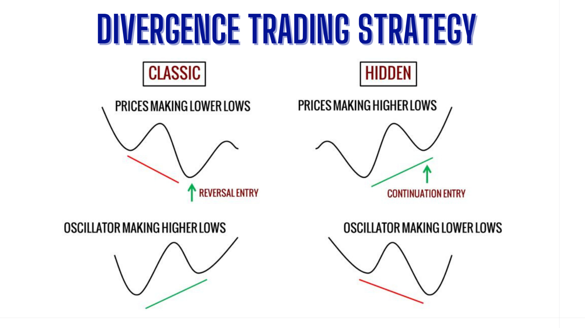

## Table of Contents

## What is a divergence trading strategy?

A divergence trading strategy is a way to trade in financial markets by looking for differences between an asset's price and a technical indicator. Traders use this strategy to spot when the price of an asset might change direction. For example, if the price of a stock is going up but the indicator is going down, this is called a bearish divergence. It might mean the price will start to fall soon. On the other hand, if the price is going down but the indicator is going up, this is a bullish divergence, suggesting the price might rise soon.

To use this strategy, traders watch the charts closely. They look for times when the price and the indicator are not moving in the same direction. When they see a divergence, they might decide to buy or sell the asset. It's important to use other tools and information too, not just divergence, to make better trading decisions. This strategy can help traders find good times to enter or exit trades, but it's not perfect and can sometimes give wrong signals.

## How does divergence occur in trading?

Divergence in trading happens when the price of an asset and a technical indicator move in different directions. For example, imagine the price of a stock is going up, but a common indicator like the Relative Strength Index (RSI) is going down. This difference between the price and the indicator is what we call divergence. Traders pay attention to this because it can be a sign that the price trend might be about to change.

There are two main types of divergence: bullish and bearish. Bullish divergence happens when the price of an asset is going down, but the indicator is going up. This can suggest that the price might start to rise soon. On the other hand, bearish divergence occurs when the price is going up, but the indicator is going down. This might mean that the price could start to fall. Traders use these signals to decide when to buy or sell, but they also use other tools to make sure their decisions are as good as possible.

## What are the different types of divergence?

There are two main types of divergence that traders look at: regular divergence and hidden divergence. Regular divergence is what most people think of when they hear about divergence. It happens when the price of an asset and an indicator move in opposite directions. There are two kinds of regular divergence: bullish and bearish. Bullish regular divergence happens when the price makes lower lows, but the indicator makes higher lows. This can mean that the price might start to go up soon. Bearish regular divergence is the opposite; the price makes higher highs, but the indicator makes lower highs, suggesting the price might go down soon.

Hidden divergence is a bit different. It's used to confirm the strength of a current trend rather than predicting a reversal. There are also two types of hidden divergence: bullish and bearish. Bullish hidden divergence happens when the price makes higher lows, but the indicator makes lower lows. This can show that the upward trend is still strong. Bearish hidden divergence is when the price makes lower highs, but the indicator makes higher highs, indicating that the downward trend might continue. Both types of divergence help traders make decisions, but they need to be careful and use other tools too.

## What are the basic steps to identify divergence on a chart?

To identify divergence on a chart, first, you need to look at the price of the asset and a technical indicator, like the RSI or MACD, at the same time. Watch the price movements and compare them to the movements of the indicator. If the price is going up and making higher highs, but the indicator is going down and making lower highs, you have a bearish divergence. If the price is going down and making lower lows, but the indicator is going up and making higher lows, that's a bullish divergence.

Once you spot a divergence, you should check other parts of the chart to see if the divergence is strong. Look at the trend lines, support and resistance levels, and other indicators to confirm the divergence signal. Not all divergences lead to a price change, so it's important to use more than just divergence to make trading decisions. By carefully analyzing the chart, you can increase your chances of making a good trade based on divergence.

## How can divergence be used to predict price movements?

Divergence can help traders predict when the price of an asset might change direction. It happens when the price and a technical indicator move in opposite ways. For example, if the price is going up but the indicator is going down, it's called bearish divergence. This might mean the price will start to go down soon. On the other hand, if the price is going down but the indicator is going up, it's called bullish divergence, which could mean the price might start to go up soon. Traders look for these signs to decide when to buy or sell.

To use divergence to predict price movements, traders need to watch the charts carefully. They look for times when the price and the indicator are not moving together. When they see a divergence, they check other parts of the chart too, like trend lines and other indicators, to make sure the divergence signal is strong. Not every divergence will lead to a price change, so it's important to use other tools to confirm the signal. By doing this, traders can make better guesses about where the price might go next.

## What are the common indicators used to spot divergence?

The most common indicators used to spot divergence are the Relative Strength Index (RSI) and the Moving Average Convergence Divergence (MACD). The RSI measures how fast and how much the price of an asset changes. It helps traders see if an asset is overbought or oversold. When the price goes up but the RSI goes down, it might mean the price will soon go down too. The MACD shows the relationship between two moving averages of an asset's price. If the price goes up but the MACD line goes down, it could be a sign that the price will start to fall.

Another useful indicator is the Stochastic Oscillator, which compares the closing price of an asset to its price range over a certain period. If the price is going up but the Stochastic Oscillator is going down, it can signal a bearish divergence. Traders also use the Commodity Channel Index (CCI) to spot divergence. The CCI measures the difference between an asset's price and its average price. If the price is going up but the CCI is going down, it might mean the price will soon drop. By watching these indicators, traders can better predict when the price might change direction.

## What are the potential entry and exit signals based on divergence?

When using divergence to trade, a potential entry signal for buying happens when you see a bullish divergence. This is when the price of the asset is going down, making lower lows, but the indicator, like the RSI or MACD, is going up, making higher lows. This can mean the price might start to go up soon. So, traders might decide to buy the asset at this point, hoping to profit from the expected price increase. On the other hand, a potential entry signal for selling comes from a bearish divergence. This is when the price is going up, making higher highs, but the indicator is going down, making lower highs. This could mean the price will start to go down soon, so traders might sell the asset to avoid losses or to profit from the expected price drop.

Exit signals based on divergence are also important. For a long position, where you have bought an asset, you might look for a bearish divergence as a sign to sell and exit your trade. This happens when the price is still going up, but the indicator is going down, suggesting the price might soon fall. It's a good time to sell to lock in your profits before the price drops. For a short position, where you have sold an asset hoping to buy it back at a lower price, a bullish divergence can be your exit signal. This is when the price is going down, but the indicator is going up, hinting that the price might start to rise. It's a good time to buy back the asset to close your short position and take your profits before the price goes up too much.

## How can one manage risks when using a divergence trading strategy?

Managing risks when using a divergence trading strategy is important to protect your money. One way to do this is by setting stop-loss orders. A stop-loss order is like a safety net that automatically sells your asset if the price goes down to a certain level. This helps you limit how much money you might lose if the divergence signal doesn't work out as expected. Another way to manage risk is by not putting all your money into one trade. Instead, spread your money across different trades. This way, if one trade goes wrong, you won't lose everything.

It's also a good idea to use other tools and information along with divergence signals. Don't just rely on divergence alone. Look at other indicators, like trend lines and support and resistance levels, to make sure your trading decision is strong. Also, keep an eye on the news and events that might affect the price of the asset you're trading. By using all these tools together, you can make better trading decisions and manage your risks more effectively.

## What are the advantages of using divergence in trading?

Using divergence in trading can help traders spot when the price of an asset might change direction. Divergence happens when the price and a technical indicator move in different ways. For example, if the price is going up but the indicator is going down, it might mean the price will start to fall soon. This early warning can help traders make better decisions about when to buy or sell. By noticing these signs, traders can enter or exit trades at good times, which can lead to making more money.

Another advantage of using divergence is that it can be used with many different indicators and assets. Traders can use tools like the RSI, MACD, or Stochastic Oscillator to find divergence signals. This flexibility means traders can apply the strategy to stocks, forex, cryptocurrencies, and more. By using divergence along with other tools and information, traders can make their trading strategies stronger and more reliable. This can help them manage risks better and increase their chances of success in the markets.

## What are the limitations and challenges of divergence trading?

Divergence trading can be tricky because it's not always right. Sometimes, you might see a divergence signal, but the price doesn't change direction like you thought it would. This can lead to losses if you make a trade based on a false signal. Another challenge is that divergence can be hard to spot. You need to watch the charts closely and know how to read them well. If you miss a divergence or see one that isn't really there, you could make a bad trade.

Also, divergence signals can be delayed. By the time you see a divergence and act on it, the price might have already moved a lot. This means you might miss the best time to enter or exit a trade. It's important to use other tools and information along with divergence to make better trading decisions. Relying only on divergence can be risky because it's just one part of the puzzle.

## How can divergence trading be combined with other technical analysis tools?

Divergence trading can be made stronger by using it with other technical analysis tools. For example, traders often use trend lines to see if the price is going up or down over time. If you see a bullish divergence and the price is also hitting a strong support level, it might be a good time to buy. The same goes for bearish divergence; if the price is near a resistance level, it might be a good time to sell. By looking at these things together, you can make better guesses about where the price might go next.

Another way to combine divergence trading with other tools is by using other indicators like moving averages or the Bollinger Bands. Moving averages can help you see the overall trend of the price. If you see a divergence and the price is moving away from a moving average, it might confirm that a change in direction is coming. Bollinger Bands can show if the price is too high or too low. If you see a divergence and the price is outside the Bollinger Bands, it might be a strong signal to enter or exit a trade. Using these tools together helps traders make more informed decisions and manage their risks better.

## What are some advanced techniques for enhancing the effectiveness of divergence trading?

To make divergence trading work better, traders can use something called "multiple time frame analysis." This means looking at the same asset on different time frames, like daily, hourly, and 15-minute charts. If you see a divergence on more than one time frame, it can be a stronger signal that the price might change direction. For example, if you spot a bullish divergence on both the daily and hourly charts, it's a good idea to pay close attention because it could mean the price will go up soon. By checking different time frames, you can get a clearer picture of what might happen next.

Another advanced technique is using "confirmation indicators" along with divergence. These are other tools that help make sure the divergence signal is strong. For example, you might use the volume indicator to see if more people are buying or selling the asset. If you see a bullish divergence and the volume is also going up, it's a good sign that the price might start to rise. Another useful confirmation tool is the Fibonacci retracement levels. If the price hits a key Fibonacci level at the same time as a divergence, it can be a powerful signal to enter or exit a trade. By using these extra tools, you can increase your chances of making successful trades based on divergence.

## What are the results of backtesting divergence strategies?

Backtesting is an essential step in evaluating the effectiveness of a divergence trading strategy. It involves simulating a trading strategy using historical data to determine how it would have performed in the past. This process provides an insight into the strategy's potential future performance and helps traders identify strengths and weaknesses before deploying it in live trading.

To effectively backtest a divergence strategy, it is important to focus on evaluating key performance metrics. One of the most widely used metrics is the Sharpe Ratio, which measures the strategy's risk-adjusted return. The Sharpe Ratio is calculated using the formula:

$$
\text{Sharpe Ratio} = \frac{E[R - R_f]}{\sigma}
$$

where $E[R]$ is the expected return of the strategy, $R_f$ is the risk-free rate, and $\sigma$ is the standard deviation of the strategy's excess return. A higher Sharpe Ratio indicates a more attractive risk-adjusted return.

Another important metric is the Profit Factor, which is the ratio of gross profits to gross losses. It is calculated using:

$$
\text{Profit Factor} = \frac{\sum{\text{Winning Trades}}}{\sum{\text{Losing Trades}}}
$$

A Profit Factor greater than one indicates a profitable strategy, with higher values reflecting greater profitability.

Alongside these metrics, it is crucial to assess the drawdown, which measures the peak-to-trough decline during [backtesting](/wiki/backtesting). A strategy with a large drawdown may entail higher risk, potentially leading to significant losses during adverse market conditions.

When developing a backtesting framework, it is beneficial to use programming languages like Python due to their robust data analysis libraries. The pandas library can be particularly useful for handling time series data, while libraries such as [backtrader](/wiki/backtrader) or pyalgotrade can facilitate the creation of backtesting models.

Here's a simple example of backtesting a divergence strategy using Python:

```python
import pandas as pd
import numpy as np
from pandas_datareader import data as pdr

# Load historical data
data = pdr.get_data_yahoo('AAPL', start='2020-01-01', end='2023-01-01')
data['Returns'] = data['Adj Close'].pct_change()

# Define a simple divergence strategy (pseudo-code logic)
def divergence_strategy(data):
    signals = []
    for i in range(1, len(data)):
        # Example logic for divergence detection (customize this section)
        if data['Returns'].iloc[i] > 0.02 and data['Returns'].iloc[i-1] < 0:
            signals.append(1)  # Buy signal
        else:
            signals.append(0)  # Hold/No Action
    return signals

data['Signals'] = divergence_strategy(data)

# Calculate the strategy returns
data['StrategyReturns'] = data['Signals'].shift(1) * data['Returns']
sharpe_ratio = (data['StrategyReturns'].mean() / data['StrategyReturns'].std()) * np.sqrt(252)

# Output results
print(f"Sharpe Ratio: {sharpe_ratio:.2f}")
```

This script demonstrates importing historical price data, applying a simple divergence strategy, and calculating the Sharpe Ratio based on the strategy's returns. While this is a basic example, more complex strategies may incorporate additional indicators and confirmations.

In summary, backtesting provides critical insights into the viability of a divergence strategy, enabling traders to enhance their trading systems for better performance. Assessing risk-adjusted returns through metrics like the Sharpe Ratio and Profit Factor ensures that strategies are not only profitable but also efficient in terms of risk management.

## What are common mistakes and best practices?

In trading, solely relying on divergence signals can lead to misguided decisions. Divergence, while a powerful analytical tool, should not be used in isolation. Signals must be contextualized within broader market conditions and confirmed with additional tools, such as support and resistance levels or candlestick patterns. This multilayered approach helps validate divergence signals, reducing false positives and enhancing strategy precision.

Effective risk management is crucial in mitigating potential losses. Establishing stop-loss orders and position sizing are fundamental practices. A stop-loss order, for example, could be strategically placed just below the last swing low in an uptrend or above the last swing high in a downtrend. Position sizing techniques, such as the Kelly Criterion, help optimize the trade size to balance risk and potential returns:

$$
f^* = \frac{bp-q}{b}
$$

where $f^*$ is the fraction of the capital to be risked, $b$ is the odds received on the wager, $p$ is the probability of winning, and $q$ is the probability of losing ($q = 1-p$).

Thorough understanding and backtesting of divergence strategies are essential before live trading. Backtesting involves simulating the trading strategy using historical data to assess its viability and performance. Important metrics, such as the Sharpe Ratio and maximum drawdown, provide insights into the strategy's risk-adjusted returns and [volatility](/wiki/volatility-trading-strategies) exposure. A high Sharpe Ratio, for example, indicates a strategy offering higher returns per unit of risk, which is desirable in trading systems.

In Python, a simple backtesting framework using libraries like ‘pandas’ and ‘numpy’ can be employed to evaluate strategy performance:

```python
import pandas as pd
import numpy as np

def compute_strategy_perf(data, signals):
    returns = data['Price'].pct_change()
    strategy_returns = signals.shift(1) * returns
    cumulative_returns = (1 + strategy_returns).cumprod() - 1
    return cumulative_returns

# Example function call
data = pd.read_csv('historical_data.csv')
signals = generate_signals(data)  # hypothetical function
perf = compute_strategy_perf(data, signals)
```

In conclusion, integrating divergence analysis with comprehensive market understanding, effective risk management, and rigorous backtesting forms the foundation for a robust trading strategy. This disciplined approach helps traders effectively capitalize on divergence signals while minimizing associated risks.

## References & Further Reading

[1]: Murphy, J. J. (1999). ["Technical Analysis of the Financial Markets: A Comprehensive Guide to Trading Methods and Applications"](https://www.amazon.com/Technical-Analysis-Financial-Markets-Comprehensive/dp/0735200661). New York Institute of Finance.

[2]: Wilder, J. W. (1978). ["New Concepts in Technical Trading Systems"](https://www.amazon.com/New-Concepts-Technical-Trading-Systems/dp/0894590278). Trend Research.

[3]: Brown, C. (2007). ["Technical Analysis for the Trading Professional"](https://www.amazon.com/Technical-Analysis-Trading-Professional-Second/dp/007175914X). McGraw-Hill Education.

[4]: Achelis, S. B. (2000). ["Technical Analysis from A to Z"](https://books.google.com/books/about/Technical_Analysis_from_A_to_Z_2nd_Editi.html?id=XuiF-2eWHYUC). McGraw-Hill Education.

[5]: Pring, M. J. (2002). ["Momentum Explained, Vol. 1: Oscillators"](https://books.google.com/books/about/Momentum_Explained.html?id=_DdBsCIJDx0C). McGraw-Hill Education.

[6]: Elder, A. (1993). ["Trading for a Living: Psychology, Trading Tactics, Money Management"](https://www.amazon.com/Trading-Living-Psychology-Tactics-Management/dp/0471592242). Wiley.

[7]: van Tharp, R. (1998). ["Trade Your Way to Financial Freedom"](https://books.google.com/books/about/Trade_Your_Way_to_Financial_Freedom.html?id=_hLzpVIg2sMC). McGraw-Hill Education.

[8]: Connors, L., & Alvarez, C. (2009). ["Short Term Trading Strategies That Work"](https://www.amazon.com/Short-Term-Trading-Strategies-That/dp/0981923909). TradingMarkets Publishing Group.