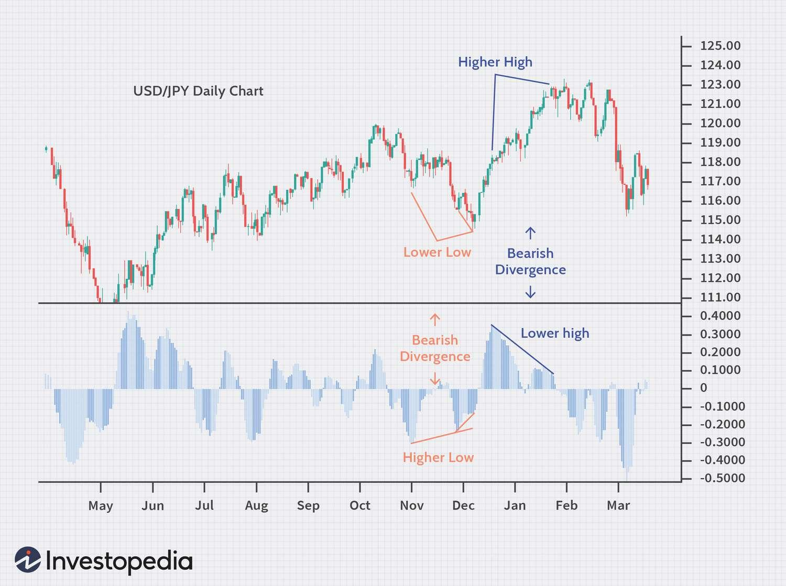

In algorithmic trading, divergence indicators play a crucial role in identifying potential reversals or shifts in market momentum. Divergence occurs when the price action of an asset contradicts the movement of a technical indicator, often signaling a possible change in trend direction. This discrepancy between price and indicator can provide early warnings of trend weaknesses, enabling traders to position themselves advantageously before these movements become evident to the broader market.

Divergence indicators are particularly valued for their ability to flag price momentum shifts that could lead to a reversal or continuation of a market trend. By anticipating these shifts, traders can strategically capitalize on market opportunities and make informed decisions about entering or exiting trades. This article will explore the fundamental concept of divergence, outline the different types of divergence, and evaluate the most effective indicators for detecting these critical market signals.



The primary aim is to assist traders in leveraging divergence indicators to recognize and act on trend shifts before they fully materialize. Divergence analysis, when effectively integrated into a trading strategy, can significantly enhance a trader's ability to anticipate market movements and manage risk. This discussion will highlight how divergence signals can indicate potential trends and offer insights for making well-informed trading decisions. Through this exploration, traders can develop a deeper understanding of divergence's role in algorithmic trading and its potential to improve trading performance through systematic and disciplined application.

## Table of Contents

## Understanding Divergence in Trading

Divergence in trading is a crucial concept that emerges when there is a discrepancy between the price action of an asset and the movement of a technical indicator. This divergence indicates a potential change in trend momentum, which can signal traders about impending market reversals. Understanding the two primary types of divergence—bullish and bearish—is essential for making informed trading decisions.

Bullish divergence occurs when the price of an asset is making lower lows, while a corresponding technical indicator, such as a momentum oscillator, is making higher lows. This pattern suggests that although the price is declining, the underlying momentum is strengthening, indicating a potential upside reversal. Conversely, bearish divergence is observed when the asset's price reaches higher highs, but the technical indicator forms lower highs. This scenario warns of a waning upward momentum and the possibility of a downward reversal.

The significance of divergence lies in its ability to highlight weakening trend momentum before it is evident in price action. Traders capitalize on these signals by anticipating reversals and adjusting their positions accordingly. It is important to note that while divergence provides valuable insights, it should be used in conjunction with other tools and strategies to confirm potential reversals and enhance trading accuracy.

## Types of Divergence

Divergence is a critical concept in technical analysis, providing valuable insights into potential trend reversals and continuations. Divergence occurs when there is a discrepancy between the price movement of an asset and the movement of a corresponding technical indicator. Two primary types of divergence are classical divergence and hidden divergence, each offering distinct implications for traders.

Classical divergence is typically associated with potential trend reversals. It emerges when the price of an asset forms higher highs or lower lows, whereas an indicator such as a [momentum](/wiki/momentum) oscillator shows the opposite movement, like lower highs in an uptrend or higher lows in a downtrend. For example, in a bullish classical divergence, the price reaches higher highs, but the Relative Strength Index (RSI) might display lower highs, suggesting a weakening of the current uptrend and signaling a possible reversal to the downside.

Mathematically, classical bullish divergence can be represented as:
$$
\text{Price: } P_2 > P_1
$$
$$
\text{Indicator: } I_2 < I_1
$$

Where $P_1$ and $P_2$ are consecutive higher highs in price, and $I_1$ and $I_2$ are corresponding lower highs in the indicator.

Hidden divergence is associated with potential trend continuations rather than reversals. It occurs when price corrections coincide with continuation patterns, suggesting the prevailing trend is likely to resume. In a bullish hidden divergence, for instance, the price forms higher lows during a retracement, while an indicator forms lower lows. This scenario indicates that although the price experiences a pullback, the underlying momentum remains strong, favoring a continuation of the existing uptrend.

A mathematical representation for bullish hidden divergence is:
$$
\text{Price: } P_2 > P_1
$$
$$
\text{Indicator: } I_2 < I_1
$$

In this context, $P_1$ and $P_2$ represent consecutive higher lows in price, and $I_1$ and $I_2$ illustrate corresponding lower lows in the indicator.

Traders utilize both types of divergence to enhance their market analysis and strategic decisions. Understanding and correctly identifying divergence can enable traders to anticipate changes in market trends, thereby optimizing their entry and [exit](/wiki/exit-strategy) points in trading.

## The Best Divergence Indicators

In [algorithmic trading](/wiki/algorithmic-trading), divergence indicators play a crucial role in identifying potential reversals in market trends. Momentum oscillators and [volume](/wiki/volume-trading-strategy)-based indicators are two primary categories of tools used for this purpose.

Momentum oscillators such as the Relative Strength Index (RSI), Moving Average Convergence Divergence (MACD), and Stochastic Oscillator are widely regarded for their efficacy in detecting divergence. RSI evaluates the speed and change of price movements, oscillating between zero and 100. Typically, a value above 70 suggests overbought conditions, while below 30 indicates oversold conditions. Divergence occurs when the RSI trend contradicts the price trend, indicating a possible reversal.

MACD, another popular indicator, utilizes the convergence and divergence of two moving averages to identify momentum changes. It consists of the MACD line, signal line, and histogram. Divergence is evident when the price exhibits higher highs or lower lows, but the MACD does not, hinting at a weakening trend. For instance, a bullish divergence is detected when the price hits a lower low, but the MACD forms a higher low.

The Stochastic Oscillator compares a particular closing price to a range of prices over a period of time, aiding in the identification of divergence by indicating whether an asset is overbought or oversold. Like RSI, divergence occurs when the oscillator's movements contradict price movements.

In addition to momentum oscillators, volume-based indicators like On-Balance Volume (OBV) and Chaikin Money Flow (CMF) offer valuable insights into market sentiment by analyzing trading volume. OBV adds volume on up days and subtracts it on down days, giving a cumulative total. Divergence signals arise when the OBV moves out of sync with the price trend, suggesting potential trend changes.

Chaikin Money Flow integrates price and volume data to measure the buying and selling pressure over a specific period. A divergence between CMF and price trend can indicate a potential reversal, where increasing positive values suggest buying pressure and decreasing negative values imply selling pressure.

These divergence indicators, if used effectively, can provide traders with early signals of impending market reversals, enhancing decision-making in algorithmic trading strategies.

## Backtesting Divergence Strategies

Backtesting is an essential step in evaluating the effectiveness of a divergence trading strategy. It involves simulating a trading strategy using historical data to determine how it would have performed in the past. This process provides an insight into the strategy's potential future performance and helps traders identify strengths and weaknesses before deploying it in live trading.

To effectively backtest a divergence strategy, it is important to focus on evaluating key performance metrics. One of the most widely used metrics is the Sharpe Ratio, which measures the strategy's risk-adjusted return. The Sharpe Ratio is calculated using the formula:

$$
\text{Sharpe Ratio} = \frac{E[R - R_f]}{\sigma}
$$

where $E[R]$ is the expected return of the strategy, $R_f$ is the risk-free rate, and $\sigma$ is the standard deviation of the strategy's excess return. A higher Sharpe Ratio indicates a more attractive risk-adjusted return.

Another important metric is the Profit Factor, which is the ratio of gross profits to gross losses. It is calculated using:

$$
\text{Profit Factor} = \frac{\sum{\text{Winning Trades}}}{\sum{\text{Losing Trades}}}
$$

A Profit Factor greater than one indicates a profitable strategy, with higher values reflecting greater profitability.

Alongside these metrics, it is crucial to assess the drawdown, which measures the peak-to-trough decline during [backtesting](/wiki/backtesting). A strategy with a large drawdown may entail higher risk, potentially leading to significant losses during adverse market conditions.

When developing a backtesting framework, it is beneficial to use programming languages like Python due to their robust data analysis libraries. The pandas library can be particularly useful for handling time series data, while libraries such as [backtrader](/wiki/backtrader) or pyalgotrade can facilitate the creation of backtesting models.

Here's a simple example of backtesting a divergence strategy using Python:

```python
import pandas as pd
import numpy as np
from pandas_datareader import data as pdr

# Load historical data
data = pdr.get_data_yahoo('AAPL', start='2020-01-01', end='2023-01-01')
data['Returns'] = data['Adj Close'].pct_change()

# Define a simple divergence strategy (pseudo-code logic)
def divergence_strategy(data):
    signals = []
    for i in range(1, len(data)):
        # Example logic for divergence detection (customize this section)
        if data['Returns'].iloc[i] > 0.02 and data['Returns'].iloc[i-1] < 0:
            signals.append(1)  # Buy signal
        else:
            signals.append(0)  # Hold/No Action
    return signals

data['Signals'] = divergence_strategy(data)

# Calculate the strategy returns
data['StrategyReturns'] = data['Signals'].shift(1) * data['Returns']
sharpe_ratio = (data['StrategyReturns'].mean() / data['StrategyReturns'].std()) * np.sqrt(252)

# Output results
print(f"Sharpe Ratio: {sharpe_ratio:.2f}")
```

This script demonstrates importing historical price data, applying a simple divergence strategy, and calculating the Sharpe Ratio based on the strategy's returns. While this is a basic example, more complex strategies may incorporate additional indicators and confirmations.

In summary, backtesting provides critical insights into the viability of a divergence strategy, enabling traders to enhance their trading systems for better performance. Assessing risk-adjusted returns through metrics like the Sharpe Ratio and Profit Factor ensures that strategies are not only profitable but also efficient in terms of risk management.

## Implementing Divergence in Algorithmic Trading

Incorporating divergence analysis into algorithmic trading models can significantly automate and enhance trading strategies. Divergence, as a concept, identifies discrepancies between price movements and technical indicators, highlighting potential market reversals. When algorithmically detected, divergence patterns can provide timely trade signals that are both objective and devoid of emotional bias, crucial elements for maintaining consistency in trading.

One effective method to implement divergence analysis in algorithmic trading is by combining it with confirmation signals. Confirmation signals, such as candlestick patterns or volume trends, can reinforce the validity of a detected divergence. For example, a bearish divergence identified by an algorithm using the Relative Strength Index (RSI) might be confirmed by observing a bearish engulfing candlestick pattern. This multi-layered confirmation process reduces the likelihood of false signals, making the strategy more robust.

Implementation begins with selecting suitable indicators that can reliably detect divergence, such as the Moving Average Convergence Divergence (MACD) or the Stochastic Oscillator. These indicators can be programmatically analyzed using a variety of software platforms. A basic Python implementation might look like this:

```python
import pandas as pd
import talib

def find_divergence(price, indicator):
    # Placeholder function for identifying divergence
    price_diff = price.diff()  # Price changes
    ind_diff = indicator.diff()  # Indicator changes
    divergence = (price_diff < 0) & (ind_diff > 0)  # Example condition for bullish divergence
    return divergence

# Sample data
price_data = pd.Series([120, 125, 130, 128, 126, 129, 134])
rsi = talib.RSI(price_data)

divergence_signals = find_divergence(price_data, rsi)
```

In the code above, the `find_divergence` function identifies potential divergence conditions. The subsequent integration of other signals, such as assessing volume trends or confirming candlestick patterns, can be added to the algorithm, providing a more comprehensive analysis. For instance, a program could be enhanced to only trigger a trading action if corroborative volume changes exceed a certain threshold or if specific candlestick patterns are met within the same timeframe.

Moreover, the practical implementation of divergence-based algorithms requires meticulous parameter tuning and rigorous backtesting. Ensuring that the algorithm works well across various market conditions will involve optimizing factors like indicator periods, divergence thresholds, and confirmation criteria.

Another potential enhancement is the use of [machine learning](/wiki/machine-learning) models to augment divergence detection and confirmation. Algorithms can be trained to recognize complex patterns and relationships that might not be immediately apparent through straightforward indicator comparisons. However, the complexity of such systems necessitates a cautious approach, often involving cross-validation and out-of-sample testing to confirm model efficacy.

In summary, effectively implementing divergence strategies in algorithmic trading involves not only the identification of divergence patterns but also the integration of multiple confirmation signals to increase trading success rates. This process, built upon robust coding and thorough strategy validation, has the potential to capitalize on market inefficiencies and provide traders with a competitive edge.

## Common Mistakes and Best Practices

In trading, solely relying on divergence signals can lead to misguided decisions. Divergence, while a powerful analytical tool, should not be used in isolation. Signals must be contextualized within broader market conditions and confirmed with additional tools, such as support and resistance levels or candlestick patterns. This multilayered approach helps validate divergence signals, reducing false positives and enhancing strategy precision.

Effective risk management is crucial in mitigating potential losses. Establishing stop-loss orders and position sizing are fundamental practices. A stop-loss order, for example, could be strategically placed just below the last swing low in an uptrend or above the last swing high in a downtrend. Position sizing techniques, such as the Kelly Criterion, help optimize the trade size to balance risk and potential returns:

$$
f^* = \frac{bp-q}{b}
$$

where $f^*$ is the fraction of the capital to be risked, $b$ is the odds received on the wager, $p$ is the probability of winning, and $q$ is the probability of losing ($q = 1-p$).

Thorough understanding and backtesting of divergence strategies are essential before live trading. Backtesting involves simulating the trading strategy using historical data to assess its viability and performance. Important metrics, such as the Sharpe Ratio and maximum drawdown, provide insights into the strategy's risk-adjusted returns and [volatility](/wiki/volatility-trading-strategies) exposure. A high Sharpe Ratio, for example, indicates a strategy offering higher returns per unit of risk, which is desirable in trading systems.

In Python, a simple backtesting framework using libraries like ‘pandas’ and ‘numpy’ can be employed to evaluate strategy performance:

```python
import pandas as pd
import numpy as np

def compute_strategy_perf(data, signals):
    returns = data['Price'].pct_change()
    strategy_returns = signals.shift(1) * returns
    cumulative_returns = (1 + strategy_returns).cumprod() - 1
    return cumulative_returns

# Example function call
data = pd.read_csv('historical_data.csv')
signals = generate_signals(data)  # hypothetical function
perf = compute_strategy_perf(data, signals)
```

In conclusion, integrating divergence analysis with comprehensive market understanding, effective risk management, and rigorous backtesting forms the foundation for a robust trading strategy. This disciplined approach helps traders effectively capitalize on divergence signals while minimizing associated risks.

## Conclusion

Divergence indicators serve as significant tools in algorithmic trading by pinpointing potential market reversals. Through highlighting discrepancies between price action and technical indicators, these tools alert traders to possible changes in market momentum before they are fully reflected in broader trends. Utilizing divergence indicators allows traders to capitalize on these opportunities, often leading to profitable trade outcomes.

The implementation of a well-tested divergence strategy can substantially enhance trading performance. When used in conjunction with other technical analysis tools, such as moving averages or support and resistance levels, these strategies become more robust, providing a layered approach to market analysis. This multi-faceted strategy enables traders to corroborate divergence signals, thereby increasing the likelihood of successful trades.

Discipline and systematic approaches are crucial when leveraging divergence in algorithmic trading. Without a methodical process, traders risk making decisions based on incomplete analysis, potentially ignoring market dynamics that could impact trade outcomes. Effective trading therefore demands not only the integration of sophisticated technical analysis but also a commitment to consistent practice and evaluation. Through such disciplined methodology, traders can optimize their use of divergence indicators, ensuring that their strategies are both informed and adaptable to evolving market conditions.

## References & Further Reading

[1]: Murphy, J. J. (1999). ["Technical Analysis of the Financial Markets: A Comprehensive Guide to Trading Methods and Applications"](https://www.amazon.com/Technical-Analysis-Financial-Markets-Comprehensive/dp/0735200661). New York Institute of Finance.

[2]: Wilder, J. W. (1978). ["New Concepts in Technical Trading Systems"](https://www.amazon.com/New-Concepts-Technical-Trading-Systems/dp/0894590278). Trend Research.

[3]: Brown, C. (2007). ["Technical Analysis for the Trading Professional"](https://www.amazon.com/Technical-Analysis-Trading-Professional-Second/dp/007175914X). McGraw-Hill Education.

[4]: Achelis, S. B. (2000). ["Technical Analysis from A to Z"](https://books.google.com/books/about/Technical_Analysis_from_A_to_Z_2nd_Editi.html?id=XuiF-2eWHYUC). McGraw-Hill Education.

[5]: Pring, M. J. (2002). ["Momentum Explained, Vol. 1: Oscillators"](https://books.google.com/books/about/Momentum_Explained.html?id=_DdBsCIJDx0C). McGraw-Hill Education.

[6]: Elder, A. (1993). ["Trading for a Living: Psychology, Trading Tactics, Money Management"](https://www.amazon.com/Trading-Living-Psychology-Tactics-Management/dp/0471592242). Wiley.

[7]: van Tharp, R. (1998). ["Trade Your Way to Financial Freedom"](https://books.google.com/books/about/Trade_Your_Way_to_Financial_Freedom.html?id=_hLzpVIg2sMC). McGraw-Hill Education.

[8]: Connors, L., & Alvarez, C. (2009). ["Short Term Trading Strategies That Work"](https://www.amazon.com/Short-Term-Trading-Strategies-That/dp/0981923909). TradingMarkets Publishing Group.