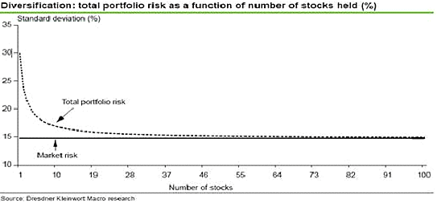

## Table of Contents

## What is diversification in investing?

Diversification in investing means spreading your money across different types of investments. This can help reduce the risk of losing money because if one investment does poorly, others might do well and balance it out. For example, instead of putting all your money into one company's stock, you could invest in stocks from different industries, bonds, and real estate.

A simple way to think about diversification is not putting all your eggs in one basket. If you only invest in one thing and it fails, you could lose a lot of money. But if you spread your investments, you're less likely to lose everything at once. This strategy can help you feel more secure about your investments and potentially earn more stable returns over time.

## Why is diversification important for a portfolio?

Diversification is important for a portfolio because it helps lower the risk of losing money. When you spread your investments across different types of assets, like stocks, bonds, and real estate, you're not relying on just one thing to do well. If one investment goes down in value, others might go up or stay the same, which can help balance out your losses. This way, you're less likely to lose a lot of money all at once.

Another reason diversification is important is that it can help you get better returns over time. By investing in different areas, you can take advantage of opportunities in various markets. For example, if the stock market is doing poorly, your bonds might be doing well. This mix can lead to more stable and potentially higher returns in the long run. Diversification helps you build a stronger, more resilient portfolio that can weather different economic conditions.

## What is the 30 stock portfolio myth?

The 30 stock portfolio myth is the idea that if you own 30 different stocks, you're fully diversified and safe from big losses. People used to think that having 30 stocks would spread out the risk so much that you wouldn't lose much money even if some stocks did badly. But this isn't always true because not all stocks are different enough from each other. If you own 30 stocks but they're all from the same industry, like tech, and the tech industry has a bad year, your portfolio could still lose a lot of money.

Diversification isn't just about the number of stocks you own. It's about making sure those stocks are from different industries and types of companies. For example, having stocks in tech, healthcare, and energy, along with some bonds and real estate, can help protect your money better. So, while having 30 stocks can be a good start, it's more important to make sure those stocks are spread out across different areas of the economy. This way, you're truly reducing your risk and building a stronger portfolio.

## How did the concept of a 30 stock portfolio originate?

The idea of a 30 stock portfolio came from a study done a long time ago. People thought that if you owned 30 different stocks, you would be safe from big losses. They believed that with 30 stocks, the risk would be spread out so much that even if some stocks did badly, the others would balance it out.

But over time, people realized that just having 30 stocks isn't enough. If all those stocks are from the same industry, like tech or healthcare, and that industry has a bad year, your portfolio could still lose a lot of money. So, it's not just about the number of stocks you own, but also about making sure those stocks are from different parts of the economy.

## Can a portfolio of 30 stocks truly be considered diversified?

A portfolio of 30 stocks can be considered diversified, but it depends on what those stocks are. Just having 30 stocks doesn't mean you're safe from big losses. If all those stocks are from the same industry, like tech or healthcare, and that industry has a bad year, your portfolio could still lose a lot of money. So, it's not just about the number of stocks you own, but also about making sure those stocks are from different parts of the economy.

To truly be diversified, your 30 stocks should be spread out across different industries and types of companies. For example, having stocks in tech, healthcare, and energy, along with some bonds and real estate, can help protect your money better. This way, if one industry does poorly, the others might do well and balance it out. So, while having 30 stocks can be a good start, it's more important to make sure those stocks are spread out across different areas of the economy.

## What are the risks of not diversifying beyond 30 stocks?

If you only have 30 stocks and they're all from the same industry, you could be in big trouble if that industry has a bad year. For example, if all your stocks are in tech and the tech industry goes down, your whole portfolio could lose a lot of money. This is because you're not spreading your risk across different areas of the economy. If one thing goes wrong, it can hurt your whole portfolio.

Not diversifying beyond 30 stocks can also mean missing out on other good investments. If you only focus on stocks and ignore things like bonds or real estate, you might not get the best returns. Bonds can be safer and give you steady income, while real estate can grow in value over time. By not spreading your money across different types of investments, you might not be as protected or have the chance to make more money in the long run.

## How does the number of stocks in a portfolio affect its risk and return?

The number of stocks in a portfolio can affect its risk and return. If you have more stocks, you can spread out your risk better. This means if one stock does badly, it won't hurt your whole portfolio as much because you have other stocks that might do well. But if you have fewer stocks, your portfolio can be riskier because a single stock doing badly can have a bigger impact.

However, having more stocks doesn't always mean you'll get better returns. If all your stocks are from the same industry, like tech, and that industry has a bad year, your whole portfolio could lose money. So, it's not just about having more stocks, but also about making sure those stocks are from different industries. This way, you can balance out the ups and downs of the market and possibly get better returns over time.

## What role do different asset classes play in diversification?

Different asset classes play a big role in diversification. They help spread out your risk by not putting all your money in one type of investment. For example, if you only have stocks and the stock market goes down, you could lose a lot of money. But if you also have bonds, which are usually safer, they might go up or stay the same when stocks go down. This can help balance out your losses and make your portfolio more stable.

Another way different asset classes help is by giving you chances to make money in different parts of the economy. Stocks might do well when the economy is growing, but real estate can be good when people are buying homes. By having a mix of stocks, bonds, real estate, and maybe even some cash, you can take advantage of different opportunities. This mix can lead to better returns over time and make your portfolio stronger against different economic conditions.

## How can an investor measure the diversification of their portfolio?

An investor can measure the diversification of their portfolio by looking at how their money is spread out across different types of investments. They should check if they have money in different asset classes like stocks, bonds, real estate, and cash. It's also important to see if their stocks are from different industries, like tech, healthcare, and energy. If all their money is in one type of investment or one industry, their portfolio isn't very diversified. A good way to see this is by using a tool called a pie chart or a list that shows how much money is in each type of investment.

Another way to measure diversification is by looking at how their investments move together. If all their investments go up and down at the same time, they're not very diversified. This is called correlation. Investors can use tools like a correlation matrix to see how different parts of their portfolio move together. If they see that some investments move differently, it means they're helping to spread out the risk. By keeping an eye on these things, investors can make sure their portfolio is well-diversified and less likely to lose a lot of money all at once.

## What are some advanced strategies for achieving optimal diversification?

One advanced strategy for achieving optimal diversification is to use asset allocation models. This means deciding how much of your money to put into different types of investments, like stocks, bonds, and real estate, based on your goals and how much risk you're willing to take. You can use tools like the Modern Portfolio Theory, which helps you find the best mix of investments to get the highest return for the least amount of risk. By regularly checking and adjusting your asset allocation, you can keep your portfolio diversified and working well for you over time.

Another strategy is to invest in different countries and currencies. This is called geographic diversification. If you only invest in one country and its economy does badly, your whole portfolio could lose money. But if you spread your investments across different countries, you can balance out the ups and downs of different economies. You can do this by buying international stocks, bonds, or even investing in global mutual funds or exchange-traded funds (ETFs). This way, you're not relying on just one country's economy to do well, which can make your portfolio safer and more likely to grow over time.

## How has modern portfolio theory influenced the approach to diversification?

Modern Portfolio Theory (MPT) has changed how people think about diversification. Before MPT, people thought that having more stocks in a portfolio was enough to spread out the risk. But MPT showed that it's not just about having more stocks; it's about choosing the right mix of investments. MPT says that you can get the best returns for the least amount of risk by putting your money into different types of investments, like stocks and bonds, that don't all go up and down at the same time. This idea helped people understand that diversification is about balancing different kinds of risks, not just having a lot of stocks.

Because of MPT, investors now look at how different parts of their portfolio move together. They use tools like correlation matrices to see if their investments are really helping to spread out the risk. If two investments always go up and down together, they're not helping to diversify the portfolio. MPT has made people think more carefully about how to mix their investments to make their portfolios safer and more likely to grow over time. This has led to better strategies for diversification and has helped investors make smarter choices about where to put their money.

## What are the latest research findings on the effectiveness of diversification in various market conditions?

Recent research has shown that diversification works well in many market conditions, but it's not a perfect solution. In calm markets, diversification helps by spreading out the risk, so if one investment goes down, others might go up and balance it out. But in really tough times, like during a big economic crash, all investments might go down together. This means that even a well-diversified portfolio can lose money when the whole market is struggling. Researchers have found that in these cases, things like bonds and cash can help protect your money better than just having a lot of different stocks.

Another finding from recent studies is that the type of diversification matters a lot. It's not just about having many different investments; it's about having the right mix. For example, having stocks from different industries and countries, along with bonds and real estate, can make your portfolio stronger. Researchers have also looked at how different asset classes move together and found that some, like stocks and bonds, often move in opposite directions. This can help your portfolio stay stable when markets are up and down. So, while diversification can't stop all losses, the right kind of diversification can make your investments safer and more likely to grow over time.

## Does diversification mean lower returns?

Some investors shy away from diversification, operating under the assumption that it might dilute returns. However, this belief overlooks the nuanced relationship between risk and return. Properly diversified portfolios are designed to mitigate unsystematic risk—risk specific to individual assets—which does not necessarily compromise overall returns. Instead, diversification often reduces portfolio volatility, thereby providing a smoother return experience across different market conditions.

The key lies in strategic asset allocation, which aims to balance risk and return in alignment with an investor’s financial objectives. For example, by allocating investments across different asset classes—such as equities, bonds, and commodities—investors can potentially insulate their portfolios from sector-specific downturns. Each asset class behaves differently under various economic scenarios, and their correlations to one another are essential in determining the overall risk. The goal is to achieve a portfolio where individual asset volatilities offset each other, reducing the portfolio's aggregate risk, commonly quantified through the portfolio’s expected volatility, $\sigma_p$:

$$
\sigma_p = \sqrt{\sum_{i=1}^{N} \sum_{j=1}^{N} w_i w_j \sigma_i \sigma_j \rho_{ij}}
$$

Where:
- $w_i$ and $w_j$ are the weights of assets $i$ and $j$
- $\sigma_i$ and $\sigma_j$ are the standard deviations of the returns of assets $i$ and $j$
- $\rho_{ij}$ is the correlation between the returns of assets $i$ and $j$

A diversified portfolio allows investors to capture various growth opportunities across sectors and geographies, making it more resilient to market fluctuations. This resilience is crucial during periods of economic uncertainty when asset classes do not move in lockstep. For instance, when equity markets are underperforming, assets like government bonds or gold might perform better, thus preserving portfolio value.

Strategic diversification does not equate to indiscriminate allocation into many different assets. Instead, it involves a thoughtful approach where asset selection and allocation are informed by factors such as market conditions, investor risk tolerance, and long-term investment goals. This strategic approach to diversification can be summarized through modern portfolio theory, which promotes the efficient frontier—a set of optimal portfolios offering the highest expected return for a defined level of risk.

Ultimately, proper diversification does not mean accepting lower returns but rather aiming for the optimization of risk-adjusted returns. By adopting a balanced investment strategy with clear objectives, investors can potentially benefit from the full spectrum of growth opportunities available in the global market, thereby enhancing the robustness and performance of their portfolios.

## Does Algorithmic Trading Aid Diversification?

Algorithmic trading, commonly known as algo trading, is frequently mischaracterized as purely speculative, focusing primarily on short-term gains rather than contributing to long-term investment strategies. However, this perspective overlooks the significant potential [algorithmic trading](/wiki/algorithmic-trading) holds for diversification. By employing sophisticated algorithms, investors can access a wider array of assets and markets, enhancing their portfolio's diversification and resilience.

Algorithmic trading employs mathematical models and algorithms to identify investment opportunities that are uncorrelated or have low correlation with existing assets. This identification helps in reducing overall portfolio risk. For instance, when assets are selected that do not move in tandem with one another, the risk of significant portfolio devaluation due to a downturn in any single sector or market is reduced. A mathematical expression of this principle is found in the correlation coefficient formula:

$$
\rho_{XY} = \frac{\text{Cov}(X, Y)}{\sigma_X \sigma_Y}
$$

where $\rho_{XY}$ is the correlation coefficient between assets $X$ and $Y$, $\text{Cov}(X, Y)$ is the covariance of the two asset returns, and $\sigma$ represents the standard deviation of asset returns. By selecting $X$ and $Y$ such that $\rho_{XY}$ approaches zero, a portfolio can be more resilient to specific market shocks.

Moreover, algorithmic trading facilitates dynamic portfolio adjustments, enabling swift adaptation to market changes. This adaptability is crucial in mitigating risks associated with sudden economic disruptions or geopolitical events. Algorithms can continuously analyze market data, adjusting asset weights in the portfolio rapidly, ensuring alignment with predefined risk management parameters. An example Python snippet illustrating a simple algorithmic adjustment could be:

```python
import numpy as np

def adjust_portfolio(weights, returns, target_correlation):
    # Calculate current correlation matrix
    corr_matrix = np.corrcoef(returns, rowvar=False)

    # Iterate over asset pairs to check and adjust correlations
    for i in range(len(weights)):
        for j in range(i+1, len(weights)):
            if corr_matrix[i, j] > target_correlation:
                # Adjust weights
                weights[i] *= 0.9
                weights[j] *= 1.1

    # Normalize weights
    return weights / np.sum(weights)

# Example usage
current_weights = np.array([0.2, 0.3, 0.5])
asset_returns = np.random.randn(100, 3)
target_corr = 0.2

new_weights = adjust_portfolio(current_weights, asset_returns, target_corr)
```

Such trading strategies leverage advanced tactics, like statistical [arbitrage](/wiki/arbitrage) and [machine learning](/wiki/machine-learning), to discern subtle patterns and opportunities that escape traditional investing methods. Through these capabilities, algorithmic trading not only manages risk but also identifies potential assets that contribute to the overall growth of the portfolio.

In summary, algorithmic trading significantly aids diversification, countering the misconception that it is solely for speculative purposes. By embracing advanced analytical tools, investors can enhance diversification, adapt proactively to market dynamics, and ultimately achieve a more balanced investment strategy.

## References & Further Reading

[1]: Malkiel, B. G. (2019). ["A Random Walk Down Wall Street: The Time-Tested Strategy for Successful Investing."](https://yourknowledgedigest.org/wp-content/uploads/2020/04/a-random-walk-down-wall-street.pdf) W.W. Norton & Company.

[2]: Tsay, R. S. (2010). ["Analysis of Financial Time Series."](https://onlinelibrary.wiley.com/doi/book/10.1002/9780470644560) John Wiley & Sons.

[3]: Markowitz, H. (1952). ["Portfolio Selection."](https://onlinelibrary.wiley.com/doi/abs/10.1111/j.1540-6261.1952.tb01525.x) Journal of Finance, 7(1), 77-91.

[4]: "Optimized Uncertainty Models: Theory and Applications" by Diego Klabjan and Hyun-Gwan Kim. [Springer Series in Operations Research and Financial Engineering](https://www.springer.com/us/book/9780387485733)

[5]: Lo, A. W., & MacKinlay, A. C. (1999). ["A Non-Random Walk Down Wall Street."](https://www.amazon.com/Non-Random-Walk-Down-Wall-Street/dp/0691092567) Princeton University Press.

[6]: Chan, E. P. (2013). ["Algorithmic Trading: Winning Strategies and Their Rationale."](https://github.com/ftvision/quant_trading_echan_book) John Wiley & Sons.

[7]: Grinold, R. C., & Kahn, R. N. (2000). ["Active Portfolio Management: A Quantitative Approach for Producing Superior Returns and Selecting Superior Returns and Controlling Risk."](https://www.amazon.com/Active-Portfolio-Management-Quantitative-Controlling/dp/0070248826) McGraw-Hill.

[8]: Fabozzi, F. J., et al. (2007). ["Robust Portfolio Optimization and Management."](https://onlinelibrary.wiley.com/doi/book/10.1002/9781119202172) Wiley Finance.