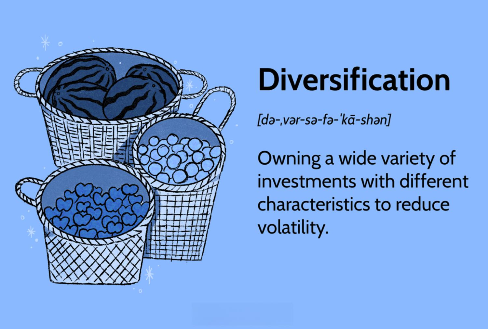

## Table of Contents

## What is diversification in investment?

Diversification in investment means spreading your money across different types of investments. Instead of putting all your money into one thing, like just stocks or just real estate, you invest in a mix of things. This can include stocks, bonds, real estate, and even cash. The idea is to reduce risk. If one type of investment does poorly, the others might do well and help balance out your losses.

Think of it like not putting all your eggs in one basket. If you drop the basket, you lose all your eggs. But if you spread your eggs across several baskets, dropping one won't ruin everything. Diversification helps protect your money by making sure that a problem in one area doesn't hurt your entire investment plan. It's a smart way to manage risk and aim for more stable returns over time.

## Why is diversification important for an investment portfolio?

Diversification is important for an investment portfolio because it helps to reduce risk. When you spread your money across different types of investments, you're less likely to lose everything if one investment goes bad. For example, if you only invest in one company's stock and that company does poorly, you could lose a lot of money. But if you also have money in other stocks, bonds, or real estate, those other investments might do well and help make up for the loss.

Another reason diversification is important is that it can help you get better overall returns over time. Different types of investments perform differently at different times. By having a mix, you can take advantage of the good performance of some investments while others might be struggling. This can lead to a smoother, more stable growth of your portfolio. In the long run, this strategy can help you reach your financial goals with less stress and worry.

## How does diversification reduce risk?

Diversification reduces risk by spreading your money across different types of investments. Instead of betting all your money on one thing, like just one stock or one piece of real estate, you put your money into many different things. This way, if one investment does badly, it won't hurt your whole portfolio. For example, if you own stocks in many different companies, and one company goes bankrupt, you won't lose everything because your other stocks might still be doing well.

It's like not putting all your eggs in one basket. If you drop one basket, you lose all your eggs. But if you spread your eggs across several baskets, dropping one won't ruin everything. By having a mix of investments, you can protect yourself from big losses. This can help you feel more secure and confident about your investments, knowing that a problem in one area won't destroy your entire financial plan.

## What are the common ways to diversify an investment portfolio?

One common way to diversify an investment portfolio is by investing in different asset classes. This means you can put your money into stocks, bonds, real estate, and even cash or cash equivalents like savings accounts or money market funds. Each of these asset classes behaves differently in the market. For example, when stocks go down, bonds might go up, helping to balance out your losses. By spreading your money across these different types of investments, you reduce the risk of losing everything if one type does badly.

Another way to diversify is by investing in different sectors or industries within the stock market. Instead of putting all your money into tech stocks, you can also invest in healthcare, energy, consumer goods, and other sectors. This way, if one sector has a bad year, the others might do well and help keep your portfolio stable. You can also diversify geographically by investing in companies from different countries or regions. This can protect you from problems that might only affect one country's economy.

A third way to diversify is by using different investment vehicles, like mutual funds or exchange-traded funds (ETFs). These funds often hold a mix of many different stocks or bonds, which automatically spreads your risk. For example, an S&P 500 index fund gives you a piece of 500 different companies. This can be an easy way to get broad diversification without having to pick individual stocks or bonds yourself. By using these different methods, you can build a well-rounded portfolio that can better withstand market ups and downs.

## Can you explain the difference between asset class diversification and geographic diversification?

Asset class diversification means spreading your money across different types of investments, like stocks, bonds, and real estate. Each type of investment, or asset class, acts differently in the market. For example, when stocks go down, bonds might go up. By putting your money into different asset classes, you can reduce the risk of losing everything if one type does badly. It's like not putting all your eggs in one basket. If you have money in stocks, bonds, and real estate, and stocks drop, your bonds and real estate might still be doing well, helping to balance out your losses.

Geographic diversification means investing in different countries or regions. Instead of only investing in companies from your own country, you can also put money into companies from other parts of the world. This can protect you from problems that might only affect one country's economy. For example, if the economy in your country is doing poorly, the economy in another country might be doing well. By spreading your investments around the world, you can reduce the risk that comes from having all your money in one place. It's another way to make sure a problem in one area doesn't hurt your whole investment plan.

## What role do stocks, bonds, and commodities play in a diversified portfolio?

Stocks, bonds, and commodities each have a special role in a diversified portfolio. Stocks can help your money grow over time. They can go up a lot in value, but they can also go down a lot. This makes them riskier, but they can also offer higher rewards. By having some of your money in stocks, you give your portfolio a chance to grow more quickly. Bonds, on the other hand, are usually safer than stocks. They give you steady income and help protect your money when the stock market is doing badly. Bonds can help balance out the ups and downs of your stocks, making your portfolio more stable.

Commodities, like gold, oil, or agricultural products, add another layer of diversification. They often don't move in the same way as stocks and bonds. For example, when the stock market is doing poorly, the price of gold might go up. This can help protect your portfolio from big losses. Commodities can also be a good way to hedge against inflation, which means they can help your money keep its value over time. By including stocks, bonds, and commodities in your portfolio, you spread your risk and increase your chances of having a more stable and successful investment plan.

## How can an investor measure the level of diversification in their portfolio?

An investor can measure the level of diversification in their portfolio by looking at how their money is spread across different types of investments. This means checking if they have money in stocks, bonds, real estate, and maybe even commodities like gold. They should also see if their stocks are from different industries, like tech, healthcare, and energy. If all their money is in one type of investment or one industry, their portfolio is not very diversified. But if they have a good mix of different investments, they are more diversified and less likely to lose everything if one type of investment does badly.

Another way to measure diversification is by using tools like the correlation coefficient. This is a number that shows how different investments move together. If two investments always go up and down at the same time, they have a high correlation. But if one goes up when the other goes down, they have a low correlation. A well-diversified portfolio will have investments with low correlations to each other. This means that when one investment is doing badly, another might be doing well, helping to balance out the losses. By looking at these correlations, an investor can see if their portfolio is truly diversified and adjust it if needed.

## What are the potential drawbacks of over-diversification?

Over-diversification can make it hard to keep track of all your investments. When you spread your money across too many different things, it can be tough to know how each one is doing. You might end up with so many small investments that it's hard to pay attention to all of them. This can lead to missing out on important news or changes that could affect your money. Also, managing a lot of different investments can take a lot of time and effort, which might not be worth it if you're not seeing much benefit from having so many.

Another problem with over-diversification is that it can water down your returns. If you have too many investments, the good performance of some might be canceled out by the bad performance of others. This can mean your overall gains are not as high as they could be if you focused on a smaller number of strong investments. Sometimes, it's better to have a few good investments that you really believe in, rather than trying to spread your money too thin. Over-diversification can make it hard to see the big wins because they get lost in the mix of all your other investments.

## How does one balance diversification with the need for portfolio concentration?

Balancing diversification with the need for portfolio concentration means finding the right mix of spreading your money across different types of investments and focusing on a few strong ones. Diversification helps reduce risk by not putting all your eggs in one basket. If one investment does badly, others might do well and help balance out your losses. But if you spread your money too thin, you might miss out on big gains from a few really good investments. So, you need to think about how much risk you're willing to take and how much you want your money to grow.

Concentration, on the other hand, means putting more of your money into a smaller number of investments that you believe in strongly. This can lead to bigger gains if those investments do well, but it also means more risk if they don't. To balance this, you might choose to have a core part of your portfolio that is well-diversified, with stocks, bonds, and maybe some commodities. Then, you can put a smaller part of your money into a few concentrated investments that you think have a lot of potential. This way, you get the benefits of both diversification and concentration, helping you manage risk while still aiming for good returns.

## What advanced strategies can be used for sector-specific diversification?

One advanced strategy for sector-specific diversification is to use sector rotation. This means moving your money from one sector to another based on which sectors are doing well at different times. For example, if you see that the technology sector is starting to slow down, you might move some of your money into the healthcare sector, which might be doing better. By keeping an eye on economic cycles and trends, you can try to invest in sectors that are likely to do well in the future. This can help you get better returns while still spreading your risk across different parts of the market.

Another strategy is to use sector-specific ETFs or mutual funds. These funds focus on one particular sector, like energy or consumer goods. By investing in a few different sector-specific funds, you can get a good mix of different industries without having to pick individual stocks. This can help you diversify within sectors while still keeping your portfolio focused. For example, you might invest in a tech [ETF](/wiki/etf-trading-strategies), a healthcare ETF, and an energy ETF. This way, you can benefit from the growth in each sector while reducing the risk that comes from investing in just one sector.

## How do modern portfolio theory and diversification intersect?

Modern Portfolio Theory (MPT) and diversification go hand in hand. MPT is all about finding the best way to balance risk and reward in your investments. It says that you can lower the risk of your portfolio by spreading your money across different investments. This is where diversification comes in. By not putting all your money into one thing, you can reduce the chance that a bad investment will hurt your whole portfolio. MPT uses math to figure out how to mix different investments to get the best possible return for the amount of risk you're willing to take.

Diversification helps make MPT work better. When you diversify, you're choosing investments that don't all move in the same way. Some might go up when others go down, which can help keep your portfolio stable. MPT looks at how these investments move together, using something called correlation. If you have investments that have low correlation with each other, your portfolio can be more diversified and less risky. So, by using MPT, you can pick the right mix of investments to make sure your portfolio is as diversified as possible, helping you reach your financial goals with less worry.

## What are some case studies or historical examples where diversification significantly impacted investment outcomes?

One famous example of diversification impacting investment outcomes is the story of Enron. In the early 2000s, Enron, once a giant energy company, went bankrupt because of fraud and mismanagement. People who had all their money in Enron stock lost everything. But investors who had diversified their portfolios, with money in different companies and types of investments, didn't lose as much. Their other investments helped balance out the loss from Enron, showing how diversification can protect your money from big losses.

Another example is the 2008 financial crisis. During this time, the stock market crashed, and many people lost a lot of money. But those who had diversified portfolios, with money in stocks, bonds, and maybe even real estate or commodities, did better. Bonds and some commodities, like gold, held up better than stocks during the crisis. So, people who had money in these other investments didn't lose as much as those who only had money in stocks. This shows how diversification can help you weather tough times in the market.

## What is Understanding Diversification?

Diversification is a fundamental risk management strategy that involves spreading investments across a variety of asset classes, industries, and geographies. This strategy aims to reduce the unsystematic risk associated with a particular investment or sector by ensuring that the portfolio is not overly dependent on the performance of any single asset. The central idea behind diversification is that the price movements of different assets are not perfectly correlated, allowing for the mitigation of portfolio volatility.

The rationale for diversification rests on the principle of reducing the portfolio's exposure to any single risk [factor](/wiki/factor-investing). By distributing investments across different asset classes such as stocks, bonds, commodities, and real estate, investors can minimize the impact of adverse events on one particular investment or sector. This strategy is particularly important in globalized financial markets where economic, political, and socio-cultural factors can unpredictably influence asset prices.

A well-diversified portfolio typically includes a mix of assets that react differently to market conditions. For example, bonds often move inversely to stocks during economic downturns, providing a cushion against losses in equity holdings. Similarly, international diversification across geographic regions allows investors to capitalize on growth opportunities in emerging markets while hedging against regional economic downturns. This international component is crucial for mitigating risks associated with currency fluctuations and varying economic cycles.

The quantitative measure of diversification's effectiveness can be seen through improved risk-adjusted returns. The Sharpe Ratio, which measures the excess return per unit of risk, can be a useful metric for assessing the benefits of diversification. A higher Sharpe Ratio in a diversified portfolio indicates more efficient risk management. Mathematically, a diversified portfolio's expected return is calculated as:

$$
E(R_p) = \sum_{i=1}^{n} w_i \cdot E(R_i)
$$

where $E(R_p)$ is the expected return of the portfolio, $w_i$ is the weight of asset $i$ in the portfolio, and $E(R_i)$ is the expected return of asset $i$.

Additionally, diversification contributes to capital preservation during market downturns by smoothing the [volatility](/wiki/volatility-trading-strategies) of returns over time. This consistent performance, achieved through strategic asset allocation, helps investors to maintain long-term financial goals without being forced to liquidate positions during periods of market stress.

In summary, diversification stands as a pivotal strategy in modern investment practice. By incorporating a diverse set of assets across various sectors and regions, investors are better equipped to manage risks and harness opportunities for sustainable growth in their portfolios. Diversification does not eliminate risk entirely but significantly reduces unsystematic risks, contributing to a more stable and resilient investment trajectory.

## What are the Principles of Effective Portfolio Management?

Effective portfolio management is the art and science of making decisions that balance risk and return, ultimately steering an investor toward their financial objectives. This process is anchored in several key principles, each playing a critical role in shaping a robust investment strategy.

**Asset Allocation**  
Asset allocation involves distributing investments among various asset categories, such as stocks, bonds, and cash. The primary goal is to maximize returns while minimizing risk, in alignment with an investor's risk tolerance and investment horizon. The fundamental idea is that different asset classes have varying return/risk characteristics and do not respond to market forces in the same way at the same time. Hence, a well-considered mix can reduce overall portfolio volatility. Mathematically, this can be expressed using the expected return of the portfolio $E(R_p)$ and the portfolio variance $\sigma^2_p$, determined as follows:

$$
E(R_p) = \sum_{i=1}^{n} w_iE(R_i)
$$

$$
\sigma^2_p = \sum_{i=1}^{n} \sum_{j=1}^{n} w_iw_j \text{Cov}(R_i, R_j)
$$

where $w_i$ and $w_j$ are the weights of assets $i$ and $j$ in the portfolio, $E(R_i)$ is the expected return of asset $i$, and $\text{Cov}(R_i, R_j)$ represents the covariance between the returns of assets $i$ and $j$.

**Regular Portfolio Rebalancing**  
Regular portfolio rebalancing involves realigning the portfolio's asset allocations as needed. Over time, some investments may grow faster than others, leading to a shift in the portfolio's intended asset allocation. This practice ensures that the portfolio remains aligned with the investor's risk tolerance and investment objectives. Rebalancing can be done on a periodic basis (e.g., quarterly or annually) or when the portfolio's asset allocation deviates significantly from its target.

Here's a simple Python script that demonstrates how a portfolio can be periodically rebalanced:

```python
def rebalance_portfolio(portfolio, target_allocation):
    total_value = sum(portfolio.values())
    for asset, target_percent in target_allocation.items():
        current_value = portfolio[asset]
        target_value = total_value * target_percent
        portfolio[asset] = target_value
    return portfolio

# Example usage
portfolio = {'stocks': 6000, 'bonds': 3000, 'cash': 1000}
target_allocation = {'stocks': 0.6, 'bonds': 0.3, 'cash': 0.1}

rebalanced_portfolio = rebalance_portfolio(portfolio, target_allocation)
print(rebalanced_portfolio)
```

**Risk Assessment**  
Risk assessment involves analyzing the potential risks associated with portfolio investments. This includes both systematic risks, which affect the market as a whole, and unsystematic risks, which are specific to individual assets. Investors need to evaluate their risk capacity and appetite, balancing the potential for higher returns against the likelihood of adverse outcomes.

**Leveraging Emerging Tools: Robo-Advisors**  
The advent of technology has introduced new tools that provide automated investment management services. Robo-advisors offer cost-effective solutions by utilizing algorithms to construct and manage portfolios. They assess an investor’s risk tolerance, financial goals, and timeline to recommend an appropriate asset allocation, thereby simplifying the investment process while ensuring an evidence-based approach.

In conclusion, effective portfolio management is a multi-faceted process that integrates disciplined asset allocation, timely rebalancing, comprehensive risk assessment, and cutting-edge technology. By adhering to these principles, investors can create a resilient portfolio that aligns with their financial aspirations.

## References & Further Reading

[1]: Malkiel, B. G. (2019). ["A Random Walk Down Wall Street: The Time-Tested Strategy for Successful Investing."](https://www.amazon.com/Random-Walk-Down-Wall-Street/dp/0393330338) W. W. Norton & Company.

[2]: Bodie, Z., Kane, A., & Marcus, A. J. (2013). ["Investments"](https://www.mheducation.com/highered/product/investments-bodie-kane/M9781264412662.html). McGraw-Hill Education.

[3]: Markowitz, H. (1952). ["Portfolio Selection."](https://www.jstor.org/stable/2975974) The Journal of Finance, 7(1), 77-91.

[4]: Fabozzi, F. J., Focardi, S. M., & Kolm, P. N. (2006). ["Financial Modeling of the Equity Market: From CAPM to Cointegration."](https://onlinelibrary.wiley.com/doi/book/10.1002/9781119201236) Wiley.

[5]: Treynor, J. L. (1965). ["How to Rate Management of Investment Funds."](https://onlinelibrary.wiley.com/doi/10.1002/9781119196679.ch10) Harvard Business Review.