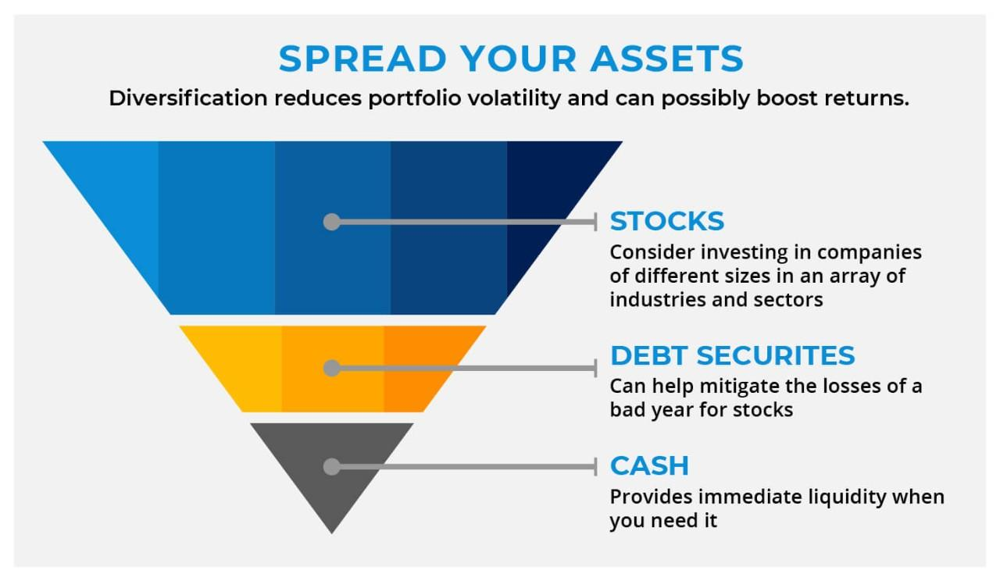

## Table of Contents

## What is diversification in the context of investment?

Diversification in investing means spreading your money across different types of investments. Instead of putting all your money into one stock or one type of investment, you invest in a variety of things like stocks, bonds, and real estate. This helps lower the risk because if one investment does poorly, the others might do well and balance it out.

Think of it like not putting all your eggs in one basket. If you drop the basket, you lose all your eggs. But if you have eggs in different baskets, dropping one basket doesn't mean you lose everything. Diversification works the same way with your money, helping to protect your investments from big losses.

## Why is diversification important for investors?

Diversification is important for investors because it helps reduce risk. When you spread your money across different types of investments, you're less likely to lose a lot if one investment does badly. Imagine if you only invested in one company's stock and that company went bankrupt. You'd lose all your money. But if you had also invested in other stocks, bonds, or real estate, those other investments might still be doing well and could help cushion the blow.

Another reason diversification matters is that it can help you get better returns over time. Different investments do well at different times. For example, when the stock market is down, bonds might be doing better. By having a mix of investments, you can take advantage of these ups and downs. This way, you're not relying on just one type of investment to grow your money, which can lead to more stable and potentially higher returns in the long run.

## How does diversification help in managing risk?

Diversification helps manage risk by spreading your investments across different types of assets. This means if one investment goes down in value, others might go up or stay the same, which can help balance out your losses. It's like not putting all your money on one horse in a race. If that horse loses, you still have other horses that might win or place well, so you don't lose everything.

When you diversify, you're less likely to face big losses all at once. For example, if you only invest in tech stocks and the tech industry has a bad year, you could lose a lot of money. But if you also have money in other sectors like healthcare or energy, those might do better and help protect your overall investment. This way, diversification acts like a safety net, making your investment journey smoother and less risky.

## What are the different types of diversification strategies?

There are different ways to diversify your investments. One way is asset allocation, which means spreading your money across different types of investments like stocks, bonds, and real estate. For example, you might put some money in the stock market, some in government bonds, and some in buying a rental property. Another way is geographic diversification, which means investing in different countries or regions. Instead of just investing in your home country, you could also invest in companies or funds from other parts of the world.

Another strategy is sector diversification, which means investing in different industries. Instead of putting all your money into tech companies, you could also invest in healthcare, energy, or consumer goods. This way, if one industry has a bad year, the others might do better. Lastly, there's time diversification, which means spreading your investments over different time periods. You might invest some money now and some later, or you might choose investments that mature at different times. This can help you manage risk and take advantage of different market conditions over time.

## Can you explain asset allocation and its role in diversification?

Asset allocation is a way to spread your money across different types of investments, like stocks, bonds, and real estate. It's like deciding how much of your money goes into each type of investment. For example, you might decide to put 60% of your money into stocks, 30% into bonds, and 10% into real estate. This mix depends on how much risk you're willing to take and what your investment goals are.

The role of asset allocation in diversification is to help manage risk. By spreading your money across different kinds of investments, you're not putting all your eggs in one basket. If one type of investment does poorly, like if the stock market goes down, your bonds or real estate might still do well. This can help protect your money from big losses. Over time, having a good mix of investments can also lead to better returns because different types of investments do well at different times.

## How does diversification across different asset classes work?

Diversification across different asset classes means you're spreading your money among different types of investments like stocks, bonds, and real estate. Think of it like having different tools in your toolbox. If one tool isn't working well, you can use another one. So, if the stock market is going down, your bonds or real estate might still be doing okay. This way, you're not depending on just one type of investment to grow your money.

By investing in different asset classes, you're reducing the risk of losing a lot of money all at once. For example, if you only put your money in stocks and the stock market crashes, you could lose a lot. But if you also have money in bonds and real estate, those might not go down as much or might even go up. Over time, this mix can help you get better returns because different types of investments do well at different times. So, diversification across asset classes helps keep your investments safer and more balanced.

## What is the impact of geographical diversification on an investment portfolio?

Geographical diversification means spreading your investments across different countries or regions. Instead of just investing in companies in your own country, you also put money into businesses or funds from other parts of the world. This can help protect your money because if the economy in one country is doing badly, another country's economy might be doing well. For example, if the U.S. stock market goes down, your investments in Europe or Asia might still be doing okay.

By investing in different places, you're not putting all your eggs in one basket. This can help lower the risk of losing a lot of money if something bad happens in one country. It also gives you a chance to take advantage of growth in other parts of the world. Over time, this can lead to more stable and potentially higher returns because different countries do well at different times. So, geographical diversification can make your investment portfolio safer and more balanced.

## How can sector diversification enhance a portfolio's performance?

Sector diversification means spreading your money across different industries, like tech, healthcare, and energy. When you do this, you're not betting all your money on one type of business. If one industry has a bad year, the others might do well. For example, if tech stocks go down, your investments in healthcare or energy might still be doing okay. This can help protect your money from big losses because you're not relying on just one sector to grow your investments.

By investing in different sectors, you can also take advantage of growth in various parts of the economy. Different industries do well at different times. When you have a mix of sectors in your portfolio, you're more likely to catch the upswings in different areas. Over time, this can lead to more stable and potentially higher returns. So, sector diversification can make your investment journey smoother and help your portfolio perform better in the long run.

## What are the common pitfalls to avoid when diversifying a portfolio?

One common pitfall to avoid when diversifying a portfolio is over-diversification. This happens when you spread your money across too many investments. It might sound good to have a lot of different things, but it can actually make it hard to keep track of everything. Plus, if you have too many small investments, it can be hard to see big gains because your money is spread too thin.

Another pitfall is not understanding the investments you're choosing. It's important to know what you're putting your money into. If you don't understand a certain type of investment, it might not fit well with your other investments, and you might not know how to react if things change. Always take the time to learn about each investment and how it fits into your overall plan.

Lastly, be careful not to chase performance. This means not just putting money into something because it did well recently. Past performance doesn't guarantee future results. If you only invest in what's hot right now, you might end up with a portfolio that's not well-balanced and more risky than you think. Stick to your long-term plan and don't let short-term trends sway your decisions.

## How should an investor measure the effectiveness of their diversification strategy?

An investor can measure the effectiveness of their diversification strategy by looking at how well their portfolio is doing over time. One way to do this is by checking the overall return of the portfolio. If the portfolio is growing steadily and the returns are more stable than the returns of just one type of investment, that's a good sign that diversification is working. Another way to measure it is by looking at the risk, or how much the value of the portfolio goes up and down. If the portfolio is less risky than it would be if all the money was in one type of investment, then the diversification strategy is helping to manage risk.

Another important thing to look at is how well the different parts of the portfolio are working together. This is called correlation. If the different investments in the portfolio are not moving in the same way at the same time, then they are helping to balance each other out. For example, if stocks go down but bonds go up, that's good diversification. Investors can use tools like a correlation matrix to see how their investments are related to each other. By keeping an eye on these things, an investor can tell if their diversification strategy is doing its job to lower risk and improve returns.

## What advanced techniques can be used to optimize portfolio diversification?

One advanced technique for optimizing portfolio diversification is using [factor](/wiki/factor-investing)-based investing. This means looking at what makes different investments move up or down, like company size, value, or how risky they are. By understanding these factors, you can pick investments that balance each other out. For example, if you have a lot of big company stocks, you might add some small company stocks to mix things up. This can help make your portfolio stronger and less risky because you're not just [picking](/wiki/asset-class-picking) random investments; you're choosing them based on what makes them tick.

Another technique is using modern portfolio theory (MPT). MPT helps you find the best mix of investments to get the highest return for the least amount of risk. It uses math to figure out how different investments work together. By using MPT, you can see how adding or taking away certain investments can change your portfolio's risk and return. This way, you can fine-tune your investments to get the best results. Both factor-based investing and MPT can help you make smarter choices and keep your portfolio well-balanced and strong.

## How does correlation between assets influence diversification strategies?

Correlation between assets is how closely the prices of different investments move together. If two investments have a high correlation, they tend to go up or down at the same time. If they have a low correlation, they move in different ways. When you're trying to diversify your portfolio, you want to pick investments that don't all move the same way. This means looking for assets with low or negative correlations. By doing this, you can help protect your money because if one investment goes down, another might go up or stay the same, balancing things out.

Understanding correlation helps you make better choices about which investments to include in your portfolio. For example, stocks and bonds often have a low correlation. When the stock market goes down, bonds might go up or not change as much. By having both in your portfolio, you can reduce the risk of losing a lot of money all at once. So, paying attention to how your investments are related to each other can make your diversification strategy more effective and help you get better returns over time.

## What is Understanding Diversification?

Diversification is a fundamental concept in investment strategy that involves allocating investments across different financial instruments, industries, and other categories to manage risk. The primary goal is to maximize returns by investing in a variety of sectors that are likely to respond differently to the same event. This approach can protect the investor from significant losses if one sector underperforms while others perform better, thereby stabilizing overall portfolio returns.

The principle of diversification is rooted in modern portfolio theory, formulated by economist Harry Markowitz in 1952. According to this theory, the overall risk of a portfolio is not just the sum of the risks of its individual assets. Instead, the degree of correlation between asset returns is crucial. When assets are not perfectly correlated, the overall risk of the portfolio can be reduced, which can be mathematically represented as:

$$
\sigma_p^2 = w_1^2 \sigma_1^2 + w_2^2 \sigma_2^2 + 2w_1w_2 \sigma_1 \sigma_2 \rho_{12}
$$

where $\sigma_p^2$ is the portfolio variance, $w_1$ and $w_2$ are the weights of the assets in the portfolio, $\sigma_1^2$ and $\sigma_2^2$ are the variances of the assets, and $\rho_{12}$ is the correlation coefficient between the returns on the assets.

Effective diversification involves spreading investments across different types of assets, such as stocks, bonds, and commodities, as well as geographic regions and economic sectors. This varied approach reduces the portfolio's exposure to any single asset's risk, which can be particularly critical in volatile markets.

Empirical studies have consistently demonstrated that a diversified portfolio can mitigate risk while providing opportunities to take advantage of potential investment gains across various asset classes. For instance, the benefits of diversification were evident during the 2008 financial crisis when portfolios diversified with safer assets like government bonds suffered less severe losses compared to those heavily invested in stocks.

Mastering diversification strategies is essential for successful portfolio management as it requires a well-dependent understanding of the risk-return profiles of different asset classes and how they interact. By effectively employing diversification, investors can work towards achieving a balanced portfolio that aligns with their financial goals and risk tolerance.

## References & Further Reading

[1]: Markowitz, H. (1952). ["Portfolio Selection."](https://onlinelibrary.wiley.com/doi/abs/10.1111/j.1540-6261.1952.tb01525.x) The Journal of Finance, 7(1), 77-91.

[2]: Lopez de Prado, M. (2018). ["Advances in Financial Machine Learning."](https://www.amazon.com/Advances-Financial-Machine-Learning-Marcos/dp/1119482089) John Wiley & Sons.

[3]: Chan, E. (2009). ["Quantitative Trading: How to Build Your Own Algorithmic Trading Business."](https://github.com/ftvision/quant_trading_echan_book) John Wiley & Sons.

[4]: Jansen, S. (2018). ["Machine Learning for Algorithmic Trading."](https://github.com/stefan-jansen/machine-learning-for-trading) Packt Publishing.

[5]: Aronson, D. (2007). ["Evidence-Based Technical Analysis: Applying the Scientific Method and Statistical Inference to Trading Signals."](https://www.amazon.com/Evidence-Based-Technical-Analysis-Scientific-Statistical/dp/0470008741) John Wiley & Sons.