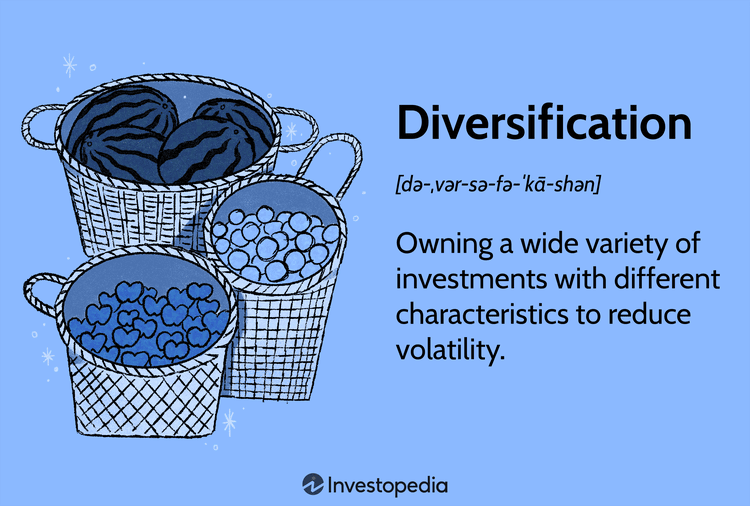

In finance, diversification and algorithmic trading represent pivotal strategies that investors employ to optimize portfolio management effectively. This article examines the synergy between diversification, investment strategy, portfolio management, and algorithmic trading, aiming to provide a comprehensive understanding of these interrelated concepts. By integrating these strategies, investors can achieve the dual goals of minimizing risk and enhancing returns—a crucial consideration in the volatile financial markets.

Diversification involves spreading investments across a variety of financial instruments, industries, and other categories to reduce exposure to risk. By doing so, investors can protect their portfolios from significant losses arising from market volatility. Algorithmic trading, on the other hand, utilizes advanced computer algorithms to execute trades with high speed and efficiency, offering the potential to capitalize on market opportunities that might be missed through manual trading.

This article will analyze the fundamentals of these strategies and the integral role that technology plays in executing them with precision and agility. With the advent of sophisticated trading algorithms and powerful computing tools, technology serves as an essential enabler in the implementation of these strategies, potentially leading to more informed and timely investment decisions.

By the conclusion of this article, readers will have gained insights into how diversification, investment strategy, portfolio management, and algorithmic trading interact to enhance investment outcomes. Understanding these elements and their interplay is key for investors aiming to navigate the complexities of modern financial markets and optimize their portfolio management practices for superior performance.

## Table of Contents

## Understanding Diversification

Diversification is a fundamental concept in investment strategy that involves allocating investments across different financial instruments, industries, and other categories to manage risk. The primary goal is to maximize returns by investing in a variety of sectors that are likely to respond differently to the same event. This approach can protect the investor from significant losses if one sector underperforms while others perform better, thereby stabilizing overall portfolio returns.

The principle of diversification is rooted in modern portfolio theory, formulated by economist Harry Markowitz in 1952. According to this theory, the overall risk of a portfolio is not just the sum of the risks of its individual assets. Instead, the degree of correlation between asset returns is crucial. When assets are not perfectly correlated, the overall risk of the portfolio can be reduced, which can be mathematically represented as:

$$
\sigma_p^2 = w_1^2 \sigma_1^2 + w_2^2 \sigma_2^2 + 2w_1w_2 \sigma_1 \sigma_2 \rho_{12}
$$

where $\sigma_p^2$ is the portfolio variance, $w_1$ and $w_2$ are the weights of the assets in the portfolio, $\sigma_1^2$ and $\sigma_2^2$ are the variances of the assets, and $\rho_{12}$ is the correlation coefficient between the returns on the assets.

Effective diversification involves spreading investments across different types of assets, such as stocks, bonds, and commodities, as well as geographic regions and economic sectors. This varied approach reduces the portfolio's exposure to any single asset's risk, which can be particularly critical in volatile markets.

Empirical studies have consistently demonstrated that a diversified portfolio can mitigate risk while providing opportunities to take advantage of potential investment gains across various asset classes. For instance, the benefits of diversification were evident during the 2008 financial crisis when portfolios diversified with safer assets like government bonds suffered less severe losses compared to those heavily invested in stocks.

Mastering diversification strategies is essential for successful portfolio management as it requires a well-dependent understanding of the risk-return profiles of different asset classes and how they interact. By effectively employing diversification, investors can work towards achieving a balanced portfolio that aligns with their financial goals and risk tolerance.

## The Role of Investment Strategy

An investment strategy encompasses a series of guiding principles designed to inform and direct an individual's or institution's investment decisions. These strategies are crucial in charting a [course](/wiki/best-algorithmic-trading-courses) through the complex financial landscape, providing a clear framework for reaching specific financial goals. Investment strategies play a pivotal role in managing risk, making them indispensable components of portfolio management.

### Types of Investment Strategies

**Growth Investing**: This strategy focuses on capital appreciation. Growth investors seek companies that are expected to grow at an above-average rate compared to their peers. Although growth stocks can offer substantial returns, they often come with higher risk. Key indicators for identifying growth stocks include earnings growth rates, revenue expansion, and innovative product lines.

**Value Investing**: In contrast to growth investing, value investing focuses on purchasing undervalued securities. Value investors aim to identify stocks that are trading below their intrinsic value, providing an opportunity for price correction. Metrics such as the price-to-earnings ratio (P/E) and book value are often used to locate potential value investments.

**Index Investing**: This strategy involves constructing a portfolio to mirror the components of a financial market index, such as the S&P 500. Index investing requires less active management and can offer diversified exposure with lower operational costs. It appeals to investors seeking consistent returns with minimal involvement.

### Customizing Investment Strategies

Investment strategies must be tailored to align with an investor’s risk tolerance, time horizon, and financial objectives. Risk tolerance refers to the level of risk an investor is willing to accept, and can be influenced by factors such as age, income, and investment profile. Time horizon indicates the length of time the investor plans to hold the investments before accessing the funds. Longer time horizons traditionally allow for greater risk-taking. Financial goals might include retirement planning, purchasing property, or funding education.

Aligning an investment strategy with diversification is vital for achieving a cohesive portfolio management approach. Diversification, the process of spreading investments to reduce risk, should be considered when forming an investment strategy. By ensuring the strategy embraces diversification principles, investors can better manage [volatility](/wiki/volatility-trading-strategies) and shield their portfolios against market fluctuations.

### Strategies as Financial Roadmaps

An investment strategy acts as a roadmap, guiding investors toward their financial objectives in varied market conditions. For example, a buy-and-hold strategy may suit investors with long-term goals, regardless of temporary market fluctuations. Conversely, a more active trading strategy may be geared toward taking advantage of short-term market movements.

In summary, investment strategies are multifaceted tools that enable investors to navigate through financial markets effectively. By understanding and tailoring these strategies to individual risk profiles and objectives, investors can enhance their potential for achieving desired financial outcomes amidst uncertain market environments. As the financial landscape evolves, continuously refining investment strategies is essential to remain aligned with shifting economic conditions and advances in financial products.

## Portfolio Management Essentials

Portfolio management is a critical practice in finance focused on the strategic selection and oversight of a diverse array of investments, designed to meet specific long-term financial objectives while aligning with an investor's risk tolerance. It encompasses a range of methodologies and practices to achieve optimal investment performance.

A fundamental aspect of portfolio management is asset allocation, which involves distributing investments across various asset classes, such as equities, bonds, and real estate. Asset allocation aims to balance risk and reward by aligning the portfolio's composition with the investor's goals and market conditions. This approach reduces volatility and enhances returns through diversification—the investment in non-correlated assets that react differently to market fluctuations.

Risk management is another pivotal component, employing strategies to measure, monitor, and control the level of risk within a portfolio. Techniques such as [value at risk](/wiki/var-value-at-risk) (VaR), beta analysis, and scenario analysis are often employed to assess potential loss scenarios and to structure the portfolio to mitigate adverse outcomes. These methodologies help portfolio managers align investment strategies with an investor's risk appetite and financial circumstances.

Performance assessment is essential for evaluating whether the portfolio meets its targets, using metrics like the Sharpe ratio, Jensen's alpha, and the Treynor ratio. These metrics allow investors to adjust strategies based on historical performance data, risk-adjusted returns, and market trends, ensuring that the portfolio remains on track to achieve its financial objectives.

Active versus passive management represents two primary approaches in portfolio management. Active management involves the active buying and selling of securities based on market research and forecasts, aiming to outperform specific benchmarks. On the other hand, passive management seeks to replicate the performance of market indices, offering lower costs and reduced complexity. While active management can potentially yield higher returns, it requires more resources and incurs higher fees than the passive approach.

Periodic portfolio rebalancing is crucial for maintaining the desired level of risk and optimizing returns over time. Rebalancing involves realigning the weightings of a portfolio's assets by periodically buying or selling securities to maintain the original or desired level of asset allocation. This practice helps in correcting any drift from the initial investment strategy due to market movements, ensuring consistency in risk exposure.

Effective portfolio management plays a key role in enhancing investment outcomes by implementing well-considered diversification and investment strategies. It requires continuous assessment and adaptation to market conditions, allowing investors to safeguard their portfolios and capitalize on potential opportunities.

## Algorithmic Trading: A Modern Approach

Algorithmic trading utilizes sophisticated computer algorithms to execute trades with remarkable speed and precision. These algorithms can process vast amounts of data in real-time, identifying profitable opportunities and executing transactions faster than any human trader. This speed and efficiency allow for the optimization of portfolio management, as trades can be aligned more closely with current market conditions, reducing delay and slippage in execution.

Algorithmic trading enhances portfolio management by automating the trading process, thereby reducing the need for continuous manual intervention. This automation ensures that trading decisions are consistently applied according to predefined strategies, mitigating the risk of human error. Additionally, the increased timeliness of trades enabled by algorithmic systems can help capitalize on short-lived market opportunities, thereby potentially improving returns.

There are several types of algorithms used in trading, each designed to accomplish different objectives. Market-making algorithms, for instance, are used by traders to provide [liquidity](/wiki/liquidity-risk-premium) to the markets by continuously quoting both bid and offer prices. These algorithms aim to profit from the bid-ask spread while minimizing the inventory risk. Trend-following algorithms, on the other hand, identify and capitalize on the [momentum](/wiki/momentum) of market trends. These algorithms analyze historical data to generate buy or sell signals based on observed patterns, allowing traders to ride existing trends until indications of reversal present themselves.

Algorithmic trading also supports implementing complex diversification strategies. Through the use of multifaceted algorithms, traders can assemble a diversified portfolio that dynamically adapts to varying market conditions. For example, algorithms can be programmed to diversify trades across different asset classes, sectors, or geographies, automatically rebalancing when the portfolio's risk exposure deviates from the desired levels. This dynamic adjustment can enhance the overall robustness of the portfolio, optimizing expected returns relative to risk.

The rise of [algorithmic trading](/wiki/algorithmic-trading) has had significant implications on market dynamics and investor behavior. On the positive side, it contributes to increased liquidity and tighter spreads, ostensibly benefiting the overall market by enhancing price discovery. However, it has also introduced challenges, such as increased market volatility during periods of high-frequency trading activity and the potential for systemic risks, as evidenced by events like the 2010 Flash Crash. Moreover, algorithmic trading can alter investor behavior by encouraging a short-term trading focus over long-term investment strategies.

In conclusion, algorithmic trading represents a modern approach that significantly impacts how trades are executed and portfolios managed. Its speed, efficiency, and capacity to implement complex strategies make it an invaluable tool in the investor's toolkit, though it is essential to remain cognizant of its broader implications on market behavior.

## Synergizing These Elements

Integrating diversification, investment strategy, portfolio management, and algorithmic trading forms a comprehensive framework that enhances investment outcomes. A notable case study that exemplifies this synergy is the approach used by Renaissance Technologies, a [hedge fund](/wiki/hedge-fund-trading-strategies) renowned for its Medallion Fund. By leveraging sophisticated algorithms and quantitative models grounded in diversified investment strategies, the fund consistently outperformed the market, delivering unparalleled returns while effectively managing risk.

Challenges arise when attempting to integrate these components due to the complexity and resource requirements of implementing advanced algorithms and data analytics. Investors must navigate issues such as data integrity, technology infrastructure, and the potential for model overfitting. Furthermore, aligning the investment strategy with effective portfolio management requires continuous monitoring and adaptation as market conditions evolve.

Advanced technology plays a crucial role in this integration, with data analytics and [machine learning](/wiki/machine-learning) providing valuable insights and enhancing decision-making capabilities. Tools such as natural language processing (NLP) can process vast amounts of unstructured data, identifying market trends and potential investment opportunities. Additionally, machine learning algorithms can optimize trade execution and enhance risk management practices.

For investors seeking to implement these strategies cohesively, several actionable insights can be considered:

1. **Invest in Technology and Expertise**: Allocate resources to develop a robust technology infrastructure and acquire skilled professionals who can facilitate the integration of these elements.

2. **Adopt a Data-Driven Approach**: Utilize advanced analytics and machine learning to refine investment strategies and enhance portfolio management. Embrace tools and platforms that can process large datasets efficiently.

3. **Regularly Rebalance Portfolios**: Ensure that portfolio allocations remain aligned with investment objectives and market conditions. Regular rebalancing helps maintain the desired risk-return profile.

4. **Monitor and Adapt Strategies**: Continuously monitor the effectiveness of integrated strategies and make necessary adjustments to adapt to changing market environments.

By adopting these practices, investors can harness the synergy of diversification, investment strategy, portfolio management, and algorithmic trading, leading to improved performance and managed risk in their investment portfolios.

## Conclusion

In the fast-evolving domain of finance, the integration of diversification, investment strategy, portfolio management, and algorithmic trading emerges as a formidable method to optimize investment results. Diversification reduces risk by distributing investments across diverse financial instruments and sectors, ensuring stability in portfolio returns over time. When this is paired with a well-devised investment strategy tailored to an investor's specific risk tolerance and financial goals, the synergy creates a cohesive roadmap for success in various market conditions. Effective portfolio management complements these strategies by offering systematic asset allocation, risk management, and performance assessment, which are essential for maintaining equilibrium in a financial portfolio.

Furthermore, the advent of algorithmic trading introduces a modern approach to executing trades with high speed and precision, leveraging complex algorithms that can implement sophisticated diversification strategies. This can dramatically enhance the efficiency of portfolio management while providing the opportunity to react swiftly to market changes.

A combined approach leveraging these elements can significantly boost portfolio performance and manage risk effectively. Investors are encouraged to incorporate these strategies into their investment plans, remaining abreast of technological advancements that continue to reshape the financial landscape. Continuous education and adaptability are critical, given the perpetually changing nature of financial markets. 

We call on investors to seek out additional resources on these topics to further solidify their understanding and expertise. By doing so, they can better navigate the complexities of today's financial world and seize opportunities for growth and security in their investment endeavors.

## References & Further Reading

[1]: Markowitz, H. (1952). ["Portfolio Selection."](https://onlinelibrary.wiley.com/doi/abs/10.1111/j.1540-6261.1952.tb01525.x) The Journal of Finance, 7(1), 77-91.

[2]: Lopez de Prado, M. (2018). ["Advances in Financial Machine Learning."](https://www.amazon.com/Advances-Financial-Machine-Learning-Marcos/dp/1119482089) John Wiley & Sons.

[3]: Chan, E. (2009). ["Quantitative Trading: How to Build Your Own Algorithmic Trading Business."](https://github.com/ftvision/quant_trading_echan_book) John Wiley & Sons.

[4]: Jansen, S. (2018). ["Machine Learning for Algorithmic Trading."](https://github.com/stefan-jansen/machine-learning-for-trading) Packt Publishing.

[5]: Aronson, D. (2007). ["Evidence-Based Technical Analysis: Applying the Scientific Method and Statistical Inference to Trading Signals."](https://www.amazon.com/Evidence-Based-Technical-Analysis-Scientific-Statistical/dp/0470008741) John Wiley & Sons.