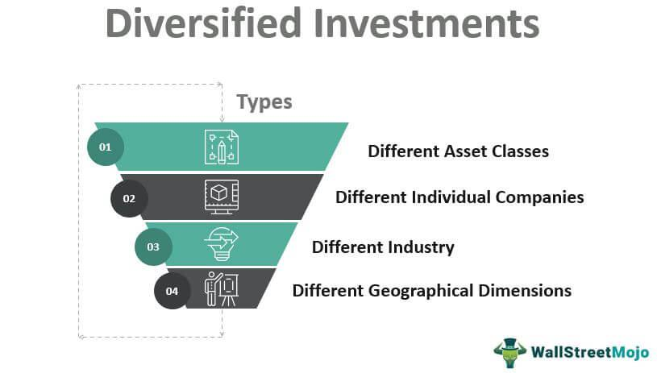

Wealth management is a comprehensive approach to managing an individual's or institution's financial assets, ensuring growth, preservation, and transfer according to defined objectives. A critical component of wealth management is diversification, a strategy undertaken to mitigate risk by allocating investments across various financial instruments, industries, and other categories. This approach helps minimize the impact of poor performance in any single asset, thereby protecting and potentially enhancing overall portfolio performance.

An investment portfolio is a collection of assets such as stocks, bonds, real estate, and other financial instruments, structured to meet an investor's financial goals while considering risk tolerance, time horizon, and capital requirements. The construction of a diversified portfolio entails selecting assets that do not exhibit perfect positive correlation, meaning that losses in certain segments can be offset by gains in others, thus stabilizing returns over time.



Algorithmic trading, the use of complex algorithms to facilitate trading decisions, has revolutionized modern investment strategies, bringing heightened precision and execution speed to financial markets. These algorithms analyze vast datasets to identify patterns and make predictions about market movements, enabling traders and wealth managers to implement strategies that optimize portfolio diversification and returns.

The integration of algorithmic trading within investment portfolios harnesses the power of technology to refine diversification strategies. By using real-time data and mathematical models, algorithms can dynamically adjust asset allocations in response to market volatility or emerging trends. This advanced capacity for decision-making assists in maximizing returns while controlling for risk, thereby enhancing traditional diversification methods.

In recent years, algorithmic trading has gained prominence due to its ability to process information faster and more accurately than human traders, leading to more informed and timely investment decisions. As financial markets grow in complexity, the utilization of algorithmic approaches within wealth management continues to expand, promising further advancements in how diversification is approached and executed in the future.

This introduction lays the foundation for understanding the vital roles that wealth management and diversification play in constructing robust investment portfolios. It also highlights the transformative influence of algorithmic trading, setting the stage for a deeper examination of its impact on portfolio diversification throughout the article.

## Table of Contents

## Understanding Diversification

Diversification is a fundamental principle in investment management that aims to reduce risk by allocating investments across various financial instruments, industries, and other categories. This strategy's primary benefit lies in its ability to mitigate the impact of negative performance in a single investment or sector by spreading exposure. In essence, diversification embodies the adage, "Don't put all your eggs in one basket." By constructing a portfolio with a broader range of investments, investors can potentially achieve more stable returns over time.

### Explanation of Diversification and Its Benefits in Risk Management

The concept of diversification revolves around the idea of minimizing unsystematic risk—risk specific to a company or industry—by combining assets that do not move in perfect harmony. While systematic risk, which affects the entire market and is non-diversifiable, remains, a well-diversified portfolio can significantly reduce the effects of risks associated with particular investments.

Statistical theory underpins the effectiveness of diversification, suggesting that as more unrelated or low-correlated assets are added to a portfolio, the overall variance of returns declines, and the portfolio becomes less volatile. The reduction of risk through diversification can be quantified using the variance formula:

$$
\sigma_p^2 = \left( \frac{1}{N} \right) \sigma^2 + \left( 1 - \frac{1}{N} \right) \text{Cov}(r)
$$

where $\sigma_p^2$ is the portfolio variance, $N$ is the number of assets, $\sigma^2$ is the average variance of the assets, and $\text{Cov}(r)$ represents the average covariance between the asset returns. As $N$ increases, the portfolio variance $\sigma_p^2$ approaches the level of systematic risk, reducing the weight of unsystematic risk.

### Examples of Traditional Diversification Methods: Stocks, Bonds, and Commodities

Traditionally, diversification has been achieved through a combination of different asset classes, each with distinct risk and return profiles:

1. **Stocks**: Equities represent ownership in a company and offer growth potential along with inherent volatility. Diversifying into different sectors and geographies can help balance risks specific to industries or markets.

2. **Bonds**: Fixed-income securities provide regular interest payments and typically exhibit lower volatility than equities. These instruments can cushion a portfolio against stock market downturns, given their tendency to behave inversely to equities during turbulent periods.

3. **Commodities**: Investing in physical goods like gold, oil, or agricultural products offers a hedge against inflation and currency devaluation. Commodities often have low correlation with traditional financial markets, making them suitable candidates for diversification.

Incorporating these asset classes into a portfolio can enhance its resilience to market perturbations, as they often respond differently to economic events. This diversity in reactions allows a balanced portfolio to harness gains from one asset class while offsetting potential losses in another, providing a smoother investment experience for investors.

## Wealth Management Strategies for Portfolio Diversification

Wealth management strategies play a crucial role in portfolio diversification, balancing various elements to achieve optimal risk-adjusted returns. Diversification involves spreading investments across multiple asset classes to reduce the overall risk of a portfolio. This strategy aims to minimize the impact of any one underperforming asset on the portfolio's overall performance. The foundation of diversification lies in the principle that different assets rarely move in perfect correlation; therefore, a diversified portfolio can mitigate losses in adverse market conditions.

### Balancing Risk and Return Through Diversification

Wealth management professionals use diversification to strike a balance between risk and return by ensuring that the portfolio is not overly exposed to any single asset class or market sector. For instance, combining equities with bonds and commodities can create a diversified portfolio that takes advantage of the inverse or low correlations between these asset classes. Stocks may offer high growth potential, while bonds provide stability and income, and commodities can serve as a hedge against inflation.

An illustrative example can be seen in the correlation matrix among different asset classes:

$$

\begin{array}{l|c|c|c}
\text{Asset Class} & \text{Stocks} & \text{Bonds} & \text{Commodities} \\
\hline
\text{Stocks} & 1 & 0.2 & 0.3 \\
\text{Bonds} & 0.2 & 1 & 0.1 \\
\text{Commodities} & 0.3 & 0.1 & 1 \\
\end{array}
$$

In the matrix, the low correlation coefficients illustrate the benefit of holding these diverse asset classes together.

### Importance of Asset Allocation in Portfolio Management

Asset allocation refers to the process of dividing investments among different categories, such as stocks, bonds, real estate, and cash, within a portfolio. This process is fundamental to portfolio management, as it directly impacts the portfolio's risk-return profile. The optimal asset allocation must align with the investor's risk tolerance, investment goals, and time horizon.

To calculate the expected return of a diversified portfolio, one may use the formula:

$$
E(R_p) = \sum_{i=1}^{n} w_i \cdot E(R_i)
$$

where $E(R_p)$ is the expected return of the portfolio, $w_i$ is the weight of each asset in the portfolio, and $E(R_i)$ is the expected return of each asset.

In practice, wealth managers apply these principles by continuously assessing market conditions and adjusting portfolios to maintain the desired allocation. Tactical asset allocation involves short-term adjustments to capitalize on market conditions, whereas strategic asset allocation is long-term and embodies the investor's risk-return preferences.

By implementing strategic and tactical asset allocation techniques, wealth management professionals can enhance a portfolio's diversification, thereby improving its potential for achieving stable and sustainable returns amid varying market conditions.

## Algorithmic Trading and Enhanced Diversification

Algorithmic trading refers to the use of computer algorithms to automate the process of buying and selling securities. It has transformed the investment landscape by offering unprecedented speed and precision in trading activities. The concept emerged in the late 1970s with the introduction of computerized trading systems on major stock exchanges, but it gained significant traction in the 1990s as technological advances made it feasible for widespread adoption. The evolution of [algorithmic trading](/wiki/algorithmic-trading) has been driven by the increasing availability of real-time market data, enhanced computing power, and the development of sophisticated algorithms capable of executing complex trading strategies.

Algorithms can significantly enhance diversification strategies by allowing for the continuous assessment of a large number of assets across different classes. They enable investors to adjust their portfolios dynamically in response to changing market conditions and new information, helping to mitigate risks and capitalize on potential opportunities. For instance, algorithms can evaluate correlations between asset classes and ensure that a portfolio is not overly concentrated in one area. This capability supports a more systematic approach to diversification, reducing the emotional and psychological biases that human traders might face.

Real-world examples of algorithmic trading impacting portfolio diversification can be observed in various financial institutions and hedge funds. One prominent case is the use of statistical [arbitrage](/wiki/arbitrage) strategies, where algorithms identify pricing inefficiencies between related financial instruments. By executing trades across a diversified set of assets, these algorithms can capture small price discrepancies, which overall enhance portfolio returns without significantly increasing risk. Another example is the implementation of sector rotation strategies, where algorithms dynamically adjust portfolio allocations to different sectors based on historical performance data and predictive analytics. This ensures that the portfolio remains diversified across different economic sectors and adapts to prevailing market trends.

Moreover, algorithmic trading frameworks often leverage [machine learning](/wiki/machine-learning) and [artificial intelligence](/wiki/ai-artificial-intelligence) to refine their diversification strategies. These technologies allow for the continual learning and improvement of algorithms, enhancing their ability to predict market movements and adjust portfolios accordingly. Through such advancements, algorithmic trading not only supports diversification but also actively contributes to more sophisticated and robust portfolio management. 

In summary, algorithmic trading has revolutionized the way diversification is achieved in investment portfolios. Its ability to analyze vast datasets and execute trades quickly and efficiently allows for better diversification strategies, which can lead to improved risk-adjusted returns.

## Dynamic Allocation Through Algorithmic Trading

Algorithmic trading has significantly transformed the way investment portfolios are managed, particularly in relation to dynamic asset allocation. Dynamic allocation refers to the continuous adjustment of asset weights within a portfolio to optimize returns while managing risk, especially in volatile markets. Algorithms can process vast amounts of real-time market data, allowing for immediate and precise adjustments that human traders might find challenging to execute.

Algorithms, often driven by complex quantitative models, utilize real-time market data to analyze price movements, trading volumes, and other financial indicators. By leveraging this data, algorithms can identify trends and potential market shifts that might necessitate a change in asset allocation. For instance, should an algorithm detect increasing [volatility](/wiki/volatility-trading-strategies) in a particular asset class, it can reduce exposure to that class while simultaneously reallocating funds to more stable or promising sectors.

Mathematically, this dynamic adjustment can be represented by adjusting the weights $w_i$ of asset $i$ in a portfolio. Let $R_i(t)$ be the expected return of asset $i$ at time $t$, and $\sigma_i(t)$ its expected volatility. An algorithm might seek to optimize the Sharpe ratio, defined as:

$$
\text{Sharpe Ratio} = \frac{\sum_{i=1}^{n} w_i(t) R_i(t) - R_f}{\sqrt{\sum_{i=1}^{n} w_i(t)^2 \sigma_i(t)^2}}
$$

where $R_f$ is the risk-free rate. The goal is to maximize the Sharpe ratio by continuously adjusting the weights $w_i(t)$ in light of incoming data.

Dynamic portfolio management provides several benefits in volatile markets. Primarily, it enhances the ability to protect returns and mitigate losses. During market disruptions, traditional investment strategies might struggle to respond swiftly, leading to potential underperformance or losses. In contrast, algorithmic trading systems can quickly rebalance portfolios to align with new market trends, minimizing downside risk.

Moreover, dynamic allocation facilitates exploiting short-term opportunities that arise from transient market inefficiencies. Algorithms can systematically capitalize on these discrepancies by reallocating resources toward undervalued assets that are likely to outperform. This proactive approach is particularly beneficial in fast-paced markets where quick decision-making is crucial.

In summary, dynamic allocation through algorithmic trading introduces a layer of sophistication and responsiveness to portfolio management, proving especially advantageous in managing risk and optimizing returns amidst market volatility. As technology and financial models continue to advance, the capacity for algorithms to enhance investment strategies will likely expand, offering even greater potential for dynamic and effective wealth management.

## Combining Strategies: Multi-Asset Trading Algorithms

Multi-asset trading involves the simultaneous trading of various asset classes such as equities, fixed income, commodities, and currencies. This approach is integral to diversification because it spreads investment across different markets, thereby reducing specific risks associated with a single asset class. Diversifying with multi-asset trading allows investors to harness various market dynamics, potentially yielding steadier returns.

Algorithmic trading, which employs advanced computational techniques to execute trades based on pre-defined criteria, enhances the capabilities of multi-asset trading. Algorithms can rapidly process vast amounts of market data, identifying patterns and executing trades faster than human traders. This capability is particularly beneficial in implementing complex strategies like [statistical arbitrage](/wiki/statistical-arbitrage) and sector rotation.

Statistical arbitrage, often referred to as "stat arb," is a sophisticated trading strategy that involves exploiting price inefficiencies between related financial instruments. The strategy is predicated on the mean-reverting behavior of asset prices. For example, if two stocks historically moved together but one temporarily deviates, algorithms may predict their convergence. Using statistical techniques and historical data analysis such as pairs trading, statistical arbitrage models assess the relative pricing of asset pairs. Traders then establish buy and sell signals based on deviations from historical norms, as seen in the formula:

$$

\text{Signal} = (\text{Price}_A - \text{Price}_B) - \text{Historical Mean} 
$$

Sector rotation is another algorithmic strategy that capitalizes on the cyclical nature of different industry sectors. Economic cycles influence sector performance, and algorithms can analyze economic indicators to forecast which sectors are likely to outperform in a given phase. By rotating investments into these sectors, traders can optimize returns. For instance, during economic expansion, consumer discretionary stocks might be favored, while utilities might be preferred during downturns.

Using Python for algorithmic trading in multi-asset strategies enables traders to automate the analysis and execution processes. Leveraging libraries like Pandas for data manipulation, NumPy for numerical computations, and scikit-learn for predictive modeling, traders can develop robust systems that dynamically adjust portfolios based on market conditions. Here is a simplified Python code snippet illustrating how such an algorithm can detect arbitrage opportunities:

```python
import numpy as np
import pandas as pd

# Historical price data for two stocks
prices_A = pd.Series([100, 102, 101, 104, 106])
prices_B = pd.Series([98, 99, 97, 100, 101])

# Calculate the difference and historical mean
price_diff = prices_A - prices_B
historical_mean = price_diff.mean()

# Identify arbitrage opportunity
signals = price_diff - historical_mean 

# Buy/Sell signals based on thresholds
buy_signal = signals < -1
sell_signal = signals > 1

print("Buy Signals:\n", buy_signal)
print("Sell Signals:\n", sell_signal)
```

The strategic integration of algorithmic tools in multi-asset trading not only enhances diversification but also provides investors with the flexibility to adapt swiftly to market changes, potentially improving both risk management and return profiles in their portfolios.

## Risk Management in Algorithmic Portfolios

Algorithmic trading has revolutionized risk management within investment portfolios by utilizing automated decision-making processes. These algorithms analyze vast amounts of market data in real time, allowing for prompt and effective responses to market changes. This capability enhances a portfolio's ability to sustain challenging market conditions and mitigate potential losses.

The primary function of algorithms in risk management is to execute predefined strategies automatically, reducing human intervention and emotional bias in trading decisions. By assessing market data continuously, these algorithms can identify trends, detect anomalies, and make instant trading decisions that align with risk management objectives.

Stop-loss orders are fundamental tools in algorithmic risk management. A stop-loss order is an automated instruction to sell an asset when it reaches a certain price level, thereby limiting potential losses. This mechanism is crucial for protecting investments from excessive downturns. For instance, if an investor sets a stop-loss order at 5% below the purchase price, the algorithm will automatically sell the asset if its value drops to that threshold, preventing further loss.

Here's a simple example of how a stop-loss order can be implemented in Python using an automated trading script:

```python
def check_stop_loss(current_price, purchase_price, stop_loss_threshold):
    loss_limit = purchase_price * (1 - stop_loss_threshold)
    if current_price <= loss_limit:
        execute_trade('sell')
        print(f"Stop-loss triggered. Asset sold at {current_price}")

def execute_trade(action):
    # Logic to execute trade goes here
    pass

# Example usage
purchase_price = 100
stop_loss_threshold = 0.05  # 5%
current_price = 94

check_stop_loss(current_price, purchase_price, stop_loss_threshold)
```

In addition to stop-loss orders, other sophisticated risk mitigation tools are employed in algorithmic trading. These include trailing stops, which adjust the stop price at a fixed percentage below the market price, and limit orders, which set a fixed price for executing trades. Algorithms can also manage risk through diversification strategies, allocating assets dynamically to achieve an optimal balance between risk and return.

By leveraging machine learning and artificial intelligence, algorithms continuously learn from market patterns and historical data, improving their ability to predict market movements and adjust strategies accordingly. This predictive insight enables more accurate risk assessments and more refined trading decisions.

In summary, algorithms play a vital role in managing risks in investment portfolios by automating decisions that minimize human error and delay. Tools like stop-loss orders are integral to this process, allowing for swift action that protects assets during market volatility. As technological advancements continue, the future of algorithmic risk management promises even more sophisticated and effective strategies for safeguarding investments.

## Case Studies and Success Stories

One compelling example of leveraging diversification through algorithmic strategies is Renaissance Technologies, a pioneering quantitative [hedge fund](/wiki/hedge-fund-trading-strategies) founded by Jim Simons. Renaissance's Medallion Fund is renowned for its extraordinary returns, heavily attributed to the use of sophisticated algorithms that optimize diversification. By analyzing massive datasets, the fund effectively identifies non-obvious trading patterns, enhancing its portfolio across multiple asset classes such as equities, commodities, and currencies. This broad diversification, coupled with high-frequency trading algorithms, significantly reduces risk while maximizing returns.

Another noteworthy case is the quantitative investment firm Two Sigma. Two Sigma emphasizes diversification through data-driven insights and advanced computational techniques. Their algorithmic strategies focus on capturing a wide array of market inefficiencies across global markets. By employing machine learning and distributed computing, they manage to balance risk and opportunity meticulously, adapting to changing market conditions. This adaptability is critical for maintaining diversification and achieving portfolio stability.

However, not all algorithmic strategies have been successful. The 2012 incident with Knight Capital is illustrative of potential algorithmic failures. A glitch in Knight Capital's trading software led to an unintended accumulation of stock positions and resulted in a $440 million loss within 45 minutes. This failure underscores the importance of rigorous testing, real-time monitoring, and robust risk management protocols in algorithmic trading.

Lessons learned from these successes and failures emphasize the importance of continuously evolving algorithms to accommodate market dynamics. Successful algorithmic trading strategies must incorporate sophisticated risk management tools, including stop-loss orders and scenario analysis, to mitigate adverse effects from unforeseen market movements. Furthermore, an integrated approach that combines human oversight with algorithmic precision can provide a balanced framework for exploiting diversification opportunities while managing inherent risks in the investment landscape.

## The Future of Diversification with Algorithmic Trading

The future of diversification with algorithmic trading is poised to be significantly influenced by advancements in artificial intelligence (AI) and machine learning. These technologies are anticipated to enhance the precision, efficiency, and adaptability of investment strategies, particularly in the context of wealth management.

Algorithmic trading has already transformed financial markets by enabling high-frequency trading and the execution of complex strategies with remarkable speed. As algorithms evolve, their ability to process vast datasets in real time will become increasingly sophisticated. This will allow for more dynamic allocation of assets, leading to improved diversification strategies. The use of machine learning models such as [reinforcement learning](/wiki/reinforcement-learning), neural networks, and decision trees can assist in predicting market trends and adjusting portfolios in real-time, optimizing both risk and return.

Machine learning models can uncover hidden patterns in historical data, facilitating the identification of correlations and potential investment opportunities that traditional analytic methods might overlook. For example, a machine-learning algorithm could analyze macroeconomic indicators, market sentiment, and historical price action to predict asset movements. This predictive capability can lead to a more informed decision-making process, thus improving the diversification of portfolios.

As AI technologies develop, their potential to incorporate and analyze [alternative data](/wiki/best-alternative-data) sources, such as social media sentiment and news analytics, will also expand. This incorporation could lead to a new era of sentiment analysis-driven trading strategies, allowing for even more granular adjustments to be made to asset allocations. By leveraging these diverse data inputs, wealth management professionals will be better equipped to navigate volatile markets, enhancing the resilience and performance of diversified portfolios.

Furthermore, the implementation of AI-driven algorithmic trading strategies can result in a more personalized approach to portfolio management. Algorithms can be designed to align closely with investor-specific risk appetites and financial goals, maintaining diversification while adhering to individual preferences. Such customization can improve investor satisfaction and retention, as portfolios that align more closely with personal expectations are likely to yield higher long-term value.

The increasing integration of quantum computing also has the potential to redefine the landscape of algorithmic trading. Quantum computing could drastically increase the computational power available for processing complex algorithms, thus widening the scope of investment possibilities and supporting more intricate diversification strategies. 

In conclusion, the evolution of algorithmic trading underscores a future wherein AI and machine learning significantly enhance portfolio diversification. By harnessing these technologies, wealth management can offer more robust, agile, and tailored investment strategies, promising a new wave of innovation in financial markets.

## Conclusion

Diversification and algorithmic trading play crucial roles in contemporary wealth management. Diversification, by spreading investments across different asset classes, fundamentally aims to reduce risk and stabilize returns, providing a buffer against market volatility. This traditional approach enhances resilience in investment portfolios, allowing investors to withstand adverse conditions by mitigating the risks associated with particular assets.

Algorithmic trading, on the other hand, represents a modern advancement in investment strategies. By leveraging algorithms, investors can process significant volumes of market data at high speed, facilitating real-time decision-making that human traders cannot match. This dynamic capability allows for enhanced diversification strategies, as algorithms can automatically adjust portfolio allocations in response to market changes, optimizing the balance between risk and return.

Balancing traditional and modern investment approaches involves combining the foundational principles of diversification with the technological advantages offered by algorithmic trading. Traditional methods provide stability through long-established risk management practices, while algorithmic strategies offer efficiency and precision in executing trades and adapting to market conditions. For instance, asset allocation—a key element in diversification—can be dynamically managed using algorithmic models to exploit transient market opportunities while maintaining a robust risk management framework.

The synergy of these strategies can potentially lead to superior portfolio performance, as they complement each other’s strengths. Traditional diversification offers a stable base, while algorithmic trading enhances the ability to capitalize on short-term market movements without sacrificing long-term investment goals. The future of wealth management thus lies in integrating these approaches, ensuring that the sophistication of technology augments, rather than replaces, the core investment principles that have stood the test of time.

## References & Further Reading

[1]: Bergstra, J., Bardenet, R., Bengio, Y., & Kégl, B. (2011). ["Algorithms for Hyper-Parameter Optimization."](https://dl.acm.org/doi/10.5555/2986459.2986743) Advances in Neural Information Processing Systems 24.

[2]: ["Advances in Financial Machine Learning"](https://www.amazon.com/Advances-Financial-Machine-Learning-Marcos/dp/1119482089) by Marcos Lopez de Prado

[3]: ["Evidence-Based Technical Analysis: Applying the Scientific Method and Statistical Inference to Trading Signals"](https://www.amazon.com/Evidence-Based-Technical-Analysis-Scientific-Statistical/dp/0470008741) by David Aronson

[4]: ["Machine Learning for Algorithmic Trading"](https://github.com/stefan-jansen/machine-learning-for-trading) by Stefan Jansen

[5]: ["Quantitative Trading: How to Build Your Own Algorithmic Trading Business"](https://www.amazon.com/Quantitative-Trading-Build-Algorithmic-Business/dp/1119800064) by Ernest P. Chan