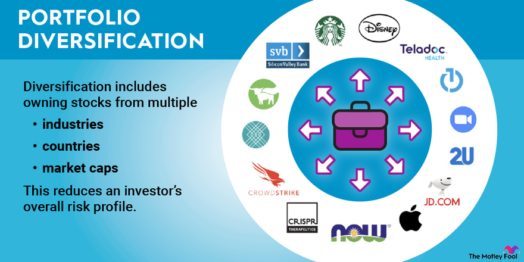

## Table of Contents

## What is diversification in investment?

Diversification in investment means spreading your money across different types of investments. Instead of putting all your money into one thing, like a single stock, you invest in a variety of things, like stocks, bonds, and real estate. This helps reduce the risk because if one investment does badly, the others might do well and balance it out.

Think of it like not putting all your eggs in one basket. If you drop the basket, you lose all your eggs. But if you have eggs in different baskets, dropping one won't ruin everything. Diversification helps protect your money and can lead to more stable returns over time.

## Why is diversification important for a million-dollar portfolio?

Diversification is super important for a million-dollar portfolio because it helps protect your big pile of money. Imagine you have a million dollars and you put it all into one company's stock. If that company does poorly, you could lose a lot of money. But if you spread that million dollars across many different investments, like stocks, bonds, and real estate, the risk is lower. If one investment goes down, others might go up and balance it out.

Also, with a million dollars, you have the chance to invest in a wide range of things. This means you can take advantage of different opportunities in the market. Some investments might grow slowly but steadily, while others might have the potential for big gains. By spreading your money around, you're not just playing it safe, but you're also setting yourself up to possibly make more money in different ways.

## What are the common asset classes to consider for diversification?

When you want to spread out your investments, you should think about different types of assets. The main ones are stocks, bonds, and real estate. Stocks are pieces of ownership in companies. When you buy a stock, you're hoping the company does well and the stock price goes up. Bonds are like loans you give to a company or government, and they pay you back with interest. Real estate means owning property, like houses or buildings, which can go up in value or earn you rent money.

Another important asset class to consider is cash and cash equivalents. This includes money in your bank account or short-term investments like money market funds. They're safe and easy to turn into cash when you need it. You might also look into commodities, like gold or oil, which can act differently from stocks and bonds. Lastly, there are alternative investments, like art or private equity, which can be riskier but might offer big rewards if they do well.

By mixing these different types of assets in your portfolio, you can lower your risk and maybe even increase your chances of making money. Each type of investment behaves differently, so when one goes down, another might go up. This balance helps keep your million-dollar portfolio safe and growing over time.

## How does diversification help in managing risk?

Diversification helps manage risk by spreading your money across different types of investments. If you put all your money into one thing, like one stock, and that stock does badly, you could lose a lot. But if you spread your money across many different investments, like stocks, bonds, and real estate, the risk is lower. If one investment goes down, others might go up and balance it out. This way, you're not putting all your eggs in one basket, which makes your overall investment safer.

Another way diversification helps manage risk is by reducing the impact of any single investment going bad. Imagine you have a million dollars and you invest it in ten different things. If one of those investments loses half its value, you're only losing 5% of your total portfolio. But if you had put all your money into that one investment, you'd lose half of everything. By spreading your investments, you're protecting yourself from big losses and making your portfolio more stable over time.

## What is the difference between strategic and tactical asset allocation?

Strategic asset allocation is like setting a long-term plan for your investments. You decide how much of your money you want to put into different types of investments, like stocks, bonds, and real estate, based on your goals and how much risk you're willing to take. Once you set this plan, you usually stick with it and only make small changes over time. It's like choosing a path and following it for a long time, making sure your investments are spread out in a way that matches your overall strategy.

Tactical asset allocation, on the other hand, is more about making short-term changes to your investments. You might decide to move more money into stocks if you think the stock market is going to do well, or into bonds if you think they'll be safer. This kind of allocation is more flexible and can help you take advantage of opportunities in the market as they come up. It's like adjusting your sails as you go, trying to catch the best winds to move your portfolio forward.

## How can one diversify across different sectors and industries?

To diversify across different sectors and industries, you can start by looking at the big groups of businesses, like technology, healthcare, finance, and energy. Instead of putting all your money into one sector, like tech, you spread it out. For example, you might invest in a tech company, a hospital, a bank, and an oil company. This way, if one sector has a bad year, the others might do well and help balance out your investments.

You can also use mutual funds or exchange-traded funds (ETFs) that focus on different sectors. These funds hold a bunch of stocks from different industries, so by buying into one fund, you're already spreading your money across many companies. For example, you could buy a tech [ETF](/wiki/etf-trading-strategies), a healthcare ETF, and a financial ETF. This makes it easier to diversify without having to pick individual stocks from each sector.

Another way to diversify is by looking at different industries within a sector. For example, within the healthcare sector, you could invest in pharmaceutical companies, medical device makers, and health insurance providers. By spreading your investments across different industries, you're not just betting on one part of the sector doing well. This can help protect your portfolio from big swings in any single industry.

## What role do international investments play in diversification?

International investments can really help you spread out your money and lower your risk. When you invest in companies or funds from different countries, you're not just relying on how well your home country's economy is doing. For example, if the U.S. economy is having a tough time, your investments in Europe or Asia might still do well. This means you can balance out the ups and downs in one part of the world with gains from another part.

Another way international investments help with diversification is by giving you access to different kinds of opportunities. Different countries have different industries that might be growing faster than others. For instance, maybe technology is booming in the U.S., but renewable energy is taking off in Germany. By investing in both, you can take advantage of these trends and potentially make more money. Plus, you're not putting all your eggs in one basket, which makes your overall investment safer.

## How should one approach diversification with alternative investments like real estate and commodities?

When you think about diversification, don't forget about alternative investments like real estate and commodities. These can be a good way to spread out your money and lower your risk. Real estate can be a great choice because it often goes up in value over time, and you can also earn money from rent. Commodities, like gold or oil, can be helpful because they often don't move the same way as stocks and bonds. If the stock market is doing badly, commodities might still do well and help balance out your investments.

But remember, alternative investments can be a bit trickier to manage than stocks and bonds. Real estate needs a lot of money to get started and can be hard to sell quickly. Commodities can be more unpredictable and might need special knowledge to invest wisely. So, it's a good idea to only put a part of your money into these kinds of investments. By mixing them with your other investments, you can make your portfolio stronger and safer. Just make sure you understand the risks and maybe talk to a financial advisor to help you make smart choices.

## What are the tax implications of different diversification strategies?

When you diversify your investments, you need to think about taxes too. Different types of investments can have different tax rules. For example, if you sell a stock and make a profit, you might have to pay capital gains tax. But if you hold onto that stock for more than a year, you might pay a lower tax rate than if you sold it sooner. Bonds can also have different tax treatments; some bonds, like municipal bonds, might be tax-free at the federal level, which can be a big plus if you're trying to keep your taxes low.

Another thing to think about is how often you're buying and selling. If you're always making changes to your portfolio, you might end up paying more in taxes because you're selling investments that have gone up in value. This is called realizing gains, and it can bump up your tax bill. On the other hand, if you're using a tax-advantaged account like an IRA or 401(k), you can delay paying taxes on your investments until you take the money out, which can be a smart way to keep more of your money working for you over time.

## How can one use modern portfolio theory to optimize a diversified million-dollar portfolio?

Modern Portfolio Theory (MPT) is a smart way to build a million-dollar portfolio that's both diversified and efficient. MPT says that you should pick a mix of investments that gives you the best possible return for the amount of risk you're willing to take. You do this by looking at how different investments move together. If stocks and bonds usually go up and down at different times, putting money in both can help smooth out your returns. By using MPT, you can figure out the best way to spread your million dollars across different types of investments like stocks, bonds, real estate, and even international assets. This helps make your portfolio stronger and more likely to grow over time.

To use MPT to optimize your million-dollar portfolio, start by figuring out how much risk you're okay with. Then, look at a bunch of different investments and see how they've done in the past. You can use a computer to help you find the best mix of these investments. This mix should give you the highest return for the level of risk you're comfortable with. Remember, MPT isn't just about [picking](/wiki/asset-class-picking) the best single investment; it's about how all your investments work together. By following MPT, you can make your million-dollar portfolio more diversified and better at handling the ups and downs of the market.

## What advanced tools and metrics can be used to assess and adjust diversification?

To assess and adjust the diversification of your investments, you can use advanced tools like portfolio analysis software. These programs can look at how your investments are spread out across different types of assets, sectors, and countries. They use something called correlation analysis to see how different parts of your portfolio move together. If everything in your portfolio goes up and down at the same time, you might not be as diversified as you think. The software can help you find the right mix of investments so that when one part goes down, another part might go up, keeping your portfolio balanced.

Another important tool is the Sharpe Ratio, which measures how much return you're getting for the risk you're taking. A higher Sharpe Ratio means you're getting more return for less risk, which is what you want. You can also use the Sortino Ratio, which is similar but focuses more on the bad kind of risk, like losing money. By keeping an eye on these ratios, you can see if your diversification strategy is working well or if you need to make some changes. These tools and metrics help you keep your million-dollar portfolio strong and growing over time.

## How does one rebalance a diversified portfolio to maintain optimal asset allocation over time?

Rebalancing a diversified portfolio means making sure your investments stay in line with your original plan. Over time, some of your investments might grow faster than others, so the balance of your portfolio can change. For example, if your stocks do really well, you might end up with more money in stocks than you wanted. To fix this, you sell some of the stocks that grew a lot and use that money to buy more of the investments that didn't grow as fast, like bonds or real estate. This way, you keep your portfolio balanced and stick to your long-term strategy.

You should think about rebalancing your portfolio every year or so, or if your investments shift a lot from your plan. It's a good idea to check how your investments are doing and see if you need to make any changes. Rebalancing helps you manage risk and make sure your portfolio stays diversified. By keeping your investments spread out the way you want, you can feel more confident that your million-dollar portfolio is on track to meet your goals.

## What is Understanding Diversification?

Diversification is a fundamental principle in investment management that aims to reduce risk by allocating investments across various financial instruments, industries, and other categories. This strategy's primary benefit lies in its ability to mitigate the impact of negative performance in a single investment or sector by spreading exposure. In essence, diversification embodies the adage, "Don't put all your eggs in one basket." By constructing a portfolio with a broader range of investments, investors can potentially achieve more stable returns over time.

### Explanation of Diversification and Its Benefits in Risk Management

The concept of diversification revolves around the idea of minimizing unsystematic risk—risk specific to a company or industry—by combining assets that do not move in perfect harmony. While systematic risk, which affects the entire market and is non-diversifiable, remains, a well-diversified portfolio can significantly reduce the effects of risks associated with particular investments.

Statistical theory underpins the effectiveness of diversification, suggesting that as more unrelated or low-correlated assets are added to a portfolio, the overall variance of returns declines, and the portfolio becomes less volatile. The reduction of risk through diversification can be quantified using the variance formula:

$$
\sigma_p^2 = \left( \frac{1}{N} \right) \sigma^2 + \left( 1 - \frac{1}{N} \right) \text{Cov}(r)
$$

where $\sigma_p^2$ is the portfolio variance, $N$ is the number of assets, $\sigma^2$ is the average variance of the assets, and $\text{Cov}(r)$ represents the average covariance between the asset returns. As $N$ increases, the portfolio variance $\sigma_p^2$ approaches the level of systematic risk, reducing the weight of unsystematic risk.

### Examples of Traditional Diversification Methods: Stocks, Bonds, and Commodities

Traditionally, diversification has been achieved through a combination of different asset classes, each with distinct risk and return profiles:

1. **Stocks**: Equities represent ownership in a company and offer growth potential along with inherent volatility. Diversifying into different sectors and geographies can help balance risks specific to industries or markets.

2. **Bonds**: Fixed-income securities provide regular interest payments and typically exhibit lower volatility than equities. These instruments can cushion a portfolio against stock market downturns, given their tendency to behave inversely to equities during turbulent periods.

3. **Commodities**: Investing in physical goods like gold, oil, or agricultural products offers a hedge against inflation and currency devaluation. Commodities often have low correlation with traditional financial markets, making them suitable candidates for diversification.

Incorporating these asset classes into a portfolio can enhance its resilience to market perturbations, as they often respond differently to economic events. This diversity in reactions allows a balanced portfolio to harness gains from one asset class while offsetting potential losses in another, providing a smoother investment experience for investors.

## What are Wealth Management Strategies for Portfolio Diversification?

Wealth management strategies play a crucial role in portfolio diversification, balancing various elements to achieve optimal risk-adjusted returns. Diversification involves spreading investments across multiple asset classes to reduce the overall risk of a portfolio. This strategy aims to minimize the impact of any one underperforming asset on the portfolio's overall performance. The foundation of diversification lies in the principle that different assets rarely move in perfect correlation; therefore, a diversified portfolio can mitigate losses in adverse market conditions.

### Balancing Risk and Return Through Diversification

Wealth management professionals use diversification to strike a balance between risk and return by ensuring that the portfolio is not overly exposed to any single asset class or market sector. For instance, combining equities with bonds and commodities can create a diversified portfolio that takes advantage of the inverse or low correlations between these asset classes. Stocks may offer high growth potential, while bonds provide stability and income, and commodities can serve as a hedge against inflation.

An illustrative example can be seen in the correlation matrix among different asset classes:

$$

\begin{array}{l|c|c|c}
\text{Asset Class} & \text{Stocks} & \text{Bonds} & \text{Commodities} \\
\hline
\text{Stocks} & 1 & 0.2 & 0.3 \\
\text{Bonds} & 0.2 & 1 & 0.1 \\
\text{Commodities} & 0.3 & 0.1 & 1 \\
\end{array}
$$

In the matrix, the low correlation coefficients illustrate the benefit of holding these diverse asset classes together.

### Importance of Asset Allocation in Portfolio Management

Asset allocation refers to the process of dividing investments among different categories, such as stocks, bonds, real estate, and cash, within a portfolio. This process is fundamental to portfolio management, as it directly impacts the portfolio's risk-return profile. The optimal asset allocation must align with the investor's risk tolerance, investment goals, and time horizon.

To calculate the expected return of a diversified portfolio, one may use the formula:

$$
E(R_p) = \sum_{i=1}^{n} w_i \cdot E(R_i)
$$

where $E(R_p)$ is the expected return of the portfolio, $w_i$ is the weight of each asset in the portfolio, and $E(R_i)$ is the expected return of each asset.

In practice, wealth managers apply these principles by continuously assessing market conditions and adjusting portfolios to maintain the desired allocation. Tactical asset allocation involves short-term adjustments to capitalize on market conditions, whereas strategic asset allocation is long-term and embodies the investor's risk-return preferences.

By implementing strategic and tactical asset allocation techniques, wealth management professionals can enhance a portfolio's diversification, thereby improving its potential for achieving stable and sustainable returns amid varying market conditions.

## How can dynamic allocation be achieved through algorithmic trading?

Algorithmic trading has significantly transformed the way investment portfolios are managed, particularly in relation to dynamic asset allocation. Dynamic allocation refers to the continuous adjustment of asset weights within a portfolio to optimize returns while managing risk, especially in volatile markets. Algorithms can process vast amounts of real-time market data, allowing for immediate and precise adjustments that human traders might find challenging to execute.

Algorithms, often driven by complex quantitative models, utilize real-time market data to analyze price movements, trading volumes, and other financial indicators. By leveraging this data, algorithms can identify trends and potential market shifts that might necessitate a change in asset allocation. For instance, should an algorithm detect increasing [volatility](/wiki/volatility-trading-strategies) in a particular asset class, it can reduce exposure to that class while simultaneously reallocating funds to more stable or promising sectors.

Mathematically, this dynamic adjustment can be represented by adjusting the weights $w_i$ of asset $i$ in a portfolio. Let $R_i(t)$ be the expected return of asset $i$ at time $t$, and $\sigma_i(t)$ its expected volatility. An algorithm might seek to optimize the Sharpe ratio, defined as:

$$
\text{Sharpe Ratio} = \frac{\sum_{i=1}^{n} w_i(t) R_i(t) - R_f}{\sqrt{\sum_{i=1}^{n} w_i(t)^2 \sigma_i(t)^2}}
$$

where $R_f$ is the risk-free rate. The goal is to maximize the Sharpe ratio by continuously adjusting the weights $w_i(t)$ in light of incoming data.

Dynamic portfolio management provides several benefits in volatile markets. Primarily, it enhances the ability to protect returns and mitigate losses. During market disruptions, traditional investment strategies might struggle to respond swiftly, leading to potential underperformance or losses. In contrast, [algorithmic trading](/wiki/algorithmic-trading) systems can quickly rebalance portfolios to align with new market trends, minimizing downside risk.

Moreover, dynamic allocation facilitates exploiting short-term opportunities that arise from transient market inefficiencies. Algorithms can systematically capitalize on these discrepancies by reallocating resources toward undervalued assets that are likely to outperform. This proactive approach is particularly beneficial in fast-paced markets where quick decision-making is crucial.

In summary, dynamic allocation through algorithmic trading introduces a layer of sophistication and responsiveness to portfolio management, proving especially advantageous in managing risk and optimizing returns amidst market volatility. As technology and financial models continue to advance, the capacity for algorithms to enhance investment strategies will likely expand, offering even greater potential for dynamic and effective wealth management.

## How can Combining Strategies enhance Multi-Asset Trading Algorithms?

Multi-asset trading involves the simultaneous trading of various asset classes such as equities, fixed income, commodities, and currencies. This approach is integral to diversification because it spreads investment across different markets, thereby reducing specific risks associated with a single asset class. Diversifying with multi-asset trading allows investors to harness various market dynamics, potentially yielding steadier returns.

Algorithmic trading, which employs advanced computational techniques to execute trades based on pre-defined criteria, enhances the capabilities of multi-asset trading. Algorithms can rapidly process vast amounts of market data, identifying patterns and executing trades faster than human traders. This capability is particularly beneficial in implementing complex strategies like [statistical [arbitrage](/wiki/arbitrage)](/wiki/statistical-arbitrage) and sector rotation.

Statistical arbitrage, often referred to as "stat arb," is a sophisticated trading strategy that involves exploiting price inefficiencies between related financial instruments. The strategy is predicated on the mean-reverting behavior of asset prices. For example, if two stocks historically moved together but one temporarily deviates, algorithms may predict their convergence. Using statistical techniques and historical data analysis such as pairs trading, [statistical arbitrage](/wiki/statistical-arbitrage) models assess the relative pricing of asset pairs. Traders then establish buy and sell signals based on deviations from historical norms, as seen in the formula:

$$

\text{Signal} = (\text{Price}_A - \text{Price}_B) - \text{Historical Mean} 
$$

Sector rotation is another algorithmic strategy that capitalizes on the cyclical nature of different industry sectors. Economic cycles influence sector performance, and algorithms can analyze economic indicators to forecast which sectors are likely to outperform in a given phase. By rotating investments into these sectors, traders can optimize returns. For instance, during economic expansion, consumer discretionary stocks might be favored, while utilities might be preferred during downturns.

Using Python for algorithmic trading in multi-asset strategies enables traders to automate the analysis and execution processes. Leveraging libraries like Pandas for data manipulation, NumPy for numerical computations, and scikit-learn for predictive modeling, traders can develop robust systems that dynamically adjust portfolios based on market conditions. Here is a simplified Python code snippet illustrating how such an algorithm can detect arbitrage opportunities:

```python
import numpy as np
import pandas as pd

# Historical price data for two stocks
prices_A = pd.Series([100, 102, 101, 104, 106])
prices_B = pd.Series([98, 99, 97, 100, 101])

# Calculate the difference and historical mean
price_diff = prices_A - prices_B
historical_mean = price_diff.mean()

# Identify arbitrage opportunity
signals = price_diff - historical_mean 

# Buy/Sell signals based on thresholds
buy_signal = signals < -1
sell_signal = signals > 1

print("Buy Signals:\n", buy_signal)
print("Sell Signals:\n", sell_signal)
```

The strategic integration of algorithmic tools in multi-asset trading not only enhances diversification but also provides investors with the flexibility to adapt swiftly to market changes, potentially improving both risk management and return profiles in their portfolios.

## References & Further Reading

[1]: Bergstra, J., Bardenet, R., Bengio, Y., & Kégl, B. (2011). ["Algorithms for Hyper-Parameter Optimization."](https://dl.acm.org/doi/10.5555/2986459.2986743) Advances in Neural Information Processing Systems 24.

[2]: ["Advances in Financial Machine Learning"](https://www.amazon.com/Advances-Financial-Machine-Learning-Marcos/dp/1119482089) by Marcos Lopez de Prado

[3]: ["Evidence-Based Technical Analysis: Applying the Scientific Method and Statistical Inference to Trading Signals"](https://www.amazon.com/Evidence-Based-Technical-Analysis-Scientific-Statistical/dp/0470008741) by David Aronson

[4]: ["Machine Learning for Algorithmic Trading"](https://github.com/stefan-jansen/machine-learning-for-trading) by Stefan Jansen

[5]: ["Quantitative Trading: How to Build Your Own Algorithmic Trading Business"](https://www.amazon.com/Quantitative-Trading-Build-Algorithmic-Business/dp/1119800064) by Ernest P. Chan