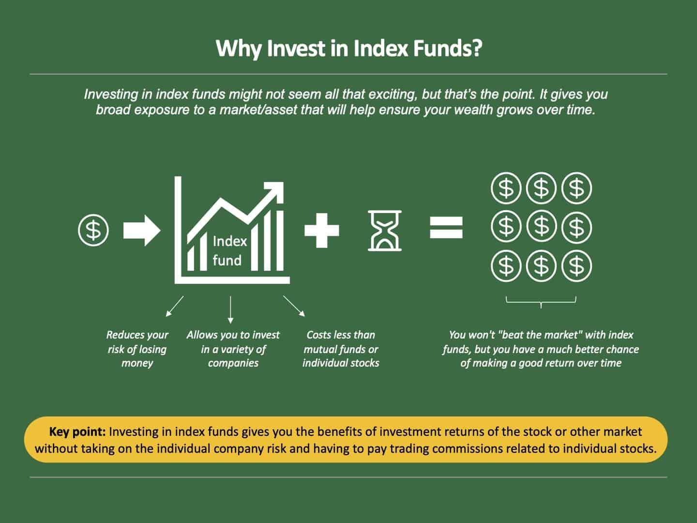

## Table of Contents

## What is diversification in investing?

Diversification in investing means spreading your money across different types of investments. Instead of putting all your money into one stock or one type of investment, you invest in a variety of things like stocks, bonds, and real estate. This helps reduce the risk because if one investment does poorly, the others might do well and balance it out.

Think of it like not putting all your eggs in one basket. If you drop the basket, you lose all your eggs. But if you have eggs in different baskets, dropping one basket won't ruin everything. Diversification helps protect your money and can lead to more stable returns over time.

## What are index funds and how do they work?

Index funds are a type of investment that aims to match the performance of a specific market index, like the S&P 500. An index is just a list of stocks that represent a part of the market. When you buy shares in an index fund, you're basically buying a tiny piece of all the companies in that index. This means your money is spread out across many different stocks, which helps lower your risk.

These funds work by holding all the stocks in the index they're tracking, in the same proportions. For example, if a company makes up 3% of the S&P 500, the index fund will have 3% of its money in that company's stock. Because they're designed to mimic the index, index funds don't need a lot of buying and selling, which keeps their costs low. This makes them a popular choice for people who want a simple, low-cost way to invest in the stock market.

## How can index funds help with diversification?

Index funds can help with diversification by spreading your investment across many different stocks. When you buy shares in an index fund, you're not just investing in one company; you're investing in all the companies that make up the index. This means if one company does poorly, it won't hurt your whole investment because you have pieces of many other companies too.

For example, if you invest in an S&P 500 index fund, you're buying a tiny piece of 500 big companies in the U.S. If one of those companies has a bad year, the other 499 might do well and balance it out. This spreading out of risk is what diversification is all about, and index funds make it easy to do this without having to pick and choose individual stocks yourself.

## What are the benefits of using index funds for diversification?

Index funds are a great way to diversify your investments because they let you own a little bit of a lot of different companies all at once. Instead of [picking](/wiki/asset-class-picking) one or two stocks, which can be risky if those companies do badly, you get to spread your money across many stocks. This means if one company doesn't do well, it won't hurt your whole investment because the other companies might do better and make up for it. It's like having a safety net for your money.

Another big benefit of using index funds for diversification is that they are usually cheaper than other types of investments. Because index funds just try to match the performance of a market index and don't need a lot of buying and selling, they have lower fees. This means more of your money stays in your pocket instead of going to pay for expensive management fees. Over time, these lower costs can really add up and help your investments grow more.

## How do you choose the right index funds for diversification?

Choosing the right index funds for diversification starts with understanding what you want to achieve with your investments. Think about how much risk you're okay with and how long you plan to keep your money invested. If you're looking for something safe and steady, you might want to go for a broad market index fund like one that tracks the S&P 500. This kind of fund includes a lot of big companies from different industries, so it's a good way to spread out your risk.

Next, consider looking at funds that focus on different parts of the market or different countries. For example, you might want to add an index fund that tracks small companies or one that invests in international markets. This can help you diversify even more because these funds will behave differently than the big U.S. companies in the S&P 500. By mixing different types of index funds, you can build a portfolio that's well-rounded and less likely to be hurt by problems in just one area.

Lastly, don't forget to check the fees of the index funds you're considering. Since the goal is to keep more of your money working for you, choosing funds with low expense ratios is smart. Look at the costs and see how they compare to other similar funds. A little bit of research can help you find index funds that not only help you diversify but also keep your costs down, making your investments more effective over time.

## What are the different types of index funds available for diversification?

There are many different types of index funds that can help you diversify your investments. One common type is the broad market index fund, like those that track the S&P 500 or the total U.S. stock market. These funds give you a piece of a large number of big companies, spreading your risk across different industries. Another type is sector-specific index funds, which focus on specific parts of the economy, like technology, healthcare, or energy. These can be useful if you want to invest more in areas you think will do well.

You can also find index funds that focus on different sizes of companies. For example, small-cap index funds invest in smaller companies, which can be riskier but also have the potential for higher growth. Mid-cap index funds are in between, offering a balance of risk and reward. Additionally, there are international index funds that invest in companies outside of the U.S., helping you spread your risk across different countries and economies.

Lastly, there are bond index funds, which invest in a variety of bonds instead of stocks. These can help balance out the risk in your portfolio because bonds usually don't move up and down as much as stocks. By mixing different types of index funds, like combining a U.S. stock market fund with an international fund and a bond fund, you can build a well-diversified portfolio that's less likely to be affected by problems in any one area.

## How much should one invest in index funds to achieve proper diversification?

To achieve proper diversification with index funds, you don't need a specific amount of money, but rather a good mix of different types of funds. A common rule of thumb is to start with a broad market index fund, like one that tracks the S&P 500 or the total U.S. stock market. This gives you a piece of many big companies and helps spread your risk across different industries. If you have more money to invest, you can add other types of index funds, like those that focus on small companies, international markets, or even bonds. The key is to have a mix that covers different parts of the market and different countries.

How much you invest in each type of index fund depends on your goals and how much risk you're okay with. If you're just starting out and don't have a lot of money, you might put most of it into a broad market fund. As you save more, you can add other funds to your mix. For example, you might decide to put 70% of your money in a U.S. stock market fund, 20% in an international fund, and 10% in a bond fund. This way, you're spreading your money across different types of investments, which can help protect your money and make your portfolio more stable over time.

## What are the risks associated with using index funds for diversification?

Even though index funds are a good way to spread out your investments, there are still some risks you should know about. One risk is that index funds follow the market, so if the whole market goes down, your index fund will go down too. This means you can't avoid market downturns completely, even with a diversified portfolio. Another risk is that some index funds might be too focused on certain parts of the market. For example, if you only invest in a tech index fund and the tech industry has a bad year, your investment could suffer a lot.

Also, while index funds usually have low fees, those fees can still add up over time and eat into your returns. It's important to pick funds with low expense ratios to keep more of your money working for you. Another thing to think about is that index funds don't change their investments much, which means they might keep money in companies that aren't doing well. This can be a problem if those companies keep dragging down the overall performance of the index. By understanding these risks, you can make smarter choices about how to use index funds for diversification.

## How does rebalancing a portfolio of index funds contribute to diversification?

Rebalancing a portfolio of index funds helps keep your investments spread out the way you want them to be. Over time, some of your index funds might grow faster than others, which can throw off your original plan. For example, if you wanted to have 70% of your money in a U.S. stock market fund and 30% in an international fund, but the U.S. fund did really well, you might end up with 80% in the U.S. fund. Rebalancing means selling some of the U.S. fund and buying more of the international fund to get back to your 70/30 split. This helps make sure your money is still spread out across different parts of the market, which is what diversification is all about.

By rebalancing, you're also managing risk. If one part of your portfolio grows too big, it can make your whole investment more risky because you're not as diversified as you used to be. Rebalancing helps you stick to your plan and keep your risk level where you want it. It's like checking your car's tires to make sure they're all at the right pressure. If one tire gets too much air, it can throw off the balance of the car. Rebalancing keeps your investment "tires" balanced, so your portfolio can handle the bumps in the road better.

## Can index funds be used effectively in a tax-advantaged account for diversification?

Yes, index funds can be used very well in a tax-advantaged account for diversification. A tax-advantaged account, like an IRA or a 401(k), lets you invest money without having to pay taxes on it right away. This means you can keep more of your money working for you, which is great when you're trying to build a diversified portfolio. By putting your index funds in one of these accounts, you can buy and sell them without worrying about taxes, which can help you rebalance your portfolio more easily and keep your investments spread out the way you want.

Using index funds in a tax-advantaged account also helps because these funds are already low-cost. Since you're not paying taxes on your gains right away, the low fees of index funds can make a big difference over time. This way, you get the benefits of diversification without the extra cost of taxes, making it easier to grow your investments and reach your financial goals.

## How do global and international index funds fit into a diversified investment strategy?

Global and international index funds are important parts of a diversified investment strategy because they help spread your money across different countries and economies. A global index fund includes companies from all over the world, including the U.S. This means you're not just betting on how well the U.S. economy will do, but also on how well other countries are doing. By investing in a global fund, you can lower your risk because if the U.S. market has a bad year, other parts of the world might do better and help balance things out.

An international index fund focuses only on companies outside of the U.S., which can also be a good way to diversify. If you already have a lot of your money in U.S. stocks, adding an international fund can give you exposure to different markets and industries. This can be especially helpful if you think other countries might grow faster than the U.S. or if you want to protect your money from problems that only affect the U.S. market. By mixing global and international index funds with your U.S. investments, you can build a portfolio that's more likely to handle ups and downs in the market.

## What advanced strategies can be used with index funds to enhance portfolio diversification?

One advanced strategy to enhance portfolio diversification with index funds is to use asset allocation funds. These funds mix different types of index funds, like stocks, bonds, and real estate, into one fund. This way, you can have a diversified portfolio with just one investment. For example, you might choose an asset allocation fund that has 60% in U.S. stocks, 30% in international stocks, and 10% in bonds. This can save you time because you don't have to pick and manage different index funds yourself. It also helps you stay diversified because the fund manager will rebalance the mix of investments to keep it in line with the fund's goals.

Another strategy is to use [factor](/wiki/factor-investing)-based index funds, which focus on specific characteristics of companies, like their size, value, or [momentum](/wiki/momentum). By adding these types of funds to your portfolio, you can get exposure to different parts of the market that might do well in different economic conditions. For example, you might add a small-cap value index fund to your mix of broad market funds. This can help you capture different sources of returns and reduce the risk of your portfolio because these factors don't always move in the same direction as the overall market. By carefully choosing a mix of traditional and factor-based index funds, you can build a more robust and diversified portfolio.

## What are the challenges and risks in diversified algorithmic portfolios?

Diversified algorithmic portfolios, while offering numerous benefits, also pose several challenges and risks that investors must carefully navigate. One of the primary risks is over-diversification. While diversification aims to spread risk across various assets, excessive diversification can dilute potential returns. This occurs when the incremental benefit of adding more assets to a portfolio diminishes, leading to a negligible reduction in risk but lowering overall returns. Investors must strike a balance between achieving adequate diversification and maintaining the potential for meaningful gains.

Maintaining a diversified portfolio necessitates managing high transaction costs and complex operational logistics. The need to regularly rebalance portfolios to ensure alignment with predefined strategies can lead to significant transaction costs, especially when high-frequency trading is involved. These costs can erode the benefits of diversification and affect the overall profitability of a portfolio. Additionally, operational logistics become complex as the number of assets and the scope of diversification increase, requiring sophisticated systems and processes to manage trades efficiently.

Another significant risk associated with diversified algorithmic portfolios is the potential increase in market correlations during financial crises. In times of market stress, asset prices that usually exhibit low correlations can suddenly move in tandem, reducing the effectiveness of diversification. This phenomenon was evident during the 2008 financial crisis when traditionally uncorrelated asset classes experienced simultaneous declines. Consequently, investors and portfolio managers must implement dynamic adjustment strategies capable of responding to shifts in market correlations.

Mathematically, the impact of market correlations on a portfolio can be represented through the covariance matrix, $\Sigma$, used in the calculation of portfolio variance. The variance $\sigma_p^2$ of a portfolio can be expressed as:

$$
\sigma_p^2 = \mathbf{w}^T \Sigma \mathbf{w}
$$

where $\mathbf{w}$ is the vector of weights allocated to each asset in the portfolio. An increase in correlations among assets results in a larger value of $\Sigma$, leading to higher portfolio variance, thus highlighting the challenges faced during correlated market downturns.

To mitigate these challenges, investors can employ algorithms capable of dynamically adjusting asset allocations in response to market changes. Advanced [machine learning](/wiki/machine-learning) techniques, such as [reinforcement learning](/wiki/reinforcement-learning), can be implemented to continually learn from market dynamics and optimize portfolio strategies accordingly. Utilizing these technologies aids in balancing diversification benefits with the associated risks, enhancing the resilience of diversified algorithmic portfolios in unpredictable market conditions.

## References & Further Reading

[1]: Markowitz, H. (1952). ["Portfolio Selection."](https://onlinelibrary.wiley.com/doi/abs/10.1111/j.1540-6261.1952.tb01525.x) The Journal of Finance, 7(1), 77–91.

[2]: Bogle, J.C. (2017). ["The Little Book of Common Sense Investing: The Only Way to Guarantee Your Fair Share of Stock Market Returns."](https://www.amazon.com/Little-Book-Common-Sense-Investing/dp/1119404509) Wiley.

[3]: Simons, J. (Renaissance Technologies). ["The Man Who Solved the Market: How Jim Simons Launched the Quant Revolution"](https://www.amazon.com/Man-Who-Solved-Market-Revolution/dp/073521798X) by Gregory Zuckerman.

[4]: Lopez de Prado, M. (2018). ["Advances in Financial Machine Learning."](https://www.amazon.com/Advances-Financial-Machine-Learning-Marcos/dp/1119482089) Wiley.

[5]: Chan, E. (2008). ["Quantitative Trading: How to Build Your Own Algorithmic Trading Business."](https://github.com/ftvision/quant_trading_echan_book) Wiley.

[6]: Jansen, S. (2020). ["Machine Learning for Algorithmic Trading."](https://github.com/stefan-jansen/machine-learning-for-trading) Packt Publishing.

[7]: Two Sigma. ["Technology and Data Driven Investment."](https://d3.harvard.edu/platform-rctom/submission/two-sigma-investments-will-machines-take-over-the-stock-market/) (Accessed 2023).

[8]: Aronson, D.R. (2007). ["Evidence-Based Technical Analysis: Applying the Scientific Method and Statistical Inference to Trading Signals."](https://onlinelibrary.wiley.com/doi/pdf/10.1002/9781118268315.fmatter) Wiley.

[9]: Van Vliet, P. (2010). ["High-Frequency Trading: A Practical Guide to Algorithmic Strategies and Trading Systems."](https://onlinelibrary.wiley.com/doi/pdf/10.1002/9781119203803.fmatter) Wiley.