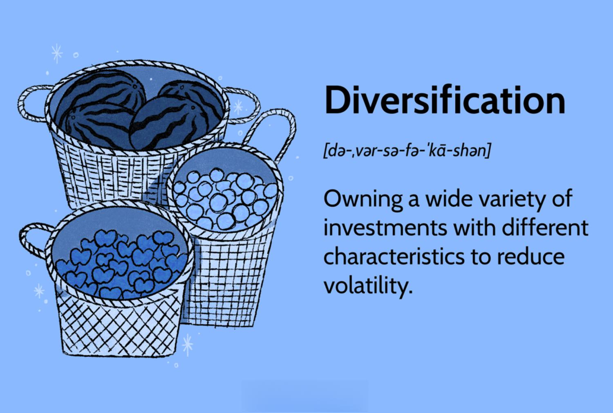

## Table of Contents

## What is diversification in the context of investments?

Diversification in investments means spreading your money across different types of investments. Instead of putting all your money into one stock or one type of asset, you invest in a variety of things like stocks, bonds, real estate, and maybe even some commodities. This way, if one investment does poorly, you won't lose all your money because other investments might do well.

The main goal of diversification is to reduce risk. Imagine if you only invested in one company and that company went bankrupt. You would lose all your money. But if you have investments in many different companies and industries, the failure of one won't hurt you as much. Diversification helps smooth out the ups and downs of the market, making your overall investment journey less bumpy.

## Why is diversification important for an investment portfolio?

Diversification is important for an investment portfolio because it helps reduce risk. When you spread your money across different types of investments, you're not putting all your eggs in one basket. If one investment goes down in value, the others might go up or stay the same, which can help balance out your losses. This way, you're less likely to lose a lot of money all at once.

It also helps you sleep better at night. Knowing that your money is spread out can make you feel more secure about your investments. Instead of worrying about one stock or one industry, you can relax knowing that your portfolio is more likely to weather different market conditions. Over time, this can lead to more stable and potentially better returns on your investments.

## How does diversification help in reducing risk?

Diversification helps reduce risk by spreading your investments across different things. Instead of putting all your money in one place, you put it in many places. If one of your investments loses value, the others might not. This means that even if one investment goes down, your whole portfolio won't lose as much money.

For example, if you only invest in tech stocks and the tech industry has a bad year, you could lose a lot of money. But if you also have money in other industries like healthcare or energy, those investments might do well even when tech stocks are down. By having a mix of investments, you're less likely to lose everything if one part of the market does poorly.

## What are the different types of diversification strategies?

Diversification strategies can be broken down into different types. One type is asset class diversification. This means spreading your money across different kinds of investments, like stocks, bonds, and real estate. Each type of investment behaves differently in the market, so by having a mix, you can reduce the risk of losing money if one type does poorly. For example, when stocks go down, bonds might go up or stay stable, helping to balance your portfolio.

Another type is geographic diversification. This means investing in companies or assets from different countries or regions. By doing this, you're not just relying on the economy of one place. If one country's economy does badly, your investments in other countries might do better. This can help protect your money from local economic problems.

A third type is sector diversification. This involves spreading your investments across different industries, like technology, healthcare, and energy. Different sectors can perform differently at different times. If one sector, like technology, has a bad year, your investments in other sectors, like healthcare, might do well. This helps reduce the risk that comes from focusing too much on one industry.

## Can you explain the concept of asset allocation in relation to diversification?

Asset allocation is a big part of diversification. It's about deciding how much of your money to put into different types of investments, like stocks, bonds, and cash. When you do asset allocation, you're trying to find a good mix that matches your goals and how much risk you're okay with. For example, if you're young and can handle more risk, you might put more money into stocks. But if you're closer to retirement and want to be safer, you might put more into bonds.

Diversification and asset allocation work together to help you manage risk. By spreading your money across different types of investments, you're less likely to lose a lot if one type does badly. Asset allocation helps you decide how to spread that money. It's like making a plan for your investments. If you stick to your plan and keep your investments balanced, you can have a better chance of reaching your financial goals without too much worry.

## How should one begin to diversify their investment portfolio?

To start diversifying your investment portfolio, first figure out what you want to achieve with your money and how much risk you're willing to take. If you're young and can handle more risk, you might want to put more money into stocks. But if you're older or prefer to play it safe, you might want to put more into bonds or other less risky investments. Once you know your goals and risk level, you can decide how to spread your money across different types of investments.

After deciding on your asset allocation, you can start choosing specific investments. You might want to invest in different industries like technology, healthcare, and energy to spread your risk. You can also look at investing in different countries to protect your money from problems in one place. A simple way to do this is by buying mutual funds or exchange-traded funds (ETFs) that already have a mix of different investments. This way, you can diversify without having to pick each investment yourself.

## What are common mistakes to avoid when diversifying investments?

One common mistake people make when diversifying their investments is over-diversifying. This happens when you spread your money too thin across too many different investments. It can make it hard to keep track of everything and might not even lower your risk that much. Instead of making your portfolio safer, it can just make it more complicated and harder to manage.

Another mistake is not diversifying enough. Some people might think they're diversified just because they own a few different stocks, but if those stocks are all in the same industry, they're not really spreading their risk. It's important to have a mix of different types of investments, like stocks, bonds, and maybe even real estate, to truly diversify. This way, if one type of investment does badly, the others might do well and help balance things out.

Lastly, people often forget to rebalance their portfolio. Over time, some of your investments might grow more than others, which can throw off your original plan. If you don't check and adjust your investments regularly, you might end up with too much money in one place and not enough in others. Rebalancing helps keep your portfolio in line with your goals and risk level, making sure you stay diversified.

## How does diversification impact potential returns?

Diversification can help make your investment returns more stable. When you spread your money across different types of investments, you're less likely to lose a lot of money if one investment does badly. This means your overall returns might not go up and down as much as they would if you had all your money in one place. It's like smoothing out the bumps on a road, making your investment journey less risky.

However, diversification might also mean you don't make as much money as you could if you had put all your money into one investment that did really well. If you diversify, you're giving up the chance to hit it big with one investment in exchange for a safer, more predictable return. So, while diversification can protect you from big losses, it might also limit your potential for big gains. It's all about finding the right balance that fits your goals and how much risk you're willing to take.

## What role does geographical diversification play in a global investment strategy?

Geographical diversification means spreading your investments across different countries or regions. This is important because it helps protect your money from problems that might happen in just one country. For example, if the economy in one country goes down, your investments in other countries might still do well. This way, you're not relying on just one place for your money to grow.

By investing in different parts of the world, you can take advantage of opportunities that might not be available in your own country. Different countries can have different economic cycles, so when one country's market is slow, another might be booming. This can help make your overall returns more stable and potentially higher over time. It's like not putting all your eggs in one basket, but spreading them out around the world.

## How can one measure the effectiveness of their diversification strategy?

To measure the effectiveness of your diversification strategy, you can look at how your portfolio performs over time. If your investments are spread out well, you should see that the ups and downs in your portfolio are not as big as they would be if you had all your money in one place. This means your diversification is helping to smooth out the bumps in the market. You can also compare your portfolio's performance to a benchmark, like a stock market index, to see if your diversification is helping you do better or at least keeping up with the market.

Another way to check your diversification is by looking at the correlation between your investments. Correlation is a fancy word that means how much your investments move together. If your investments are well-diversified, they won't all go up or down at the same time. You can use tools like a correlation matrix to see if your investments are moving independently of each other. If they are, that's a good sign that your diversification strategy is working.

## What advanced diversification techniques can be used by experienced investors?

Experienced investors might use a technique called [factor](/wiki/factor-investing) diversification. This means spreading their money across different factors that affect how investments do. Factors can be things like the size of a company, how much it grows, or how much risk it takes. By investing in different factors, investors can make their portfolio even more balanced. For example, they might invest in small companies, big companies, companies that are growing fast, and companies that are more stable. This way, if one factor does badly, the others might do well and help keep the portfolio strong.

Another advanced technique is using alternative investments for diversification. These can be things like hedge funds, private equity, or even art and collectibles. These kinds of investments often don't move the same way as stocks and bonds, so they can add another layer of protection to a portfolio. Experienced investors might put some of their money into these alternatives to spread their risk even more. But it's important to know that these investments can be more complicated and might need more time and effort to manage well.

## How does diversification apply to different types of investment vehicles like stocks, bonds, and real estate?

Diversification means spreading your money across different types of investments, like stocks, bonds, and real estate. When you invest in stocks, you can diversify by buying shares in companies from different industries, like technology, healthcare, and energy. This way, if one industry does badly, the others might do well and help balance out your losses. For bonds, you can diversify by investing in bonds from different issuers, like governments and companies, and in bonds that have different lengths of time until they pay you back. This can help protect your money from problems in one part of the bond market.

Real estate diversification can mean investing in properties in different areas or types of properties, like homes, apartments, or commercial buildings. If you own properties in different cities or countries, you're not just relying on one place for your money to grow. If one area's real estate market goes down, your investments in other areas might still do well. By mixing stocks, bonds, and real estate in your portfolio, you're spreading your risk even more. This can help make your overall investment journey smoother and less risky.

## References & Further Reading

[1]: Bergstra, J., Bardenet, R., Bengio, Y., & Kégl, B. (2011). ["Algorithms for Hyper-Parameter Optimization."](https://dl.acm.org/doi/10.5555/2986459.2986743) Advances in Neural Information Processing Systems 24.

[2]: ["Advances in Financial Machine Learning"](https://www.amazon.com/Advances-Financial-Machine-Learning-Marcos/dp/1119482089) by Marcos Lopez de Prado

[3]: ["Evidence-Based Technical Analysis: Applying the Scientific Method and Statistical Inference to Trading Signals"](https://www.amazon.com/Evidence-Based-Technical-Analysis-Scientific-Statistical/dp/0470008741) by David Aronson

[4]: ["Machine Learning for Algorithmic Trading"](https://github.com/stefan-jansen/machine-learning-for-trading) by Stefan Jansen

[5]: ["Quantitative Trading: How to Build Your Own Algorithmic Trading Business"](https://books.google.com/books/about/Quantitative_Trading.html?id=j70yEAAAQBAJ) by Ernest P. Chan