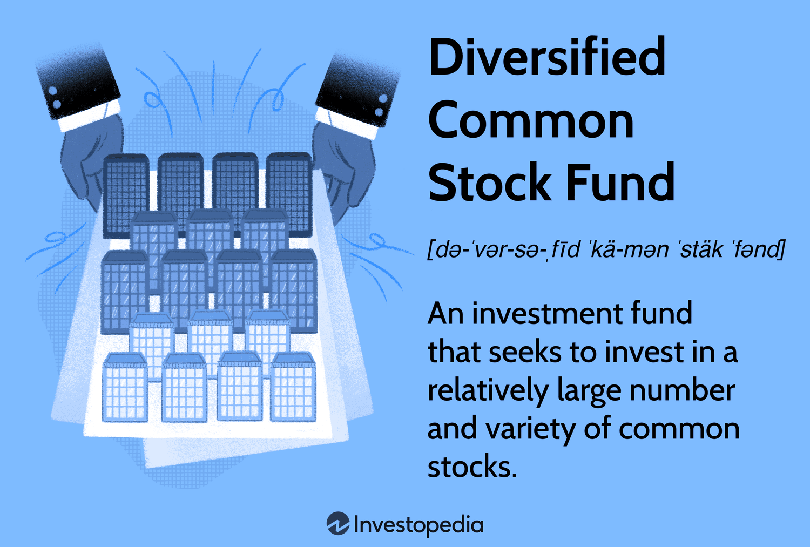

In recent years, the landscape of investment strategies has undergone a transformative shift with the advent of algorithmic trading. This development has introduced new dimensions to the diversification of investment portfolios, offering more nuanced ways to optimize returns while minimizing risks. Algorithmic trading enables investors to deploy complex algorithms to automate trading decisions, providing access to diverse asset classes and strategies that were previously difficult to manage manually.

Diversification, a fundamental principle of investing, involves spreading investments across various asset classes to reduce exposure to any single asset or risk. With the integration of algorithmic trading, this concept has been further expanded, allowing portfolios to benefit from sophisticated risk management and enhanced performance potential. The synergy of diversification and algorithmic trading creates opportunities for achieving a balanced risk-return ratio by including assets that exhibit different behaviors under varying market conditions.



This article examines the intersection of diversification, common stock, and algorithmic trading in developing robust investment strategies. By leveraging technology and advanced algorithms, investors can optimize asset allocation, ensuring portfolios are well-positioned to navigate the complexities of modern financial markets. As we explore these elements, it becomes evident that the strategic use of algorithms is crucial in fortifying portfolios against market fluctuations, underscoring the importance of embracing technological advancements in finance.

## Table of Contents

## Understanding Diversification in Investment Portfolios

Diversification is a fundamental concept in investment strategy aimed at minimizing risk by distributing investments across a variety of asset classes. This approach prevents over-reliance on any single asset or market, thus reducing the impact of market fluctuations on overall portfolio performance. By incorporating a range of investments, diversification seeks to create a more stable and predictable return profile.

The principal mechanism of diversification is the inclusion of assets with varying correlations. Assets that do not move in tandem under identical market conditions have the potential to offset losses from one another, balancing the risk-return trade-off. For instance, while stocks and bonds traditionally display an inverse relationship during certain market conditions, including commodities or real estate further diversifies a portfolio, as these tend to react differently to economic cycles.

Traditional diversification has primarily centered around conventional asset classes such as stocks and bonds. In this context, diversification may involve investing in a broad array of stocks spanning multiple sectors and geographic regions, coupled with various types of bonds. The diverse nature of these investments can stabilize returns by smoothing out volatility over time. For example, an adverse performance in technology stocks may be counterbalanced by a favorable performance in consumer staples or utilities sectors.

With the advent of sophisticated investment strategies, [algorithmic trading](/wiki/algorithmic-trading) has significantly widened the horizon for diversification. Algorithms can efficiently manage and execute trades across traditional and non-traditional asset classes, including but not limited to derivatives, cryptocurrencies, and foreign currencies. This technological advancement facilitates comprehensive diversification strategies that were previously challenging to implement manually.

Algorithmic trading enables investors to explore new asset classes and sophisticated diversification methodologies with enhanced precision and speed. It achieves this by executing complex mathematical models and data analytics to identify and capitalize on market inefficiencies. Through algorithmic strategies, investors can reallocate resources dynamically in response to market triggers, ensuring robust diversification. Consequently, this expands the potential scope of diversified portfolios beyond conventional borders, optimizing the risk-return landscape more efficiently and effectively.

## The Role of Common Stock in Diversification

Common stocks form a central component in diversified investment portfolios primarily due to their potential for substantial returns. As corporations issue common stock to raise capital, investors gain an opportunity to share in the company's profits and growth prospects. This participatory aspect is a significant [factor](/wiki/factor-investing) in why common stocks are pivotal for diversification strategies. 

Diversified common stock funds incorporate a blend of large-cap, mid-cap, and small-cap stocks. Large-cap stocks are typically well-established companies with substantial market capitalization, often perceived as more stable investments. In contrast, mid-cap and small-cap stocks, although potentially more volatile, can offer higher growth opportunities. This assortment ensures that a portfolio is not overly reliant on a specific market segment, sector, or economic region, thereby enhancing the portfolio's resilience against market downturns.

Such funds utilize various investment styles, predominantly value and growth investing, to further bolster diversification. Value investing involves selecting stocks that appear to be undervalued by the market, with the expectation that their true value will be recognized over time. Growth investing, on the other hand, focuses on companies that demonstrate potential for substantial future growth, albeit sometimes at the cost of higher [volatility](/wiki/volatility-trading-strategies).

By employing these strategies, diversified common stock funds strive to maintain a balance between risk and reward. The diversity in company size, industry sector, and investment approach allows for broader exposure and reduces unsystematic risk—that is, the risk associated with a specific company or industry. This adaptability not only mitigates potential losses but also positions the portfolio to take advantage of a wider array of market opportunities. 

Thus, incorporating common stocks into a diversified portfolio provides a foundation for achieving a well-rounded investment strategy that can harness the growth potential of the stock market while managing inherent risks.

## Algorithmic Trading: A Game Changer for Diversification

Algorithmic trading leverages technology to streamline the process of portfolio diversification by automating asset transactions according to predetermined criteria and prevailing market conditions. Algorithms process vast amounts of market data to monitor multiple assets and adjust portfolios swiftly, ensuring optimal asset allocation while minimizing human intervention.

Key strategies that underscore the role of algorithmic trading in diversification consist of multi-asset diversification, sector rotation, and geographic diversification. Multi-asset diversification involves spreading investments across various asset classes such as equities, bonds, commodities, and foreign currencies, which reduces exposure to risk associated with any one asset class. By analyzing historical data and current market trends, algorithms can identify correlations and volatilities among these classes, allowing for a strategic allocation of assets that improves the risk-return profile.

Sector rotation is another pivotal strategy enabled by algorithmic trading. Algorithms can shift capital between different industry sectors based on economic cycles, sector performance, and predictive analytics. For instance, during an economic expansion, algorithms might favor technology and consumer discretionary sectors, while shifting to consumer staples and utilities during downturns. This method takes advantage of sector-specific economic conditions to enhance portfolio returns.

Geographic diversification, facilitated by algorithmic trading, helps absorb regional economic shocks and political risks by distributing investments across global markets. Algorithms can evaluate macroeconomic indicators and geopolitical factors to determine the optimal geographical asset allocation. This not only mitigates the risk associated with investing in a single country or region but also capitalizes on growth opportunities in emerging markets.

In Python, a basic example of how algorithmic trading might aid diversification can be illustrated using a library like `pandas` for data manipulation and `numpy` for numerical operations:

```python
import pandas as pd
import numpy as np

# Sample data for asset classes: stocks, bonds, and commodities
data = {
    'Date': pd.date_range(start='1/1/2022', periods=5, freq='D'),
    'Stocks': [150, 152, 151, 153, 155],
    'Bonds': [102, 101, 103, 104, 105],
    'Commodities': [75, 74, 76, 77, 76]
}

# Creating a DataFrame
df = pd.DataFrame(data)

# Calculate daily returns
returns = df[['Stocks', 'Bonds', 'Commodities']].pct_change().dropna()

# Calculate the correlation matrix to understand how asset classes relate
correlation_matrix = returns.corr()

# Example of making allocation decisions based on correlations:
allocations = np.array([1 - correlation_matrix['Stocks'].mean(),
                        1 - correlation_matrix['Bonds'].mean(),
                        1 - correlation_matrix['Commodities'].mean()])

# Normalize the allocations to ensure they sum to 1
allocations /= allocations.sum()

print("Optimal Asset Allocation:", allocations)
```

This script presents a simplistic approach to understanding asset returns and correlations, allowing for a basic assessment of how to allocate capital across different asset classes to achieve diversification. Algorithmic trading systems, however, use more sophisticated models and techniques incorporating real-time data and advanced analytical methods to optimize diversification strategies, providing investors with a robust mechanism to navigate market complexities effectively.

## Implementing Diversification Through Algorithmic Trading

Algorithmic trading is a significant tool in implementing diversification due to its capability to access a broader spectrum of markets, which traditional trading methods may not efficiently reach. By executing trades based on predetermined rules and analyzing extensive datasets, algorithmic trading systems can assimilate assets from various classes, sectors, and geographies, thereby enriching the diversification spectrum.

One of the major benefits of these automated systems is the minimization of emotional biases that often plague human traders. Emotions such as fear and greed are significant impediments in manual trading as they frequently lead to inconsistent application of investment strategies. By removing this emotional variable, algorithmic systems facilitate a more disciplined approach, sticking to data-driven, pre-set strategies regardless of market volatility or investor sentiment.

Furthermore, algorithmic trading empowers dynamic portfolio rebalancing. This automated adjustment is crucial for maintaining an optimal asset distribution that is aligned with the investor's goals. In a diversified portfolio, asset weights must often be rebalanced to reflect changing market conditions and asset performances. The formula for calculating the new weight $w_i$ of an asset $i$ in a portfolio, immediately after a change in its market value, is:

$$
w_i = \frac{v_i}{\sum v_j}
$$

where $v_i$ is the market value of asset $i$, and $\sum v_j$ is the total market value of the portfolio. Algorithmic trading systems can automate this recalculation and adjust asset holdings accordingly, ensuring that the portfolio remains diversified and risk-balanced.

In practice, a Python script can be used to automate portfolio rebalancing:

```python
def rebalance_portfolio(current_values, total_value):
    new_weights = {asset: value / total_value for asset, value in current_values.items()}
    return new_weights

# Example usage
current_values = {'StockA': 10000, 'StockB': 15000, 'BondC': 5000}
total_value = sum(current_values.values())
new_weights = rebalance_portfolio(current_values, total_value)
print(new_weights)
```

In conclusion, algorithmic trading fundamentally enhances the implementation of diversification strategies. It does so by enabling access to varied asset markets, minimizing emotional inconsistencies, and providing a framework for maintaining appropriately balanced portfolios that align with specified investment objectives. As such, with the growth of algorithmic technology, diversification strategies will continue to evolve, providing opportunities for more robust and resilient investment portfolios.

## Risk Management in Diversified Algorithmic Portfolios

Effective risk management is a cornerstone of successful portfolio diversification, especially when utilizing algorithmic trading. Algorithms in trading systems play a pivotal role in managing risks by executing trades with precision and speed based on pre-defined parameters. 

One of the primary ways algorithms manage risk is through the use of stop-loss orders. These are automated instructions to sell a security when it reaches a certain price, thereby limiting potential losses. For example, if a stock is purchased at $100, a stop-loss order might be set at $90, protecting the portfolio from further declines in value.

Additionally, algorithms can implement hedging strategies to reduce risk exposure. Hedging involves taking a position in a related security to offset potential losses in the primary investment. For instance, an algorithm might use options or futures contracts to hedge against adverse price movements in the portfolio's assets.

Rebalancing is another critical function that algorithms perform to maintain an optimal asset distribution in line with investment goals. Algorithms continuously assess the portfolio's asset allocation and make necessary adjustments to ensure the portfolio aligns with the investor's risk tolerance and return expectations. The formula for rebalancing might involve calculating the deviation from target asset weights and executing trades to correct these imbalances.

$$
\text{Deviation} = \frac{\text{Current Asset Weight} - \text{Target Asset Weight}}{\text{Target Asset Weight}}
$$

Continuous monitoring and historical [backtesting](/wiki/backtesting) are essential components of risk management in algorithmic trading. Monitoring involves real-time analysis of market conditions to detect patterns and anomalies that could impact portfolio performance. This enables algorithms to adjust strategies promptly, enhancing their effectiveness in volatile markets.

Historical backtesting, on the other hand, is the simulation of an algorithm's performance using historical data. It allows traders to validate and refine algorithmic strategies, ensuring they are robust under various market scenarios. Backtesting can highlight potential weaknesses in algorithms, offering insights for adjustments before deploying them in live trading environments.

Incorporating these risk management techniques effectively ensures that diversified algorithmic portfolios are resilient against market volatility, optimizing risk and return profiles while adhering to the established investment strategies.

## Conclusion

Combining diversification with algorithmic trading offers a compelling advantage in optimizing portfolio performance by effectively balancing risk and return. By integrating a diverse array of asset classes, investors can construct portfolios that are inherently resilient to market fluctuations. Algorithmic trading serves as a crucial mechanism in this process, utilizing sophisticated algorithms to automate and optimize asset allocation. This technology enables the continuous assessment and adjustment of portfolios, ensuring they remain aligned with investment objectives despite volatile market conditions.

Leveraging the strategic capabilities of algorithms, investors can efficiently manage diverse asset classes ranging from equities to bonds, commodities, and beyond. This comprehensive diversification ensures that portfolios are not overly exposed to risks associated with any single sector or region. Algorithms can swiftly execute trades based on predetermined strategies, responding in real-time to market data and enhancing the agility of the investment process.

As financial markets continue to evolve, the role of algorithmic trading in achieving effective diversification becomes increasingly significant. The speed and accuracy of algorithmic systems reduce human error and emotional bias, promoting more disciplined investment approaches. In an era where data and technology drive market dynamics, the integration of algorithmic trading in portfolio management not only enhances diversification but also ensures that portfolios are positioned to capitalize on emerging opportunities and withstand market volatility.

In conclusion, the synergy between diversification and algorithmic trading is pivotal to modern investment strategies. By harnessing these tools, investors can achieve a robust defense against market uncertainties while positioning themselves for optimal returns across various economic cycles. As technology continues to advance, the strategic application of algorithmic trading in diversification will undoubtedly remain a key factor in successful portfolio management.

## References & Further Reading

[1]: Bergstra, J., Bardenet, R., Bengio, Y., & Kégl, B. (2011). ["Algorithms for Hyper-Parameter Optimization."](https://dl.acm.org/doi/10.5555/2986459.2986743) Advances in Neural Information Processing Systems 24.

[2]: ["Advances in Financial Machine Learning"](https://www.amazon.com/Advances-Financial-Machine-Learning-Marcos/dp/1119482089) by Marcos Lopez de Prado

[3]: ["Evidence-Based Technical Analysis: Applying the Scientific Method and Statistical Inference to Trading Signals"](https://www.amazon.com/Evidence-Based-Technical-Analysis-Scientific-Statistical/dp/0470008741) by David Aronson

[4]: ["Machine Learning for Algorithmic Trading"](https://github.com/stefan-jansen/machine-learning-for-trading) by Stefan Jansen

[5]: ["Quantitative Trading: How to Build Your Own Algorithmic Trading Business"](https://www.amazon.com/Quantitative-Trading-Build-Algorithmic-Business/dp/1119800064) by Ernest P. Chan