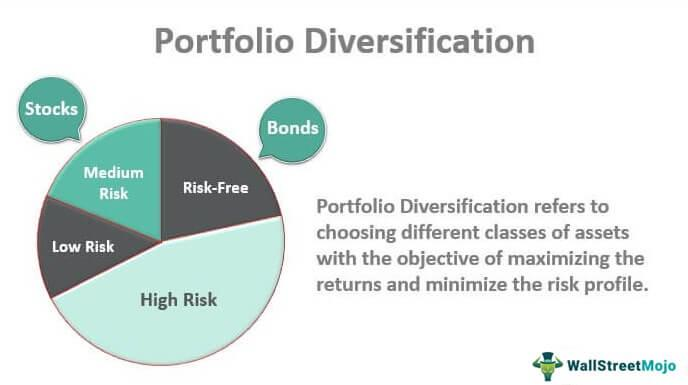

## Table of Contents

## What is a diversified fund?

A diversified fund is a type of investment fund that spreads its money across many different types of investments. This can include stocks, bonds, and other assets from various industries and countries. The main goal of a diversified fund is to reduce risk. By not putting all the money into one type of investment, the fund can protect itself better if one investment does poorly.

Diversified funds are popular because they offer a way for investors to have a broad range of investments without needing to buy each one separately. This can be especially helpful for people who don't have the time or knowledge to pick individual stocks or bonds. Instead, they can rely on the fund managers to make those decisions for them, aiming for a balanced and stable growth over time.

## How does a diversified fund work?

A diversified fund works by collecting money from many investors and using that money to buy a wide range of investments. This can include stocks from different companies, bonds from various issuers, and even other types of assets like real estate or commodities. The idea is to spread the money across many different things so that if one investment does badly, it won't hurt the whole fund too much. The people who manage the fund, called fund managers, choose what to buy based on their research and goals for the fund.

When you invest in a diversified fund, you're buying a small piece of all the investments the fund owns. This means you don't have to pick each stock or bond yourself; the fund managers do that for you. Over time, as the different investments in the fund grow or shrink in value, the overall value of your investment in the fund will change. The goal is to have a mix of investments that balance each other out, reducing the risk and aiming for steady growth.

## What are the benefits of investing in a diversified fund?

Investing in a diversified fund has many benefits. One big benefit is that it helps lower your risk. When you spread your money across many different investments, it's less likely that a problem with one investment will hurt your whole portfolio. If one stock goes down, other stocks or bonds in the fund might go up, balancing things out. This makes diversified funds a safer choice for people who don't want to take big risks with their money.

Another benefit is that diversified funds are easy to manage. Instead of having to pick and watch many different stocks or bonds yourself, you can let the fund managers do the work for you. They use their knowledge and research to choose a good mix of investments. This can save you time and effort, and it's especially helpful if you're new to investing or don't have the time to manage your investments closely.

Lastly, diversified funds can help you reach your financial goals more steadily. Because they spread the risk, they often provide more stable returns over time. This can be good if you're saving for something important, like retirement or buying a house. By investing in a diversified fund, you're more likely to see your money grow at a steady pace, without the big ups and downs that can come with investing in just one or two things.

## What types of assets are typically included in a diversified fund?

A diversified fund usually includes a mix of different types of assets to spread out risk. The main types of assets you'll find in these funds are stocks and bonds. Stocks come from many different companies, often from different industries like technology, healthcare, and finance. This way, if one industry does poorly, the fund isn't hit too hard because it also has stocks in other industries. Bonds are another big part of diversified funds. They can come from governments, big companies, or even smaller businesses. Bonds are generally safer than stocks, so they help balance out the riskier parts of the fund.

In addition to stocks and bonds, diversified funds might also include other types of assets. Real estate investment trusts (REITs) are common, which let the fund invest in properties without buying them directly. Commodities like gold, oil, or agricultural products might also be included, adding another layer of diversification. Some funds even invest in international assets, buying stocks and bonds from companies and governments in other countries. This global approach can help protect the fund from problems that might only affect one country or region.

Overall, the goal of a diversified fund is to have a little bit of everything. By mixing stocks, bonds, real estate, commodities, and possibly international investments, the fund aims to grow steadily over time while keeping risk as low as possible. This mix helps the fund managers create a balanced portfolio that can weather different market conditions and provide stable returns for investors.

## How does diversification reduce risk in a fund?

Diversification reduces risk in a fund by spreading the money across many different types of investments. Instead of putting all the money into one stock or bond, the fund invests in a lot of different things. This means if one investment does badly, it won't hurt the whole fund too much because other investments might do well. For example, if a tech company's stock goes down, the fund might still be okay because it also has stocks in healthcare or energy companies that are doing well. By not relying on just one thing, the fund can protect itself better from big losses.

Another way diversification helps is by balancing out the ups and downs of the market. Different types of investments can react differently to what's happening in the economy. Stocks might go up when the economy is doing well, but bonds might be safer when things are uncertain. By having both in the fund, it can keep growing even when parts of the market are struggling. This makes the fund's growth more steady and less likely to have big drops, which is good for people who want their money to grow safely over time.

## What are the differences between a diversified fund and a focused fund?

A diversified fund and a focused fund are two different ways to invest money. A diversified fund spreads its money across many different types of investments. This can include stocks from different companies, bonds, and even things like real estate or commodities. The idea is to reduce risk by not putting all the money in one place. If one investment does badly, it won't hurt the whole fund too much because other investments might do well. This makes diversified funds a safer choice for people who want to protect their money and see steady growth over time.

On the other hand, a focused fund puts its money into a smaller number of investments. These funds might focus on just a few stocks or a specific industry, like technology or healthcare. Because they have fewer investments, focused funds can be riskier. If one of the investments does badly, it can have a big impact on the whole fund. But focused funds can also offer bigger rewards if their chosen investments do well. They are often chosen by investors who are willing to take more risk for the chance of higher returns.

In summary, the main difference between a diversified fund and a focused fund is how they spread their investments. Diversified funds aim for safety and steady growth by spreading money widely, while focused funds aim for higher potential returns by concentrating on fewer, often riskier, investments. Choosing between them depends on how much risk you're willing to take and what your investment goals are.

## How can one evaluate the performance of a diversified fund?

To evaluate the performance of a diversified fund, you can look at several key things. One important thing is the fund's return, which shows how much the fund has grown over time. You can compare this return to a benchmark, like a stock market index, to see if the fund is doing better or worse than the market. Another thing to consider is the fund's risk, which you can measure with something called standard deviation. A lower standard deviation means the fund's returns are more stable, which is good for people who don't like big ups and downs.

Another way to evaluate a diversified fund is by looking at its expense ratio, which tells you how much it costs to manage the fund. A lower expense ratio means more of your money stays in the fund, which can lead to better returns over time. It's also helpful to check the fund's historical performance to see how it has done in different market conditions. While past performance doesn't guarantee future results, it can give you an idea of how the fund might perform in the future.

Lastly, consider the fund's asset allocation, which shows how the fund's money is spread across different types of investments. A well-diversified fund will have a good mix of stocks, bonds, and maybe even other assets like real estate or commodities. This mix helps reduce risk and can lead to more stable returns. By looking at all these factors together, you can get a good sense of whether a diversified fund is a good choice for your investment goals.

## What are the costs associated with investing in diversified funds?

When you invest in a diversified fund, you'll need to pay some costs. One of the main costs is the expense ratio. This is a fee that the fund charges to cover the costs of managing the fund, like paying the fund managers and other expenses. The expense ratio is usually a small percentage of the money you have in the fund, but it can add up over time. A lower expense ratio is better because it means more of your money stays in the fund, which can lead to higher returns.

Another cost to think about is the load fee. Some diversified funds charge a load fee when you buy or sell shares in the fund. There are two types of load fees: front-end loads, which you pay when you buy the shares, and back-end loads, which you pay when you sell the shares. Not all funds have load fees, so it's important to check before you invest. If a fund does have a load fee, it can make your investment more expensive, so you might want to look for funds with no load fees or lower fees.

Lastly, there might be other small costs, like transaction fees or account fees, depending on where you buy the fund. These fees can be small, but they can add up if you're buying and selling a lot. It's a good idea to read all the information about the fund before you invest so you know exactly what costs you'll be paying. By understanding all the costs, you can make a better decision about which diversified fund is right for you.

## How does asset allocation strategy impact the performance of diversified funds?

Asset allocation strategy plays a big role in how well a diversified fund does. It's all about how the fund's money is spread out across different types of investments, like stocks, bonds, and maybe even real estate or commodities. A good asset allocation can help reduce risk because it makes sure the fund isn't too heavily invested in just one thing. If the stock market goes down, for example, the fund might still do okay if it also has money in bonds or other assets that are doing better. This mix helps the fund grow more steadily over time, without big ups and downs.

The way a fund's assets are allocated also affects how much it can grow. If a fund has a lot of money in stocks, it might grow faster when the stock market is doing well, but it could also lose more money if the market goes down. On the other hand, if the fund has more money in bonds, it might grow more slowly but be safer because bonds are usually less risky than stocks. The fund managers choose the asset allocation based on what they think will help the fund meet its goals, like growing steadily or protecting against big losses. So, the right asset allocation can make a big difference in how well the fund performs for investors.

## What are the tax implications of investing in diversified funds?

When you invest in a diversified fund, you need to think about taxes. One thing to know is that you might have to pay taxes on the money the fund makes. This can happen in two ways: through dividends and capital gains. Dividends are when the fund pays you part of the money it earns from its investments. Capital gains happen when the fund sells an investment for more than it paid for it. Both of these can add to your taxable income, so you might have to pay taxes on them at the end of the year.

Another thing to think about is how often the fund buys and sells its investments. If the fund does this a lot, it can create more capital gains, which means more taxes for you. Some funds are better at keeping these taxes low by not trading as much. Also, where you keep your diversified fund can affect your taxes. If you put it in a tax-advantaged account like an IRA or 401(k), you might not have to pay taxes on the gains right away. This can help your money grow faster because you're not losing some of it to taxes each year.

## How do global economic conditions affect diversified funds?

Global economic conditions can have a big impact on diversified funds. These funds spread their money across many different types of investments, like stocks and bonds from all over the world. When the global economy is doing well, more people are buying things, and companies are making more money. This can make the stocks in the fund go up in value, helping the fund grow. But if the global economy is struggling, like during a recession, fewer people are spending money, and companies might not do as well. This can cause the stocks in the fund to go down, which can hurt the fund's performance.

Different parts of the world can also affect a diversified fund in different ways. For example, if one country is doing really well, the investments from that country in the fund might do better than others. But if another country is having problems, like high inflation or political issues, the investments from there might do worse. Because diversified funds have money in many different places, they can be affected by what's happening all over the world. This can help balance out the risk, but it also means the fund's performance can go up and down based on global economic conditions.

## What advanced strategies can be used to optimize returns in diversified funds?

One advanced strategy to optimize returns in diversified funds is called tactical asset allocation. This means the fund managers change how the fund's money is spread out based on what's happening in the market. For example, if they think stocks will do well, they might put more money into stocks. If they think bonds will be safer, they might move more money into bonds. By doing this, they try to take advantage of good opportunities and avoid big losses. This can help the fund grow faster, but it needs a lot of research and good timing to work well.

Another strategy is to use [factor](/wiki/factor-investing) investing. This means the fund managers pick investments based on certain things, or factors, that they think will help the fund do better. For example, they might look for stocks that are cheaper than others, or companies that are growing fast. By focusing on these factors, they try to find investments that will beat the market. This can help the fund grow more than it would if it just followed the market. But it's important to choose the right factors and keep an eye on how they're doing.

Lastly, some funds use smart beta strategies. This is a mix of active and passive investing. Instead of just following a market index, the fund uses a special way to pick investments that tries to do better than the market. For example, the fund might focus on stocks that pay high dividends or have low risk. By doing this, the fund tries to get better returns without taking on too much extra risk. This can help the fund grow more steadily over time, but it needs careful planning and management to work well.

## References & Further Reading

[1]: Markowitz, H. (1952). ["Portfolio Selection."](https://onlinelibrary.wiley.com/doi/abs/10.1111/j.1540-6261.1952.tb01525.x) Journal of Finance.

[2]: ["Advances in Financial Machine Learning"](https://www.amazon.com/Advances-Financial-Machine-Learning-Marcos/dp/1119482089) by Marcos Lopez de Prado

[3]: ["Quantitative Trading: How to Build Your Own Algorithmic Trading Business"](https://github.com/LucindaYa/quant-resources/blob/master/Quantitative%20Trading%20How%20to%20Build%20Your%20Own%20Algorithmic%20Trading%20Business.pdf) by Ernest P. Chan

[4]: Aldridge, I. (2013). ["High-Frequency Trading: A Practical Guide to Algorithmic Strategies and Trading Systems."](https://www.amazon.com/High-Frequency-Trading-Practical-Algorithmic-Strategies/dp/1118343506) Wiley.

[5]: Taleb, N. N. (2010). ["The Black Swan: The Impact of the Highly Improbable."](https://www.amazon.com/Black-Swan-Improbable-Robustness-Fragility/dp/081297381X) Random House.

[6]: Fabozzi, F. J. (Ed.). (2007). ["Handbook of Portfolio Construction: Contemporary Applications of Markowitz Techniques."](https://link.springer.com/book/10.1007/978-0-387-77439-8) Springer.