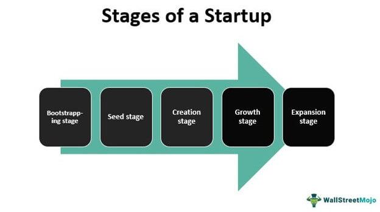

Diverse and inclusive environments play a crucial role in driving organizational success by fostering both innovation and engagement. Organizations and investors increasingly recognize the importance of diversity, equity, and inclusion (DEI) metrics and their implications across different sectors. This article examines how diversity scores, inclusivity metrics, equity measurement, and algorithmic trading intersect to form a comprehensive understanding of these concepts.

Diversity, equity, and inclusion metrics serve as vital tools for assessing workplace inclusivity. These metrics track representation, equity, and the sense of belonging within organizations, guiding them toward more inclusive cultures. Meanwhile, diversity scores are utilized in financial contexts to evaluate the diversification of investment portfolios. These scores assess the extent to which investment portfolios are composed of varied assets, aiding in risk management and portfolio stability.



Algorithmic trading represents another dimension, incorporating complex calculations—including diversity scores—to facilitate financial decision-making. By integrating a range of data inputs, these algorithms aim to optimize risk-adjusted returns. Such financial models also reflect broader trends towards ethical investing by considering DEI metrics, consequently aligning financial strategies with social responsibility.

Understanding how DEI and financial metrics interact offers valuable insights for enhancing both organizational operations and investment strategies. By leveraging these metrics, organizations are better positioned to make informed, impactful decisions that promote sustained growth and social responsibility. As such, the synergy between these dimensions is pivotal for achieving balanced and successful business outcomes in a rapidly evolving market landscape.

## Table of Contents

## Understanding Diversity Scores

Diversity scores were initially developed to evaluate the diversification level of collateralized debt obligations (CDOs). These financial instruments bundle assorted debt assets, and assessing their diversification is crucial for understanding potential risks and stability. Essentially, diversity scores function by comparing asset risks that are correlated against those that are uncorrelated. This comparison helps in determining the overall risk profile of a portfolio.

Moody's Diversity Score is a prime example of such a tool, designed to measure diversification by analyzing the similarity among assets within a portfolio. It calculates the degree of correlation between different assets and provides an index that reflects the diversification level. A higher score indicates greater diversity and potentially reduced risk because it suggests that the assets are less likely to default simultaneously.

The 2008 financial crisis prompted significant adaptations in these scoring methods. The crisis highlighted the severe impacts of underestimating correlated defaults, thus making reliable diversity scores essential for managing investment risks. Post-crisis, these scores underwent enhancements to better predict risks and stabilize investments by accounting for more complex correlations and potential adverse events.

However, there are limitations to diversity scores. They may not accurately reflect industry-specific risks, mainly because they often rely on historical data that may not be indicative of future trends. Additionally, these scores do not [factor](/wiki/factor-investing) in recovery rates after defaults, which can significantly affect the ultimate loss incurred by investors. Therefore, while valuable, diversity scores should be used in conjunction with other risk assessment tools to provide a more comprehensive risk evaluation.

## Incorporating DEI Metrics in Organizations

Diversity, Equity, and Inclusion (DEI) metrics are vital tools used to evaluate and enhance workplace inclusivity. These metrics are pivotal in measuring key aspects such as representation, equity, fairness, and the overall sense of belonging among employees. By systematically analyzing these dimensions, organizations can gain a comprehensive understanding of their workplace culture and identify opportunities for improvement.

Common DEI metrics include diversity indices, equity ratios, and inclusion scores. Diversity indices quantify the representation of different demographic groups within an organization, typically evaluating the proportional presence of various gender, ethnic, and racial groups. Equity ratios analyze the fairness in pay, promotions, and other opportunities across different demographic categories, providing insight into potential disparities. Inclusion scores assess how well employees feel valued and integrated into the workplace, capturing qualitative aspects of workplace culture and engagement.

To collect qualitative insights, organizations often rely on surveys and focus groups. These tools allow employees to voice their experiences and perceptions, shedding light on areas requiring attention and improvement. Surveys can cover a range of themes, such as job satisfaction, perceived fairness, and the inclusiveness of organizational policies. Focus groups provide a more interactive platform for discussion, enabling a deeper exploration of experiences and viewpoints.

Benchmarking is another critical component in contextualizing an organization's DEI efforts. By comparing its metrics against industry peers, an organization can better understand its relative standing and identify best practices from others in the sector. This comparative analysis helps in setting realistic targets and identifying gaps where the organization lags behind its counterparts.

Continuous data analysis is essential for setting actionable goals and fostering a positive organizational culture. Organizations can employ data analytics tools to monitor DEI metrics over time, ensuring that policies and interventions are effective. This ongoing assessment helps in refining strategies and making informed decisions to support inclusivity in the workplace. With the application of [machine learning](/wiki/machine-learning) algorithms, organizations may even predict trends and potential challenges in DEI efforts, allowing for preemptive action.

Organizations that integrate these DEI metrics into their strategic planning can foster a more inclusive and equitable work environment. By focusing on these key areas, companies are better equipped to enhance employee satisfaction, drive engagement, and ultimately improve organizational performance.

## Equity Measurement: Beyond Compliance

Equity measurement extends beyond mere compliance with legal requirements, seeking to establish genuinely fair and equitable workplaces. This effort is crucial for fostering an environment where each employee is valued and receives equitable treatment and opportunities, which in turn contributes to overall organizational success.

One of the primary ways to address equity is through specific metrics such as pay equity and promotion rates. Pay equity involves ensuring that employees are compensated equitably for their contributions, taking into account factors such as role, experience, and performance. By analyzing compensation data, organizations can identify disparities and work to adjust salaries to achieve parity. Promotion rates are another critical metric; they help organizations assess whether all employees have equal opportunities for advancement. Discrepancies in promotion rates may highlight underlying biases or structural barriers that need to be addressed.

Addressing equity proactively can significantly enhance employee satisfaction and retention. When employees perceive their workplace as fair, they are more likely to experience job satisfaction and remain with the company longer. This is further supported by a company’s commitment to driving equity through transparent policies and practices, which necessitates strong leadership accountability. Leaders must champion equitable practices, ensuring that policies are not only in place but are also effectively implemented and regularly evaluated for their impact.

To facilitate these efforts, equity measurement tools, often integrated within Diversity, Equity, and Inclusion (DEI) software, provide organizations with data-driven strategies for improvement. These tools can analyze large sets of data to produce insightful reports and visualizations, helping companies identify specific areas needing intervention and track progress over time. Advanced DEI tools might incorporate machine learning algorithms to predict future trends and suggest targeted strategies.

By leveraging these metrics and tools, organizations can move beyond compliance, fostering a culture of equity that enhances organizational performance and employee well-being.

## Complexities in Algorithmic Trading

Algorithmic trading, a cornerstone of modern financial markets, leverages the power of automation and advanced computational techniques to execute trades at speeds and frequencies that are beyond human capability. At its core, [algorithmic trading](/wiki/algorithmic-trading) utilizes a vast array of data, including diversity scores, market trends, and portfolio risks, to create risk-adjusted returns that are not only precise but also adaptable to changing market dynamics.

Diversity scores, traditionally employed to evaluate the diversification of financial assets, play a significant role in algorithmic trading. By assessing the correlation among various assets, these scores help in constructing a more stable and diversified portfolio, mitigating risks associated with market [volatility](/wiki/volatility-trading-strategies). Incorporation of these scores ensures that portfolios are not overly dependent on correlated asset classes, thus reducing systemic risk.

The integration of DEI (Diversity, Equity, and Inclusion) metrics in trading algorithms marks a progressive shift towards ethical investing. These metrics, traditionally used to gauge inclusivity within an organization, can be repurposed to ensure that the investments align with socially responsible and sustainable practices. For instance, by factoring in companies' DEI performance, trading algorithms can prioritize investments in businesses that demonstrate strong ethical governance and social responsibility.

The advanced capabilities of machine learning and [artificial intelligence](/wiki/ai-artificial-intelligence) (AI) provide a framework for enhancing the precision and responsiveness of trading algorithms. Machine learning models can analyze historical data and identify patterns or anomalies that may inform trading decisions. AI further enables these models to learn and adapt to new data inputs in real-time, improving predictive accuracy and decision-making efficiency. The use of neural networks or decision trees can be employed to evaluate complex interdependencies among variables such as asset values, economic indicators, and DEI metrics.

For example, a simplistic algorithm in Python might employ machine learning to factor diversity scores into the decision-making process:

```python
import numpy as np
from sklearn.ensemble import RandomForestRegressor

# Sample data
asset_features = np.array([[0.2, 0.5, 0.3], [0.4, 0.4, 0.2], [0.3, 0.6, 0.1]])
diversity_scores = np.array([0.7, 0.8, 0.6])

# Model training
model = RandomForestRegressor()
model.fit(asset_features, diversity_scores)

# Predictive analysis
new_asset = np.array([[0.25, 0.55, 0.2]])
predicted_diversity_score = model.predict(new_asset)
print(predicted_diversity_score)
```

Incorporating these diverse datasets into financial algorithms not only broadens the spectrum of investment opportunities but also aligns trading activities with a broader ethical framework. The adoption of such inclusive practices within algorithmic trading is indicative of a future where financial gain and social responsibility coexist, fostering a more balanced and equitable market environment. As algorithmic trading continues to evolve, its reliance on integrated metrics underscores the importance of comprehensive data analysis in developing sustainable investment strategies.

## The Synergy of DEI and Financial Metrics

The integration of Diversity, Equity, and Inclusion (DEI) metrics with financial analysis offers a comprehensive approach to organizational development. Research indicates that diverse teams are more likely to engage in innovative problem-solving and achieve superior financial performance. The rationale behind this is that diversity fosters a variety of perspectives, which enhances creativity and decision-making. In financial contexts, this leads to diverse investment strategies that can mitigate risks and capture opportunities.

Aligning DEI objectives with financial strategies signifies more than a commitment to corporate responsibility—it enhances brand reputation and investor confidence. Companies that successfully synchronize these aspects create a narrative that resonates with stakeholders who value ethical business practices. This alignment is also critical in attracting and retaining talent as employees increasingly seek workplaces that prioritize diversity and inclusivity.

Utilizing data from both DEI and financial domains allows organizations to make decisions that are not only informed but also impactful. For example, DEI metrics such as diversity indices and equity ratios can be integrated with market analysis to provide a fuller picture of organizational performance. This dual focus helps uncover correlations between inclusive practices and financial stability, enabling companies to adjust their strategies effectively.

Organizations benefit significantly from adopting a dual-focus approach where human capital metrics are given as much weight as financial strategies. The synergy created between DEI and financial metrics ultimately promotes sustainable growth by ensuring that both social and economic objectives are met. This comprehensive strategy positions companies to thrive in competitive markets while contributing positively to societal progress. 

In summary, the merging of DEI and financial metrics leads to an enriched framework that supports holistic growth, fostering environments where innovative ideas flourish and ethical considerations drive business success.

## Conclusion

Integrating diversity scores and diversity, equity, and inclusion (DEI) metrics into organizational and financial practices is essential for navigating today's complex markets. Each respective domain leveraged in tandem offers an innovative approach towards achieving both superior financial performance and enhanced social equity. Understanding the role of these metrics within algorithmic trading, for instance, equips organizations to generate not only economic gains but also to contribute positively to society. By incorporating DEI metrics, trading algorithms can align financial success with ethical considerations, thus balancing profitability with social responsibility.

Organizations must establish comprehensive DEI frameworks that guide both employee engagement and strategic investment decisions. These frameworks should utilize data-driven insights to promote fairness and representativeness across all levels of the organization. Such practices not only advance workplace inclusivity but can also enhance employee satisfaction, retention, and overall organizational performance. In financial investments, diversified portfolios evaluated through diversity scores can optimize risk management and return profiles.

Encouraging inclusivity in workplaces and investment portfolios fosters a market environment where ethical and equitable practices are prioritized. This dual focus not only supports corporate social responsibility but also enhances brand reputation among increasingly socially-conscious investors and consumers.

As businesses continue to evolve, strategies that emphasize both diversity in human resources and financial diversification emerge as cornerstones of sustained success. These interconnected approaches not only drive competitive advantage but also contribute to a more balanced and ethical market landscape. By adopting such comprehensive strategies, organizations can navigate future challenges with resilience and integrity, creating value that extends beyond mere financial metrics.

## References & Further Reading

[1]: Moody's Investors Service. (2004). ["Moody's Approach to Rating Collateralized Debt Obligations."](https://www.moodys.com/sites/products/Shared%20Documents/Rating%20Methodologies.xls?stop_mobi=yes) Moody's Global Credit Policy.

[2]: Jeong, J., & Song, J. (2021). ["The Role of Diversity in Corporate Governance and Financial Performance: Evidence from Corporate Boards."](https://scholar.google.com/citations?user=ySM96xgAAAAJ&hl=pl) Sustainability, 13(9), 5173.

[3]: CFA Institute. (2020). ["Diversity, Equity, and Inclusion Code for the Investment Profession."](https://rpc.cfainstitute.org/sites/default/files/-/media/documents/code/dei/dei-code-overview.pdf) CFA Institute.

[4]: Statman, M. (2000). ["Socially Responsible Mutual Funds."](https://www.researchgate.net/publication/240311517_Socially_Responsible_Mutual_Funds) Financial Analysts Journal, 56(3), 30-39.

[5]: Lopez de Prado, M. (2018). ["Advances in Financial Machine Learning."](https://www.amazon.com/Advances-Financial-Machine-Learning-Marcos/dp/1119482089) Wiley.

[6]: Deloitte. (2020). ["The Equity Imperative: The Business Case for Advancing Diversity, Equity, and Inclusion."](https://www2.deloitte.com/us/en/pages/about-deloitte/articles/the-equity-imperative.html) Deloitte Insights.