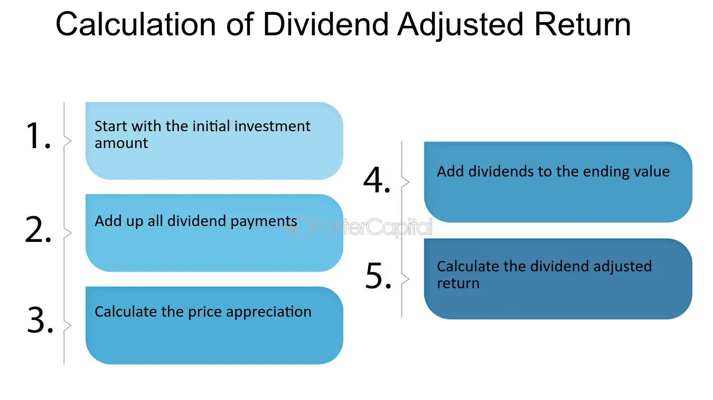

## Table of Contents

## What is a dividend?

A dividend is money that a company pays to its shareholders. It's like a reward for owning part of the company. When a company makes a profit, it can choose to share some of that profit with its shareholders. This payment is usually made every three months, but it can be different for each company.

Not all companies pay dividends. Some companies, especially new ones, might use all their profits to grow the business instead of paying dividends. If a company does pay dividends, the amount each shareholder gets depends on how many shares they own. The more shares you have, the more money you get from the dividend.

## What is a dividend-adjusted return?

A dividend-adjusted return is a way to measure how much money you make from an investment, including the dividends you get. When you invest in a stock, you can make money in two ways: the stock price can go up, or the company can pay you dividends. A dividend-adjusted return adds these two things together to give you a complete picture of your investment's performance.

For example, if you buy a stock and its price goes up by 5%, but the company also pays you a 2% dividend, your dividend-adjusted return would be 7%. This is important because it shows you the total benefit of owning the stock, not just the change in its price. By looking at the dividend-adjusted return, you can better understand if your investment is doing well or not.

## How is dividend-adjusted return calculated?

To calculate the dividend-adjusted return, you start with the total return of the investment. The total return is made up of two parts: the change in the stock's price and the dividends you receive. First, figure out how much the stock's price has changed from when you bought it to now. If you bought the stock for $100 and it's now worth $110, the price change is 10%.

Next, add the dividends you received during the time you owned the stock. If the company paid you $2 in dividends, you add that to the price change. So, the dividend-adjusted return would be the price change (10%) plus the dividends ($2/$100 = 2%), which equals 12%. This gives you a complete picture of how well your investment did, including both the growth in the stock's value and the money you got from dividends.

## Why is it important to consider dividends when calculating returns?

It's important to consider dividends when calculating returns because dividends are a big part of the money you can make from an investment. If you only look at how much the stock's price went up or down, you're missing out on the extra money you get from dividends. For example, if a stock's price stays the same but it pays a 4% dividend, you're still making money even though the stock's price didn't change.

Including dividends in your return calculation gives you a fuller picture of how well your investment is doing. Some companies might not have a big increase in their stock price, but they pay good dividends. By looking at the dividend-adjusted return, you can see if those dividends make the investment worthwhile. This helps you make better decisions about where to put your money.

## Can you provide an example of how to calculate dividend-adjusted return?

Let's say you bought a stock for $100. Over the year, the stock's price went up to $105. That's a 5% increase in the stock's price ($5/$100 = 0.05 or 5%). During that year, the company also paid you $3 in dividends. To find the dividend-adjusted return, you add the price increase to the dividends you received.

First, calculate the dividend yield, which is the dividends divided by the original price of the stock. In this case, it's $3/$100 = 0.03 or 3%. Now, add the price increase (5%) to the dividend yield (3%). The dividend-adjusted return is 5% + 3% = 8%. So, even though the stock's price only went up by 5%, your total return, including dividends, was 8%.

## How does dividend reinvestment affect the dividend-adjusted return?

When you reinvest your dividends, it means you use the money you get from dividends to buy more of the same stock. This can make your dividend-adjusted return bigger over time. Let's say you get a $3 dividend from a stock you bought for $100. If you reinvest that $3, you'll own more shares. Next time the company pays a dividend, you'll get more money because you have more shares. This can make your investment grow faster than if you just kept the dividends as cash.

Reinvesting dividends can turn a small difference into a big one over many years. Imagine you keep reinvesting your dividends for a long time. Each time, you're buying more shares, and those new shares will also earn dividends. This cycle can make your total return much higher than if you didn't reinvest. So, when you calculate your dividend-adjusted return, remember that reinvesting can make your investment grow even more than just adding the dividends to the price change.

## What are the differences between total return and dividend-adjusted return?

Total return and dividend-adjusted return are two ways to measure how well an investment is doing. Total return looks at how much the price of the investment has changed, plus any money you get from dividends. If you buy a stock for $100 and it goes up to $110, and you also get $2 in dividends, your total return would be the $10 increase in price plus the $2 in dividends, which is $12 or 12%.

Dividend-adjusted return is a bit different because it focuses on the percentage change, including the dividends. Using the same example, if you bought the stock for $100 and it went up to $110, that's a 10% increase in price. If you also got $2 in dividends, that's a 2% dividend yield ($2/$100). So, your dividend-adjusted return would be 10% (price increase) plus 2% (dividend yield), which equals 12%. Both total return and dividend-adjusted return give you a complete picture of your investment's performance, but they show it in slightly different ways.

## How do dividend-adjusted returns impact long-term investment strategies?

Dividend-adjusted returns are really important for long-term investment strategies because they show the full picture of how much money you're making from your investments. When you're thinking about investing for a long time, you want to know not just how much the price of your stocks goes up, but also how much money you get from dividends. By looking at the dividend-adjusted return, you can see if a stock that doesn't go up a lot in price but pays good dividends might be a good choice for you. This can help you pick investments that will grow your money over many years, not just a few months.

For example, if you're saving for retirement, you might want to invest in stocks that pay regular dividends. Over time, those dividends can add up and make a big difference in how much money you have. Plus, if you reinvest those dividends, you can buy more shares, which can lead to even more dividends in the future. This cycle can help your investments grow faster than if you just looked at the price going up. So, understanding dividend-adjusted returns can help you make smarter choices about where to put your money for the long term.

## What are the tax implications of dividend-adjusted returns?

When you get dividends from your investments, you have to pay taxes on them. The tax you pay on dividends depends on where you live and how much money you make. In the United States, dividends are usually taxed at a special rate that can be lower than the rate for your regular income. This special rate is called the qualified dividend rate. But if your dividends don't qualify for this special rate, you'll pay taxes on them at your normal income tax rate.

The tax on dividends can affect how much money you keep from your dividend-adjusted returns. If you get a lot of dividends, you might end up paying more in taxes, which means your actual return after taxes might be less than what you see on paper. It's a good idea to think about taxes when you're planning your investments. You might want to talk to a tax advisor to figure out the best way to handle your dividends and keep more of your money.

## How do market conditions influence dividend-adjusted returns?

Market conditions can have a big impact on dividend-adjusted returns. When the economy is doing well, companies might make more money and pay higher dividends. This can make your dividend-adjusted returns go up because you're getting more money from dividends. Also, when people feel good about the economy, stock prices might go up, which can make your returns even better. But if the economy is not doing so well, companies might cut back on dividends or not raise them as much. This can make your dividend-adjusted returns go down because you're not getting as much money from dividends. Plus, if people are worried about the economy, stock prices might go down, which can also hurt your returns.

Another thing to think about is interest rates. When interest rates go up, it can be harder for companies to borrow money, which might make them cut dividends. This can lower your dividend-adjusted returns. On the other hand, when interest rates are low, companies might have more money to pay out as dividends, which can help your returns. Also, different industries can be affected differently by market conditions. For example, some industries might do better in a bad economy and keep paying good dividends, while others might struggle and cut dividends. So, it's important to look at the bigger picture of the market when thinking about your dividend-adjusted returns.

## What role do dividend-adjusted returns play in portfolio performance analysis?

Dividend-adjusted returns are a key part of understanding how well your investments are doing. When you look at your portfolio's performance, you want to see the whole picture, not just how much the prices of your stocks have gone up or down. Dividend-adjusted returns help you do that by including the money you get from dividends in your total return. This is important because dividends can add up over time and make a big difference in how much money you make from your investments.

When you're trying to figure out if your portfolio is doing well, looking at dividend-adjusted returns can give you a clearer idea. For example, if a stock doesn't go up much in price but pays good dividends, it might still be a good investment. By including dividends in your return calculation, you can see if those dividends make the investment worthwhile. This can help you make better decisions about which investments to keep and which ones to change, making your overall portfolio stronger over time.

## How can investors use dividend-adjusted returns to compare the performance of different stocks or funds?

Investors can use dividend-adjusted returns to compare the performance of different stocks or funds by looking at how much money they make from both the change in price and the dividends they get. For example, if you're trying to decide between two stocks, one might have a higher price increase but pay less in dividends, while the other might have a smaller price increase but pay more in dividends. By calculating the dividend-adjusted return for each stock, you can see which one gives you more money overall. This helps you pick the best investment for your goals.

When comparing funds, like mutual funds or ETFs, dividend-adjusted returns are also very useful. Some funds might focus on stocks that pay high dividends, while others might focus on stocks that grow in price. By looking at the dividend-adjusted returns of these funds, you can see which one has done better over time, including both the growth in the fund's value and the dividends it pays out. This way, you can choose the fund that fits your investment strategy and helps you reach your financial goals.

## What is Dividend-Adjusted Return?

Dividend-adjusted return is a metric that comprehensively evaluates the performance of a stock by considering both capital appreciation and the dividends received by investors. This method provides a clearer and more accurate assessment of a stock's performance over a specific holding period than relying solely on price changes. By incorporating dividends, investors gain insight into the total return the stock has generated, which includes both the growth in stock price and the income from dividends. This holistic view is particularly valuable for income-focused strategies, where dividends play a significant role in total earnings.

The significance of dividends within an investment portfolio cannot be understated. For many investors, particularly those seeking income, dividends represent a substantial portion of their return. Therefore, dividend-adjusted returns offer a realistic depiction of profitability, underscoring the critical role these income payments play in the total return of a stock.

Mathematically, the dividend-adjusted return can be calculated by adding the total dividends received to the selling price of the stock and then comparing this sum to the initial purchase price. The formula for calculating the dividend-adjusted return is given by:

$$

\text{Dividend-Adjusted Return} = \left( \frac{\text{Ending Price} + \text{Total Dividends}}{\text{Beginning Price}} \right) - 1 
$$

Where:
- Ending Price is the price at which the stock is sold.
- Total Dividends is the sum of all dividends received during the holding period.
- Beginning Price is the price at which the stock was originally purchased.

This calculation reflects the true profitability of the stock over the holding period, providing investors with a comprehensive measure that accounts for both price appreciation and dividend income. The use of dividend-adjusted returns in financial analysis allows for a complete evaluation of securities, particularly benefitting those focused on long-term growth and consistent income generation.

## What is the role of understanding dividends in financial analysis?

Dividends significantly influence financial analysis by impacting stock prices and overall returns. They represent a portion of a company's earnings distributed to shareholders, reflecting the company's financial health and profitability. When assessing a stock's value, dividends contribute to a comprehensive understanding of the potential income from an investment.

The ex-dividend date holds particular importance as it marks when a stock begins trading without the dividend value. Investors purchasing the stock on or after this date do not receive the upcoming dividend payment. This often results in a price adjustment that reflects the dividend's value, affecting short-term stock price movements. The formula used to calculate the adjusted stock price after the ex-dividend date is typically:

$$
\text{Adjusted Price} = \text{Stock Price} - \text{Dividend Amount}
$$

Understanding this adjustment is crucial for accurate financial analysis as the apparent drop in stock price can be misleading without considering the dividend distribution.

Dividends are also perceived differently depending on a company's strategy and investor expectations. Some analysts view dividends as a potential devaluation because they involve distributing profits to shareholders instead of reinvesting in the company for growth opportunities. This perception can influence investor decisions and impact the stock's valuation.

Incorporating dividends into financial analysis is essential for an accurate evaluation of a company's investment potential. Dividend-adjusted metrics, such as the dividend-adjusted return, allow analysts to [factor](/wiki/factor-investing) in both capital appreciation and income generated through dividends. This holistic approach is vital in assessing the true performance of income-generating securities.

Furthermore, dividend-adjusted metrics play a crucial role in identifying accurate stock valuations and understanding market movements. By enabling analysts to account for dividends' impact on total returns, these metrics provide deeper insights into a stock's profitability, aiding in more informed investment decisions. Thus, dividends are an integral component of comprehensive financial analysis, greatly influencing investment outcomes.

## What is the role of Dividend-Adjusted Return in Investment Strategies?

Dividend-adjusted returns play a crucial role in shaping various investment strategies, particularly those that prioritize income generation. These strategies often attract risk-averse investors who prefer consistent income streams over aggressive growth opportunities. The inclusion of dividends in the calculation of total returns provides a comprehensive view of a stock’s performance, enhancing the ability to make well-informed investment decisions.

Investors who focus on dividend-paying stocks benefit from evaluating not only the capital appreciation but also the income potential derived from dividends. This dual-focus approach enables them to assess the true value a stock can add to their portfolio. Dividend-adjusted returns thus serve as a vital metric for these investors, allowing them to quantify the total return on their investment accurately. 

For instance, a simple way to calculate the total return, including dividends, can be expressed by the formula:

$$
\text{Dividend-Adjusted Return} = \left( \frac{\text{Final Price} + \text{Dividends Paid}}{\text{Initial Price}} \right) - 1
$$

This formula integrates the dividend payments into the overall return, providing a more complete picture of the investment's performance across the holding period.

Investment strategies that integrate dividend-adjusted returns typically emphasize long-term growth and stability. This focus aligns with the objectives of building sustainable and reliable portfolios. The reinvestment of dividends, often through dividend reinvestment plans (DRIPs), can further compound growth, enhancing the total return over time. These reinvestment strategies allow dividends to purchase additional shares, increasing the potential for compounded growth which becomes a crucial component of long-term financial planning.

By focusing on dividend-adjusted returns, investors can align their strategies with their financial goals, particularly those related to income stability. These returns also provide a critical lens through which to view the potential impact of market [volatility](/wiki/volatility-trading-strategies), allowing for adjustments that can buffer against unexpected market fluctuations. Consequently, dividend-adjusted returns are a strategic tool that empowers investors to harness the full potential of their equity investments, ensuring a balanced approach towards achieving financial objectives.

## What is the conclusion?

Dividend-adjusted return is a powerful tool for evaluating the full scope of investment performance. By incorporating dividends into the calculation of total returns, investors gain a more precise understanding of a stock's profitability. This comprehensive measure combines both capital appreciation and the income generated from dividends, providing an accurate representation of the total return on investment. 

For investors, understanding and utilizing dividend-adjusted returns can enhance investment strategies significantly. This is especially true for those focusing on dividend-oriented strategies and [algorithmic trading](/wiki/algorithmic-trading). Dividend adjustments allow for a detailed analysis of income-generating securities, helping investors make more informed decisions. 

Accurate historical and financial analysis is contingent upon comprehensive data that includes both capital appreciation and dividend impacts. When dividends are ignored, the true performance of an investment can be misrepresented, potentially leading to suboptimal decision-making. For example, consider a stock purchased at $100 that grew to $120 over a year and paid $5 in dividends. The simplified total return calculation would be:

$$
\text{Total Return} = \frac{(120 + 5) - 100}{100} \times 100\% = 25\%
$$

This calculation highlights the additional 5% return from dividends, which would otherwise be overlooked.

Incorporating dividend adjustments is essential for achieving investment goals and ensuring that the valuation of stocks reflects their real performance. This integration aids in constructing robust growth and income-focused portfolios and optimizes the performance of algorithmic trading strategies. Ultimately, dividends are not merely a complement to capital gains but a crucial element for a holistic investment analysis and strategy formulation.

## References & Further Reading

[1]: ["Dividends: An Overview"](https://money.usnews.com/investing/articles/what-is-a-dividend-and-how-do-dividend-stocks-work) - CFA Institute Research Foundation

[2]: Bodie, Z., Kane, A., & Marcus, A. J. (2014). ["Investments & Portfolio Management"](https://www.amazon.com/Investments-Portfolio-Management-Zvi-Bodie/dp/0071289143) - McGraw-Hill Education.

[3]: ["Stocks for the Long Run: The Definitive Guide to Financial Market Returns & Long-Term Investment Strategies"](https://www.amazon.com/Stocks-Long-Run-Definitive-Investment/dp/1264269803) by Jeremy J. Siegel

[4]: Graham, B. (2003). ["The Intelligent Investor: The Definitive Book on Value Investing."](https://www.amazon.com/Intelligent-Investor-Definitive-Investing-Essentials/dp/0060555661) - Harper Business

[5]: ["Dividend Policy: Its Impact on Firm Value"](https://www.semanticscholar.org/paper/Dividend-Policy%3A-Its-Impact-on-Firm-Value-Lease-John/729424dc0a79c499797a1609917d0f74b5f6f041) - Munich Personal RePEc Archive