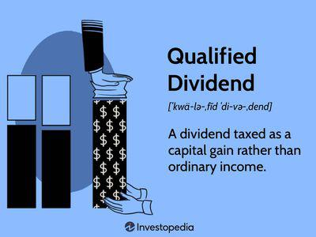

In the complex world of investment strategies, understanding the full spectrum of investment returns is crucial for both individual and institutional investors. A critical component often overlooked by investors is the role of dividends in calculating investment returns. Dividends represent a portion of a company's earnings distributed to shareholders, serving as an important source of income, particularly for those seeking steady cash flow.

This article explores the concept of dividend-adjusted return and its relevance in financial analysis, investment returns, and algorithmic trading. Dividend-adjusted return is a measure that considers both the capital appreciation of a stock and the dividends received by investors, providing a more comprehensive picture of a stock's performance. Traditional metrics often focus solely on the change in the stock's market price, neglecting the significant impact that dividends can have over time. By factoring in dividends, investors gain a holistic view of total returns, which is especially important for evaluating income-generating securities.



Understanding dividend-adjusted returns can significantly impact investment strategies, offering a more accurate evaluation of securities that pay out dividends regularly. This metric is particularly relevant for income-focused investors who prioritize dividends over capital gains. Additionally, the inclusion of dividend data in algorithmic trading models can enhance the robustness and reliability of these systems, allowing traders to make more informed decisions.

In summary, comprehending and utilizing dividend-adjusted returns can provide investors with a clearer and more accurate assessment of investment performance. This understanding is essential for formulating effective investment strategies that take into account both capital appreciation and income from dividends.

## Table of Contents

## What is Dividend-Adjusted Return?

Dividend-adjusted return is a metric that comprehensively evaluates the performance of a stock by considering both capital appreciation and the dividends received by investors. This method provides a clearer and more accurate assessment of a stock's performance over a specific holding period than relying solely on price changes. By incorporating dividends, investors gain insight into the total return the stock has generated, which includes both the growth in stock price and the income from dividends. This holistic view is particularly valuable for income-focused strategies, where dividends play a significant role in total earnings.

The significance of dividends within an investment portfolio cannot be understated. For many investors, particularly those seeking income, dividends represent a substantial portion of their return. Therefore, dividend-adjusted returns offer a realistic depiction of profitability, underscoring the critical role these income payments play in the total return of a stock.

Mathematically, the dividend-adjusted return can be calculated by adding the total dividends received to the selling price of the stock and then comparing this sum to the initial purchase price. The formula for calculating the dividend-adjusted return is given by:

$$

\text{Dividend-Adjusted Return} = \left( \frac{\text{Ending Price} + \text{Total Dividends}}{\text{Beginning Price}} \right) - 1 
$$

Where:
- Ending Price is the price at which the stock is sold.
- Total Dividends is the sum of all dividends received during the holding period.
- Beginning Price is the price at which the stock was originally purchased.

This calculation reflects the true profitability of the stock over the holding period, providing investors with a comprehensive measure that accounts for both price appreciation and dividend income. The use of dividend-adjusted returns in financial analysis allows for a complete evaluation of securities, particularly benefitting those focused on long-term growth and consistent income generation.

## Understanding Dividends in Financial Analysis

Dividends significantly influence financial analysis by impacting stock prices and overall returns. They represent a portion of a company's earnings distributed to shareholders, reflecting the company's financial health and profitability. When assessing a stock's value, dividends contribute to a comprehensive understanding of the potential income from an investment.

The ex-dividend date holds particular importance as it marks when a stock begins trading without the dividend value. Investors purchasing the stock on or after this date do not receive the upcoming dividend payment. This often results in a price adjustment that reflects the dividend's value, affecting short-term stock price movements. The formula used to calculate the adjusted stock price after the ex-dividend date is typically:

$$
\text{Adjusted Price} = \text{Stock Price} - \text{Dividend Amount}
$$

Understanding this adjustment is crucial for accurate financial analysis as the apparent drop in stock price can be misleading without considering the dividend distribution.

Dividends are also perceived differently depending on a company's strategy and investor expectations. Some analysts view dividends as a potential devaluation because they involve distributing profits to shareholders instead of reinvesting in the company for growth opportunities. This perception can influence investor decisions and impact the stock's valuation.

Incorporating dividends into financial analysis is essential for an accurate evaluation of a company's investment potential. Dividend-adjusted metrics, such as the dividend-adjusted return, allow analysts to [factor](/wiki/factor-investing) in both capital appreciation and income generated through dividends. This holistic approach is vital in assessing the true performance of income-generating securities.

Furthermore, dividend-adjusted metrics play a crucial role in identifying accurate stock valuations and understanding market movements. By enabling analysts to account for dividends' impact on total returns, these metrics provide deeper insights into a stock's profitability, aiding in more informed investment decisions. Thus, dividends are an integral component of comprehensive financial analysis, greatly influencing investment outcomes.

## Dividend-Adjusted Return in Investment Strategies

Dividend-adjusted returns play a crucial role in shaping various investment strategies, particularly those that prioritize income generation. These strategies often attract risk-averse investors who prefer consistent income streams over aggressive growth opportunities. The inclusion of dividends in the calculation of total returns provides a comprehensive view of a stock’s performance, enhancing the ability to make well-informed investment decisions.

Investors who focus on dividend-paying stocks benefit from evaluating not only the capital appreciation but also the income potential derived from dividends. This dual-focus approach enables them to assess the true value a stock can add to their portfolio. Dividend-adjusted returns thus serve as a vital metric for these investors, allowing them to quantify the total return on their investment accurately. 

For instance, a simple way to calculate the total return, including dividends, can be expressed by the formula:

$$
\text{Dividend-Adjusted Return} = \left( \frac{\text{Final Price} + \text{Dividends Paid}}{\text{Initial Price}} \right) - 1
$$

This formula integrates the dividend payments into the overall return, providing a more complete picture of the investment's performance across the holding period.

Investment strategies that integrate dividend-adjusted returns typically emphasize long-term growth and stability. This focus aligns with the objectives of building sustainable and reliable portfolios. The reinvestment of dividends, often through dividend reinvestment plans (DRIPs), can further compound growth, enhancing the total return over time. These reinvestment strategies allow dividends to purchase additional shares, increasing the potential for compounded growth which becomes a crucial component of long-term financial planning.

By focusing on dividend-adjusted returns, investors can align their strategies with their financial goals, particularly those related to income stability. These returns also provide a critical lens through which to view the potential impact of market [volatility](/wiki/volatility-trading-strategies), allowing for adjustments that can buffer against unexpected market fluctuations. Consequently, dividend-adjusted returns are a strategic tool that empowers investors to harness the full potential of their equity investments, ensuring a balanced approach towards achieving financial objectives.

## The Role of Dividend-Adjusted Data in Algorithmic Trading

Algorithmic trading, a method that uses automated systems to execute trades based on pre-defined criteria, heavily depends on historical data to design and validate trading strategies. Dividend-adjusted data is critical in this context because it ensures that algorithmic models accurately reflect market dynamics. 

When historical data is adjusted for dividends, it recognizes the value that dividends contribute to the total return of a security. This adjustment involves modifying the historical price data to account for these payouts, preventing misleading spikes or drops in the price series. Without these adjustments, algorithms may incorrectly interpret stock movements, leading to flawed decisions and potentially increased risk exposure.

Accurately adjusted data also considers stock splits, where the number of shares increases while the price per share decreases. This is another essential adjustment to avoid artificial distortion in historical price data. For example, a stock splitting 2-for-1 will see its share price halve but maintains the same market capitalization and intrinsic value.

In practice, a Python script that adjusts historical prices for dividends and stock splits might involve fetching this data from a reliable source such as Yahoo Finance, and applying corrections to the historical price series. Here’s an example of how such adjustments can be implemented:

```python
import pandas as pd
import yfinance as yf  # For more datasets, visit: https://paperswithbacktest.com/datasets

# Fetch historical market data
stock_data = yf.download('AAPL', start='2020-01-01', end='2023-01-01')
dividends = stock_data['Dividends']
stock_splits = stock_data['Stock Splits']

# Adjust price for dividends and splits
adjust_factor = (1 + dividends).cumprod() / (1 + stock_splits).cumprod()
stock_data['Adj Close'] *= adjust_factor.shift(fill_value=1)

# The 'Adj Close' now reflects dividend and split adjustments
```

Utilizing dividend-adjusted data gives algorithmic traders the precise historical price series essential for creating effective strategies. It reduces the risk of strategy failure caused by misinterpretation of price movements that are, in reality, attributable to dividend distributions rather than genuine changes in market valuation.

In summary, accounting for dividends and other corporate actions offers algorithmic traders robust data to base their models on, optimizing strategy performance and improving overall trading outcomes. By recognizing the importance of dividend-adjusted data, traders can ensure a more realistic and data-integrated approach to [algorithmic trading](/wiki/algorithmic-trading).

## Conclusion

Dividend-adjusted return is a powerful tool for evaluating the full scope of investment performance. By incorporating dividends into the calculation of total returns, investors gain a more precise understanding of a stock's profitability. This comprehensive measure combines both capital appreciation and the income generated from dividends, providing an accurate representation of the total return on investment. 

For investors, understanding and utilizing dividend-adjusted returns can enhance investment strategies significantly. This is especially true for those focusing on dividend-oriented strategies and algorithmic trading. Dividend adjustments allow for a detailed analysis of income-generating securities, helping investors make more informed decisions. 

Accurate historical and financial analysis is contingent upon comprehensive data that includes both capital appreciation and dividend impacts. When dividends are ignored, the true performance of an investment can be misrepresented, potentially leading to suboptimal decision-making. For example, consider a stock purchased at $100 that grew to $120 over a year and paid $5 in dividends. The simplified total return calculation would be:

$$
\text{Total Return} = \frac{(120 + 5) - 100}{100} \times 100\% = 25\%
$$

This calculation highlights the additional 5% return from dividends, which would otherwise be overlooked.

Incorporating dividend adjustments is essential for achieving investment goals and ensuring that the valuation of stocks reflects their real performance. This integration aids in constructing robust growth and income-focused portfolios and optimizes the performance of algorithmic trading strategies. Ultimately, dividends are not merely a complement to capital gains but a crucial element for a holistic investment analysis and strategy formulation.

## References & Further Reading

[1]: ["Dividends: An Overview"](https://money.usnews.com/investing/articles/what-is-a-dividend-and-how-do-dividend-stocks-work) - CFA Institute Research Foundation

[2]: Bodie, Z., Kane, A., & Marcus, A. J. (2014). ["Investments & Portfolio Management"](https://www.amazon.com/Investments-Portfolio-Management-Zvi-Bodie/dp/0071289143) - McGraw-Hill Education.

[3]: ["Stocks for the Long Run: The Definitive Guide to Financial Market Returns & Long-Term Investment Strategies"](https://www.amazon.com/Stocks-Long-Run-Definitive-Investment/dp/1264269803) by Jeremy J. Siegel

[4]: Graham, B. (2003). ["The Intelligent Investor: The Definitive Book on Value Investing."](https://www.amazon.com/Intelligent-Investor-Definitive-Investing-Essentials/dp/0060555661) - Harper Business

[5]: ["Dividend Policy: Its Impact on Firm Value"](https://www.semanticscholar.org/paper/Dividend-Policy%3A-Its-Impact-on-Firm-Value-Lease-John/729424dc0a79c499797a1609917d0f74b5f6f041) - Munich Personal RePEc Archive