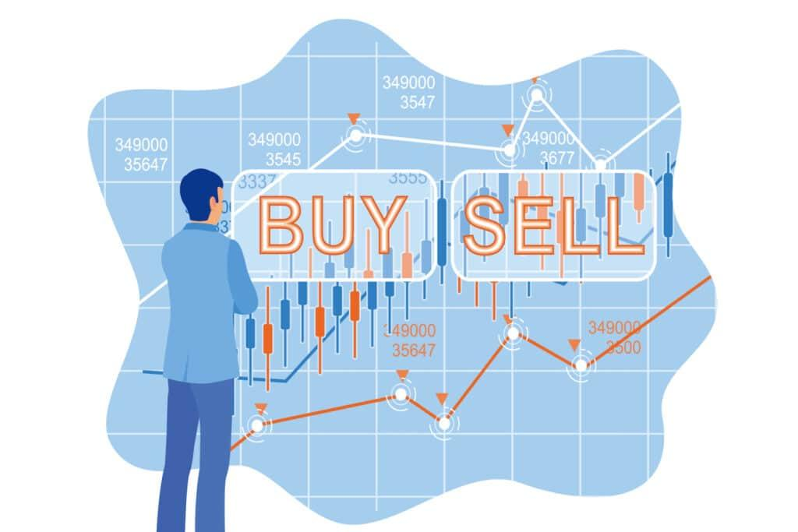

Dividend arbitrage is a sophisticated trading strategy employed in financial markets to capitalize on discrepancies related to dividend payouts. This technique involves the strategic buying and selling of stocks around their ex-dividend date to profit from differential tax treatments and pricing anomalies. Investors leverage such opportunities to enhance their returns, taking advantage of short-term inefficiencies in market pricing. Dividend arbitrage holds particular importance for institutional investors and hedge funds who seek to maximize yield by exploiting these temporary market conditions.

The implementation of dividend arbitrage has been considerably enhanced by the advent of algorithmic trading. In modern finance, algorithmic trading plays a pivotal role, allowing traders to execute complex strategies at phenomenal speeds, often impossible through manual trading. Algorithms can process vast amounts of data, identifying arbitrage opportunities with precision and executing trades at optimal moments across global markets. This automation not only increases efficiency but also reduces the potential for human error.

There exists a noteworthy synergy between dividend arbitrage and algorithmic trading. Algorithms facilitate the rapid identification and exploitation of dividend arbitrage opportunities by analyzing market trends and executing trades with minimal latency. This integration has enabled traders to better manage liquidity and execute trades that meet specific, pre-defined criteria, optimizing both risk and return. 

This article aims to provide a comprehensive overview of dividend arbitrage, focusing on its mechanisms, the integral role of algorithmic trading, and the strategic benefits for investors. It will examine the intersection of technology and finance, illustrating how algorithmic innovations are reshaping investment strategies. While the focus will be on the mechanics and implications of dividend arbitrage, attention will also be given to the inherent risks, regulatory considerations, and future trends impacting these practices. By doing so, it seeks to equip investors and financial professionals with insights necessary to navigate, understand, and potentially leverage dividend arbitrage in an evolving financial landscape.

## Table of Contents

## Understanding Dividend Arbitrage

Dividend arbitrage is a trading strategy that seeks to exploit price differentials arising from the payment of dividends on financial instruments such as stocks or options. This form of arbitrage typically involves the strategic purchase and sale of shares or options to capture the tax benefits or price adjustments associated with dividend distributions. It plays a significant role in financial markets by offering opportunities for generating profits through risk management.

### How Dividend Arbitrage Works in Financial Markets

Dividend [arbitrage](/wiki/arbitrage) generally involves buying shares just before the ex-dividend date and selling them shortly after. The ex-dividend date is crucial because it determines whether the buyer of a stock will be entitled to the declared dividend. The strategy leverages the price drop that usually occurs after the ex-dividend date, as the stock price is adjusted downward by the amount of the dividend. Short sellers, for example, might borrow stock just before this date to profit from the declining price after the dividend distribution.

### Types of Dividend Arbitrage Strategies

Dividend arbitrage can involve several strategies:

1. **Long-Position Dividend Capture:** Investors purchase shares just before the ex-dividend date to receive the dividend. They sell the stock ex-dividend, hoping the stock price drops by less than the dividend received.

2. **Short-Position Dividend Capture:** By selling stock short before the dividend distribution, traders aim to benefit from the drop in stock price post-dividend payout.

3. **Options-Based Strategies:** These involve using options to hedge positions, capitalize on volatility, or structure trades to benefit from price movements due to dividend declarations.

4. **Cross-Border Dividend Arbitrage:** Traders exploit differences in tax treatments and market practices between countries to potentially increase returns on dividend payments.

### Key Risks and Rewards Involved in Dividend Arbitrage

Dividend arbitrage carries both potentials for gains and inherent risks:

- **Rewards:** The primary reward is the opportunity to profit from the predictable price adjustment related to a known dividend payment. When executed efficiently, this can lead to returns that are relatively low-risk compared to other speculative market ventures.

- **Risks:** These include transaction costs, liquidity risk, and market risk due to unexpected changes in price movements or volatility. Furthermore, regulatory changes and evolving tax rules about dividend treatments can significantly impact the strategy's effectiveness.

### Historical Context and Evolution of Dividend Arbitrage

Historically, dividend arbitrage has evolved alongside financial innovation and regulatory changes. In earlier financial markets, dividends represented a significant part of stock returns, making dividend capture strategies attractive. Over time, the advent of derivatives markets has increased the sophistication of such strategies, allowing traders to incorporate various financial instruments to mitigate risk and enhance returns.

Changes in tax regulation over the years have also influenced dividend arbitrage practices. For instance, varying tax treatments of dividends between jurisdictions have led to cross-border opportunities, although these are increasingly scrutinized by regulators to prevent tax avoidance.

Overall, understanding dividend arbitrage involves recognizing its mechanisms, strategic implementations, potential financial rewards, and the risks involved. The historical evolution further highlights the adaptability of dividend-focused strategies in response to market and regulatory dynamics.

## Role of Algorithmic Trading in Dividend Arbitrage

Algorithmic trading has transformed the financial markets by incorporating speed, precision, and efficiency in executing transactions. At its core, [algorithmic trading](/wiki/algorithmic-trading) involves utilizing computer programs to automate certain trading strategies based on pre-defined criteria. These algorithms can process vast amounts of data and execute buy or sell orders at speeds that far exceed human capabilities. The core components of algorithmic trading include data analysis, signal generation, risk management, and execution.

In the context of dividend arbitrage, algorithmic trading offers several advantages. Dividend arbitrage involves exploiting differences in the taxation or timing of dividend payments across jurisdictions, using instruments such as options, futures, and swaps. Algorithms are particularly well-suited to this task, since they can simultaneously monitor multiple markets and execute trades precisely timed to capitalise on minute price discrepancies. The ability to process large data sets quickly and spot fleeting arbitrage opportunities makes algorithmic trading a powerful tool for dividend arbitrage.

Several case studies illustrate the successful application of algorithms in dividend arbitrage. For example, proprietary trading firms and hedge funds often deploy custom-built algorithms to identify and act on dividend mispricings in real-time. These algorithms analyze market trends, historical dividend yields, and tax implications across different jurisdictions to devise optimal trading strategies. Successful execution of these strategies can lead to significant returns, although comprehensive [backtesting](/wiki/backtesting) and risk assessment are critical to mitigate potential losses.

The technology underlying algorithmic trading in dividend arbitrage includes high-frequency trading systems, [machine learning](/wiki/machine-learning) models, and sophisticated data analytics platforms. High-frequency trading ([HFT](/wiki/high-frequency-trading-strategies)) systems enable the execution of trades in fractions of a second, which is crucial for exploiting short-lived arbitrage opportunities. Machine learning models can enhance these systems by improving predictive accuracy and adapting to market changes. Data analytics platforms provide the infrastructure for processing and analyzing vast amounts of financial data, aiding in the development and refinement of trading algorithms.

Despite its advantages, algorithmic trading in dividend arbitrage presents several challenges. Market risks, such as sudden price movements or [volatility](/wiki/volatility-trading-strategies), can lead to significant losses if algorithms are not robustly tested to handle such conditions. Execution risks arise from factors like latency, slippage, and incorrect order execution. Moreover, regulatory constraints and compliance requirements vary across jurisdictions and can impact the design and implementation of algorithms. Technological risks, including potential system failures and cybersecurity threats, necessitate rigorous testing and safeguards to protect sensitive data and maintain uninterrupted trading operations.

Successful practitioners in algorithmic trading for dividend arbitrage invest considerable effort in strategy validation and backtesting. This involves using historical data to evaluate the performance of algorithms under various market conditions, ensuring that strategies are resilient and adaptive to changes. Lessons learned from past failures underscore the importance of continuous monitoring, updating, and refining algorithmic strategies to remain competitive in the dynamic financial landscape.

## Benefits of Integrating Algo Trading with Dividend Arbitrage

Integrating algorithmic trading with dividend arbitrage offers significant advantages that enhance the effectiveness and profitability of investment strategies. 

Firstly, algorithmic trading provides enhanced speed and efficiency in executing trades. By utilizing automated systems, traders can execute buy and sell orders within milliseconds, taking advantage of short-lived arbitrage opportunities that are otherwise imperceptible to human traders. This rapid execution is crucial in dividend arbitrage, where timing inefficiencies can significantly impact returns.

Secondly, algorithms facilitate data-driven decision-making and analytics. They can analyze vast amounts of market data in real-time, identifying patterns and trends that inform more accurate and strategic trading decisions. This computational power allows for sophisticated modeling of dividend payments, stock price behavior, and market conditions, creating more reliable predictions and strategies designed to capitalize on dividend inefficiencies.

Additionally, algorithmic trading reduces human error and emotional bias. Automated systems strictly follow pre-defined rules and parameters, eliminating impulsive decisions driven by emotions or cognitive biases. This consistency ensures that trades are executed based on objective criteria, thus preserving the integrity and reliability of the dividend arbitrage strategy.

Moreover, implementing algorithmic systems can lead to improved [liquidity](/wiki/liquidity-risk-premium) management. These systems optimize the timing of trades to minimize market impact and capitalize on liquidity events, ensuring that large trades are executed without significantly altering market prices. Effective liquidity management is vital in dividend arbitrage, where liquidity can influence the ability to establish and unwind positions efficiently.

Finally, the potential for higher returns and optimized risk management is a compelling benefit of integrating algo trading with dividend arbitrage. Algorithms can continuously monitor market conditions and adjust strategies dynamically, optimizing both the entry and [exit](/wiki/exit-strategy) of trades. This responsiveness allows for better management of risks associated with market volatility and price fluctuations, while exploiting favorable conditions to enhance returns.

In conclusion, the synergy between algorithmic trading and dividend arbitrage results in a more efficient, precise, and profitable approach to capitalizing on dividend discrepancies, offering investors the tools to navigate and succeed in competitive financial markets.

## Risks and Considerations

Market and execution risks are crucial considerations in algorithmic trading, particularly when applied to dividend arbitrage. Market risks encompass the potential for adverse price movements, impacting the expected returns from dividend arbitrage strategies. For example, fluctuations in stock prices due to unforeseen economic events or market sentiment can erode profits expected from capturing dividends. Execution risks, on the other hand, involve the challenges of efficiently executing trade orders. These may arise from latency issues, where delays in the execution can mean missing the optimal timing for a trade, and slippage, where the execution price deviates from the expected price.

Regulatory and compliance considerations are also significant. As financial markets are heavily regulated, any trading strategy, including dividend arbitrage, must adapt to a framework of regulatory rules and compliance standards that may vary by jurisdiction. These regulations can affect the feasibility of certain arbitrage strategies, especially with cross-border trades where dividend taxation and repatriation rules differ [1]. Algorithmic trading must therefore stay updated with these regulations to avoid legal penalties and ensure ethical trading practices.

Technological failures and cybersecurity threats are inherent risks in algorithmic trading. The reliance on technology means that failures such as system crashes, network outrages, or faulty algorithms can have severe financial repercussions. Cybersecurity threats pose risks like data breaches, which can lead to unauthorized access to trading strategies and sensitive data. It is essential to implement robust IT infrastructure and security protocols to mitigate these risks.

Backtesting and strategy validation are critical processes to ensure the reliability of a trading algorithm. Backtesting involves using historical data to simulate the trading strategy’s performance, helping identify potential weaknesses or flaws in the algorithm. Strategy validation ensures that the model’s logic aligns with the intended market behavior under various conditions. However, past performance is not always indicative of future results, emphasizing the importance of ongoing validation and adaptation.

Cautionary tales from past failures highlight the importance of diligent risk management practices. For instance, in 2012, Knight Capital's algorithmic trading error resulted in a loss of $440 million in a single day due to faulty software deployment [2]. Such incidents underscore the necessity for rigorous testing, monitoring, and the implementation of fail-safes to prevent similar occurrences.

In conclusion, recognizing and addressing these risks is vital for the successful integration of algorithmic trading with dividend arbitrage, ensuring both compliance and profitability.

**References**:
1. [Wikipedia: Dividend Tax](https://en.wikipedia.org/wiki/Dividend_tax)
2. Scott Patterson, *Dark Pools: High-Speed Traders, A.I. Bandits, and the Threat to the Global Financial System*, Crown Business, 2012.

## Future Trends and Developments

Emerging technologies are continuously reshaping the landscape of dividend arbitrage, offering new opportunities and challenges to investors. Among the most significant advancements is the growth of [artificial intelligence](/wiki/ai-artificial-intelligence) (AI) and machine learning within the finance sector. These technologies enable investors to process vast amounts of data, identify patterns, and execute trades with precision and speed. AI algorithms can digest historical market data to optimize dividend arbitrage strategies, providing insights that were previously inaccessible through traditional methods.

Machine learning models, particularly those leveraging [deep learning](/wiki/deep-learning) techniques, have been instrumental in forecasting price movements and dividend announcements, which are crucial for developing effective arbitrage strategies. By incorporating real-time data analytics, machine learning facilitates the prediction of dividend changes, allowing traders to adjust their positions appropriately to capitalize on market inefficiencies.

Regulatory environments are also evolving, influencing dividend arbitrage strategies. Financial markets are subject to a growing web of regulations aimed at increasing transparency and reducing systemic risks. These changes pose both challenges and opportunities for investors seeking to implement dividend arbitrage strategies. Complying with new regulations requires sophisticated technology to ensure that trades adhere to legal standards without sacrificing speed or efficiency.

As regulatory frameworks continue to develop, algorithms capable of swift adaptation to compliance requirements will become even more crucial. This adaptability will help mitigate risks associated with legal infractions and maintain the profitability of arbitrage strategies.

Predicting the future of algorithmic trading in dividend arbitrage, increased automation and sophistication in trading algorithms are expected to be at the forefront. Transactions will likely become more efficient as technology minimizes latency and maximizes execution success rates. Developments in quantum computing could further revolutionize trading strategies by processing complex calculations at unprecedented speeds, opening up new avenues for arbitrage opportunities.

For investors, these technological advancements present a plethora of opportunities in the decade ahead. Those who harness AI and machine learning tools will likely gain a competitive edge in identifying and exploiting arbitrage opportunities swiftly. Adopting flexible, scalable technology platforms will enable investors to respond to market and regulatory changes promptly.

The integration of emerging technologies will not only enhance the effectiveness of dividend arbitrage strategies but also promote an agile, informed approach to risk management. By staying ahead of technological advancements and regulatory modifications, investors can position themselves strategically to maximize returns and minimize risks in the evolving financial landscape.

## Conclusion

In conclusion, dividend arbitrage, when combined with algorithmic trading, presents a valuable long-term opportunity for investors seeking to maximize returns while managing risk. The strategic integration of algorithms enables traders to exploit minute discrepancies in dividend payouts with enhanced speed and efficiency, often leading to a competitive edge in the financial markets. Algorithmic trading, characterized by data-driven decision-making and reduced human biases, allows investors to execute strategies with precision and improved liquidity management.

However, investors must remain cognizant of the inherent risks, such as market volatility, execution errors, and technological failures. It is crucial to conduct thorough backtesting and validation of trading strategies to mitigate these risks effectively. A strategic approach includes constant monitoring and adaptation to regulatory changes and technological advancements, ensuring compliance and security in financial operations.

Balancing risk and reward is fundamental, as the dynamic nature of financial markets demands a vigilant and informed approach. Investors should be encouraged to continuously enhance their understanding of emerging technologies, such as AI and machine learning, which are poised to shape the future of dividend arbitrage strategies. Staying informed and agile will be essential for capitalizing on new opportunities and maintaining a resilient investment strategy in an ever-evolving financial landscape.

## References & Further Reading

[1]: Scott Patterson, *Dark Pools: High-Speed Traders, A.I. Bandits, and the Threat to the Global Financial System*, Crown Business, 2012.

[2]: Bergstra, J., Bardenet, R., Bengio, Y., & Kégl, B. (2011). ["Algorithms for Hyper-Parameter Optimization."](https://dl.acm.org/doi/10.5555/2986459.2986743) Advances in Neural Information Processing Systems 24.

[3]: ["Advances in Financial Machine Learning"](https://www.amazon.com/Advances-Financial-Machine-Learning-Marcos/dp/1119482089) by Marcos Lopez de Prado.

[4]: ["Machine Learning for Algorithmic Trading"](https://github.com/stefan-jansen/machine-learning-for-trading) by Stefan Jansen.

[5]: ["Quantitative Trading: How to Build Your Own Algorithmic Trading Business"](https://books.google.com/books/about/Quantitative_Trading.html?id=j70yEAAAQBAJ) by Ernest P. Chan.

[6]: ["Evidence-Based Technical Analysis: Applying the Scientific Method and Statistical Inference to Trading Signals"](https://www.amazon.com/Evidence-Based-Technical-Analysis-Scientific-Statistical/dp/0470008741) by David Aronson.

[7]: [Wikipedia: Dividend Tax](https://en.wikipedia.org/wiki/Dividend_tax).