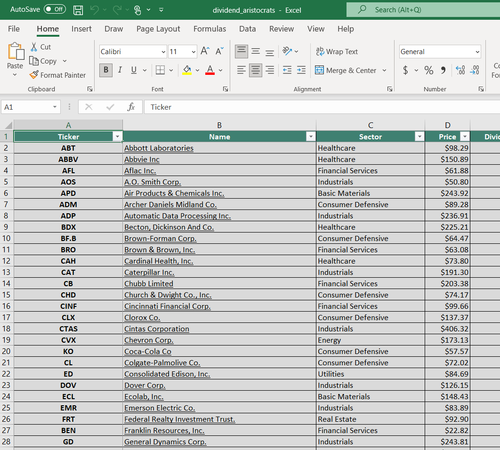

## Table of Contents

## What are Dividend Aristocrats?

Dividend Aristocrats are companies that have increased their dividends every year for at least 25 years in a row. This shows that these companies are stable and good at making money over a long time. The list of Dividend Aristocrats is made by an organization called Standard & Poor's, and it includes companies from the S&P 500 index.

These companies are attractive to investors who want to get regular income from their investments. By increasing dividends every year, these companies show that they care about their shareholders and want to give them more money over time. This makes them a popular choice for people who are looking for steady and growing income from their stock investments.

## What are the criteria for a company to be considered a Dividend Aristocrat in 2024?

To be considered a Dividend Aristocrat in 2024, a company must be part of the S&P 500 index. This means the company is one of the 500 biggest and most important companies in the United States. Also, the company must have increased its dividend payments every year for at least 25 years in a row. This shows that the company is stable and good at making money over a long time.

Another important rule is that the company must have a certain market value, which is how much the company is worth. This makes sure that only big and well-known companies can be Dividend Aristocrats. By meeting these criteria, a company proves it is reliable and committed to giving more money to its shareholders year after year.

## How many years must a company consecutively increase its dividends to qualify as a Dividend Aristocrat?

A company needs to increase its dividends every year for at least 25 years to be a Dividend Aristocrat. This shows that the company is stable and good at making money over a long time.

By doing this, the company proves it cares about its shareholders and wants to give them more money each year. This makes the company attractive to investors who want regular and growing income from their investments.

## Can you list some examples of Dividend Aristocrats in 2024?

In 2024, some examples of Dividend Aristocrats include companies like Coca-Cola, Procter & Gamble, and Johnson & Johnson. These companies are well-known and have been increasing their dividends for many years. Coca-Cola, for example, has been raising its dividends for over 60 years, showing how stable and reliable it is.

Another example is Procter & Gamble, which makes everyday products like shampoo and soap. They have been increasing their dividends for more than 65 years. This shows they are good at making money and care about their shareholders. Johnson & Johnson, a big healthcare company, has also been raising its dividends for over 60 years, making it a popular choice for investors looking for steady income.

These companies are part of the S&P 500 and are known for their long history of dividend growth. By consistently increasing dividends, they show they are committed to giving more money to their shareholders every year. This makes them attractive to people who want to invest in stable and growing companies.

## What sectors are most commonly represented among the Dividend Aristocrats?

The sectors most commonly represented among the Dividend Aristocrats are consumer goods, healthcare, and industrials. These sectors include companies that make everyday products, provide healthcare services, and produce industrial equipment. For example, companies like Procter & Gamble, which makes shampoo and soap, and Johnson & Johnson, which provides healthcare products, are often found in these sectors. These companies are known for their stability and consistent profits, which allow them to increase their dividends year after year.

Consumer goods companies are popular among Dividend Aristocrats because they sell products that people use every day, like food, drinks, and cleaning supplies. These companies, such as Coca-Cola, have a steady demand for their products, which helps them maintain stable earnings. Healthcare companies, like Johnson & Johnson, also tend to be stable because people always need healthcare, no matter what is happening in the economy. Industrial companies, like 3M, make products that are essential for other businesses, which also helps them keep their profits steady and increase dividends regularly.

## How does a company's inclusion in the Dividend Aristocrats list affect its stock performance?

When a company becomes a Dividend Aristocrat, it often sees positive effects on its stock performance. Being a Dividend Aristocrat means the company has increased its dividends every year for at least 25 years, showing it is stable and good at making money. Investors like this because it means they can count on getting more money from their investments every year. This makes the company's stock more attractive to people who want regular income from their investments, which can increase demand for the stock and push its price up.

However, being a Dividend Aristocrat doesn't always mean the stock will perform better. Other things like the overall economy, how well the company is doing compared to others in its industry, and changes in interest rates can also affect the stock's performance. Sometimes, even if a company is a Dividend Aristocrat, its stock price might not go up if there are bigger problems in the market or if people start to think the company won't keep increasing its dividends. So, while being a Dividend Aristocrat can help a company's stock, it's not the only thing that matters.

## What are the benefits of investing in Dividend Aristocrats?

Investing in Dividend Aristocrats can give you a steady and growing income. These companies have increased their dividends every year for at least 25 years, which means they are good at making money and care about their shareholders. By investing in them, you can get regular payments that grow over time. This can help you plan your finances better because you know you'll get more money each year. It's like having a little extra income that keeps getting bigger.

Another benefit is that Dividend Aristocrats are usually stable and reliable. They are big companies that have been around for a long time and can handle tough times better than smaller companies. This makes them a safer choice for your investments. When the stock market goes up and down, these companies are less likely to lose a lot of value. So, if you want to keep your money safe while still getting regular income, investing in Dividend Aristocrats can be a good idea.

## What are the risks associated with investing in Dividend Aristocrats?

Investing in Dividend Aristocrats can be a good choice, but there are some risks you should know about. One risk is that even though these companies have been good at increasing dividends for a long time, they might not be able to keep doing it. Things like a bad economy or problems in their industry could make it hard for them to keep raising dividends. If a company stops increasing its dividends, the stock price might go down, and you could lose money.

Another risk is that Dividend Aristocrats might not grow as fast as other companies. These companies are usually big and stable, but they might not have as much room to grow quickly. If you want your investments to grow a lot in a short time, Dividend Aristocrats might not be the best choice. You could miss out on bigger gains if you put all your money in these companies instead of investing in smaller, faster-growing companies.

## How can investors use Dividend Aristocrats to build a diversified investment portfolio?

Investors can use Dividend Aristocrats to build a diversified investment portfolio by choosing companies from different sectors. For example, you could pick some companies from the consumer goods sector, like Coca-Cola, and others from the healthcare sector, like Johnson & Johnson. By spreading your money across different industries, you reduce the risk that problems in one sector will hurt your whole portfolio. This way, even if one sector has a tough time, the other sectors might still do well, and you'll still get steady income from your dividends.

Another way to diversify with Dividend Aristocrats is to mix them with other types of investments. You could invest in some Dividend Aristocrats and also put money into growth stocks, bonds, or even real estate. This mix can help balance your portfolio because Dividend Aristocrats give you steady income, while growth stocks might help your money grow faster. By combining these different investments, you can have a portfolio that grows over time while still giving you regular income, making it safer and more stable.

## What financial metrics should investors look at when evaluating Dividend Aristocrats?

When evaluating Dividend Aristocrats, investors should look at the company's dividend yield, which is how much money you get from dividends compared to the stock's price. A higher yield can mean more income, but be careful because a very high yield might mean the company is having problems. Another important metric is the payout ratio, which shows how much of the company's earnings are paid out as dividends. A lower payout ratio means the company has more money left over to grow or handle tough times, which is good for long-term stability.

Investors should also check the company's earnings growth. If a company's earnings are growing, it's more likely to keep increasing its dividends. Look at the company's debt levels too. A company with a lot of debt might struggle to keep paying dividends if it has to pay a lot of interest. Finally, consider the company's history of dividend increases. A long track record of raising dividends every year shows the company is reliable and committed to its shareholders. By looking at these metrics, investors can make smarter choices about which Dividend Aristocrats to invest in.

## How have the criteria for Dividend Aristocrats changed over the years?

The criteria for Dividend Aristocrats have changed a bit over the years. In the past, the main rule was that a company had to increase its dividends every year for at least 25 years to be a Dividend Aristocrat. This rule hasn't changed, but other things have. For example, the list used to include companies from the S&P 500 and the S&P MidCap 400, but now it only includes companies from the S&P 500. This change makes sure that only the biggest and most important companies can be Dividend Aristocrats.

Another change is that the list now has a rule about market value. A company needs to have a certain market value to be a Dividend Aristocrat. This rule wasn't always there, but it helps make sure that only big and stable companies are on the list. These changes show that the criteria for Dividend Aristocrats have gotten stricter over time, focusing on the biggest and most reliable companies to give investors a better idea of which companies are truly stable and good at increasing dividends.

## What is the historical performance of Dividend Aristocrats compared to the broader market?

Historically, Dividend Aristocrats have done better than the broader market in some ways. They have given investors steady and growing income over time. This is because these companies have increased their dividends every year for at least 25 years, showing they are stable and good at making money. Even though the stock market can go up and down a lot, Dividend Aristocrats usually don't lose as much value during tough times. This makes them a safer choice for people who want to keep their money safe while still getting regular income.

When it comes to total returns, which include both stock price changes and dividends, Dividend Aristocrats have often done better than the S&P 500 over the long term. For example, over the past 20 years, the Dividend Aristocrats Index has beaten the S&P 500 in total returns. This is because the steady dividend increases add up over time, making the total return higher. But, it's important to remember that in some years, the broader market might do better than Dividend Aristocrats, especially if there's a lot of excitement about fast-growing companies. So, while Dividend Aristocrats can be a good choice for steady income and long-term growth, they might not always beat the market every single year.

## What are the stock selection criteria for dividend aristocrats?

Dividend aristocrats are companies that have consistently increased their dividend payouts for at least 25 consecutive years, demonstrating financial stability and resilience. Identifying potential candidates for this distinguished category requires a meticulous evaluation of specific financial metrics that highlight superior performance and sustainability.

### Key Financial Metrics

1. **Dividend Yield and Payout Ratio**: A fundamental criterion is the dividend yield, which measures the annual dividends per share relative to the stock price. A moderate yield is typically preferred, ensuring that dividends are sustainable and not disproportionately high, which might indicate underlying financial stress. The payout ratio, defined as the percentage of earnings paid out as dividends, is also crucial. A lower ratio suggests more room for reinvestment and future growth, while a very high payout could imply a risk if earnings decline.
$$
   \text{Dividend Yield} = \frac{\text{Annual Dividends Per Share}}{\text{Price Per Share}}

$$
$$
   \text{Dividend Payout Ratio} = \frac{\text{Dividends Paid}}{\text{Net Income}}

$$

2. **Earnings Growth**: Consistent earnings growth reflects a company’s ability to generate increasing profits over time, a vital sign of its potential to sustain dividend increases. Historical earnings growth trends along with forward-looking indicators, such as projected earnings per share (EPS), can provide investors with insights into a company's future dividend capacity.

3. **Return on Equity (ROE)**: This ratio, calculated as net income divided by shareholder’s equity, measures a company's efficiency in generating profits from every unit of shareholder equity. A high ROE indicates effective management and potential for continued profitability, supporting ongoing dividend growth.
$$
   \text{Return on Equity (ROE)} = \frac{\text{Net Income}}{\text{Shareholder's Equity}}

$$

### Role of Market Capitalization and Liquidity

Market capitalization, the total market value of a company’s outstanding shares, helps gauge the size and market presence of a company. Large-cap companies often have the financial stability and resources to sustain and grow dividends, making them likely candidates for the aristocrat status. Additionally, [liquidity](/wiki/liquidity-risk-premium), which indicates how easily a stock can be bought or sold without affecting its price, ensures that an investor can enter or [exit](/wiki/exit-strategy) a position with ease. High liquidity often correlates with lower transaction costs and reduced volatility.

### Evaluating Stability and Growth Prospects

Stability and future growth are critical for sustained dividend increases. Evaluating these can involve the analysis of debt levels, as excessively high debt can impede dividend payments. The debt-to-equity ratio, a key indicator, helps assess the extent to which a company is financing its operations through debt versus wholly-owned funds. An optimal strategy includes companies with robust balance sheets, low to moderate levels of debt, and strong free cash flow, ensuring dividends can be maintained even during economic downturns.
$$
   \text{Debt-to-Equity Ratio} = \frac{\text{Total Liabilities}}{\text{Shareholder's Equity}}

$$

In summary, selecting stocks for dividend aristocrat status involves a calculated approach incorporating dividend-related metrics, financial performance indicators, and company stability assessments. Sound investment criteria are essential to identify candidates capable of sustaining the rigorous demands of dividend growth over the long term.

## What are Algorithmic Trading Strategies for Dividend Aristocrats?

Algorithmic trading is a systematic approach to executing buy and sell orders by utilizing pre-defined criteria and mathematical models. Its primary benefits include enhanced precision, speed, and the ability to process vast amounts of data, which collectively offer a competitive edge to investors. In the context of dividend aristocrats—stocks of companies that have consistently increased their dividends for at least 25 consecutive years—[algorithmic trading](/wiki/algorithmic-trading) strategies can be particularly advantageous.

### Tracking and Predicting Dividend Growth with Algorithms

Algorithms can be designed to analyze historical dividend patterns, financial statements, and market conditions, thus predicting future dividend growth. These algorithms often incorporate a combination of [fundamental analysis](/wiki/fundamental-analysis) and quantitative methods to assess a company's ability to sustain its dividend payments.

One approach involves the use of time-series analysis to model historical dividend data. By employing methods like ARIMA (AutoRegressive Integrated Moving Average), investors can forecast future dividend values. The ARIMA model, represented as:

$$
Y_t = c + \phi_1 Y_{t-1} + \theta_1 \varepsilon_{t-1} + \ldots + \varepsilon_t
$$

allows predictions based on past observations while accounting for trends and seasonal variations.

Another noteworthy technique is sentiment analysis, where algorithms process textual data from financial news, press releases, or earnings calls to gauge market sentiment about a company’s future dividend prospects. Machine learning algorithms, such as support vector machines or neural networks, can classify this text data and correlate it with dividend changes.

### Case Study: Successful Algorithmic Strategies in 2024

In 2024, investment firms have increasingly adopted [machine learning](/wiki/machine-learning) models to enhance their algorithmic trading strategies for dividend aristocrats. A prominent example is the use of [reinforcement learning](/wiki/reinforcement-learning) algorithms, which optimize trading decisions through trial and error. By simulating various market scenarios, these algorithms adapt their strategies based on outcomes, learning to maximize returns on dividend aristocrats.

Python code snippet for a basic reinforcement learning model might look like:

```python
import numpy as np

# Initial parameters
state_space = np.arange(0, 100)  # Example states
action_space = ['buy', 'hold', 'sell']
q_table = np.zeros((len(state_space), len(action_space)))

# Hyperparameters
alpha = 0.1    # Learning rate
gamma = 0.6    # Discount factor
epsilon = 0.1  # Exploration rate

def choose_action(state):
    if np.random.uniform(0, 1) < epsilon:
        return np.random.choice(action_space)  # Explore
    else:
        return action_space[np.argmax(q_table[state])]  # Exploit

# Main loop for Q-learning
for episode in range(1000):  # Number of episodes
    state = np.random.choice(state_space)
    for step in range(100):  # Steps per episode
        action = choose_action(state)
        # Example reward structure
        reward = np.random.rand()
        next_state = np.random.choice(state_space)  # Next state

        # Update Q-table
        q_value = q_table[state, action_space.index(action)]
        max_future_q = np.max(q_table[next_state])
        q_table[state, action_space.index(action)] = (1 - alpha) * q_value + alpha * (reward + gamma * max_future_q)
        state = next_state
```

In 2024, the integration of algorithmic trading into investment strategies for dividend aristocrats has demonstrated significant advantages. By using advanced predictive analytics and machine learning models, investors have improved their ability to identify promising opportunities and mitigate risks associated with dividend fluctuations. These advancements underscore the potential of algorithmic trading to transform dividend-focused investment strategies, aligning with the broader trend towards data-driven decisions in the financial industry.

## What are the potential investment risks and challenges?

Investing in dividend aristocrats is often perceived as a secure and reliable strategy, yet it is not devoid of risks and challenges. Despite their history of increasing dividends for at least 25 consecutive years, these companies face several potential pitfalls that can impact investor portfolios.

One significant risk involves companies at risk of losing their aristocrat status. This can occur when a company is unable to continue its streak of dividend increases due to adverse financial performance or market conditions. The loss of aristocrat status often leads to a decline in investor confidence and, consequently, the company's stock price might drop. Investors who rely heavily on such stocks for their portfolios may face asset devaluation and reduced dividend income. 

Mathematically, the impact on a portfolio can be expressed through a weighted average approach:

$$

\Delta P = \sum_{i=1}^{n} w_i \times \Delta S_i 
$$

where $\Delta P$ is the change in the portfolio’s value, $w_i$ is the weight of the i-th stock in the portfolio, and $\Delta S_i$ is the change in the stock price due to losing aristocrat status.

Moreover, tax implications also pose challenges. Dividend income may be subject to varying tax rates depending on the investor's jurisdiction and tax bracket. Changes in tax policy can thus influence the attractiveness of dividend aristocrats. For instance, an increase in dividend tax rates can diminish net returns, making these investments less appealing compared to [growth stocks](/wiki/growth-stocks), which typically focus on capital appreciation rather than income distribution.

Another influencing factor is shareholder activism. Activist investors may pressure companies to alter their dividend policies, sometimes advocating for reallocating funds from dividends to other areas such as growth or debt reduction. While this may benefit the company's long-term strategy, it can affect income-focused investors seeking consistent dividend payouts.

In navigating these challenges, investors must continually reassess their strategies, ensuring diversification and the resilience of their portfolios to maintain stability even as individual companies face potential status changes or policy shifts. Understanding the dynamic nature of these risks allows for more informed decision-making in the pursuit of sustainable growth and income.

## References & Further Reading

[1]: ["Standard & Poor's 500 Dividend Aristocrats"](https://www.spglobal.com/spdji/en/indices/dividends-factors/sp-500-dividend-aristocrats/) - A factsheet by S&P Dow Jones Indices about the criteria and performance of the S&P 500 Dividend Aristocrats.

[2]: ["Dividend Growth Investing: A Proven Approach for Long-Term Wealth Creation"](https://smartasset.com/investing/dividend-growth-investing) by Roxann Klugman

[3]: ["Algorithmic Trading: Winning Strategies and Their Rationale"](https://www.wiley.com/en-us/Algorithmic+Trading%3A+Winning+Strategies+and+Their+Rationale-p-9781118460146) by Ernest P. Chan

[4]: ["Machine Learning for Asset Managers"](https://www.cambridge.org/core/books/machine-learning-for-asset-managers/6D9211305EA2E425D33A9F38D0AE3545) by Marcos Lopez de Prado

[5]: ["The Intelligent Investor: The Definitive Book on Value Investing"](https://www.amazon.com/Intelligent-Investor-Definitive-Investing-Essentials/dp/0060555661) by Benjamin Graham

[6]: Ganti, A., & Bodnar, R. (2021). ["Understanding Stock Trading Algorithms and Strategies"](https://www.researchgate.net/publication/378548435_Algorithmic_Trading_and_AI_A_Review_of_Strategies_and_Market_Impact) - Investopedia article on algorithmic trading strategies.