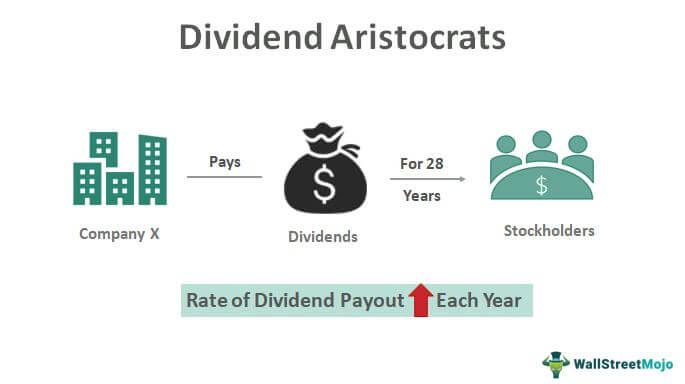

Dividend Aristocrats are a group of esteemed companies within the S&P 500 Index, renowned for their consistent record of increasing dividend payouts for at least 25 consecutive years. This distinguished class of stocks has become a cornerstone for both conservative and income-focused investors, offering a blend of reliability and stability. The significance of these equities in the financial world lies in their demonstrated ability to not only weather economic fluctuations but also to provide a steady income stream, all while potentially appreciating in value over time.

Algorithmic trading, a method of executing trades using pre-programmed strategies based on complex algorithms, is increasingly being applied to investing in Dividend Aristocrats. This approach offers several advantages, such as enhanced trading efficiency, removal of emotional biases, and the ability to implement sophisticated investment strategies that can swiftly adapt to market trends. For Dividend Aristocrats, algorithmic trading can assist in the continuous monitoring of financial metrics and market conditions, allowing for optimized decision-making concerning equity entry and exit.



As we move into 2024, sound investment criteria remain of paramount importance. The market is expected to navigate a mix of evolving economic environments and technological disruptions. Hence, investors should integrate robust analytical techniques and prudent financial principles when selecting investments. The use of algorithmic strategies in evaluating Dividend Aristocrats can enhance an investor's capability to precisely screen for stocks based on historical performance and future potential, ultimately aiding in the construction of a well-rounded and resilient portfolio. These strategies could include automated screening for dividend yield trends, price-to-earnings ratios, and other critical financial indicators, ensuring a comprehensive assessment tailored for the year ahead.

## Table of Contents

## Understanding Dividend Aristocrats

Dividend aristocrats are distinguished companies recognized for their consistent and reliable distribution of dividends. Specifically, these are firms included in the S&P 500 Index that have achieved the remarkable feat of increasing their dividend payouts to shareholders for at least 25 consecutive years. As of 2024, the criteria for maintaining dividend aristocrat status remain stringent, emphasizing not only the longevity but also the sustainable growth of dividend payouts.

The significance of achieving a 25-year streak of dividend increases is profound. It indicates a company’s strong financial health, robust cash flow, and management's commitment to returning value to shareholders. This long-term dividend growth often signifies a stable business model that can withstand various economic cycles, providing investors with a measure of reliability in their portfolios.

Dividend aristocrats are often compared to another elite group known as dividend kings. While both groups share similarities, particularly in their focus on consistent dividend growth, there are distinct differences. Dividend kings are a subset of firms that have not only achieved the 25-year dividend growth milestone but have extended this achievement to 50 or more consecutive years. This group, while smaller, exemplifies an even greater level of consistency and historical resilience than the broader category of aristocrats.

The attractiveness of both dividend aristocrats and kings lies in their ability to deliver steady income streams, often with less [volatility](/wiki/volatility-trading-strategies) compared to the broader market. For income-focused investors, these stocks offer a reliable source of passive income, making them a cornerstone of any diversified investment strategy focused on dividends. 

Understanding these dynamics, the inclusion criteria, and the comparative analysis with dividend kings grants investors insight into not just the reliability but the caliber of companies worthy of consideration in a sound investment strategy for 2024 and beyond.

## Stock Selection Criteria for Dividend Aristocrats

Dividend aristocrats are companies that have consistently increased their dividend payouts for at least 25 consecutive years, demonstrating financial stability and resilience. Identifying potential candidates for this distinguished category requires a meticulous evaluation of specific financial metrics that highlight superior performance and sustainability.

### Key Financial Metrics

1. **Dividend Yield and Payout Ratio**: A fundamental criterion is the dividend yield, which measures the annual dividends per share relative to the stock price. A moderate yield is typically preferred, ensuring that dividends are sustainable and not disproportionately high, which might indicate underlying financial stress. The payout ratio, defined as the percentage of earnings paid out as dividends, is also crucial. A lower ratio suggests more room for reinvestment and future growth, while a very high payout could imply a risk if earnings decline.
$$
   \text{Dividend Yield} = \frac{\text{Annual Dividends Per Share}}{\text{Price Per Share}}

$$
$$
   \text{Dividend Payout Ratio} = \frac{\text{Dividends Paid}}{\text{Net Income}}

$$

2. **Earnings Growth**: Consistent earnings growth reflects a company’s ability to generate increasing profits over time, a vital sign of its potential to sustain dividend increases. Historical earnings growth trends along with forward-looking indicators, such as projected earnings per share (EPS), can provide investors with insights into a company's future dividend capacity.

3. **Return on Equity (ROE)**: This ratio, calculated as net income divided by shareholder’s equity, measures a company's efficiency in generating profits from every unit of shareholder equity. A high ROE indicates effective management and potential for continued profitability, supporting ongoing dividend growth.
$$
   \text{Return on Equity (ROE)} = \frac{\text{Net Income}}{\text{Shareholder's Equity}}

$$

### Role of Market Capitalization and Liquidity

Market capitalization, the total market value of a company’s outstanding shares, helps gauge the size and market presence of a company. Large-cap companies often have the financial stability and resources to sustain and grow dividends, making them likely candidates for the aristocrat status. Additionally, [liquidity](/wiki/liquidity-risk-premium), which indicates how easily a stock can be bought or sold without affecting its price, ensures that an investor can enter or [exit](/wiki/exit-strategy) a position with ease. High liquidity often correlates with lower transaction costs and reduced volatility.

### Evaluating Stability and Growth Prospects

Stability and future growth are critical for sustained dividend increases. Evaluating these can involve the analysis of debt levels, as excessively high debt can impede dividend payments. The debt-to-equity ratio, a key indicator, helps assess the extent to which a company is financing its operations through debt versus wholly-owned funds. An optimal strategy includes companies with robust balance sheets, low to moderate levels of debt, and strong free cash flow, ensuring dividends can be maintained even during economic downturns.
$$
   \text{Debt-to-Equity Ratio} = \frac{\text{Total Liabilities}}{\text{Shareholder's Equity}}

$$

In summary, selecting stocks for dividend aristocrat status involves a calculated approach incorporating dividend-related metrics, financial performance indicators, and company stability assessments. Sound investment criteria are essential to identify candidates capable of sustaining the rigorous demands of dividend growth over the long term.

## Algorithmic Trading Strategies for Dividend Aristocrats

Algorithmic trading is a systematic approach to executing buy and sell orders by utilizing pre-defined criteria and mathematical models. Its primary benefits include enhanced precision, speed, and the ability to process vast amounts of data, which collectively offer a competitive edge to investors. In the context of dividend aristocrats—stocks of companies that have consistently increased their dividends for at least 25 consecutive years—[algorithmic trading](/wiki/algorithmic-trading) strategies can be particularly advantageous.

### Tracking and Predicting Dividend Growth with Algorithms

Algorithms can be designed to analyze historical dividend patterns, financial statements, and market conditions, thus predicting future dividend growth. These algorithms often incorporate a combination of [fundamental analysis](/wiki/fundamental-analysis) and quantitative methods to assess a company's ability to sustain its dividend payments.

One approach involves the use of time-series analysis to model historical dividend data. By employing methods like ARIMA (AutoRegressive Integrated Moving Average), investors can forecast future dividend values. The ARIMA model, represented as:

$$
Y_t = c + \phi_1 Y_{t-1} + \theta_1 \varepsilon_{t-1} + \ldots + \varepsilon_t
$$

allows predictions based on past observations while accounting for trends and seasonal variations.

Another noteworthy technique is sentiment analysis, where algorithms process textual data from financial news, press releases, or earnings calls to gauge market sentiment about a company’s future dividend prospects. Machine learning algorithms, such as support vector machines or neural networks, can classify this text data and correlate it with dividend changes.

### Case Study: Successful Algorithmic Strategies in 2024

In 2024, investment firms have increasingly adopted [machine learning](/wiki/machine-learning) models to enhance their algorithmic trading strategies for dividend aristocrats. A prominent example is the use of [reinforcement learning](/wiki/reinforcement-learning) algorithms, which optimize trading decisions through trial and error. By simulating various market scenarios, these algorithms adapt their strategies based on outcomes, learning to maximize returns on dividend aristocrats.

Python code snippet for a basic reinforcement learning model might look like:

```python
import numpy as np

# Initial parameters
state_space = np.arange(0, 100)  # Example states
action_space = ['buy', 'hold', 'sell']
q_table = np.zeros((len(state_space), len(action_space)))

# Hyperparameters
alpha = 0.1    # Learning rate
gamma = 0.6    # Discount factor
epsilon = 0.1  # Exploration rate

def choose_action(state):
    if np.random.uniform(0, 1) < epsilon:
        return np.random.choice(action_space)  # Explore
    else:
        return action_space[np.argmax(q_table[state])]  # Exploit

# Main loop for Q-learning
for episode in range(1000):  # Number of episodes
    state = np.random.choice(state_space)
    for step in range(100):  # Steps per episode
        action = choose_action(state)
        # Example reward structure
        reward = np.random.rand()
        next_state = np.random.choice(state_space)  # Next state

        # Update Q-table
        q_value = q_table[state, action_space.index(action)]
        max_future_q = np.max(q_table[next_state])
        q_table[state, action_space.index(action)] = (1 - alpha) * q_value + alpha * (reward + gamma * max_future_q)
        state = next_state
```

In 2024, the integration of algorithmic trading into investment strategies for dividend aristocrats has demonstrated significant advantages. By using advanced predictive analytics and machine learning models, investors have improved their ability to identify promising opportunities and mitigate risks associated with dividend fluctuations. These advancements underscore the potential of algorithmic trading to transform dividend-focused investment strategies, aligning with the broader trend towards data-driven decisions in the financial industry.

## Economic and Market Factors Influencing Dividend Aristocrats in 2024

Dividend aristocrats, companies known for increasing their dividends for at least 25 consecutive years, are influenced by various economic and market factors. As 2024 unfolds, the intersection of interest rates, economic growth, sector-specific trends, and global policy changes will play critical roles in shaping the landscape for these dependable dividend payers.

### Impact of Interest Rates and Economic Growth on Dividend Stocks

Interest rates are a pivotal [factor](/wiki/factor-investing) in the valuation of dividend stocks. Higher interest rates often lead to increased borrowing costs, potentially impacting corporate profitability and, consequently, the ability to sustain dividend growth. For dividend aristocrats, maintaining a robust track record is crucial; thus, the balance between retaining earnings and distributing dividends could be strained if interest rates rise substantially.

Conversely, a robust economic growth environment can bode well for dividend aristocrats. Economic expansion typically translates to higher corporate earnings, providing the financial capacity to continue or increase dividend payouts. However, it is crucial to consider that different industries contribute differently to economic cycles. Growth in consumer spending, for example, boosts companies in consumer discretionary sectors, while energy sector companies might benefit from industrial growth.

### Sector-Specific Performance Trends and Their Implications

In 2024, sector-specific dynamics are expected to play a significant role in determining the performance of dividend aristocrats. Traditionally, sectors such as consumer staples, healthcare, and utilities are well-represented among dividend aristocrats due to their stable cash flows and defensive nature, especially during economic slowdowns.

For instance, the technology sector, which is increasingly venturing into dividend territory, is experiencing rapid growth, propelled by innovations in [artificial intelligence](/wiki/ai-artificial-intelligence) and cloud computing. These advancements can provide new opportunities for dividend growth but also introduce volatility given the fast-paced changes in technology.

### Global Policy Changes and Their Effects on Dividend Distributions

Global policy shifts, including trade agreements, tax reforms, and environmental regulations, will also influence dividend aristocrats in 2024. For instance, global trade tensions and protectionist policies could impact companies with considerable international exposure, affecting their profitability and, hence, their capacity to maintain or grow dividends.

Moreover, changes in corporate tax rates can either enhance or constrain a company’s net income, thereby affecting dividend payouts. Companies benefiting from lower tax rates may have increased potential to distribute higher dividends. Alternatively, stricter environmental regulations, particularly for companies within the energy and industrial sectors, might necessitate increased expenditure on compliance, potentially pressuring dividend distributions.

In summary, while dividend aristocrats are traditionally seen as stable investments, their performance in 2024 will be intricately tied to interest rates, economic growth, sector-specific dynamics, and global policy changes. Investors aiming for exposure to these companies must consider these factors as they navigate the evolving economic landscape.

## Potential Investment Risks and Challenges

Investing in dividend aristocrats is often perceived as a secure and reliable strategy, yet it is not devoid of risks and challenges. Despite their history of increasing dividends for at least 25 consecutive years, these companies face several potential pitfalls that can impact investor portfolios.

One significant risk involves companies at risk of losing their aristocrat status. This can occur when a company is unable to continue its streak of dividend increases due to adverse financial performance or market conditions. The loss of aristocrat status often leads to a decline in investor confidence and, consequently, the company's stock price might drop. Investors who rely heavily on such stocks for their portfolios may face asset devaluation and reduced dividend income. 

Mathematically, the impact on a portfolio can be expressed through a weighted average approach:

$$

\Delta P = \sum_{i=1}^{n} w_i \times \Delta S_i 
$$

where $\Delta P$ is the change in the portfolio’s value, $w_i$ is the weight of the i-th stock in the portfolio, and $\Delta S_i$ is the change in the stock price due to losing aristocrat status.

Moreover, tax implications also pose challenges. Dividend income may be subject to varying tax rates depending on the investor's jurisdiction and tax bracket. Changes in tax policy can thus influence the attractiveness of dividend aristocrats. For instance, an increase in dividend tax rates can diminish net returns, making these investments less appealing compared to [growth stocks](/wiki/growth-stocks), which typically focus on capital appreciation rather than income distribution.

Another influencing factor is shareholder activism. Activist investors may pressure companies to alter their dividend policies, sometimes advocating for reallocating funds from dividends to other areas such as growth or debt reduction. While this may benefit the company's long-term strategy, it can affect income-focused investors seeking consistent dividend payouts.

In navigating these challenges, investors must continually reassess their strategies, ensuring diversification and the resilience of their portfolios to maintain stability even as individual companies face potential status changes or policy shifts. Understanding the dynamic nature of these risks allows for more informed decision-making in the pursuit of sustainable growth and income.

## Conclusion

Dividend aristocrats, known for their consistent dividend growth over a span of at least 25 years, offer a unique investment avenue, combining stability with the potential for regular income. Their strength lies in their proven track record, making them appealing to both conservative and growth-oriented investors. As outlined earlier in the article, in 2024, the criteria for being a dividend aristocrat remain stringent, which underscores their reliability and financial robustness.

Algorithmic trading, on the other hand, leverages computational power to analyze vast datasets, providing insights into potential investment opportunities. This approach can be particularly beneficial in tracking and predicting the dividend growth of aristocrats, thus aiding in crafting a dynamic investment strategy. The inclusion of technology in investment decisions has proven to be a game-changer, offering precision and the ability to quickly respond to market fluctuations.

For investors looking to incorporate these insights into their portfolio, diversification remains key. By spreading investments across various asset classes, sectors, and geographical regions, investors can mitigate risks and enhance returns. A well-diversified portfolio that includes dividend aristocrats can provide both stability during volatile market conditions and growth over the long term.

To foster a more informed investment decision-making process, potential investors should engage in continuous research. Useful resources might include financial news platforms, investment analysis tools, and software that facilitates algorithmic trading. For those inclined towards algorithmic trading, developing a basic understanding of programming languages such as Python could be beneficial. Below is a simple example of a Python code to fetch historical stock data using Python's `yfinance` library:

```python
import yfinance as yf

# Get historical market data for Johnson & Johnson (JNJ)
ticker = 'JNJ'
data = yf.download(ticker, start='2000-01-01', end='2024-01-01')

# Display the first five rows of the data
print(data.head())
```

This example can serve as a starting point for analyzing stocks over time. Such tools, combined with the information from trusted financial analysts, contribute to making sound investment choices, ultimately leading to a successful investment journey.

## References & Further Reading

[1]: ["Standard & Poor's 500 Dividend Aristocrats"](https://www.spglobal.com/spdji/en/indices/dividends-factors/sp-500-dividend-aristocrats/) - A factsheet by S&P Dow Jones Indices about the criteria and performance of the S&P 500 Dividend Aristocrats.

[2]: ["Dividend Growth Investing: A Proven Approach for Long-Term Wealth Creation"](https://smartasset.com/investing/dividend-growth-investing) by Roxann Klugman

[3]: ["Algorithmic Trading: Winning Strategies and Their Rationale"](https://www.wiley.com/en-us/Algorithmic+Trading%3A+Winning+Strategies+and+Their+Rationale-p-9781118460146) by Ernest P. Chan

[4]: ["Machine Learning for Asset Managers"](https://www.cambridge.org/core/books/machine-learning-for-asset-managers/6D9211305EA2E425D33A9F38D0AE3545) by Marcos Lopez de Prado

[5]: ["The Intelligent Investor: The Definitive Book on Value Investing"](https://www.amazon.com/Intelligent-Investor-Definitive-Investing-Essentials/dp/0060555661) by Benjamin Graham

[6]: Ganti, A., & Bodnar, R. (2021). ["Understanding Stock Trading Algorithms and Strategies"](https://www.researchgate.net/publication/378548435_Algorithmic_Trading_and_AI_A_Review_of_Strategies_and_Market_Impact) - Investopedia article on algorithmic trading strategies.