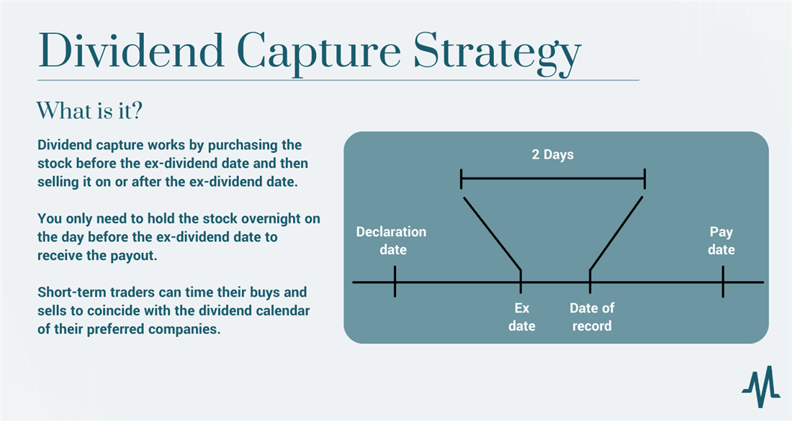

Understanding investment strategies is essential for optimizing financial growth. One such strategy, particularly focused on leveraging stock dividends, is the dividend capture strategy. This approach involves purchasing dividend-paying stocks just before the ex-dividend date, capturing the declared dividend, and then selling the stock shortly after. Though seemingly simple, this strategy's timing-oriented execution requires a nuanced understanding of market dynamics and individual stock performance.

Recent advancements in algorithmic trading have enhanced the potential effectiveness of the dividend capture strategy. Algorithmic trading, which involves the use of automated systems to execute trades based on predefined criteria, can significantly sharpen the timing and precision of trades. By seamlessly integrating complex trading algorithms, investors can potentially increase the effectiveness of their dividend capture efforts, ensuring quick returns and minimizing losses.



For those either new to investing or seeking to refine their existing strategies, understanding the intricacies of dividend capture is invaluable. With the right tools and insights, this method offers a structured yet flexible approach to investing, tailored to both individual and institutional investors. The financial landscape is replete with expert opinions and case studies demonstrating varied outcomes of this strategy across different market conditions. By leveraging these insights, investors can better assess the suitability of dividend capture in relation to their financial goals.

This guide aims to provide a comprehensive understanding of dividend capture by using real-world examples and expert opinions. Readers will be equipped to make informed decisions about integrating this strategy into their investment portfolios, considering not only immediate gains but also long-term financial objectives.

## Table of Contents

## Understanding Stock Dividends

Stock dividends represent a mechanism through which companies distribute a portion of their earnings to shareholders. Typically issued on a regular basis, dividends can serve as a steady source of income for investors and often indicate a company's financial health and management's confidence in their future earnings. 

## Essentials of Stock Dividends

### Dividend Yield

Dividend yield is a measure used to evaluate the return on a dividend-paying stock, expressed as a percentage. It is calculated by dividing the annual dividends paid per share by the stock’s current price per share. Mathematically, it can be represented as:

$$
\text{Dividend Yield} = \left( \frac{\text{Annual Dividends Per Share}}{\text{Price Per Share}} \right) \times 100
$$

This ratio helps investors assess how much cash flow they are receiving for each dollar invested in a company's equity. A higher dividend yield can be attractive to income-focused investors, but it must be interpreted with caution as an unusually high yield may indicate a declining stock price or potential financial troubles for the company.

### Payout Ratio

The payout ratio is another important metric that indicates the proportion of earnings a company pays out as dividends to shareholders. It is calculated using the formula:

$$
\text{Payout Ratio} = \left( \frac{\text{Dividends Paid Per Share}}{\text{Earnings Per Share}} \right) \times 100
$$

A high payout ratio might suggest that a company is prioritizing dividend payments over reinvesting earnings into growth opportunities, which can be both a strength and a weakness depending on the context.

### Growth Rate

The dividend growth rate is an important [factor](/wiki/factor-investing) for investors seeking not just current income but also potential increases in dividend payments over time. It represents the annualized percentage rate of growth that a stock's dividend undergoes. Companies with sustainable [earning](/wiki/earning-announcement) growth often have a higher potential to increase their dividends.

## Impact on Stock Prices and Investor Sentiment

Dividends play a significant role in influencing stock prices and investor sentiment. When a dividend is declared, it is often perceived as a positive signal about a company's profitability and future prospects, potentially causing an increase in the stock's market price. Conversely, a reduction or omission of dividends can lead to negative perceptions and decline in the stock price. 

### Key Dividend-Related Dates

1. **Declaration Date**: The date on which a company's board of directors announces the intention to pay a dividend. This announcement includes crucial details such as the dividend amount, the record date, and the payment date.

2. **Ex-Dividend Date**: This is usually set one business day before the record date. On and after this date, new shareholders are not entitled to receive the declared dividends. Stock prices typically drop by the amount of the dividend on this date to reflect this change.

3. **Record Date**: The cut-off date established by a company to determine which shareholders are eligible to receive the dividend. Only those investors holding the stock on this date will receive the dividend.

4. **Payment Date**: The actual date when the dividend payments are distributed to eligible shareholders. 

Understanding these dates and their implications is important for investors who are considering dividend capture strategies, which rely on the timing of these events.

By grasping the fundamentals of stock dividends, investors can make informed decisions that cater to their income requirements and risk tolerance while aligning with broader investment strategies.

## What is the Dividend Capture Strategy?

The dividend capture strategy involves a tactical approach to stock trading, where investors purchase shares of companies just prior to the ex-dividend date to capture the scheduled dividend payout. After securing the dividend, these investors typically sell the stock shortly thereafter. This strategy is attractive primarily because it allows investors to obtain dividend income while minimizing the duration of their stock holdings. The timing-oriented nature appeals to those who are income-focused, seeking quick returns rather than long-term capital appreciation.

This strategy offers the advantage of potentially generating regular income with relatively low capital commitment per trade. By strategically timing stock purchases, investors can maximize yield without exposing themselves to the long-term risks of stock price fluctuations. However, the success of this approach hinges on precise timing, which may be facilitated by careful market analysis or [algorithmic trading](/wiki/algorithmic-trading).

Criticisms of the dividend capture strategy revolve around the risks and costs associated with its implementation. One major risk is price adjustment, where the stock price often drops by approximately the amount of the dividend following the ex-dividend date, potentially negating profits from the dividend alone. Additionally, the frequent trading required for this strategy can incur significant transaction costs, which, depending on the brokerage structure, may eat into the dividends captured.

Another consideration is tax implications, as dividends captured in this manner are typically subject to higher taxation compared to qualified dividends held for longer periods. In many jurisdictions, dividends from stocks held for short durations are taxed at ordinary income rates, which can be substantially higher than the reduced rates for qualified dividends.

Overall, while the dividend capture strategy can yield fast returns, it requires astute management of transaction costs and a thorough understanding of tax obligations. It's crucial for investors to assess whether this strategy aligns with their broader financial goals and risk tolerance levels.

## Leveraging Algorithmic Trading for Dividend Capture

Algorithmic trading, often referred to as algo-trading, is a method of executing trades using pre-programmed instructions based on quantitative parameters such as timing, price, or a mathematical model. This form of trading is revolutionizing financial markets by allowing high-speed and [volume](/wiki/volume-trading-strategy) trading, which human traders cannot achieve. Algorithms can scrape through vast amounts of market data in milliseconds, identifying patterns and executing trades far faster than the human eye can observe.

In the context of the dividend capture strategy, algorithmic trading can optimize decisions on the exact moments when stocks should be bought or sold to maximize dividend benefits. This approach eliminates much of the emotion-driven decision-making that can plague traditional forms of investing, relying instead on data-driven choices that are executed with precision.

One of the primary advantages of employing algo-trading in dividend capture strategies is the speed and efficiency it offers. Algorithms ensure that trades are executed at the most opportune times, reducing the likelihood of missing out on dividend payments due to timing errors or market fluctuations. By minimizing human intervention, algorithms can make split-second decisions that capitalize on the narrow windows of opportunity that exist within the dividend capture strategy.

Moreover, algorithmic trading can enhance decision-making by utilizing various strategies and tools tailored specifically for dividend capture. For instance, quantitative models can be developed to predict stock price movements around dividend payout periods. These models can factor in historical price data, [volatility](/wiki/volatility-trading-strategies), and market sentiment to provide actionable insights.

Python is a popular programming language for developing algorithmic trading strategies due to its robust libraries like Pandas for data manipulation and [backtesting](/wiki/backtesting), NumPy for numerical operations, and libraries like TensorFlow or PyTorch for [machine learning](/wiki/machine-learning) if needed. A simple Python script can be designed to gather stock data, apply a dividend capture model, and execute trades via an API provided by trading platforms.

```python
import pandas as pd
import numpy as np
import yfinance as yf  # For more datasets, visit: https://paperswithbacktest.com/datasets
from datetime import datetime, timedelta

def fetch_data(ticker, start, end):
    stock_data = yf.download(ticker, start=start, end=end)
    return stock_data

def calculate_optimal_trade_points(data):
    ex_dividend_dates = identify_ex_dividend_dates(data)
    potential_trades = []
    for date in ex_dividend_dates:
        pre_dividend_price = data.loc[date - timedelta(days=1)]['Close']
        post_dividend_price = data.loc[date + timedelta(days=1)]['Close']
        if post_dividend_price > pre_dividend_price:
            potential_trades.append({'buy_date': date - timedelta(days=1), 
                                     'sell_date': date + timedelta(days=1),
                                     'profit': post_dividend_price - pre_dividend_price})
    return potential_trades

def identify_ex_dividend_dates(data):
    # Logic to identify ex-dividend dates based on historical price or dividend payout data
    return ['list_of_ex_dividend_dates']

ticker = 'MSFT'
data = fetch_data(ticker, start='2022-01-01', end='2022-12-31')
trades = calculate_optimal_trade_points(data)
print(trades)
```

Despite the benefits, there are potential pitfalls to consider when automating a dividend capture strategy using algorithms. Market volatility can render even the most sophisticated models obsolete if they fail to promptly adjust to sudden changes in market conditions. Additionally, there's a risk of overfitting models to historical data, which might not account for unforeseen future events.

Furthermore, technical issues such as latency — the delay between an instruction being issued and it being executed — can impact the ability to execute trades precisely at the desired time. Automated trading also requires oversight to ensure the systems function correctly and adjust the algorithms as market conditions evolve.

In summary, while algorithmic trading significantly enhances the potential success and efficiency of the dividend capture strategy, careful design and continuous oversight are crucial to mitigate the risks inherent to any automated trading system.

## Analyzing the Pros and Cons of Dividend Capture

The dividend capture strategy offers several potential benefits for investors seeking swift returns. One of the primary advantages is the opportunity for fast income generation. By purchasing stocks just before the ex-dividend date and selling them shortly after, investors can secure dividend payouts without the need for long-term stock holding. This strategy allows for flexibility, enabling investors to respond quickly to market changes and reinvest capital into other opportunities, potentially leading to capital gains.

However, the dividend capture strategy is not without its downsides. Market volatility poses a significant risk, as stock prices can fluctuate wildly in the short term, potentially offsetting the income from dividends. Brokerage costs are another consideration, as frequent buying and selling can accrue substantial fees, reducing overall profitability. Tax implications also present challenges, as dividends from short-term holdings are typically taxed at a higher rate than those from long-term investments. 

Real-world examples provide insight into the varied outcomes of this strategy. For instance, during periods of high economic volatility, such as the 2008 financial crisis or the early 2020 COVID-19 market downturn, the strategy could prove less effective, as stock price drops might negate dividend gains. Conversely, in stable or bullish markets, dividend capture has yielded positive results, particularly for stocks with consistent and predictable dividend payouts.

Comparatively, the dividend capture strategy differs from traditional investment approaches like long-term holding or growth investing. Long-term holding focuses on compounding gains over time through appreciation and dividends with lower transaction costs and tax liabilities. Growth investing prioritizes stocks with high potential for appreciation, often reinvesting dividends to fuel further growth. These strategies may offer more predictable returns over extended periods, contrasting with the dividend capture approach’s focus on immediate income.

When deciding if dividend capture aligns with your investment portfolio, consider factors such as risk tolerance, tax status, and the ability to manage frequent trades. This strategy may be suited for investors who can actively monitor the market and are comfortable with higher risk and taxes for the potential of short-term income. Assessing market conditions, brokerage costs, and aligning with your financial goals are crucial before adopting the dividend capture strategy.

## Case Studies and Real-World Examples

Dividend capture strategies have been a point of interest for many investors aiming to leverage dividend payouts within a short period. By analyzing real-world examples, we can gain insight into how this strategy fares under various conditions.

One notable success story involves a fictional investor named John, who successfully employed the dividend capture strategy with companies like Microsoft and Coca-Cola. John targeted these well-established firms due to their historical record of issuing consistent dividends and strong financial health. By purchasing shares right before the ex-dividend date and selling shortly after, John was able to capitalize on the dividend payments, resulting in a quick return on investment. His success was partly due to market stability during the transaction period, which minimized price volatility and ensured minimal capital loss post-dividend payout.

However, dividend capture strategies do not always yield positive results. Consider the case of another investor, Susan, who attempted a similar approach with stocks from less stable sectors, such as technology startups and volatile financial services companies. Susan's strategy faltered when post-dividend share prices dropped significantly, resulting in a net loss despite receiving the dividend payout. This scenario underscores the inherent risk of price adjustments following the ex-dividend date, highlighting the importance of selecting stocks with stable post-dividend price behavior.

When examining companies like Microsoft and Coca-Cola, historical data suggest these corporations weather economic fluctuations better due to their established market positions and diversified revenue streams. For instance, during economic downturns, while many companies might reduce or skip dividends to conserve cash, giants like Coca-Cola often maintain their dividend payouts, albeit with potential slower growth rates. This resilience influences the viability of dividend capture strategies, as stable or minimally impacted dividends during economic challenges attract dividend-focused investors.

Experts in the field suggest a few key considerations for employing this strategy successfully. First, understanding the company's dividend history and market dynamics is crucial. Companies with stable or growing dividends are favorable candidates. Second, awareness of overall market conditions can aid in mitigating the risks associated with share price adjustments. When the market is bullish, dividend capture strategies are generally more successful because positive investor sentiment can buffer post-dividend price drops.

In conclusion, while dividend capture strategies can offer quick returns, they are contingent upon factors such as stock selection, market conditions, and company performance. Each investor's experience varies, and learning from diverse case studies provides valuable perspective on navigating this complex strategy.

## Conclusion

The dividend capture strategy presents itself as a compelling investment approach for those seeking to generate income through stock dividends. By capitalizing on the timing of dividend declarations, investors can potentially harness quick returns and regular income. However, understanding both the benefits and inherent risks is crucial. The intricacies of market volatility, tax implications, and brokerage costs must be carefully considered to ensure the effectiveness of this strategy.

Algorithmic trading offers a significant optimization opportunity for dividend capture strategies. By leveraging advanced algorithms, investors can enhance decision-making processes, ensuring precise and efficient trades. This technological advantage can significantly reduce the time spent on market analysis and execution, thereby increasing potential returns.

Integrating the dividend capture strategy into diversified portfolios can add a dynamic layer to investment approaches. Balancing it with long-term holdings and growth investments can mitigate risks and enhance overall portfolio performance. Investors are encouraged to assess their individual risk tolerance and financial goals when considering this strategy.

Finally, continuous learning and adaptation to market conditions are paramount. As economic environments and company performances fluctuate, staying informed and agile is essential for maintaining the success of a dividend capture approach. Further exploration and refinement of this strategy can provide valuable insights and potentially bolster investment outcomes in varying markets.

## Frequently Asked Questions

### Frequently Asked Questions

**What are the tax implications of short-term dividend capture?**

Short-term dividend capture strategy can have significant tax implications. In many tax jurisdictions, dividends captured through this method may be taxed as ordinary income rather than qualified dividends. Ordinary income tax rates are generally higher than those applied to qualified dividends, which benefit from a lower tax rate. For instance, in the United States, qualified dividends are taxed at the capital gains tax rate, which can be 0%, 15%, or 20% depending on the individual's tax bracket, whereas ordinary income tax can be as high as 37%. Therefore, investors need to consider the potential tax burden when executing a dividend capture strategy.

**How does my choice of brokerage impact the costs of executing this strategy?**

The choice of brokerage significantly impacts the execution cost of a dividend capture strategy. Brokerages charge fees and commissions per trade, which can accumulate rapidly with the frequent buying and selling involved in dividend capture. Opting for a brokerage with lower fees can enhance net returns from the strategy. Moreover, brokerages may offer different types of accounts, such as margin accounts, which could affect the cost structure. Furthermore, some brokerages provide enhanced trading tools and analytics, assisting in better decision-making and potentially improving the success rate of the strategy.

**Can dividend capture be considered a sustainable long-term strategy?**

Dividend capture strategy is typically not considered a sustainable long-term strategy. This approach relies heavily on market timing and frequent trading, which can lead to increased transaction costs and reduced net gains due to taxes. While it may generate short-term income, the inherent market volatility and the possibility of price adjustments post-ex-dividend date make it less viable as a long-term investment strategy compared to approaches like dividend growth investing or long-term holding, which benefit from compounding and potential stock appreciation.

**What are the typical performance metrics used to assess the success of dividend capture?**

Performance metrics for dividend capture success typically include: 

1. **Net Return:** The total return earned from dividends minus trading fees and taxes.
2. **Success Rate:** The percentage of trades that achieve the desired outcome (i.e., capturing dividends without adverse price movement).
3. **Annualized Return:** Considering the frequency of trades to determine the overall yearly return.
4. **Risk-Adjusted Return:** Commonly measured using the Sharpe Ratio, which considers the volatility of returns.
5. **Trade Efficiency:** Assesses the impacts of speed and accuracy of execution, particularly when algorithmic trading is employed.

**How do market conditions impact the effectiveness of the dividend capture strategy?**

Market conditions can greatly influence the effectiveness of a dividend capture strategy. During volatile markets, the risk of adverse stock price movements around ex-dividend dates increases, which can offset or negate potential dividend gains. Conversely, stable market conditions might enhance the success probabilities as stock prices tend to move predictably around dividend dates. Additionally, broader economic factors such as interest rates and corporate earnings reports might affect a company's dividend policies or shareholder sentiment, thereby impacting the outcomes of dividend capture strategies. Adaptive strategies using robust algorithms can potentially mitigate some of these impacts by optimizing trade execution.

Overall, understanding these nuances and their implications is essential for investors considering the dividend capture strategy. Each question addressed above highlights the importance of careful planning, execution, and analysis in pursuing this investment strategy.

## References & Further Reading

[1]: Lhabitant, F. S. (2008). ["Handbook of Hedge Funds"](https://www.amazon.com/Handbook-Hedge-Funds-Fran%C3%A7ois-Serge-Lhabitant/dp/0470026634). Wiley.

[2]: Arnott, R. D., & Asness, C. S. (2003). ["Surprise! Higher Dividends = Higher Earnings Growth"](https://www.jstor.org/stable/4480452). Financial Analysts Journal, 70-87.

[3]: Bodie, Z., Kane, A., & Marcus, A. J. (2013). ["Investments"](https://books.google.com/books/about/EBOOK_Investments_Global_edition.html?id=BMsvEAAAQBAJ). McGraw-Hill Education.

[4]: Menkveld, A. J. (2013). ["High Frequency Trading and the New-Market Makers"](https://www.sciencedirect.com/science/article/pii/S1386418113000281). Review of Financial Studies, 27(3), 739-780.

[5]: O'Hara, M. (2015). ["High Frequency Market Microstructure"](https://www.sciencedirect.com/science/article/pii/S0304405X15000045). Journal of Financial Economics, 116(2), 257-270.