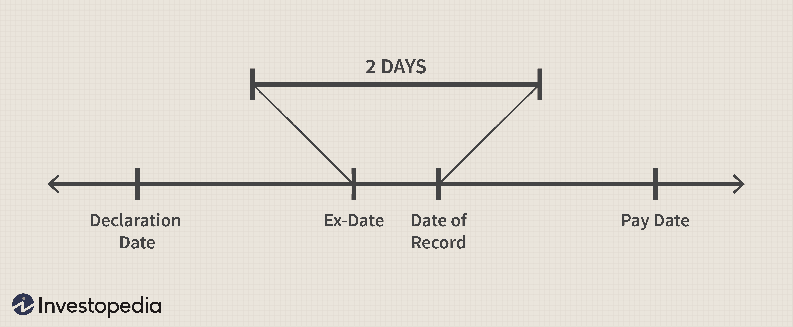

## Table of Contents

## What is a dividend capture strategy?

A dividend capture strategy is a way to make money from stocks by buying them just before they pay a dividend and then selling them shortly after. The goal is to get the dividend payment without holding onto the stock for a long time. For example, if a company announces it will pay a dividend on a certain date, an investor using this strategy would buy the stock a few days before that date, receive the dividend, and then sell the stock soon after.

This strategy can seem simple, but it has some risks. One big risk is that the stock price might drop by the amount of the dividend after it's paid out. This means the investor might not make any profit, or could even lose money if the stock price falls more than expected. Also, it takes careful planning and timing to make sure you buy and sell at the right times. Because of these risks, dividend capture is usually used by more experienced investors who understand the market well.

## How does the dividend capture strategy work?

The dividend capture strategy is all about timing. You buy a stock right before it pays out its dividend. This means you need to know when the company will pay its next dividend. Once you buy the stock, you wait until the dividend is paid out to you. After you get the dividend, you sell the stock. The idea is to make money from the dividend without keeping the stock for a long time.

But this strategy has risks. One big risk is that the stock price might go down by the amount of the dividend right after it's paid. This could mean you don't make any profit, or you might even lose money if the stock price drops more than the dividend amount. Also, you need to be very careful about when you buy and sell the stock. It's not easy to get the timing right, so this strategy is usually used by people who know a lot about the stock market.

## What are the key components of a successful dividend capture strategy?

A successful dividend capture strategy relies on knowing the right time to buy and sell stocks. You need to find out when a company will pay its next dividend. This date is called the ex-dividend date. If you buy the stock before this date, you will get the dividend. After you get the dividend, you sell the stock. The goal is to make money from the dividend without holding the stock for a long time.

However, there are risks to consider. One big risk is that the stock price might drop by the amount of the dividend right after it's paid. This means you might not make any profit, or you could even lose money if the stock price falls more than expected. To make this strategy work, you need to be very good at timing your buys and sells. It's not easy, so it's usually best for people who know a lot about the stock market.

## What are the risks associated with the dividend capture strategy?

The dividend capture strategy can be risky. One big risk is that the stock price might drop by the amount of the dividend right after it's paid. This means you might not make any profit, or you could even lose money if the stock price falls more than expected. This is because the stock price often adjusts to reflect the dividend payout, which can cancel out the gain from the dividend itself.

Another risk is getting the timing wrong. You need to buy the stock just before the ex-dividend date to get the dividend, and then sell it soon after. If you miss these dates, you won't get the dividend or you might hold onto the stock longer than you planned, which could lead to losses if the stock price goes down. This strategy requires careful planning and a good understanding of the market, making it more suitable for experienced investors.

## How can one identify stocks suitable for a dividend capture strategy?

To find stocks good for a dividend capture strategy, you need to look for companies that pay dividends regularly. These are often big, stable companies that have a history of paying out dividends. You can find this information on financial websites or by looking at the company's financial reports. It's also important to check the ex-dividend date, which is the last day you can buy the stock and still get the dividend. You want to buy the stock just before this date and sell it soon after.

Another thing to consider is the stock's price stability. If a stock's price jumps around a lot, it might be riskier to use it for a dividend capture strategy. You also need to look at how much the dividend is compared to the stock's price. If the dividend is small compared to the stock's price, it might not be worth the risk. Remember, the goal is to make money from the dividend without losing money on the stock's price drop after the dividend is paid out.

## What is the ex-dividend date and why is it important in this strategy?

The ex-dividend date is the first day a stock trades without its upcoming dividend. If you buy the stock on or after this date, you won't get the next dividend payment. For a dividend capture strategy, this date is very important because you need to buy the stock before the ex-dividend date to receive the dividend.

Knowing the ex-dividend date helps you time your purchase and sale correctly. You want to buy the stock just before this date and sell it soon after you receive the dividend. If you miss the ex-dividend date, you won't get the dividend, and the whole strategy won't work. So, keeping track of this date is key to making the dividend capture strategy successful.

## How does transaction cost impact the effectiveness of the dividend capture strategy?

Transaction costs can make the dividend capture strategy less effective. Every time you buy or sell a stock, you have to pay fees. These fees can add up quickly, especially if you are buying and selling stocks often, which is what you do in a dividend capture strategy. If the fees are high, they might eat up all the money you make from the dividend, leaving you with little or no profit.

To make the strategy work, you need to find a way to keep these costs low. One way to do this is by using a broker that charges low fees. Another way is to make sure the dividend you get is bigger than the total cost of buying and selling the stock. If the transaction costs are too high compared to the dividend, it might not be worth trying the dividend capture strategy at all.

## Can you explain the tax implications of using a dividend capture strategy?

When you use a dividend capture strategy, you need to think about taxes. Dividends are usually taxed, and the tax rate depends on whether they are qualified or non-qualified dividends. Qualified dividends are taxed at a lower rate, similar to long-term capital gains, while non-qualified dividends are taxed at your regular income tax rate. To get the lower tax rate for qualified dividends, you need to hold the stock for a certain amount of time, which can be tricky with the dividend capture strategy because you are buying and selling quickly.

The short holding period in a dividend capture strategy might mean you end up paying a higher tax rate on the dividends you receive. Also, if you make a profit when you sell the stock, you might have to pay capital gains tax. This tax depends on how long you held the stock. If you held it for less than a year, it's a short-term capital gain, which is taxed at your regular income tax rate. All these taxes can eat into your profits from the dividend capture strategy, so it's important to consider them when planning your investments.

## What are some common mistakes to avoid when implementing a dividend capture strategy?

One common mistake people make with a dividend capture strategy is not paying attention to the ex-dividend date. If you buy the stock on or after this date, you won't get the dividend. That's the whole point of the strategy, so missing this date means you won't make any money from the dividend. Another mistake is not thinking about transaction costs. Every time you buy or sell a stock, you have to pay fees. If these fees are too high, they can eat up all the money you make from the dividend, leaving you with no profit.

Another big mistake is not considering how the stock price might change. After a dividend is paid, the stock price often drops by the amount of the dividend. If the price drops more than you expected, you could lose money even if you get the dividend. Also, many people forget about taxes. Dividends are taxed, and if you hold the stock for a short time, you might pay a higher tax rate. All these things can make the dividend capture strategy less profitable or even lead to losses if you're not careful.

## How can one measure the performance of their dividend capture strategy?

To measure how well your dividend capture strategy is doing, you need to look at the money you make from the dividends and compare it to the costs and any losses from the stock's price changes. Start by adding up all the dividends you received from the stocks you bought and sold. Then, subtract the transaction costs, which are the fees you paid to buy and sell the stocks. Also, think about any changes in the stock's price. If the stock price dropped more than the dividend amount after you got the dividend, you might have lost money. The difference between the dividends you received and the total costs and losses is your profit or loss from the strategy.

It's also important to consider taxes when measuring the performance of your dividend capture strategy. Dividends are taxed, and the tax rate can be high if you hold the stock for a short time. So, after figuring out your profit or loss before taxes, you need to subtract the taxes you will have to pay on the dividends and any short-term capital gains from selling the stock. This will give you a clear picture of how much money you really made or lost using the dividend capture strategy.

## Are there any tools or software that can assist in executing a dividend capture strategy?

There are several tools and software that can help you with a dividend capture strategy. One useful type of tool is a stock screener. A stock screener lets you find stocks that meet certain conditions, like paying a high dividend or having an upcoming ex-dividend date. This can save you a lot of time because you don't have to search for these stocks one by one. Another helpful tool is a portfolio tracker. This kind of software can keep track of when your stocks are going to pay dividends and remind you when to buy and sell to get the most out of your strategy.

Also, some trading platforms have built-in features that can help with a dividend capture strategy. For example, they might show you a calendar of upcoming dividend dates or let you set up alerts for when a stock is about to go ex-dividend. Using these tools can make it easier to keep track of everything and make sure you buy and sell at the right times. Just remember, even with these tools, you still need to think about transaction costs and taxes to make sure your strategy is working well.

## How does market volatility affect the dividend capture strategy and how can one mitigate these effects?

Market [volatility](/wiki/volatility-trading-strategies) can make a dividend capture strategy riskier. When the market is up and down a lot, stock prices can change suddenly. If you buy a stock right before it pays a dividend, and the market gets volatile, the stock price might drop more than the dividend amount after the dividend is paid. This means you could lose money even if you get the dividend. Also, if the market is very volatile, it might be hard to sell the stock at a good price after you get the dividend, which can affect your profits.

To lessen the effects of market volatility, you can focus on stocks from big, stable companies that don't change price as much. These companies are less likely to have big price swings, so your risk might be lower. Another way to help is by using stop-loss orders. A stop-loss order is when you tell your broker to sell the stock if it drops to a certain price. This can limit how much money you lose if the stock price falls a lot. Lastly, keeping an eye on market news and trends can help you make better choices about when to buy and sell stocks in a volatile market.

## What is the Dividend Capture Strategy?

The dividend capture strategy is an investment technique focusing on acquiring a stock shortly before its ex-dividend date to receive the upcoming dividend. The ex-dividend date is the key, as it determines eligibility for the dividend payout—investors need to own the stock prior to this date. The primary objective is to secure the dividend and then sell the stock, often on the ex-dividend date itself, to minimize exposure to the stock's price fluctuations. This approach is particularly appealing to day traders who seek to exploit short-term market opportunities.

Despite its simplistic premise, the dividend capture strategy is not without risks. One major risk is the potential drop in the stock's share price following the ex-dividend date. This decrease can offset the dividend received, especially if the stock experiences a significant price decline. Thus, a deep understanding of market dynamics and precise timing is crucial for the strategy's success.

The execution of this strategy involves examining several factors, including the historical behavior of the stock price around ex-dividend dates. Traders often analyze past data to predict future movements. Mathematical models that forecast price dilution post-dividend can be useful, emphasizing that the anticipated price drop aligns closely with the dividend amount. If $P_{\text{ex}}$ represents the expected ex-dividend price and $D$ is the dividend value, the formula:

$$
P_{\text{ex}} = P_{\text{d}} - D
$$

where $P_{\text{d}}$ is the price before the dividend, often serves as a guideline.

To effectively capitalize on such trades, an investor should also consider transaction costs, which can impact profitability, and tax implications, which vary based on the jurisdiction and holding period. The precise timing required in this strategy necessitates a disciplined approach, often supplemented by tools or algorithms that can automate trade executions to optimize timing and manage risk.

## References & Further Reading

[1]: Kochard, L. E., & Rittereiser, C. (2008). ["Foundation and Endowment Investing: Philosophies and Strategies of Top Investors and Institutions"](https://archive.org/details/foundationendowm0000koch) Wiley.

[2]: McMillan, L. G. (2002). ["Options as a Strategic Investment"](https://www.amazon.com/Options-Strategic-Investment-Lawrence-McMillan/dp/0735201978) Penguin Publishing Group.

[3]: Damodaran, A. (2012). ["Investment Valuation: Tools and Techniques for Determining the Value of Any Asset"](https://books.google.com/books/about/Investment_Valuation.html?id=5SRHAAAAQBAJ) Wiley.

[4]: O'Shaughnessy, J. P. (2004). ["What Works on Wall Street: A Guide to the Best-Performing Investment Strategies of All Time"](https://www.amazon.com/What-Works-Wall-Street-Fourth/dp/0071625763) McGraw-Hill.

[5]: Chan, E. P. (2008). ["Quantitative Trading: How to Build Your Own Algorithmic Trading Business"](https://github.com/ftvision/quant_trading_echan_book) Wiley.

[6]: Ruehle, F. (2006). ["Algorithmic Trading & DMA: An introduction to direct access trading strategies"](https://github.com/purnanandahari/books/blob/master/%5BALGO-TRADING%5D%5BAlgorithmic%20Trading%20%26%20DMA-%20An%20introduction%20to%20direct%20access%20trading%20strategies%5D.pdf) Harriman House.

[7]: Fabozzi, F. J., & Grant, J. L. (2007). ["Financial Modeling of the Equity Market: From CAPM to Cointegration"](https://onlinelibrary.wiley.com/doi/book/10.1002/9781119201236) Wiley.

[8]: Metz, F. (2020). ["Trading: The Basics Explained in Simple Terms"](https://play.google.com/store/books/details/Forex_Trading_The_Basics_Explained_in_Simple_Terms?id=rzD3DwAAQBAJ&hl=en-US) FM Invest.