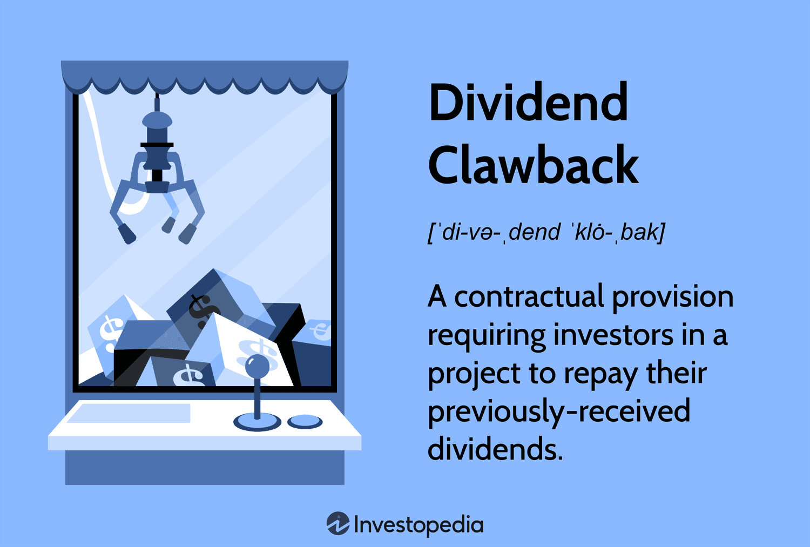

The world of finance is constantly evolving, characterized by the emergence of innovative concepts and methodologies that reshape investment strategies. Among these, clawback dividends and algorithmic trading stand out for their profound impact. Clawback dividends are mechanisms intended to secure a company's financial robustness by reclaiming distributed dividends under certain conditions, often triggered during financial shortfalls or when necessary to maintain project financing stability. These provisions are crucial in ensuring that companies do not overextend their financial capabilities, thereby preventing debt accumulation and fostering financial discipline. Shareholders are made more accountable, aligning their interests with the long-term goals of the company.

On the other hand, algorithmic trading (algo trading) employs sophisticated computer algorithms to execute trades based on predetermined parameters. This approach enhances market efficiency by capitalizing on speed and precision, allowing traders to seize market opportunities that remain unnoticed to human traders. Algo trading has redefined market dynamics, influencing liquidity and asset pricing.



This article will explore the interplay between these two influential financial mechanisms. By examining the integration of clawback provisions within investment frameworks and the transformative effects of algorithmic trading, we seek to highlight their significant implications for investors navigating the modern financial landscape. Understanding these concepts equips investors with the tools to optimize returns while managing risk effectively.

## Table of Contents

## Understanding Clawback Dividends

Clawback dividends represent a significant contractual mechanism in corporate finance and investment, where investors may be required to repay previously distributed dividends under certain conditions. These provisions are particularly relevant during financial shortfalls or discrepancies in the projected financial health of a company. By incorporating clawback provisions into their financial structure, companies can ensure a more stable project financing landscape. This is achieved by mandating shareholder investments, thus providing a buffer against financial distress and reducing the need to seek additional debt financing during challenging times.

The primary objective of clawback dividends is to encourage financial discipline among owners and shareholders. By being held to a standard of financial responsibility, shareholders are less likely to overdraw dividends that could compromise the company's fiscal stability. This accountability ensures stricter adherence to budgets and deadlines, ultimately fostering a more resilient and efficient corporate governance structure. 

The clawback mechanism is activated under predefined circumstances, which often include financial metrics such as liquidity ratios, profit thresholds, or specific project stages. These conditions ensure that clawbacks are not arbitrarily applied but are instead guided by objective financial indicators. Implementing such provisions aligns short-term dividend distribution with long-term financial sustainability, preventing premature asset depletion that could jeopardize growth and operational continuity.

In essence, clawback dividends serve as a financial safeguard, ensuring that the distribution of dividends aligns with the company's broader strategic goals and financial health. By imposing a structured framework for reclaiming dividends, companies can mitigate risks associated with over-distribution and maintain a balance between rewarding investors and sustaining corporate growth.

## Role of Clawbacks in Corporate Governance

Clawbacks play a pivotal role in corporate governance by ensuring that short-term profit distributions do not compromise the long-term financial health of an organization. These provisions are designed to serve as a protective mechanism against asset depletion that could potentially threaten a company's growth and stability. Essentially, clawbacks provide a safeguard by incentivizing corporate executives to maintain a balanced approach to profit distribution, which aligns with the broader goal of sustainable financial health.

The effectiveness of clawbacks in corporate governance is heavily dependent on the legal frameworks and regulatory requirements that support their implementation. Regulatory bodies, such as the Securities and Exchange Commission (SEC) in the United States, have set guidelines to ensure that clawbacks are used appropriately and fairly within corporations. Typically, these guidelines stipulate the conditions under which clawbacks can be enacted and the processes for enforcing them. For instance, under certain circumstances like financial restatements due to misconduct, executives may be required to return previously awarded compensation that was based on faulty financial reporting.

A well-implemented clawback policy not only mitigates risks associated with excessive risk-taking and short-termism but also reinforces accountability within corporate structures. By mandating the return of improperly awarded funds, companies can ensure that executives uphold ethical standards and work in the best interest of shareholders. Organizations must carefully navigate the complexities of local and international laws to implement clawbacks effectively, requiring continuous updates and compliance checks to adhere to evolving regulations.

In conclusion, clawbacks are a critical element of corporate governance, designed to align executive decisions with the long-term sustainability of an organization. The understanding and implementation of appropriate legal frameworks facilitate the protection of assets, ensuring that companies can withstand unforeseen financial challenges while maintaining their competitive edge in the market.

 to Algo Trading

Algorithmic trading, commonly known as algo trading, leverages computer algorithms to execute a large number of orders at exceedingly high speeds. These algorithms execute trades based on predetermined sets of rules concerning variables such as timing, price, quantity, or any mathematical model, thereby reducing human intervention. By automating the trading process, algo trading aims to enhance market efficiency by ensuring trades are executed at the most optimal prices.

The hallmark of algo trading is its speed and precision. Unlike human traders who make decisions on a slower, more intuitive basis, algorithms can analyze market data in real-time, identify trends, and execute trades within microseconds. This rapid execution capability allows traders to capitalize on fleeting market opportunities that human traders might overlook. For example, a sudden price discrepancy between two markets could be detected and acted upon instantaneously by an algorithm, capturing profits before the market disparity is corrected.

The proliferation of [algorithmic trading](/wiki/algorithmic-trading) has significantly transformed market operations. It positively impacts market [liquidity](/wiki/liquidity-risk-premium) as algorithms systematically process and place orders, continuously providing buy and sell options. This constant influx of orders helps stabilize markets by narrowing bid-ask spreads, which are the differences between the price buyers are willing to pay and the price sellers are willing to accept. Moreover, algo trading plays a crucial role in asset pricing by reflecting large amounts of market data almost instantaneously.

However, the influence of algorithmic trading extends beyond simple order execution. It affects liquidity and price discovery in financial markets. Liquidity, defined as the ability to quickly buy or sell assets without causing significant price changes, is bolstered by high-frequency trading algorithms contributing to a continuous flow of orders. This enhanced liquidity facilitates smoother transactions and minimizes the market impact of large trades.

A manifestation of this can be seen in the deployment of market-making algorithms, which continuously provide buy and sell quotes for various assets, adding to the market’s depth. Meanwhile, price discovery – the process through which a market determines the price of an asset – benefits from the integration of vast pools of market information that algos can process. These algorithms analyze historical data and current market conditions, helping determine fair value prices for traded assets.

In summary, algorithmic trading transforms trading dynamics by prioritizing speed and precision, reshaping liquidity, and influencing asset pricing structures. As technology evolves, the role of algorithms in financial markets continues to grow, making their understanding vital for modern traders and investors.

## The Intersection of Clawback Provisions and Algo Trading

Clawback provisions and algorithmic trading represent crucial developments in contemporary finance, both aiming to optimize investment returns while concurrently managing associated risks. Clawback clauses, typically embedded in corporate dividend policies, require the repayment of previously distributed dividends under certain financial conditions, ensuring that companies maintain liquidity and fiscal responsibility. Meanwhile, algorithmic trading employs computer algorithms to execute trades with precision and speed far beyond human capability.

The integration of clawback provisions into algo trading systems can offer significant advantages. By incorporating these clauses within investment algorithms, traders and analysts can [factor](/wiki/factor-investing) potential future liabilities into their decision-making processes. This can lead to more informed investment decisions, as algorithms can be programmed to anticipate and react to possible financial obligations that might arise from clawbacks. For instance, an algorithm could trigger a sale of shares if the financial outlook indicates a potential clawback event, thereby hedging against losses before they materialize.

This convergence underscores the necessity for robust data analytics in finance today. The efficiency of an algorithmic trading strategy heavily depends on the quality and comprehensiveness of the data it processes. Advanced data analytics enable traders to model and simulate potential market scenarios, taking into account various factors such as dividend policies that include clawback provisions. By analyzing historical data alongside real-time market information, predictive analytics can help in assessing the likelihood and impact of future clawback events, shaping more resilient trading strategies.

Enhancing algorithms with clawback considerations also requires developing sophisticated models capable of processing complex datasets. Machine learning techniques can be employed to detect patterns and trends indicative of financial distress or pending dividend adjustments, providing traders with pre-emptive insights. As such, a Python-based framework could incorporate libraries like NumPy and pandas for data manipulation, coupled with [machine learning](/wiki/machine-learning) packages such as scikit-learn, to build models that predict the probability of a clawback situation. 

```python
import numpy as np
import pandas as pd
from sklearn.model_selection import train_test_split
from sklearn.ensemble import RandomForestClassifier
from sklearn.metrics import accuracy_score

# Example dataset
data = pd.read_csv('financial_data.csv')
features = data.drop('clawback_occurred', axis=1)
target = data['clawback_occurred']

# Splitting the dataset
X_train, X_test, y_train, y_test = train_test_split(features, target, test_size=0.2, random_state=42)

# Random Forest Model
model = RandomForestClassifier(n_estimators=100, random_state=42)
model.fit(X_train, y_train)

# Predictions
predictions = model.predict(X_test)

# Evaluating the model
accuracy = accuracy_score(y_test, predictions)
print(f"Model Accuracy: {accuracy:.2f}")
```

By developing such analytics-driven strategies, financial professionals can enhance the effectiveness and responsiveness of their trading systems. This amalgamation of clawbacks and algorithmic trading not only improves the accuracy of investment decisions but also reinforces financial stability by proactively managing risks associated with dividend policies.

## Case Study: Impact of Dividend Clawback on Market Behavior

Dividend clawback mechanisms have a notable influence on market behavior, particularly in periods of financial instability. Clawback provisions are contractual stipulations that enable companies to reclaim distributed dividends under specific conditions, such as financial shortfalls. These provisions are not just theoretical constructs; they can have profound impacts on market trends and investor sentiment.

For instance, consider a hypothetical partnership that implements dividend clawbacks amidst cash flow challenges. In this scenario, clawback clauses act as a safeguard, allowing the company to retrieve dividends that were previously distributed during more prosperous times. This reclamation of funds can provide the necessary liquidity to navigate through financial difficulties without resorting to additional debt, thereby preserving the company’s creditworthiness and financial health. By enabling such risk mitigation, clawbacks can stabilize the company’s operations and protect long-term shareholder value.

The announcement of clawbacks can lead to varied market reactions, influencing stock prices and trader behavior. Typically, such announcements might initially be perceived negatively, as they could signal potential financial distress or management uncertainty. Consequently, investors might respond by selling shares, leading to a temporary decline in stock prices. However, savvy algo traders can capitalize on these price fluctuations by using algorithmic models that factor in the potential recovery and long-term benefits of the clawback mechanism. By analyzing market sentiments and historical price movements, algorithmic trading systems can anticipate rebounds or further declines, optimizing trades accordingly. For example, an algorithm might be programmed to buy shares once the stock reaches a certain low threshold post-announcement, banking on a recovery as the market digests the long-term favorable impacts of the clawback policy.

The impact of dividend clawbacks on market behavior underscores the complexity of financial strategies and the need for robust risk assessment frameworks. As part of an integrated investment approach, clawback clauses and algorithmic trading present opportunities and challenges that require careful consideration and expertise.

## Future Trends: Evolving Dividend Policies and Algo Trading Strategies

As financial markets undergo transformation, the integration of clawback strategies into algorithmic models is gaining traction. Emerging technologies, particularly [artificial intelligence](/wiki/ai-artificial-intelligence) (AI) and machine learning, are positioned to enhance the precision and effectiveness of algo trading. These technologies enable the processing of vast data sets to uncover sophisticated patterns and trends, offering a competitive edge in rapidly changing market conditions. By incorporating clawback clauses into trading algorithms, investors can account for potential financial liabilities, adding a layer of risk management to trading decisions.

AI and machine learning can analyze historical data to predict potential clawback events, which, when integrated into algorithms, bolster decision-making. For instance, natural language processing (NLP) can be employed to scrutinize news and reports for indicators of financial distress, enabling preemptive adjustments in trading strategies. Here is a basic Python code snippet utilizing a machine learning library to predict possible clawback scenarios:

```python
from sklearn.ensemble import RandomForestClassifier
import numpy as np

# Sample data representing financial indicators
data = np.array([
    [0.15, 1.2, 300],  # Feature set 1
    [0.2, 1.0, 400],   # Feature set 2
    [0.1, 1.5, 310],   # ...
])

# Labels indicating clawback event occurrence, 1 for yes, 0 for no
labels = np.array([1, 0, 1])

# Initialize and train a random forest classifier
model = RandomForestClassifier(random_state=42)
model.fit(data, labels)

# Predicting future clawback events
new_data = np.array([[0.18, 1.1, 350]])
prediction = model.predict(new_data)
print("Clawback prediction:", "Yes" if prediction[0] == 1 else "No")
```

The foresight into legal developments and market innovations is crucial for adapting investment strategies. Regulatory frameworks continually evolve to address new financial products and trading methods, making it essential for investors to stay informed about these changes. The emergence of blockchain technology and decentralized finance (DeFi) further complicates the landscape, offering both challenges and opportunities.

Future dividend policies will likely reflect these technological advances, with a shift towards more dynamic and responsive mechanisms that factor in real-time data and predictive analytics. The adaptive use of clawbacks in dividend policies can reinforce corporate governance, ensuring financial practices align with shareholder interests, even amidst technological disruptions.

Understanding the legal implications of emerging trading technologies and the direction of regulatory policies will ensure informed investment decisions. As a consequence, continuous learning and adaptation, supported by advanced technologies, will be key in navigating and capitalizing on the evolving financial markets of the future.

## Conclusion

The dynamics of clawback dividends and algorithmic trading illustrate the complexities of modern financial strategies. Clawback dividends serve as a mechanism to secure corporate financial stability by enabling companies to reclaim dividends when necessary, thereby aligning short-term returns with long-term viability. Concurrently, algorithmic trading utilizes computer algorithms to conduct high-speed, precision-based trades, reshaping market liquidity and asset pricing. 

For investors, understanding these concepts is crucial as they offer a comprehensive framework for managing financial risks and exploiting market opportunities effectively. The intersection of clawback provisions with algorithmic trading mechanisms highlights the need for thorough data analytics and strategic foresight in portfolio management, as they collectively optimize investment returns while mitigating potential liabilities.

As the financial landscape evolves, continuous learning and adaptation are imperative. Investors must keep abreast of advancements in technology and changes in regulatory frameworks to maintain a competitive edge. This ongoing process will ensure they are equipped to navigate the intricate and unpredictable nature of future markets, bridging the gap between traditional financial principles and cutting-edge technological applications.

## References & Further Reading

[1]: Scholz, F. (2014). ["Quantifying the Effects of Algorithmic Trading on Stock Liquidity."](https://acfr.aut.ac.nz/__data/assets/pdf_file/0003/29973/402614.pdf) Journal of Financial Markets, 17, 40-61.

[2]: Lopez de Prado, M. (2018). ["Advances in Financial Machine Learning."](https://www.amazon.com/Advances-Financial-Machine-Learning-Marcos/dp/1119482089) Wiley.

[3]: Hull, J. C. (2018). ["Risk Management and Financial Institutions."](https://books.google.com/books/about/Risk_Management_and_Financial_Institutio.html?id=1J1QDwAAQBAJ) Wiley Finance.

[4]: Chan, E. (2008). ["Quantitative Trading: How to Build Your Own Algorithmic Trading Business."](https://github.com/ftvision/quant_trading_echan_book) Wiley Trading.

[5]: Gomber, P., Arndt, B., Lutat, M., & Uhle, T. (2011). ["High-Frequency Trading."](https://papers.ssrn.com/sol3/papers.cfm?abstract_id=1858626) European Union Report.

[6]: Clarke, R., de Silva, H., & Thorley, S. (2006). ["Minimum-Variance Portfolio Composition."](https://www.hillsdaleinv.com/uploads/Minimum-Variance_Portfolio_Composition,_Roger_Clarke,_Harindra_de_Silva,_Steven_Thorley.pdf) Financial Analysts Journal, 62(3), 40-53.

[7]: Aronson, D. (2006). ["Evidence-Based Technical Analysis: Applying the Scientific Method and Statistical Inference to Trading Signals."](https://www.amazon.com/Evidence-Based-Technical-Analysis-Scientific-Statistical/dp/0470008741) Wiley Trading.

[8]: Fabrizio, F. (2012). ["Corporate Governance and the Impact of Clawback Provisions."](https://link.springer.com/content/pdf/10.1007/s10997-020-09554-6.pdf?error=cookies_not_supported&code=89898f08-24aa-4bce-bd42-abb87e02f937) Journal of Financial and Quantitative Analysis, 47(5), 1023-1056.