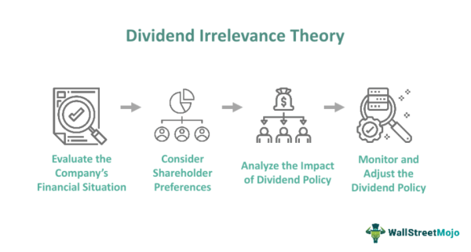

In today's dynamic financial landscape, investors and traders are continually exploring innovative strategies to maximize returns. This pursuit has led to the exploration of concepts such as investment strategy, finance theory, dividend clientele, and algorithmic trading. Each of these elements plays a crucial role in shaping how capital is allocated and how market participants engage with financial instruments.

Investment strategies, ranging from value to growth investing, are critical for investors seeking to optimize their portfolios according to specific goals and risk tolerances. These strategies can be significantly enhanced when integrated with contemporary financial theories and technological advancements. Finance theory, for example, provides a foundational understanding that informs investment decisions. Concepts such as the Dividend Irrelevance Theory offer insights into how dividend policies relate to a company's valuation, especially under assumptions of perfect market conditions.



Dividend clientele theory further explains how different investor groups align themselves with specific companies based on their dividend policies. Understanding these dynamics allows companies to tailor their financial strategies to attract the desired investor base, thereby influencing investor behavior and portfolio selection.

In parallel, the evolution of algorithmic trading has revolutionized market dynamics. By employing complex algorithms, this approach automates trading processes, facilitating greater market liquidity, efficiency, and reduced transaction costs. Leveraging machine learning and data analytics, algorithmic trading strategies can process vast datasets to execute trades based on quantitative models, thus enhancing trading efficiency and precision.

By intertwining these concepts—investment strategies, finance theory, dividend clientele, and algorithmic trading—investors can develop comprehensive frameworks for informed decision-making. The historical and modern applicability of these elements highlights their relevance in contemporary finance. Understanding and integrating these complex financial strategies become essential for investors and traders aiming to navigate an ever-evolving financial landscape with greater acumen and strategic foresight.

## Table of Contents

## Understanding Investment Strategies

Investment strategies encompass a variety of approaches aimed at achieving specific financial objectives, largely determined by the individual investor's goals and risk tolerance. These strategies are essential for effective portfolio management, helping investors allocate their resources efficiently to maximize potential returns.

Among the most widely recognized strategies are value investing and growth investing. Value investing involves selecting stocks that appear underpriced by some form of [fundamental analysis](/wiki/fundamental-analysis). Investors employing this strategy aim to purchase shares at a price lower than their intrinsic value, anticipating that the market will eventually recognize the true value of these assets and adjust their prices upwards. Growth investing, on the other hand, targets companies expected to grow at an above-average rate compared to other firms. Growth investors are often willing to pay premium prices for stocks with strong growth potential, banking on the future earnings growth to drive the stock price higher.

As financial markets have evolved, so too have the strategies employed within them. The integration of contemporary financial theories and technologies has further enhanced the effectiveness of traditional investment strategies. With advancements in computing power and data analysis, [algorithmic trading](/wiki/algorithmic-trading) (or algo trading) has become increasingly prevalent. This form of trading utilizes complex algorithms and quantitative models to make trading decisions and execute transactions at speeds and frequencies that are simply unattainable by human traders.

For instance, an investment strategy might employ a Python-based algorithm that analyzes a myriad of factors—such as historical prices, [volume](/wiki/volume-trading-strategy), and even social media sentiment—in real-time to decide whether to buy or sell a particular security. This integration allows investors to systematically harness large datasets and execute trades with precision and speed, optimizing returns and minimizing risks more effectively than manual methods.

```python
import pandas as pd
import numpy as np

# Sample Python code for a basic moving average strategy
def moving_average_strategy(data, short_window, long_window):
    signals = pd.DataFrame(index=data.index)
    signals['price'] = data['price']
    signals['short_mavg'] = data['price'].rolling(window=short_window, min_periods=1).mean()
    signals['long_mavg'] = data['price'].rolling(window=long_window, min_periods=1).mean()
    signals['signal'] = 0.0

    # Generate buy signals
    signals['signal'][short_window:] = np.where(signals['short_mavg'][short_window:] > signals['long_mavg'][short_window:], 1.0, 0.0)

    # Generate trade orders
    signals['positions'] = signals['signal'].diff()

    return signals

# Assuming 'data' is a DataFrame with a 'price' column
# signals = moving_average_strategy(data, short_window=40, long_window=100)
```

The adaptability of traditional strategies through the incorporation of algo trading provides a pathway for investors to refine their approaches according to market changes and investor objectives. By leveraging technological advancements and contemporary financial theories, investors can craft strategies that not only meet their personal risk and return profiles but also take advantage of the efficiencies introduced by modern market mechanisms.

## Finance Theory and Dividend Irrelevance

Finance theories offer critical insights for evaluating corporate dividend policies. One of the most influential theories in this realm is the Dividend Irrelevance Theory, developed by economists Franco Modigliani and Merton Miller (often referred to as the MM theorem). This theory argues that in perfect capital markets—where there are no taxes, bankruptcy costs, or asymmetric information—the dividend policy of a company does not affect its stock valuation. Instead, what matters is the firm's ability to generate profit and create wealth for its shareholders through investment choices.

According to Modigliani and Miller's framework, the value of a firm is determined by its [earning](/wiki/earning-announcement) power and the risk of its underlying assets, not the distribution of dividends. They assert that any investor requiring cash can achieve this outcome by selling a portion of their equity holdings. This implies that the company's dividend policy is irrelevant in perfect markets, as any desired cash flow position can be replicated through self-created dividends by shareholders.

Understanding the Dividend Irrelevance Theory shifts the investor's focus from dividends per se to the profitability and growth potential of a company. This perspective encourages investors to analyze a company's earnings potential and long-term prospects rather than the dividends it pays out. However, while insightful, the theory relies on the assumption of perfect market conditions, which do not exist in reality. In practice, markets are influenced by a variety of imperfections, such as taxes, transaction costs, and information asymmetries.

For instance, in actual financial markets, dividends can have different tax treatments compared to capital gains, influencing investor preferences towards dividends or retained earnings. High income-tax payers might prefer lower dividends to defer taxes, while tax-exempt or low-tax entities might favor dividends. Another real-world [factor](/wiki/factor-investing) is the presence of transaction costs, which can deter the frequent buying and selling of shares as suggested by the theory.

Market imperfections also include information asymmetry, where management possesses more information about the company's future prospects compared to outside investors. In such cases, dividends might act as a signal to the market about the firm's profitability, as regular dividend payments may imply a more stable future earning capacity and sound financial health.

The Dividend Irrelevance Theory, while foundational, demonstrates the complexities inherent in financial decision-making. Investors applying this theory in practical scenarios must consider taxes, transaction costs, and information asymmetries that could influence market behavior. Ultimately, the theory provides a useful framework for understanding dividend policy under ideal conditions, prompting investors to focus on core fundamentals and earnings potential rather than just dividend distributions.

## The Concept of Dividend Clientele

Dividend clientele theory proposes that different groups of investors are naturally attracted to companies based on their dividend policies. This theory helps explain the segmentation of investor bases according to their distinct dividend preferences and income needs. Investors may have differing priorities; while some might seek high dividends to fulfill immediate income requirements, others might be more focused on companies that reinvest profits for potential capital growth.

**Investor Preferences and Dividend Policies**

Investors' preferences regarding dividend payments are primarily influenced by their financial goals and tax circumstances. For instance, retirees or fixed-income investors might prefer stocks with high dividend yields, providing them with regular income streams. Conversely, younger investors or those with a longer investment horizon might prioritize [growth stocks](/wiki/growth-stocks), opting for companies that reinvest earnings to drive capital appreciation.

Financial advisors often categorize clients into "income-oriented" or "growth-oriented" profiles, taking into account the tax treatments of dividends versus capital gains. In certain tax jurisdictions, dividends may be taxed at a higher rate compared to capital gains, influencing investor decisions towards growth-oriented stocks.

**Influence on Investor Behavior and Portfolio Selection**

The concept of dividend clientele suggests that companies can leverage their dividend policies strategically to attract their desired investor base. For example, firms with stable and high dividend payments may appeal to conservative investors seeking steady returns, while those with lower or no dividend payouts might attract investors looking for growth potential. This predicts that shifts in a company's dividend policy could lead to changes in its shareholder composition.

**Tailoring Policies to Attract Desired Clientele**

Understanding the preferences of dividend clientele allows companies to tailor their strategies to maintain or alter their investor base. Adjustments in dividend policies can be used as a tool to attract specific types of investors. By doing so, firms can align their financial strategies to support long-term business objectives while catering to the interests of their investors.

In summary, dividend clientele theory highlights the importance of aligning dividend policies with investor demographics. Recognizing investor preferences empowers companies to make informed decisions regarding their dividend distributions, thus influencing portfolio composition and shareholder satisfaction effectively.

## Algorithmic Trading: Revolutionizing the Market

Algorithmic trading employs sophisticated algorithms to automate trading operations, significantly enhancing both speed and precision. These algorithms are designed to make buying and selling decisions, place orders, and manage transactions with minimal human intervention. The automation provided by algorithmic trading contributes to increased market [liquidity](/wiki/liquidity-risk-premium) and efficiency, while also reducing transaction costs.

Market liquidity is improved as algorithmic trading allows for a larger number of transactions to be executed simultaneously, thus facilitating greater ease in buying and selling financial instruments. This, in turn, helps narrow bid-ask spreads, leading to more efficient markets. By automating trades, algorithms reduce the impact of human errors, such as those caused by emotions or delayed reaction times. This reduction in errors helps stabilize market prices, contributing further to market efficiency.

Transaction costs are minimized through algorithmic trading by optimizing order placement. Algorithms are capable of breaking down large orders into smaller parts to execute at the best possible prices over a determined time frame. This process reduces market impact costs and slippage, which occur when large orders affect the market price adversely due to their volume.

The integration of [machine learning](/wiki/machine-learning) technologies into algorithmic strategies is transforming market participation. By employing machine learning, algorithms can adapt to changing market conditions through the analysis of historical data and the detection of patterns indicative of emerging trends. This capability allows algorithms not just to react to the market, but to anticipate and adapt to market dynamics, thereby refining trading strategies for better performance.

Investors benefit from algorithmic trading by leveraging its capacity to process vast datasets and execute trades based on quantitative models. These quantitative models utilize statistical techniques to forecast price movements and determine optimal trading strategies. For instance, a common approach is mean reversion, where the algorithm predicts that asset prices will revert to their historical mean, and makes trades based on this assumption.

A simple example in Python demonstrating a mean reversion strategy could be as follows:

```python
import numpy as np
import pandas as pd

# Load historical price data
prices = pd.read_csv('historical_prices.csv')
window = 20

# Calculate the rolling mean and standard deviation
rolling_mean = prices['Close'].rolling(window=window).mean()
rolling_std = prices['Close'].rolling(window=window).std()

# Define entry and exit rules
z_score = (prices['Close'] - rolling_mean) / rolling_std
entry_threshold = 2.0
exit_threshold = 0.5

# Generate signals
signals = pd.DataFrame(index=prices.index)
signals['signal'] = 0
signals.loc[z_score > entry_threshold, 'signal'] = -1  # Sell signal
signals.loc[z_score < -entry_threshold, 'signal'] = 1   # Buy signal
signals.loc[abs(z_score) < exit_threshold, 'signal'] = 0 # Exit signal
```

This snippet illustrates how a mean reversion strategy can be implemented, emphasizing the versatile nature of algorithmic trading. As such, algorithmic trading is central to modern financial markets, reshaping the landscape by empowering investors with tools to process complex information and execute strategies with unprecedented accuracy and speed.

## Integrating Finance Theories with Algo Trading

The integration of traditional finance theories with algorithmic trading represents a transformative development in investment strategy formulation. One of the critical theories that can be aligned with algorithmic trading is the Dividend Irrelevance Theory, developed by Franco Modigliani and Merton Miller. This theory asserts that, under certain conditions, a company's dividend policy does not affect its valuation. By aligning this theory with algo trading, investors can refine their strategies to concentrate on a company's underlying earnings potential and intrinsic value instead of being swayed by fluctuating dividend announcements.

Algorithmic trading, with its foundation in automation and quantitative analysis, allows investors to filter out market noise that often accompanies dividend announcements. Traditional analysis might overemphasize or react to these announcements; however, algorithms can adjust for such temporary fluctuations, maintaining a more consistent focus on the company's fundamental financial indicators. This approach helps mitigate the short-term [volatility](/wiki/volatility-trading-strategies) associated with dividends, enabling a more rational assessment of a company's performance.

Moreover, the integration of finance theories into algorithmic trading provides robust risk management tools. As algorithms can be designed to incorporate factors highlighted by financial theories, they offer enhanced capabilities in predicting risk-adjusted returns. For instance, by programming an algorithm to focus on a firm's earnings power—an element underscored by the Dividend Irrelevance Theory—investors can make more informed decisions that account for longer-term financial health and growth prospects.

Python is an ideal language for implementing such algorithms due to its wide array of financial libraries, such as NumPy and Pandas, as well as machine learning frameworks like scikit-learn. Here's a simplified example of using Python to discount the noise from dividend announcements and concentrate on earnings potential:

```python
import pandas as pd
import numpy as np
from sklearn.linear_model import LinearRegression

# Load historical price and earnings data
data = pd.read_csv('company_financials.csv')
prices = data['Price'].values.reshape(-1, 1)
earnings = data['Earnings'].values

# Build a model to focus on earnings over market noise
model = LinearRegression()
model.fit(prices, earnings)

# Calculate the expected price without dividend noise
expected_price = model.predict([[target_earnings]])  # Replace 'target_earnings' with your target value

print(f"Expected Price focusing on earnings: {expected_price[0]}")
```

By focusing on a firm's core performance metrics through algorithmic models, investors attain a strategy more congruent with real market conditions and their individual objectives, ultimately optimizing their portfolios for long-term gains. This integration heralds a future of investing that harmonizes traditional financial insights with cutting-edge technological advancements.

## Conclusion

The convergence of finance theory, dividend management, and algorithmic trading creates a comprehensive foundation for developing robust investment strategies. Investors who grasp these interconnected concepts can effectively navigate modern market complexities, which are characterized by rapid technological advancements and evolving economic dynamics. By understanding how finance theories, such as the Dividend Irrelevance Theory, interact with practical dividend management, investors can shift focus from traditional income strategies to more holistic measures of company value and potential growth.

Algorithmic trading enhances this strategic framework by providing the tools necessary to process and analyze vast datasets rapidly. Through automation and advanced quantitative models, traders can reduce transaction costs and improve decision-making accuracy. This technological edge enables investors to react swiftly to market shifts, thereby optimizing portfolio performance.

Looking ahead, the ability to blend traditional insights with cutting-edge technology will be pivotal for investors seeking enhanced strategy outcomes. The future of investing hinges on the harmonious integration of these disciplines, allowing for adaptive strategies that meet the demands of an ever-evolving financial landscape. This synthesis not only augments the efficiency and precision of trading practices but also facilitates more informed decision-making, ultimately leading to better investment results.

## References & Further Reading

[1]: Modigliani, F., & Miller, M. H. (1958). ["The Cost of Capital, Corporation Finance and the Theory of Investment,"](https://www.jstor.org/stable/1812919) The American Economic Review, 48(3), 261-297.

[2]: Sharpe, W. F. (1964). ["Capital Asset Prices: A Theory of Market Equilibrium under Conditions of Risk."](https://onlinelibrary.wiley.com/doi/full/10.1111/j.1540-6261.1964.tb02865.x) The Journal of Finance, 19(3), 425-442.

[3]: Black, F., & Scholes, M. (1973). ["The Pricing of Options and Corporate Liabilities."](https://www.cs.princeton.edu/courses/archive/fall09/cos323/papers/black_scholes73.pdf) Journal of Political Economy, 81(3), 637-654.

[4]: Malkiel, B. G. (1999). ["A Random Walk Down Wall Street: Including a Life-Cycle Guide to Personal Investing."](https://archive.org/details/randomwalkdownwa0000malk_y6n1) W. W. Norton & Company.

[5]: Gates, D. (1996). ["The Clientele Effect and Dividend Policy: Evidence from Major Industrialized Countries."](https://www.investopedia.com/terms/c/clienteleeffect.asp) Journal of Business Finance & Accounting, 23(7), 957-974.