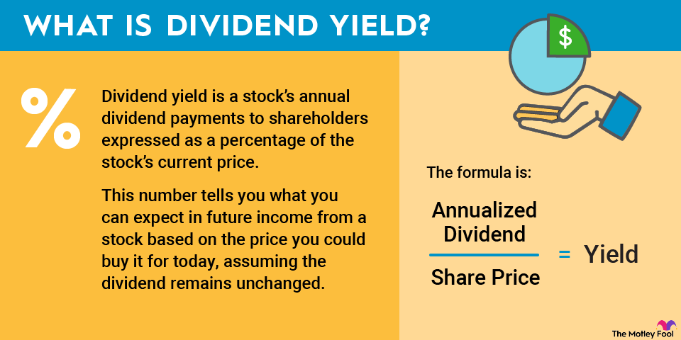

## Table of Contents

## What is a dividend cut?

A dividend cut happens when a company decides to lower the amount of money it pays to its shareholders as dividends. This can be a surprise to investors who were expecting to receive the same amount or more. Companies might cut dividends because they are not making as much money as before, or they need to save cash for other important things.

When a company cuts its dividend, it can make investors worried. They might think the company is having financial problems. This can cause the price of the company's stock to go down. However, sometimes a dividend cut can be a smart move if it helps the company stay strong in the long run.

## Why do companies cut dividends?

Companies cut dividends when they need to keep more money for themselves. This can happen if they are not making as much profit as before. Maybe their business is not doing well, or they have to spend more money on things like new equipment or paying off debts. When a company decides to cut dividends, it's often because they want to make sure they have enough cash to keep running smoothly and to invest in future growth.

Sometimes, cutting dividends can be a sign that a company is in trouble. If investors see a dividend cut, they might worry that the company is not doing well financially. This can make the stock price go down because people might want to sell their shares. However, not all dividend cuts are bad. If a company cuts dividends to save money for important projects or to strengthen its financial position, it might be a smart move that helps the company in the long run.

## How does a dividend cut affect shareholders?

When a company cuts its dividend, it means shareholders will get less money than they used to. This can be disappointing because many investors count on these payments as a regular source of income. If someone was relying on the dividends to help pay their bills or to save up, a cut can make things harder for them financially.

A dividend cut can also make the price of the company's stock go down. When investors see a cut, they might think the company is having money problems. This can make them want to sell their shares, which can lower the stock price. However, if the company cuts dividends to save money for important things like new projects or to pay off debts, it might be a good move in the long run, even if it's tough for shareholders right now.

## What are the signs that a company might cut its dividend?

One sign that a company might cut its dividend is if it's not making as much money as before. If the company's profits are going down, it might not have enough cash to keep paying the same amount of dividends. Another sign is if the company is spending a lot of money on things like new projects or paying off debts. If it needs to save money for these things, it might decide to cut dividends to keep more cash on hand.

Also, if a company's dividend payout ratio is getting too high, it might be a warning sign. The payout ratio is the percentage of earnings paid out as dividends. If it's close to 100% or even higher, the company might not be able to keep up the payments. Lastly, if the company is in an industry that's struggling, like during an economic downturn, it might cut dividends to stay financially stable.

## How can investors predict a dividend cut?

Investors can predict a dividend cut by looking at a company's earnings. If the company is making less money than before, it might not have enough to keep paying the same dividends. Another thing to watch is how much the company is spending on other things, like new projects or paying off debts. If it needs to save money for these, it might cut dividends to keep more cash.

Also, investors should check the dividend payout ratio. This is the percentage of the company's earnings that go to dividends. If this number is close to or over 100%, the company might not be able to keep paying the dividends. Finally, if the company is in an industry that's having a tough time, like during a recession, it might cut dividends to stay financially stable. By keeping an eye on these things, investors can get a sense of whether a dividend cut might be coming.

## What are the financial implications of a dividend cut for a company?

When a company cuts its dividend, it keeps more money for itself. This can help the company if it's not making as much profit as before or if it needs to spend money on important things like new equipment or paying off debts. By cutting dividends, the company can save cash and use it to keep running smoothly or to invest in future growth. This can be a smart move if it helps the company stay strong in the long run.

However, a dividend cut can also make investors worried. They might think the company is having money problems, which can make the stock price go down. If people start selling their shares because they're worried, it can hurt the company's value. But if the company explains why it's cutting dividends and shows it's a good plan for the future, investors might understand and still support the company.

## How do dividend cuts impact stock prices?

When a company cuts its dividend, it often makes the stock price go down. Investors might think the company is having money problems if it can't pay the same dividends anymore. This can make people want to sell their shares, which pushes the stock price lower. If a lot of people sell at the same time, the price can drop a lot.

However, sometimes a dividend cut can be a good thing for the company in the long run. If the company cuts dividends to save money for important things like new projects or paying off debts, it might be a smart move. If investors understand this and believe in the company's plan, the stock price might not drop as much, or it might even go up later if the company does well.

## Can a dividend cut be a strategic move for a company?

Yes, a dividend cut can be a strategic move for a company. Sometimes, a company needs to keep more money to spend on important things like new projects or paying off debts. If the company cuts dividends to save cash for these things, it can help the company grow and stay strong in the future. This can be a smart move if it helps the company do better in the long run.

However, when a company cuts its dividend, it can make investors worried. They might think the company is having money problems, which can make the stock price go down. But if the company explains why it's cutting dividends and shows it's a good plan for the future, investors might understand and still support the company. So, even though a dividend cut can be tough in the short term, it can be a good strategy if it helps the company in the long run.

## What are the long-term effects of a dividend cut on a company's reputation?

When a company cuts its dividend, it can hurt its reputation with investors. People might think the company is having money problems and not doing well. This can make investors lose trust in the company. They might start to think the company is not a good place to invest their money anymore. If the stock price goes down a lot after the dividend cut, it can make the company look even worse.

However, if the company explains why it cut the dividend and shows it's a good plan for the future, it might not hurt the reputation as much. If the company uses the saved money to do important things like new projects or paying off debts, it can actually help the company in the long run. If the company does well after the cut, investors might start to trust it again and see the dividend cut as a smart move.

## How should investors adjust their portfolios in response to a dividend cut?

When a company cuts its dividend, investors need to think about what to do with their money. They might want to sell the stock if they were counting on the dividends for income. If they sell, they can use the money to buy other stocks that still pay good dividends. Or, they might decide to keep the stock if they think the company will do better in the future. It depends on why the company cut the dividend and if the investor believes in the company's plan.

Another thing investors can do is look at their whole portfolio. They might want to spread their money around more, so they're not too dependent on one company's dividends. By having a mix of different stocks, some that pay dividends and some that might grow in value, investors can be safer. This way, if one company cuts its dividend, it won't hurt as much because the rest of the portfolio can still do well.

## What are some case studies of companies that have successfully navigated a dividend cut?

One company that successfully navigated a dividend cut is General Electric (GE). In 2017, GE cut its dividend by half to save money for important things like fixing its financial problems. At first, investors were upset, and the stock price went down a lot. But GE used the money to pay off debts and focus on its most important businesses. Over time, as GE started to do better, investors began to trust the company again. By making smart moves with the saved money, GE showed that the dividend cut was a good plan for the future.

Another example is Ford Motor Company. In 2020, Ford cut its dividend to zero because of the problems caused by the COVID-19 pandemic. This was a tough time for the car industry, and Ford needed to save cash to keep running. The stock price dropped at first, but Ford used the money to invest in new technology and electric vehicles. As the world started to recover from the pandemic, Ford's focus on the future paid off. The company's stock price went up again, and investors saw that the dividend cut was a smart move to help Ford stay strong in the long run.

## How do different sectors typically handle dividend cuts, and what are the sector-specific implications?

Different sectors handle dividend cuts in their own ways, depending on how they make money and what's happening in their industry. In the energy sector, like oil and gas companies, dividend cuts can happen a lot when the price of oil goes down. These companies need a lot of money to keep their operations going, so if they're not making as much from selling oil, they might cut dividends to save cash. This can make investors worried about the whole energy sector, and other energy stocks might go down too, even if they haven't cut their dividends yet.

In the technology sector, dividend cuts are less common because many tech companies focus more on growing their business than paying dividends. If a tech company does cut its dividend, it might be because they want to spend more money on new projects or buying other companies. Investors in the tech sector might not be as upset about a dividend cut if they think the company is using the money to grow and do better in the future. But if the cut is because the company is not doing well, it can still make the stock price go down and affect how people see the whole tech industry.

## What is the understanding of dividends and dividend cuts?

Dividends play a critical role in the investment ecosystem, acting as a tangible return on investment for shareholders. They are typically distributed as a portion of a company's profits, reflecting its financial health and profitability. Regular and consistent dividends are usually perceived as indicators of a company's stability and robust operations.

However, when companies announce a dividend cut, it often serves as a cautionary signal to the market, suggesting potential underlying financial difficulties. A dividend cut can occur for several reasons, such as declining earnings, cash flow challenges, or strategic reinvestment in business operations. It's essential for investors to understand these underlying causes to make informed decisions. For example, a cyclical downturn in a company’s industry might temporarily impact its cash flow, leading to a dividend reduction, which does not necessarily indicate long-term issues.

The impact of dividend cuts on stock prices is typically negative, as many investors see such cuts as signs of financial instability. A dividend cut can result in an immediate downtrend in stock price as investors react by selling off their shares, reflecting diminished confidence. This reaction can be quantified by the formula:

$$
\text{Price Change} = (\text{New Dividend} - \text{Old Dividend}) \times \text{Dividend Yield Sensitivity}
$$

where "Price Change" reflects the immediate impact on stock prices due to changes in dividend amounts, adjusted by the stock’s sensitivity to dividend yields.

Investor sentiment is also significantly affected by dividend cuts. Many investors rely on dividends as a source of income, particularly those who see dividends as a key part of their retirement strategy. A cut may force investors to reassess their holdings or investment strategies, potentially shifting their focus towards more stable or diversified portfolios to mitigate risk.

Understanding the nuance behind dividend cuts allows investors to discern whether such reductions are situational, driven by broader market conditions, or indicate deeper financial distress within the company. This understanding is paramount for navigating the complexity of investment decisions, reaffirming the need for thorough analysis beyond initial market reactions.

## References & Further Reading

[1]: Benninga, S. (2008). ["Financial Modeling"](https://www.amazon.com/Financial-Modeling-Press-Simon-Benninga/dp/0262027283). MIT Press.

[2]: Carr, P., & Wu, L. (2010). ["Theory and Evidence on the Dynamic Interactions Between Market Returns and Trading Strategies."](https://papers.ssrn.com/sol3/papers.cfm?abstract_id=745824) The Journal of Finance, 65(2), 683-720.

[3]: ["The Intelligent Investor: The Definitive Book on Value Investing"](https://www.amazon.com/Intelligent-Investor-Definitive-Investing-Essentials/dp/0060555661) by Benjamin Graham

[4]: ["Machine Learning for Asset Managers"](https://www.cambridge.org/core/elements/machine-learning-for-asset-managers/6D9211305EA2E425D33A9F38D0AE3545) by Marcos Lopez de Prado

[5]: "Algorithmic and High-Frequency Trading" by Álvaro Cartea, Sebastian Jaimungal, and José Penalva, published by Cambridge University Press (2015).

[6]: ["Quantitative Momentum: A Practitioner's Guide to Building a Momentum-Based Stock Selection System"](https://www.amazon.com/Quantitative-Momentum-Practitioners-Momentum-Based-Selection/dp/111923719X) by Wesley R. Gray and Jack R. Vogel