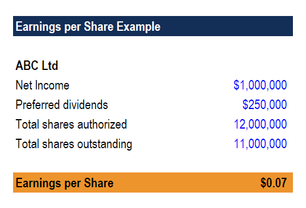

In today's fast-evolving financial landscape, the intersection of traditional financial metrics and modern trading technologies offers intriguing opportunities for investors. This article focuses on three critical areas: dividend finance, earnings per share (EPS), and algorithmic trading. Understanding how these elements integrate is essential for crafting effective investment strategies. The advancements in technology have transformed how investors can assess and interact with these financial metrics, providing both opportunities and challenges.

Earnings Per Share (EPS) serves as a vital gauge of a company's profitability, influencing investor decisions and stock valuations. It provides insights into a company's financial health by calculating the net income attributable to each share of common stock. In mathematical terms, EPS is expressed as:



$$
\text{EPS} = \frac{\text{Net Income} - \text{Preferred Dividends}}{\text{Weighted Average Shares Outstanding}}
$$

Dividends are another foundational aspect of investment strategies, especially for income-focused investors. They represent a portion of a company's earnings distributed to shareholders, providing a means of generating cash returns. Through a company's dividend policy and payout ratio, investors can glean insights into its operational stability and potential for future growth.

Algorithmic trading, or "algo trading," utilizes complex algorithms to execute trades with speed and precision far beyond human capability. By incorporating financial metrics such as EPS, these automated systems can react swiftly to market changes, capturing trading opportunities and mitigating risks through data-driven decisions. This modern approach amplifies the ability of investors to respond to fluid market conditions while leveraging traditional profitability indicators.

Exploring how EPS functions within algorithmic trading and how dividends integrate into this context reveals manifold possibilities for optimizing investment strategies. This integration enables investors to dynamically adjust their portfolios based on real-time data, combining the strengths of traditional financial analysis with cutting-edge trading technologies. Understanding and effectively managing these synergies can lead to improved investment outcomes in today's competitive financial markets.

## Table of Contents

## Understanding Earnings Per Share (EPS)

Earnings Per Share (EPS) is a fundamental financial metric used to assess a company's profitability per outstanding share of common stock. It provides investors with valuable insight into a company's financial performance and helps them make informed decisions regarding stock valuation. The EPS is calculated using the formula:

$$
\text{EPS} = \frac{\text{Net Income} - \text{Preferred Dividends}}{\text{Average Number of Outstanding Shares}}
$$

This formula indicates the portion of a company's profit allocated to each share, excluding preferred dividends to focus on the earnings available to common shareholders. A higher EPS is generally viewed positively, as it implies greater profitability and efficiency in generating earnings relative to the number of shares.

EPS plays a crucial role in investment strategies, as it reflects a company's ability to generate profits. Investors often compare the EPS of different companies within the same industry to assess relative performance. A rising EPS over multiple periods can indicate strong financial health and potential for stock price appreciation, attracting investors seeking growth opportunities.

In addition to its standalone significance, EPS is frequently incorporated into valuation models and ratios, such as the Price-to-Earnings (P/E) ratio. This ratio, which compares a company's stock price to its EPS, helps determine if a stock is overvalued or undervalued relative to its earnings potential.

Finally, it is important to note the variation in EPS calculations based on either basic or diluted shares. Diluted EPS accounts for all possible shares that could be outstanding from convertible securities, stock options, or warrants, offering a more conservative view of a company's profitability. By understanding and applying EPS metrics, investors can gain a clearer perspective on a company's financial health and its potential for future earnings growth.

## Exploring Dividends in Financial Strategies

Dividends per share (DPS) are a critical measure used by income-focused investors to evaluate a company's financial health concerning cash returns. Essentially, DPS represents the portion of a company’s earnings that is distributed to shareholders. This measure provides valuable insights for investors who prioritize immediate returns, as opposed to those who might seek long-term capital gains through reinvestment.

DPS is calculated by dividing the total dividends paid out by a company over a specific period by the number of outstanding shares. Mathematically, it can be expressed as:

$$
\text{DPS} = \frac{\text{Total Dividends Paid}}{\text{Total Outstanding Shares}}
$$

This metric serves as a vital indicator of how much cash return shareholders receive for every share they own. A higher DPS suggests that a company is generating sufficient earnings to finance generous shareholder payouts, which can be attractive for investors looking for steady income streams.

Companies with high DPS are particularly appealing to investors who value immediate returns. These firms are seen as providing direct financial rewards to shareholders, therefore enhancing the appeal of their stock amongst dividend-focused portfolios. Conversely, some companies may opt to reinvest their earnings to fuel future growth rather than distribute them as dividends, prioritizing reinvestment over immediate cash distribution. Such strategies are often adopted by growth-oriented companies that believe in expanding their operations to enhance future profitability.

A company's dividend policy, including its payout ratio, serves as an indicator of both its operational stability and growth prospects. The payout ratio, calculated as the ratio of dividends per share to earnings per share (EPS), reflects the proportion of earnings distributed as dividends. A low payout ratio may signify that a company is retaining a significant proportion of its earnings for reinvestment, potentially leading to future expansion and increased earnings. On the other hand, a high payout ratio might indicate that a company prioritizes returning wealth to its shareholders, which might suggest limited reinvestment opportunities or a strategy to attract income-focused investors.

In conclusion, understanding the role of DPS within financial strategies is crucial for investors aiming to assess company performance and align their investment choices with their financial goals. Through DPS and associated indicators like payout ratios, investors can glean insights into a company's financial health, dividend strategy, and future growth potential.

## Algorithmic Trading: A Modern Approach

Algorithmic trading, often referred to as 'algo trading,' involves the use of sophisticated algorithms to automate trading decisions with remarkable speed and precision. This method capitalizes on mathematical models and complex computation to execute trades based on pre-defined criteria. The acceleration and accuracy provided by [algorithmic trading](/wiki/algorithmic-trading) enable market participants to take advantage of transient market opportunities that would otherwise be difficult to exploit manually.

The integration of Earnings Per Share (EPS) and other financial metrics into algorithmic strategies is a prominent aspect of modern trading. By programming automated systems to consider EPS and related data, traders can significantly enhance their execution capabilities. For example, algorithms can be designed to monitor corporate earnings announcements and react within milliseconds, executing buy or sell orders based on the EPS reported relative to expectations.

One of the main advantages of algo trading is its ability to process and analyze vast datasets efficiently. This capability improves the prediction of stock performance and the identification of trading opportunities. Algorithms can sift through historical data and current market information to identify patterns and trends that might indicate future price movements.

For instance, an algorithm could be structured to buy stocks when the EPS growth exceeds a certain threshold, indicating potential for future value appreciation, and sell them if the EPS fails to meet the predefined criteria. Such an algorithm might be coded in Python as follows:

```python
def trading_decision(eps_current, eps_previous, growth_threshold):
    eps_growth = (eps_current - eps_previous) / eps_previous
    if eps_growth > growth_threshold:
        return "Buy"
    else:
        return "Sell"

# Example usage:
eps_current = 3.50
eps_previous = 3.00
growth_threshold = 0.10

decision = trading_decision(eps_current, eps_previous, growth_threshold)
print(decision)
```

This simple Python function calculates the EPS growth rate and compares it to a pre-set threshold, delivering a "Buy" or "Sell" recommendation as a result. This type of systematic approach underscores the potential of algo trading to streamline decision-making and enhance trading execution.

Algorithmic trading, leveraging financial metrics like EPS, signifies a pivotal advancement in investment strategies. The continuous evolution of these algorithms, including the incorporation of real-time data inputs and [machine learning](/wiki/machine-learning) models, continues to refine their accuracy and efficiency, fostering a more dynamic interaction with the financial markets.

## Integrating EPS, Dividends, and Algo Trading for Optimal Strategies

Combining Earnings Per Share (EPS) and Dividends Per Share (DPS) metrics with algorithmic trading presents an opportunity to refine investment strategies by harnessing detailed data on both profitability and income streams. This synergy allows for dynamic portfolio adjustments based on real-time financial data, thus enhancing decision-making and risk management. The strategic integration of these elements can significantly improve investment outcomes by ensuring that portfolio choices are driven by both immediate earnings data and long-term growth patterns.

Algorithmic trading systems, when embedded with EPS and DPS metrics, can automate the identification of profitable trading opportunities. Such systems leverage financial indicators to trigger trades when specific criteria are met. For example, a trading algorithm might monitor EPS growth rates and initiate buy or sell orders upon reaching predetermined thresholds. This automation facilitates swift market reactions, essential for maximizing returns in volatile trading environments.

Moreover, the use of these metrics in algorithmic models ensures that investment decisions are backed by quantitative insights. For instance, an investor might develop a Python-based algorithm that inputs real-time EPS and DPS data to forecast stock performance:

```python
import pandas as pd
import numpy as np

# Simulated function to calculate moving averages of EPS and DPS
def calculate_moving_averages(df, window=5):
    df['EPS_MA'] = df['EPS'].rolling(window=window).mean()
    df['DPS_MA'] = df['DPS'].rolling(window=window).mean()
    return df

# Simulated data
data = {'EPS': [1.5, 1.7, 1.8, 1.6, 1.9],
        'DPS': [0.5, 0.55, 0.6, 0.58, 0.62]}
df = pd.DataFrame(data)

# Calculate moving averages
df = calculate_moving_averages(df)

# Display the dataframe
print(df)
```

By continually updating algorithmic models with the latest financial metrics, investors can remain attuned to market realities. This approach requires an ongoing process of model refinement to accommodate shifts in market conditions and corporate strategies. Models must be iteratively recalibrated to [factor](/wiki/factor-investing) in new data, ensuring that trading decisions reflect current market dynamics.

In summary, integrating EPS and DPS metrics within automated trading systems provides a robust framework for adapting to fast-paced financial markets. By utilizing data-driven insights, investors can better align their strategies with profitability indicators and income projections, ultimately achieving a balanced approach to investment that capitalizes on both earnings growth and cash returns.

## Conclusion

Earnings Per Share (EPS) and Dividends Per Share (DPS) are critical in evaluating a company's financial well-being and the value it offers to its shareholders. EPS gives insight into a company's profitability by determining the earnings allocated to each outstanding share. DPS reflects the portion of earnings distributed back to shareholders in the form of dividends. Both metrics provide valuable information that can be pivotal for investors making strategic decisions.

The integration of EPS and DPS with algorithmic trading can significantly enhance the accuracy and efficiency of investment strategies. By using these metrics within algorithmic systems, investors can swiftly respond to market fluctuations and financial disclosures, dynamically adjusting their portfolios based on real-time data. This synergy facilitates a more refined approach to trading, maximizing the potential for favorable investment outcomes while maintaining effective risk management.

Incorporating EPS and DPS into automated trading systems requires a careful balance of financial analysis and technology. Investors need to continually ensure that their algorithmic models reflect the latest financial metrics and market conditions. This ongoing adjustment is crucial for maintaining a competitive edge in the rapidly evolving financial landscape. By integrating these fundamental financial indicators with advanced technologies, investors can better navigate market complexities and capitalize on emerging opportunities effectively.

## References & Further Reading

[1]: ["Advances in Financial Machine Learning"](https://www.amazon.com/Advances-Financial-Machine-Learning-Marcos/dp/1119482089) by Marcos Lopez de Prado

[2]: ["Evidence-Based Technical Analysis: Applying the Scientific Method and Statistical Inference to Trading Signals"](https://www.amazon.com/Evidence-Based-Technical-Analysis-Scientific-Statistical/dp/0470008741) by David Aronson

[3]: ["Machine Learning for Algorithmic Trading"](https://github.com/stefan-jansen/machine-learning-for-trading) by Stefan Jansen

[4]: ["Quantitative Trading: How to Build Your Own Algorithmic Trading Business"](https://www.amazon.com/Quantitative-Trading-Build-Algorithmic-Business/dp/1119800064) by Ernest P. Chan